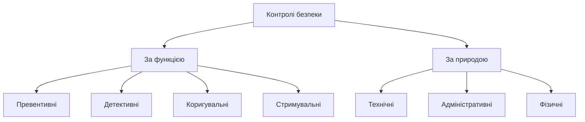

# 1.1. Що таке кібербезпека: визначення, історія, базова термінологія

> 📖 Усі ключові терміни цього модуля зібрано також в окремому [глосарії](00-glosariy.md) — зручно для швидкого пошуку й повторення.

## Визначення

Уявіть, що ваш будинок одночасно є банком, поштовим відділенням, фотоальбомом, робочим кабінетом і місцем, де зберігаються всі ваші листи за останні десять років. А тепер уявіть, що до цього будинку ведуть не одні двері з одним замком, а сотні входів — деякі ви бачите, деякі ні, — і кожен з них потенційно можна відкрити. Приблизно так виглядає цифрове життя сучасної людини чи організації. Саме тому кібербезпека давно перестала бути вузькою технічною дисципліною для системних адміністраторів і стала питанням, що стосується кожного, хто має смартфон, банківську картку чи робочу пошту.

**Кібербезпека** — це сукупність технологій, процесів, політик і практик, спрямованих на захист мереж, пристроїв, програм і даних від несанкціонованого доступу, пошкодження, крадіжки чи порушення роботи.

Важливо розуміти: кібербезпека — **не стан**, а **безперервний процес**. Не існує системи, яку можна «убезпечити один раз і забути» — так само, як неможливо один раз помити руки й залишатися чистим назавжди. Ландшафт загроз змінюється щодня, тому безпека — це постійний цикл оцінки, захисту, виявлення й реагування. Цей цикл формалізовано в моделі **NIST CSF 2.0**, яку ми розглянемо детально в розділі 1.7 (підрозділ «NIST CSF 2.0: операційна модель безпеки») — там вона природно лягає поряд з іншими регуляторними й галузевими фреймворками.

## Коротка історія розвитку галузі

| Період | Що відбувалось |
|---|---|
| 1970-ті | Перші експерименти з мережевою безпекою (ARPANET), концепція "Creeper" — перша самовідтворювана програма |
| 1980-ті | Перші комп'ютерні віруси для персональних комп'ютерів (Brain, 1986); поява перших антивірусів |
| 1990-ті | Зростання інтернету → масові черв'яки (Morris Worm, 1988, фактично започаткував індустрію реагування на інциденти — саме після нього створено перший CERT) |
| 2000-ні | Комерціалізація кіберзлочинності, перші великі витоки даних, поява SOC (Security Operations Center) як стандарту в компаніях |
| 2010-ті | Епоха APT та державно спонсорованих атак (Stuxnet, 2010), масові ransomware-кампанії (WannaCry, NotPetya — 2017, остання має пряме українське походження як точка входу) |
| 2020-ні | Хмарна безпека, supply chain атаки (SolarWinds), бурхливе зростання кібервійни як складової повномасштабних збройних конфліктів (Україна — один з найбільш показових прикладів) |

> **Чому це важливо знати:** історія показує закономірність — кожне нове технологічне зрушення (мережі → інтернет → мобільні пристрої → хмара → AI) породжує нову хвилю загроз. Кібербезпекознавець мислить на крок вперед, а не лише реагує на вже відомі атаки.

## Базова термінологія (глосарій модуля)

Ці терміни — фундамент, на якому будується весь подальший курс. Засвойте їх напам'ять.

| Термін | Визначення | Приклад |
|---|---|---|
| **Актив (asset)** | Усе, що має цінність для організації чи особи й потребує захисту | база клієнтів, ноутбук, репутація бренду |
| **Загроза (threat)** | Потенційна причина небажаної події, що може завдати шкоди активу | хакерська група, вірус, пожежа в дата-центрі |
| **Вразливість (vulnerability)** | Слабке місце в системі, процесі чи людині, яке загроза може використати | неоновлене ПЗ, слабкий пароль, недбалий співробітник |
| **Експлойт (exploit)** | Конкретний метод чи код, що використовує вразливість | скрипт, що атакує відому CVE |
| **Атака (attack)** | Реалізована спроба використати вразливість | фішинговий лист зі шкідливим вкладенням |
| **Вектор атаки (attack vector)** | Шлях, яким загроза досягає активу | електронна пошта, USB-носій, вебзастосунок |
| **Ризик (risk)** | Імовірність того, що загроза реалізує вразливість, помножена на вплив | див. розділ 1.3 |
| **Поверхня атаки (attack surface)** | Сукупність усіх точок, де зловмисник може спробувати проникнути в систему | усі відкриті порти, форми вводу, API-ендпоінти, співробітники |
| **Контроль (control)** | Захід, що знижує ризик (технічний, адміністративний чи фізичний) | фаєрвол, політика паролів, замок на серверній |
| **Інцидент (incident)** | Подія, що порушила або могла порушити CIA-тріаду активу | виявлене зараження шкідливим ПЗ |
| **Нульовий день (zero-day)** | Вразливість, про яку ще невідомо виробнику ПЗ (немає патча) | експлойт, виявлений до офіційного релізу виправлення |
| **Патч (patch)** | Оновлення ПЗ, що закриває відому вразливість | оновлення безпеки Windows |

## Типи контролів безпеки

Контролі поділяють за **функцією** та за **природою**:

**За функцією:**
- **Превентивні (preventive)** — запобігають інциденту (фаєрвол, контроль доступу).
- **Детективні (detective)** — виявляють інцидент, що вже стався (SIEM, логування, антивірус-сканування).
- **Коригувальні (corrective)** — усувають наслідки (відновлення з бекапу, патчування).
- **Стримувальні (deterrent)** — знижують імовірність спроби атаки (камери відеоспостереження, попередження про відповідальність).

**За природою:**
- **Технічні** — реалізовані в технологіях (шифрування, фаєрволи).
- **Адміністративні** — політики, процедури, навчання персоналу.
- **Фізичні** — замки, охорона, контроль доступу до приміщень.

Жоден окремий контроль не є достатнім — справжній захист будується на поєднанні кількох типів одночасно (принцип defense in depth, детально — модуль 03).

## Джерела та додаткові матеріали

- NIST, *Computer Security Handbook* (NIST SP 800-12 Rev. 1) — базовий огляд понять і контролів.
- ISO/IEC 27000:2018 — загальний огляд термінології систем управління інформаційною безпекою.
- CERT-UA (cert.gov.ua) — офіційні звіти про кіберінциденти в Україні.
- MITRE, *ATT&CK Framework* (attack.mitre.org) — база знань тактик і технік зловмисників.

---

**Далі:** [1.2. CIA-тріада та розширені моделі безпеки](02-cia-triada.md)
**Назад до модуля:** [README модуля 01](README.md)
