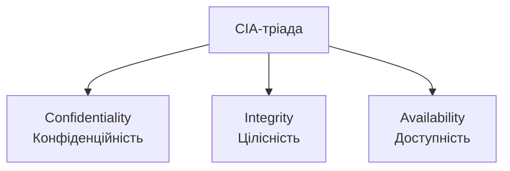
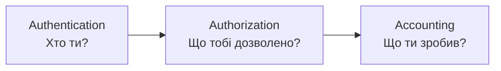

# 1.2. CIA-тріада та розширені моделі безпеки

Якщо кібербезпеку звести до трьох слів, якими користуються фахівці по всьому світу незалежно від мови чи галузі, це будуть слова з абревіатури CIA. Не плутайте з американською розвідувальною службою — тут йдеться про три властивості, навколо яких будується буквально кожне рішення в безпеці: чи варто шифрувати цей файл, чи потрібен резервний сервер, чи достатньо одного пароля для входу. Кожне таке рішення — це, по суті, відповідь на питання «яку з трьох властивостей я зараз захищаю і від чого».

## CIA-тріада: фундамент

### Конфіденційність (Confidentiality)

Гарантія того, що інформація доступна лише особам, процесам чи системам, які мають на це авторизацію.

**Як забезпечується:**
- Шифрування даних (у спокої та при передачі).
- Контроль доступу (role-based access control, RBAC).
- Класифікація даних за рівнем чутливості.
- Принцип «need to know» — доступ лише до того, що необхідно для виконання задачі.

**Приклад порушення:** витік бази даних клієнтів інтернет-магазину через незахищений API-ендпоінт.

### Цілісність (Integrity)

Гарантія того, що дані не були змінені несанкціоновано — ні навмисно зловмисником, ні випадково через збій.

**Як забезпечується:**
- Хеш-функції для перевірки незмінності файлів (детально — модуль 04).
- Цифрові підписи.
- Контроль версій і журналювання змін.
- Контрольні суми (checksums) при передачі даних.

**Приклад порушення:** зловмисник підмінив номер банківського рахунку отримувача у платіжному дорученні після перехоплення трафіка.

### Доступність (Availability)

Гарантія того, що авторизовані користувачі мають своєчасний і надійний доступ до інформації та ресурсів, коли це потрібно.

**Як забезпечується:**
- Резервування (redundancy) серверів і каналів зв'язку.
- Захист від DDoS-атак.
- Резервне копіювання та плани відновлення (BCP/DRP — детально пізніше).
- Моніторинг доступності (uptime monitoring).

**Приклад порушення:** DDoS-атака поклала сайт держпослуг напередодні важливого терміну подачі документів.

## Чому саме ці три, і чому їх часто бракує

CIA-тріада — мінімальна, але не вичерпна модель. На практиці безпекознавці додають до неї ще кілька властивостей, які формально не входять у тріаду, але є критично важливими:

| Властивість | Що означає | Чому окремо від CIA |
|---|---|---|
| **Автентичність (Authenticity)** | Підтвердження, що дані, повідомлення чи особа справді є тими, за кого себе видають | Стосується не лише доступу (як конфіденційність), а перевірки джерела |
| **Неспростовність (Non-repudiation)** | Сторона не може заперечити факт здійсненої дії (наприклад, підписання документа чи відправлення повідомлення) | Юридично-доказовий аспект, відмінний від цілісності |
| **Підзвітність (Accountability)** | Можливість простежити дію до конкретного користувача/системи (через логування) | Забезпечує розслідування інцидентів |

## Розширена модель: AAA-фреймворк

AAA — практичний операційний фреймворк, що описує, **як** забезпечується конфіденційність і підзвітність на практиці:

- **Authentication (автентифікація)** — підтвердження особи (пароль, біометрія, токен). Детально — модуль 05.
- **Authorization (авторизація)** — визначення, які саме дії/ресурси дозволені вже автентифікованому користувачу.
- **Accounting (облік)** — журналювання дій користувача для подальшого аудиту й розслідування.

Поширена помилка початківців — плутати автентифікацію з авторизацією. Автентифікація відповідає на питання «хто ти», авторизація — «що тобі можна робити». Можна бути успішно автентифікованим (увійти в систему), але не мати авторизації на конкретну дію (наприклад, видалення чужого файлу).

## Альтернативна модель: Parkerian Hexad

Для повноти варто знати, що дослідник Донн Паркер запропонував розширену модель із шести елементів, яка деталізує CIA:

1. Confidentiality (конфіденційність)
2. Possession/Control (володіння/контроль) — можливість фізично втратити контроль над даними, навіть якщо конфіденційність формально не порушена (наприклад, викрадений зашифрований ноутбук)
3. Integrity (цілісність)
4. Authenticity (автентичність)
5. Availability (доступність)
6. Utility (корисність) — дані можуть бути доступні, але непридатні для використання (наприклад, файл пошкоджено форматуванням)

На практиці більшість стандартів (ISO 27001, NIST) досі базуються на класичній CIA-тріаді як основі, але Parkerian Hexad корисний для розуміння нюансів, які тріада не покриває напряму.

## Застосування тріади на практиці: міні-вправа

Для будь-якої системи чи активу варто запитати себе три питання:

1. Що станеться, якщо ці дані побачить хтось сторонній? → оцінка важливості **конфіденційності**.
2. Що станеться, якщо ці дані будуть змінені без дозволу? → оцінка важливості **цілісності**.
3. Що станеться, якщо ці дані/система стануть недоступні на годину? На день? На тиждень? → оцінка важливості **доступності**.

Відповіді на ці питання визначають пріоритет контролів. Наприклад, для медичних записів пацієнта критична конфіденційність і цілісність, тоді як для публічного новинного сайту найважливіша доступність.

## Джерела та додаткові матеріали

- Donn B. Parker, *Fighting Computer Crime* — першоджерело моделі Parkerian Hexad.
- NIST SP 800-53 Rev. 5 — каталог контролів, що реалізують CIA-тріаду на практиці.
- ISO/IEC 27001:2022, Annex A — структура контролів, прив'язана до конфіденційності, цілісності й доступності.

---

**Попередній розділ:** [1.1. Що таке кібербезпека](01-shcho-take-kiberbezpeka.md)
**Далі:** [1.3. Управління ризиками: основи](03-upravlinnya-ryzykamy.md)
**Назад до модуля:** [README модуля 01](README.md)
