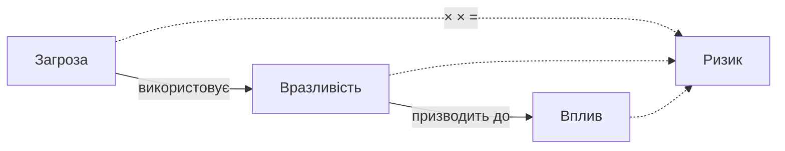

# 1.3. Управління ризиками: основи

> Це вступний огляд. Повна методологія оцінки ризику за ISO/IEC 27005 та NIST SP 800-30, з таблицями та реєстрами ризиків, буде в окремому модулі 04 (Оцінка ризиків). Тут — мінімум, необхідний для розуміння всього подальшого курсу.

## Базова формула

> **Ризик = Загроза × Вразливість × Вплив**

Якщо хоча б один множник дорівнює нулю — ризику немає. Звідси випливає логіка всієї роботи з безпекою: ризик можна знизити, **усунувши вразливість** (найефективніше), **знизивши ймовірність реалізації загрози**, або **зменшивши потенційний вплив**.

## Якісна оцінка ризику: матриця ймовірність × вплив

На базовому рівні ризик оцінюють якісно — за шкалою (наприклад, низький/середній/високий/критичний), без точних цифр. Це швидко і не вимагає статистичних даних.

| Вплив \ Імовірність | Низька | Середня | Висока |
|---|---|---|---|
| **Низький** | Низький | Низький | Середній |
| **Середній** | Низький | Середній | Високий |
| **Високий** | Середній | Високий | Критичний |

**Приклад застосування:** втрата ноутбука без шифрування диска з робочими документами — імовірність середня (ноутбуки губляться/крадуться регулярно), вплив високий (конфіденційні дані потрапляють до сторонніх) → ризик високий. Висновок: потрібен контроль (шифрування диска), що знижує вплив навіть у разі реалізації загрози.

## Кількісна оцінка (коротко)

Для зрілих організацій застосовують кількісні моделі, найвідоміша — **FAIR (Factor Analysis of Information Risk)**. Вона оцінює ризик у грошовому вираженні: очікувані втрати за рік (Annualized Loss Expectancy) = частота події на рік × середній фінансовий збиток від однієї події. Це дозволяє порівнювати інвестиції в безпеку напряму з вартістю потенційних втрат, але вимагає якісних статистичних даних, тому на початковому рівні зрілості організації частіше використовують якісний підхід.

## Чотири стратегії обробки ризику

Коли ризик ідентифіковано та оцінено, є чотири варіанти дій:

| Стратегія | Опис | Приклад |
|---|---|---|
| **Уникнення (Avoid)** | Повністю усунути джерело ризику | Відмовитись від збору даних, які не є необхідними для бізнесу |
| **Зниження (Mitigate/Reduce)** | Впровадити контроль, що зменшує ймовірність або вплив | Встановити MFA, щоб знизити ризик компрометації облікового запису |
| **Передача (Transfer)** | Перекласти фінансовий наслідок ризику на третю сторону | Кіберстрахування, аутсорсинг хостингу провайдеру з SLA |
| **Прийняття (Accept)** | Свідомо погодитись жити з ризиком, якщо вартість контролю перевищує потенційний збиток | Не захищати від загрози з мізерною ймовірністю та незначним впливом |

> Важливо: «ігнорування» ризику — це не стратегія. Прийняття ризику має бути **свідомим рішенням** із задокументованим власником і обґрунтуванням, а не результатом того, що про ризик просто забули.

## Залишковий ризик

Жоден контроль не знижує ризик до нуля. Те, що залишається після впровадження контролів, називається **залишковим ризиком (residual risk)**. Мета управління ризиками — не «усунути всі ризики» (неможливо й економічно недоцільно), а звести залишковий ризик до **прийнятного рівня (risk appetite)**, визначеного організацією чи особисто вами.

## Особиста модель ризику: застосування для приватної особи

Той самий підхід працює і для особистої кібербезпеки, не лише для організацій:

1. **Активи:** що цінне для вас цифрово? (пошта, банкінг, фото, робочі документи, акаунти соцмереж)
2. **Загрози:** хто або що може цьому зашкодити? (фішер, втрата пристрою, шкідливе ПЗ, витік пароля з іншого сервісу)
3. **Вразливості:** де ваші слабкі місця? (повторне використання паролів, відсутність MFA, застаріле ПЗ)
4. **Вплив:** що станеться, якщо актив скомпрометовано? (фінансові втрати, втрата доступу до акаунтів, шантаж)

Відповівши на ці чотири питання для себе, ви отримуєте персональну, пріоритизовану основу для дій — замість спроби «захиститись від усього одразу», що ресурсно неефективно навіть для великих організацій, а тим паче для приватної особи.

## Джерела та додаткові матеріали

- ISO/IEC 27005:2022 — методологія оцінки ризиків інформаційної безпеки.
- NIST SP 800-30 Rev. 1 — посібник з оцінки ризику.
- FAIR Institute (fairinstitute.org) — методологія кількісної оцінки ризику FAIR.

---

**Попередній розділ:** [1.2. CIA-тріада](02-cia-triada.md)
**Далі:** [1.4. Типи зловмисників та їхня мотивація](04-typy-zlovmysnykiv.md)
**Назад до модуля:** [README модуля 01](README.md)
