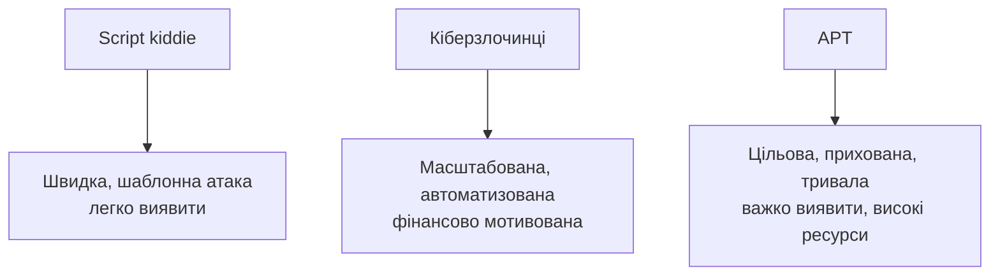

# 1.4. Типи зловмисників та їхня мотивація

Розуміння того, **хто** атакує і **навіщо**, допомагає правильно пріоритизувати захист. Захист поштової скриньки звичайної людини й захист енергетичної компанії від APT-групи вимагають принципово різного рівня контролів.

## Класифікація за типом

| Тип | Технічний рівень | Типова мотивація | Приклад дії |
|---|---|---|---|
| **Script kiddie** | Низький — використовує готові інструменти без глибокого розуміння | Самоствердження, цікавість, «розвага» | Запуск готового експлойта з публічного репозиторію проти випадкової цілі |
| **Кіберзлочинці (cybercriminals)** | Від середнього до високого, часто організовані групи | Фінансова вигода | Ransomware-атаки, фішинг для крадіжки банківських даних, продаж викрадених даних |
| **Хактивісти (hacktivists)** | Різний | Ідеологічна/політична мотивація | Дефейс сайту, витік документів організації для привернення уваги до проблеми |
| **Інсайдери (insider threats)** | Різний, але мають легітимний доступ | Помста, фінансова вигода, недбалість (не завжди зловмисний намір) | Співробітник зливає клієнтську базу конкурентам перед звільненням |
| **Корпоративні шпигуни** | Високий | Конкурентна перевага | Крадіжка комерційної таємниці, технологій |
| **Терористичні групи** | Різний | Залякування, дестабілізація | Атаки на критичну інфраструктуру з метою спричинити паніку |
| **APT (Advanced Persistent Threat)** | Дуже високий, значні ресурси | Геополітика, шпигунство, довгострокова стратегічна перевага, часто державне спонсорство | Багаторічна прихована присутність у мережі державного органу для збору розвідданих |

## Чому розрізнення важливе: різні моделі атаки

Script kiddie зазвичай атакує «що завгало, аби спрацювало» — масове сканування вразливих цілей. APT-група, навпаки, обирає конкретну ціль і може місяцями непомітно перебувати в мережі, збираючи інформацію (це називають **dwell time** — час перебування зловмисника в системі до виявлення).

## Інсайдери: недооцінена загроза

Інсайдерські загрози заслуговують окремої уваги, бо їх часто недооцінюють порівняно із зовнішніми атаками:

- **Зловмисний інсайдер** — свідомо завдає шкоди (помста, фінансова вигода).
- **Недбалий інсайдер** — не має злого наміру, але через помилку (фішинг, втрата пристрою, неправильне налаштування) спричиняє інцидент. За статистикою галузевих звітів, саме людська помилка — одна з найчастіших першопричин витоків даних.
- **Скомпрометований інсайдер** — легітимний обліковий запис, захоплений зовнішнім зловмисником (наприклад, через викрадені облікові дані).

Захист від інсайдерських загроз вимагає поєднання технічних контролів (моніторинг аномальної поведінки, least privilege) і організаційних (процес офбордингу при звільненні, навчання персоналу — модуль 02 курсу).

## MITRE ATT&CK: як систематизують поведінку зловмисників

**MITRE ATT&CK** — загальновизнана база знань про тактики, техніки й процедури (TTP), які реальні зловмисники використовують на практиці. Замість абстрактного «хакер може зламати систему», ATT&CK описує конкретні кроки: від початкового доступу (Initial Access) через виконання коду (Execution), закріплення в системі (Persistence), підвищення привілеїв (Privilege Escalation) — аж до ексфільтрації даних (Exfiltration) і впливу (Impact).

Ця база буде детально використана в модулі 10 (Реагування на інциденти) та модулі 04 (Оцінка ризиків) для систематичного аналізу загроз, а не інтуїтивного вгадування.

## Український контекст: хто атакує Україну

З 2014, і особливо з 2022 року, Україна стала однією з найбільш атакованих країн світу в кіберпросторі, з домінуванням саме APT-категорії:

- Державно спонсоровані групи, що проводять цільові атаки на критичну інфраструктуру, державні реєстри та оборонний сектор.
- Паралельно — хвилі менш складних, але масових фішингових кампаній, спрямованих на широкий загал (видавання за державні органи, банки, волонтерські організації).
- **CERT-UA** (Урядова команда реагування на комп'ютерні надзвичайні події України) регулярно публікує відкриті звіти про виявлені кампанії — це цінне й безкоштовне джерело реальних, актуальних кейсів для подальшого навчання.

> Детальніше про конкретні українські кейси (атака на «Київстар» 2023, атаки на енергосистему) — у розділі 1.6.

## Міні-вправа

Згадайте останній підозрілий лист, дзвінок чи повідомлення, яке ви отримали (фішинговий лист «від банку», дзвінок «зі служби безпеки», повідомлення про виграш). Спробуйте відповісти: до якого типу зловмисника з таблиці вище найімовірніше належить автор цієї спроби — масовий кіберзлочинець, що розсилає тисячі однакових листів, чи хтось, хто цілеспрямовано обрав саме вас? Які деталі повідомлення на це вказують (персоналізація, якість мови, терміновість)?

## Висновок: чому модель загроз має бути персоналізованою

Немає універсального «зловмисника», від якого варто захищатись. Звичайна приватна особа найімовірніше зіткнеться з масовим фішингом чи script kiddie, а не з APT. Енергетична компанія в Україні, навпаки, має враховувати саме APT як реалістичний сценарій. Перший крок будь-якої грамотної стратегії захисту — визначити: **хто реалістично може атакувати саме мене/мою організацію, і навіщо**.

## Джерела та додаткові матеріали

- MITRE ATT&CK (attack.mitre.org) — каталог тактик, технік і профілів реальних угруповань.
- Verizon, *Data Breach Investigations Report* (щорічний) — статистика за типами зловмисників і векторами атак.
- CERT-UA — звіти про конкретні угруповання, що атакують Україну.

---

**Попередній розділ:** [1.3. Управління ризиками](03-upravlinnya-ryzykamy.md)
**Далі:** [1.5. Ландшафт сучасних кіберзагроз](05-landshaft-zagroz.md)
**Назад до модуля:** [README модуля 01](README.md)
