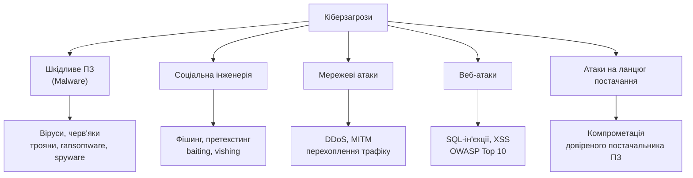

# 1.5. Ландшафт сучасних кіберзагроз: огляд

> Це оглядовий розділ. Кожен тип загроз нижче буде розкрито поглиблено в окремих модулях (06 — веб-безпека, 07 — шкідливе ПЗ та соціальна інженерія). Мета тут — щоб ви впізнавали базові категорії та розуміли загальну карту місцевості перед зануренням у деталі.

## Карта основних категорій загроз

## Шкідливе програмне забезпечення (Malware) — короткий огляд

| Тип | Що робить | Ключова особливість |
|---|---|---|
| **Вірус** | Прикріплюється до легітимного файлу, поширюється при його запуску | Потребує дії користувача для поширення |
| **Черв'як (worm)** | Самостійно поширюється мережею без участі користувача | Може спричинити масштабні епідемії (приклад: WannaCry) |
| **Троян** | Маскується під легітимну програму | Не самовідтворюється, покладається на обман |
| **Ransomware (програми-вимагачі)** | Шифрує дані жертви, вимагає викуп за розшифрування | Найбільш фінансово руйнівна категорія для бізнесу сьогодні |
| **Spyware** | Приховано збирає інформацію про користувача | Часто працює непомітно тривалий час |
| **Rootkit** | Приховує присутність зловмисного коду на рівні системи | Складно виявити стандартними засобами |

## Соціальна інженерія — короткий огляд

Соціальна інженерія експлуатує не технічні вразливості, а **людську психологію** — довіру, страх, терміновість, авторитет.

- **Фішинг (phishing)** — масові обманні листи, що видають себе за легітимні джерела.
- **Спірфішинг (spear phishing)** — персоналізована атака на конкретну особу/організацію.
- **Вішинг (vishing)** — соціальна інженерія через телефонний дзвінок.
- **Смішинг (smishing)** — через SMS.
- **Претекстинг (pretexting)** — створення вигаданого сценарію для виманювання інформації («я з служби підтримки банку, підтвердіть код з SMS»).
- **Baiting** — приманка (наприклад, «загублена» USB-флешка, навмисно залишена на видному місці).

> Статистично соціальна інженерія залишається одним з найефективніших векторів атаки саме тому, що обходить технічні контролі повністю — найкращий фаєрвол не допоможе, якщо людина сама повідомить пароль зловмиснику.

## Мережеві атаки — короткий огляд

- **DDoS (Distributed Denial of Service)** — масований потік запитів з багатьох джерел, що виводить сервіс з ладу через перевантаження.
- **MITM (Man-in-the-Middle)** — перехоплення та потенційна підміна трафіку між двома сторонами, які вважають, що спілкуються напряму.
- **Сніфінг (sniffing)** — пасивне перехоплення мережевого трафіку для збору даних.
- **Спуфінг (spoofing)** — підміна джерела (IP-адреси, MAC-адреси, відправника листа) для маскування під довірену сторону.

## Веб-атаки — короткий огляд (детально — модуль 06)

Веб-застосунки — одна з найпоширеніших точок входу через свою публічну доступність. Базова класифікація за **OWASP Top 10**, найвпливовішим галузевим стандартом класифікації веб-вразливостей, включає, серед іншого:

- **Ін'єкції (Injection)**, зокрема SQL-ін'єкції — вставка шкідливого коду через поля вводу.
- **Зламана автентифікація (Broken Authentication)** — слабкі механізми входу в систему.
- **XSS (Cross-Site Scripting)** — впровадження шкідливого скрипта, що виконується в браузері іншого користувача.
- **Невірна конфігурація безпеки (Security Misconfiguration)** — найчастіша причина — налаштування «за замовчуванням», які ніхто не змінив.

## Атаки на ланцюг постачання (Supply Chain Attacks)

Замість прямої атаки на ціль, зловмисник компрометує **довіреного постачальника** — бібліотеку з відкритим кодом, оновлення ПЗ, постачальника послуг — і через нього отримує доступ до всіх клієнтів постачальника одночасно.

**Класичний приклад:** атака NotPetya (2017) поширилась через скомпрометоване оновлення українського бухгалтерського ПЗ M.E.Doc і за лічені години спричинила мільярдні збитки компаніям по всьому світу — наочна ілюстрація того, наскільки руйнівним може бути цей вектор.

Зростання використання відкритих бібліотек у розробці ПЗ (детально — Блок «Розробка ПЗ», управління залежностями через SCA та SBOM) зробило цей вектор одним з найбільш пріоритетних напрямків сучасної безпеки розробки.

## Міні-вправа

Поверніться до карти на початку розділу. Виберіть будь-яку новину про кібератаку, яку ви читали за останній місяць (наприклад, на сайті CERT-UA чи в новинах), і визначте: до якої категорії з карти вона належить — malware, соціальна інженерія, мережева, веб- чи supply chain атака? Який саме вектор було використано для початкового проникнення? Ця звичка — «розкладати» новину по категоріях замість сприймати її як абстрактний «злам» — один з перших навичок, що відрізняє фахівця від стороннього спостерігача.

## Як орієнтуватись у цій карті як початківцю

Не намагайтесь запам'ятати все одразу — це довідкова карта місцевості, до якої ви повертатиметесь протягом усього курсу. На цьому етапі важливо засвоїти головний принцип: **кожна категорія атаки експлуатує конкретний тип вразливості** (технічну, людську чи процесну), і відповідно для кожної існує конкретний тип контролю з протидії — саме цей зв'язок «загроза → вразливість → контроль» і є предметом вивчення подальших модулів.

## Джерела та додаткові матеріали

- OWASP Top 10 (owasp.org) — щодо веб-атак, детально в модулі 06.
- ENISA Threat Landscape (щорічний звіт) — загальноєвропейський огляд категорій загроз.
- CISA, *Supply Chain Compromise* — методичні матеріали щодо атак на ланцюг постачання.

---

**Попередній розділ:** [1.4. Типи зловмисників](04-typy-zlovmysnykiv.md)
**Далі:** [1.6. Український контекст: реальні кейси та CERT-UA](06-ukrainskyi-kontekst.md)
**Назад до модуля:** [README модуля 01](README.md)
