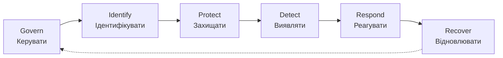

# 1.7. Правова та регуляторна основа

> Це вступний огляд законодавчого ландшафту. Поглиблений розгляд із практичними кейсами комплаєнсу — в окремому модулі 11 (Приватність і законодавство).

## Українське законодавство

### ЗУ «Про основні засади забезпечення кібербезпеки України»

Базовий закон, що формує національну систему кібербезпеки. Ключові положення для розуміння на цьому етапі:

- Визначає **об'єкти критичної інфраструктури** — підприємства й системи, порушення роботи яких має значні наслідки для держави (енергетика, фінанси, телеком, охорона здоров'я, держреєстри).
- Встановлює обов'язки **суб'єктів забезпечення кібербезпеки**, включно з вимогами щодо повідомлення про інциденти.
- Закріплює роль **Держспецзв'язку** як координуючого органу та **CERT-UA** як структури реагування (див. розділ 1.6).
- Визначає основи державно-приватного партнерства у сфері кіберзахисту.

### ЗУ «Про захист персональних даних»

Регулює обробку персональних даних в Україні:

- Визначає **розпорядника** (хто приймає рішення про обробку даних) і **володільця** даних.
- Встановлює права суб'єкта персональних даних: право на доступ, виправлення, видалення своїх даних.
- Вимагає **згоди** на обробку персональних даних у більшості випадків, з визначеними винятками.
- Передбачає відповідальність за порушення порядку обробки та захисту персональних даних.

> **Практичний наслідок для будь-кого, хто розробляє ПЗ чи працює з даними клієнтів в Україні:** обробка персональних даних (навіть простого переліку email-адрес) — це юридично регульована діяльність, а не суто технічне питання.

## Міжнародна регуляторна основа

### GDPR (General Data Protection Regulation)

Регламент ЄС про захист персональних даних. Хоча формально не діє напряму в Україні, GDPR є фактичним глобальним орієнтиром найкращих практик і обов'язковий для будь-якої організації, що обробляє дані громадян ЄС — незалежно від того, де ця організація фізично розташована.

Ключові принципи GDPR, корисні як загальний орієнтир:

- **Privacy by design** — приватність закладається в систему ще на етапі проєктування, а не додається пізніше.
- **Мінімізація даних** — збирайте лише ті дані, що дійсно необхідні.
- **Право на забуття** — користувач може вимагати видалення своїх даних.
- **Обов'язкове повідомлення про витік** у визначений короткий термін (як правило, 72 години).

## Галузеві та технічні стандарти (огляд)

На відміну від законів (обов'язкові юридично), стандарти нижче зазвичай **добровільні**, але є галузевим орієнтиром якості та основою для сертифікації:

| Стандарт | Що регулює | Статус застосування |
|---|---|---|
| **ISO/IEC 27001:2022** | Система управління інформаційною безпекою (ISMS) — процесний підхід | Добровільна сертифікація, часто вимога партнерів/клієнтів |
| **NIST CSF 2.0** | Фреймворк управління кіберризиками (Govern, Identify, Protect, Detect, Respond, Recover) | Добровільний, широко визнаний орієнтир, особливо в США |
| **OWASP Top 10/ASVS** | Найпоширеніші вразливості веброзробки та стандарт верифікації безпеки застосунків | Галузевий орієнтир для розробників, не юридична вимога |
| **CIS Controls v8** | Пріоритизований перелік практичних технічних контролів | Добровільний, орієнтований на практичне впровадження |
| **PCI DSS** | Стандарт безпеки для обробки платіжних карток | Обов'язковий для будь-кого, хто обробляє дані платіжних карток |

### NIST CSF 2.0: операційна модель безпеки

На відміну від інших стандартів у таблиці вище, які переважно описують *що* потрібно захищати, **NIST Cybersecurity Framework 2.0** відповідає на питання *як організувати сам процес* управління кіберризиком. Саме на цю модель ми посилались у розділі 1.1, коли говорили, що безпека — це цикл, а не одноразова дія. Версія 2.0 (2024) додала до попередніх п'яти функцій шосту — Govern — що підкреслює: безпека починається не з технологій, а з управлінського рішення й відповідальності.

| Функція | Суть | Приклад дії |
|---|---|---|
| **Govern (керувати)** | Визначення стратегії, ролей, відповідальності та апетиту до ризику на рівні керівництва | Затвердження політики ІБ, призначення власника ризику |
| **Identify (ідентифікувати)** | Розуміння того, що саме потрібно захищати | Інвентаризація активів, оцінка ризиків (модуль 04) |
| **Protect (захищати)** | Впровадження контролів, що знижують імовірність інциденту | Контроль доступу, шифрування, навчання персоналу |
| **Detect (виявляти)** | Своєчасне виявлення відхилень і інцидентів | Моніторинг логів, SIEM (модуль 09) |
| **Respond (реагувати)** | Дії під час та одразу після інциденту | Ізоляція скомпрометованої системи, комунікація (модуль 10) |
| **Recover (відновлювати)** | Повернення до нормальної роботи й винесення уроків | Відновлення з бекапу, перегляд процесів після інциденту |

Цикл замкнений навмисно: висновки з етапу Recover повертаються в Govern, уточнюючи стратегію на наступний раунд. Саме ця циклічність — а не статичний перелік контролів — і відрізняє зрілий підхід до безпеки від одноразового «встановили антивірус і забули».

## Must vs Should: як читати вимоги

Протягом курсу вживатимуться терміни:

- **Must (обов'язково)** — юридична вимога закону або контрактне зобов'язання (наприклад, PCI DSS для платіжних систем); недотримання має юридичні чи фінансові наслідки.
- **Should (рекомендовано)** — галузева найкраща практика (наприклад, положення CIS Controls), яка значно знижує ризик, але формально не є юридично обов'язковою — рішення про впровадження залежить від оцінки ризику й ресурсів.

## Чому це важливо знати вже на старті курсу

Технічні рішення без розуміння правового контексту ризикують бути або надлишковими (витрата ресурсів на захист, що не вимагається й не виправданий реальним ризиком), або недостатніми (відсутність обов'язкових за законом контролів, що тягне юридичну відповідальність). Грамотний фахівець з кібербезпеки завжди діє на перетині трьох площин: **технічної доцільності, бізнес-ризику та юридичної відповідності**.

## Джерела та додаткові матеріали

- Закон України «Про основні засади забезпечення кібербезпеки України» (zakon.rada.gov.ua).
- Закон України «Про захист персональних даних» (zakon.rada.gov.ua).
- Regulation (EU) 2016/679 (GDPR) — офіційний текст на eur-lex.europa.eu.
- NIST, *The NIST Cybersecurity Framework (CSF) 2.0* (nist.gov/cyberframework).
- ISO/IEC 27001:2022 — офіційний опис на iso.org.

---

**Попередній розділ:** [1.6. Український контекст](06-ukrainskyi-kontekst.md)
**Далі:** [1.8. Практична лабораторна робота на Python](08-praktychna-laboratorna.md)
**Назад до модуля:** [README модуля 01](README.md)
