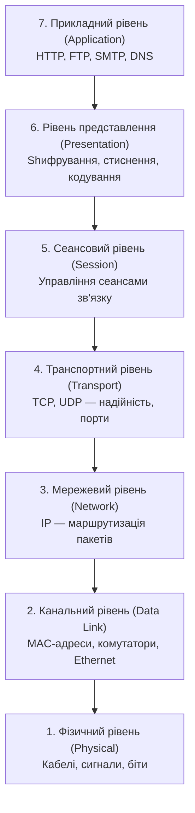
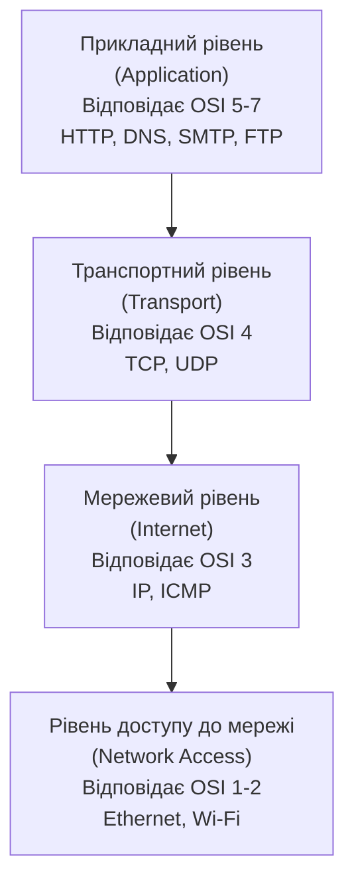
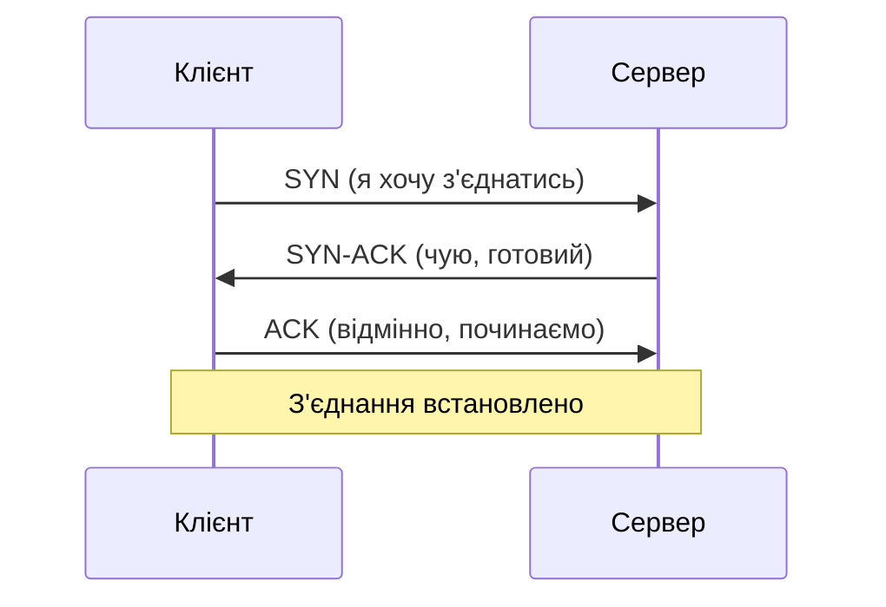

# 2.1. Моделі OSI та TCP/IP: як дані мандрують мережею

Перш ніж захищати мережу, потрібно зрозуміти, як вона працює. Це звучить банально, але саме тут більшість початківців роблять помилку: вчать назви рівнів напам'ять, не розуміючи, навіщо вони існують. А між тим ця абстракція виникла не в теорії — вона описує реальний шлях ваших даних від натискання клавіші до сервера та назад, і кожен рівень цього шляху — потенційне місце для атаки або для захисту.

> 📖 Ключові терміни розділу — у [глосарії модуля](00-glosariy.md).

## Навіщо взагалі потрібні моделі

У 1970-х, коли мережі тільки починали з'єднувати комп'ютери різних виробників, виникла проблема: обладнання різних компаній не «розуміло» одне одного — кожен виробник мав власний протокол. ISO (Міжнародна організація зі стандартизації) запропонувала рішення у вигляді **моделі OSI (Open Systems Interconnection)** — спільної мови, що описує, як має відбуватися комунікація незалежно від виробника обладнання чи ОС.

Паралельно DARPA розробляла власний стек для ARPANET — він ліг в основу сучасного інтернету як **модель TCP/IP**. Сьогодні OSI здебільшого використовують як концептуальний інструмент для опису й діагностики мережевих проблем, тоді як TCP/IP — це те, що реально виконується в обладнанні та ПЗ.

## Модель OSI: сім рівнів



| Рівень | Назва | Що відбувається | Одиниця даних | Приклади протоколів | Пристрій |
|---|---|---|---|---|---|
| 7 | Прикладний | Взаємодія з застосунком користувача | Дані | HTTP, HTTPS, FTP, SMTP, DNS | — |
| 6 | Представлення | Шифрування, стиснення, кодування формату | Дані | TLS/SSL, JPEG, ASCII | — |
| 5 | Сеансовий | Відкриття, підтримка, закриття сеансів | Дані | NetBIOS, RPC | — |
| 4 | Транспортний | Надійна доставка, сегментація, порти | Сегмент (TCP) / Датаграма (UDP) | TCP, UDP | — |
| 3 | Мережевий | Логічна адресація, маршрутизація | Пакет | IP, ICMP, ARP | Маршрутизатор |
| 2 | Канальний | Фізична адресація (MAC), виявлення помилок | Кадр | Ethernet, Wi-Fi (802.11) | Комутатор |
| 1 | Фізичний | Передача бітів через фізичне середовище | Біт | — | Кабель, концентратор |

**Мнемоніка для запам'ятовування** (знизу вгору): *«Після Комп'ютерів Мережі Типово Стають Потрібними Людям»* — Фізичний, Канальний, Мережевий, Транспортний, Сеансовий, Представлення, Прикладний.

### Безпекова перспектива рівнів OSI

Кожен рівень — це окрема площина для атаки чи захисту:

- **Рівень 1–2:** фізичний перехват кабелю, підроблення MAC-адрес, ARP-спуфінг (розділ 2.7).
- **Рівень 3:** IP-спуфінг, маршрутизаційні атаки (BGP hijacking).
- **Рівень 4:** TCP SYN flood, UDP flood (складова DDoS), сканування портів.
- **Рівень 7:** SQL-ін'єкції, XSS, фішинг — уся «прикладна» безпека, включно з OWASP Top 10 (модуль 06).

## Модель TCP/IP: чотири рівні

TCP/IP об'єднує сім рівнів OSI в чотири практичних:



## Інкапсуляція: що відбувається з даними насправді

Коли ви надсилаєте HTTP-запит, дані не просто «летять» до сервера як є. Кожен рівень **обгортає** дані своїм заголовком (header) — це і є **інкапсуляція**:

```
[ HTTP-запит (рівень 7) ]
[ TCP-заголовок + HTTP-запит (рівень 4) ]
[ IP-заголовок + TCP-сегмент (рівень 3) ]
[ Ethernet-кадр: MAC-заголовок + IP-пакет + трейлер (рівень 2) ]
[ біти у фізичному середовищі (рівень 1) ]
```

На стороні отримувача відбувається зворотній процес — **деінкапсуляція**: кожен рівень знімає «свою» оболонку й передає вміст угору. Саме тому аналізатор мережевого трафіку (наприклад, Wireshark) може «розбирати» пакет по шарах — він просто послідовно читає заголовки.

## TCP vs UDP: ключовий вибір четвертого рівня

| Характеристика | TCP | UDP |
|---|---|---|
| Встановлення з'єднання | Так (трьохетапне рукостискання) | Ні |
| Гарантія доставки | Так (підтвердження, перепосилання) | Ні |
| Порядок пакетів | Гарантовано | Не гарантовано |
| Швидкість | Нижча (накладні витрати) | Вища |
| Використання | HTTP/S, пошта, SSH, передача файлів | DNS, стримінг відео, VoIP, ігри |

**TCP-рукостискання (SYN-SYN/ACK-ACK)** — те, що відбувається при кожному встановленні TCP-з'єднання:



Це рукостискання — відправна точка для розуміння **SYN flood DDoS**: зловмисник надсилає тисячі SYN-пакетів з підробленими адресами, не відповідаючи на SYN-ACK, і сервер витрачає ресурси на підтримку «напіввідкритих» з'єднань.

## Джерела та додаткові матеріали

- ISO/IEC 7498-1 — офіційний стандарт моделі OSI.
- IETF RFC 793 — специфікація TCP.
- IETF RFC 768 — специфікація UDP.
- Tanenbaum A., Wetherall D., *Computer Networks* (5th ed.) — класичний підручник.

---

**Далі:** [2.2. Ключові мережеві протоколи](02-kliuchovi-protokoly.md)
**Назад до модуля:** [README модуля 02](README.md)
