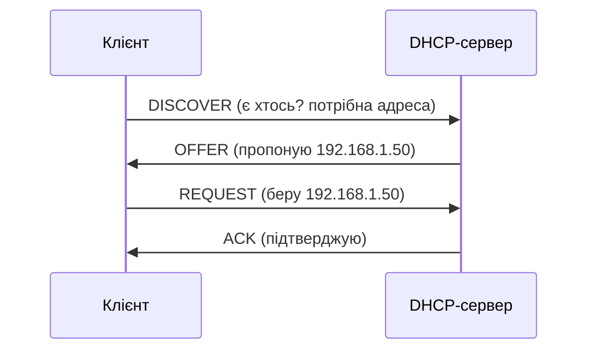

# 2.2. Ключові мережеві протоколи

Уявіть, що всі комп'ютери у світі раптово «забули», як розмовляти одне з одним. Вебсторінки перестали відкриватись, пошта зупинилась, DNS не відповідає. Це звучить як сценарій фантастичного роману, але насправді ілюструє просту істину: інтернет — це не фізичний об'єкт, а набір домовленостей. Кожен протокол — це одна така домовленість: суворо формалізоване правило про те, яким словом починається розмова, як підтверджується отримання, як повідомляється про помилку. Безпекознавцю ці домовленості цікаві з особливої причини: більшість з них розроблялись у 1970–1990-х роках, коли інтернет був маленьким і довірливим. Наслідки цього ми пожинаємо досі.

> 📖 Ключові терміни — у [глосарії модуля](00-glosariy.md).

## Порти: адреси для застосунків

IP-адреса визначає пристрій у мережі, але на одному пристрої може одночасно працювати десяток мережевих служб. **Порт** — числовий ідентифікатор (0–65535), що вказує, якому конкретному застосунку призначений пакет. Аналогія: IP-адреса — будинок, порт — номер квартири.

Діапазони портів поділені за призначенням:

| Діапазон | Назва | Призначення |
|---|---|---|
| 0–1023 | Well-known ports | Зарезервовані за стандартними протоколами (root-привілеї в Linux) |
| 1024–49151 | Registered ports | Зареєстровані IANA для конкретних застосунків |
| 49152–65535 | Dynamic/ephemeral ports | Тимчасові порти клієнтського боку з'єднань |

Нижче — порти, які треба знати напам'ять. Річ не в числах сама по собі, а в тому, що кожен відкритий назовні порт — це питання, яке треба поставити: «хто слухає тут і чи має він бути доступний з інтернету?»

|---|---|---|---|
| 21 | FTP | Передача файлів (нешифрована) | Перехоплення облікових даних |
| 22 | SSH | Захищений віддалений доступ | Брутфорс паролів (якщо не ключі) |
| 23 | Telnet | Незахищений віддалений доступ | Критичний — весь трафік у відкритому вигляді |
| 25 | SMTP | Відправка пошти | Спам-реле при відкритому relay |
| 53 | DNS | Розв'язання імен | DNS amplification DDoS, спуфінг |
| 80 | HTTP | Незашифрований вебтрафік | MITM-перехоплення |
| 443 | HTTPS | Зашифрований вебтрафік | Атаки на TLS, підроблені сертифікати |
| 3306 | MySQL | СУБД | Пряме підключення до БД ззовні — критично |
| 3389 | RDP | Віддалений робочий стіл Windows | Брутфорс, BlueKeep та ін. CVE |
| 8080 | HTTP alternate | Часто — панелі адміністрування | Витік адмін-інтерфейсу |

## DNS: телефонна книга інтернету

**DNS (Domain Name System)** перетворює людські імена (наприклад, `google.com`) на IP-адреси, з якими насправді працює мережеве обладнання. Без DNS вам довелося б пам'ятати IP-адреси замість доменних імен.

Типи DNS-записів, що мають значення для безпеки:

| Тип запису | Що містить | Значення для безпеки |
|---|---|---|
| **A** | IPv4-адреса домену | Основний запис; підміна → редиректить трафік |
| **AAAA** | IPv6-адреса домену | Аналог A для IPv6 |
| **MX** | Поштовий сервер домену | Підміна → перехоплення пошти |
| **TXT** | Довільний текст | SPF, DKIM, DMARC — захист від підробки відправника |
| **CNAME** | Псевдонім (аліас) для іншого імені | Subdomain takeover при видаленні запису |
| **PTR** | Зворотній запис (IP → ім'я) | Верифікація відправника пошти |
| **NS** | Авторитетні DNS-сервери домену | Підміна → захоплення всього домену |

Детально DNS-безпека розглядається в розділі 2.5 — там повний ланцюжок розв'язання, cache poisoning та DNSSEC.

## HTTP та HTTPS: протокол вебу

**HTTP (HyperText Transfer Protocol)** — протокол прикладного рівня для передачі вебсторінок і даних між клієнтом (браузером) і сервером. Він текстовий і без шифрування, тому будь-хто «між» клієнтом і сервером може прочитати запит і відповідь.

**HTTPS = HTTP + TLS** — той самий протокол, але зашифрований на рівні TLS. Детально — розділ 2.6.

Структура HTTP-запиту:
```
GET /login HTTP/1.1
Host: example.com
User-Agent: Mozilla/5.0
Accept: text/html
Cookie: session_id=abc123
```

Структура HTTP-відповіді:
```
HTTP/1.1 200 OK
Content-Type: text/html
Set-Cookie: session_id=xyz789; Secure; HttpOnly
X-Content-Type-Options: nosniff
```

**HTTP-заголовки безпеки** — речі, що відрізняють грамотно налаштований сервер від дефолтного:

| Заголовок | Що робить |
|---|---|
| `Strict-Transport-Security` | Примусовий HTTPS для всіх наступних запитів (HSTS) |
| `Content-Security-Policy` | Обмежує джерела скриптів, стилів, медіа (захист від XSS) |
| `X-Frame-Options` | Забороняє відображення сторінки в iframe (захист від clickjacking) |
| `X-Content-Type-Options: nosniff` | Забороняє браузеру «вгадувати» тип контенту |
| `Referrer-Policy` | Обмежує передачу заголовка Referer |

Ці заголовки не вимагають складного програмування — вони додаються кількома рядками у конфігурації вебсервера. Але в більшості перевірок реальних сайтів хоча б кілька з них відсутні.

## ARP: протокол, якому не можна довіряти

**ARP (Address Resolution Protocol)** пов'язує IP-адреси (рівень 3) з MAC-адресами (рівень 2) у локальній мережі. Коли ваш комп'ютер хоче відправити пакет на IP `192.168.1.1`, він надсилає ARP-запит у мережу: «хто має цю IP? Скажіть свою MAC». Пристрій з цією IP відповідає своєю MAC-адресою, і ваш комп'ютер записує відповідь у **ARP-кеш**.

Проблема в тому, що ARP **не має механізму автентифікації**. Будь-який пристрій у мережі може надіслати ARP-відповідь з неправдивою інформацією, і більшість систем охоче оновлять свій ARP-кеш — це і є основа **ARP-спуфінгу** (розділ 2.7).

## DHCP: автоматична роздача адрес

**DHCP (Dynamic Host Configuration Protocol)** автоматично надає пристроям в мережі IP-адресу, маску підмережі, шлюз і DNS-сервери при підключенні. Без DHCP кожен пристрій довелося б налаштовувати вручну.

Послідовність DHCP (DORA):


**Ризик: Rogue DHCP.** Зловмисник у локальній мережі може підняти власний DHCP-сервер, що роздаватиме клієнтам свою IP як DNS і шлюз — і весь трафік клієнтів піде через контрольований зловмисником пристрій. Захист: функція DHCP Snooping на керованих комутаторах.

## ICMP: діагностичний протокол

**ICMP (Internet Control Message Protocol)** використовується для діагностики мережі та передачі повідомлень про помилки. Команда `ping` надсилає ICMP Echo Request і чекає ICMP Echo Reply.

Корисні ICMP-повідомлення для діагностики:
- **Echo Request/Reply** — `ping`, перевірка досяжності хоста.
- **Destination Unreachable** — хост або порт недоступний.
- **Time Exceeded** — пакет «помер» через TTL (основа роботи `traceroute`).

**Ризики:** ICMP може використовуватись для розвідки (ping sweep — сканування мережі на живі хости) або для **ICMP flood** (частина DDoS-атак).

## Міні-вправа

Відкрийте термінал і виконайте:
- `nslookup google.com` (або `dig google.com`) — подивіться на DNS-відповідь: які записи повернулись, який сервер відповів.
- `ping 8.8.8.8` — перевірте, чи є відповідь від Google DNS. Скільки мілісекунд займає round-trip?
- `traceroute 8.8.8.8` (Linux/macOS) або `tracert 8.8.8.8` (Windows) — подивіться, скільки «стрибків» (hop) між вами і сервером, і які IP-адреси по дорозі.

Ці три команди — перший і базовий інструментарій мережевої діагностики, і вони ж — перший крок у розвідці (reconnaissance) при легітимному пентесті власної мережі.

## Джерела та додаткові матеріали

- IETF RFC 1035 — специфікація DNS.
- IETF RFC 2616 — специфікація HTTP/1.1.
- IETF RFC 826 — специфікація ARP.
- IETF RFC 2131 — специфікація DHCP.
- OWASP, *HTTP Security Response Headers Cheat Sheet*.

---

**Попередній розділ:** [2.1. Моделі OSI та TCP/IP](01-modeli-osi-tcp-ip.md)
**Далі:** [2.3. IP-адресація, підмережі, NAT](03-ip-adresatsiia.md)
**Назад до модуля:** [README модуля 02](README.md)
