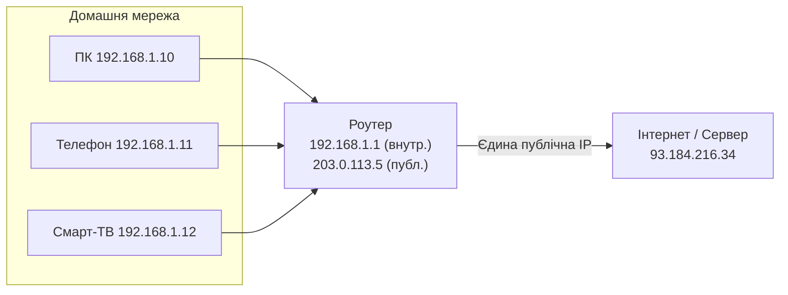

# 2.3. IP-адресація, підмережі та NAT

IP-адреса — це поштова адреса пристрою в мережі. Але на відміну від вулиці й будинку, IP-адрес є обмежена кількість, і людство вже кілька десятиліть живе в умовах їх дефіциту — саме тому з'явились приватні адреси, NAT і, зрештою, IPv6. Для безпекознавця розуміння адресації — це розуміння того, звідки насправді прийшов пакет і наскільки цій інформації можна довіряти.

> 📖 Ключові терміни — у [глосарії модуля](00-glosariy.md).

## IPv4: структура адреси

**IPv4-адреса** — це 32-бітне число, записане у вигляді чотирьох десяткових октетів, розділених крапкою: `192.168.1.105`. Кожен октет — число від 0 до 255 (8 біт = 256 значень).

Теоретично це дає 2³² ≈ 4,3 мільярда адрес. На практиці значна частина зарезервована, і «публічних» адрес значно менше — звідси й дефіцит, що стимулював появу NAT і IPv6.

### Приватні адреси (RFC 1918)

Ці діапазони ніколи не маршрутизуються в публічному інтернеті — вони призначені виключно для внутрішніх мереж:

| Діапазон | Кількість адрес | Типове використання |
|---|---|---|
| `10.0.0.0/8` | ~16,7 млн | Корпоративні мережі |
| `172.16.0.0/12` | ~1 млн | Середні мережі |
| `192.168.0.0/16` | ~65 тис. | Домашні та малі офісні мережі |

Якщо ваш комп'ютер має адресу `192.168.x.x` — він за NAT, і «назовні» в інтернет виходить з публічної IP-адреси роутера.

**Інші зарезервовані діапазони, що мають значення для безпеки:**
- `127.0.0.0/8` — loopback (localhost): пакети ніколи не виходять з пристрою.
- `169.254.0.0/16` — link-local (APIPA): автоматично присвоюється, коли DHCP недоступний; наявність такої адреси часто сигналізує про проблему в мережі.
- `0.0.0.0/0` — маршрут за замовчуванням (default route): «усе, що не відповідає конкретнішому маршруту».

## Маска підмережі та CIDR-нотація

Маска підмережі визначає, яка частина IP-адреси є **мережевою** (однакова для всіх пристроїв у підмережі), а яка — **адресою хоста** (унікальна для кожного пристрою).

| CIDR | Маска підмережі | Кількість хостів | Типове застосування |
|---|---|---|---|
| `/8` | 255.0.0.0 | ~16,7 млн | Великі мережі, ISP |
| `/16` | 255.255.0.0 | ~65 тис. | Корпоративні мережі |
| `/24` | 255.255.255.0 | 254 | Малі офіси, домашні мережі |
| `/25` | 255.255.255.128 | 126 | Сегментація середніх мереж |
| `/30` | 255.255.255.252 | 2 | Point-to-point канали між роутерами |
| `/32` | 255.255.255.255 | 1 (конкретний хост) | Маршрути до окремого хоста, фаєрвол-правила |

**Чому підмережі важливі для безпеки?** Сегментація мережі на підмережі — ключовий принцип захисту: якщо скомпрометований пристрій в одній підмережі, правильно налаштована сегментація обмежує «радіус вибуху» і не дозволяє зловмиснику легко досягти інших сегментів. Детально — розділ 2.8.

## NAT: трансляція адрес

**NAT (Network Address Translation)** дозволяє всім пристроям приватної мережі виходити в інтернет через одну (або кілька) публічних IP-адрес. Роутер веде таблицю відповідності: який внутрішній хост:порт відповідає якому публічному порту.

**Переваги NAT для безпеки:**
- Приховує внутрішню топологію мережі.
- Пристрої за NAT недоступні безпосередньо ззовні (якщо не налаштовано Port Forwarding).

**Обмеження NAT:**
- Не є «справжнім» фаєрволом — не перевіряє вміст пакетів.
- Port Forwarding, налаштований необдумано (наприклад, для відкриття RDP-порту в інтернет), може повністю нівелювати захист NAT.

## IPv6: наступне покоління адресації

**IPv6** — відповідь на вичерпання IPv4-адрес. Адреса IPv6 — це 128-бітне число в шістнадцятковому записі: `2001:0db8:85a3:0000:0000:8a2e:0370:7334`. 2¹²⁸ ≈ 340 ундецильйонів адрес — достатньо, щоб присвоїти унікальну адресу кожному атому на поверхні Землі.

**Особливості IPv6 з точки зору безпеки:**
- **Відсутність NAT** за замовчуванням — кожен пристрій отримує публічну адресу. Це знімає «захист через непрозорість», що давав NAT, і вимагає свідомого налаштування фаєрвола.
- **IPSec** — вбудована підтримка шифрування (у IPv4 — опціональна).
- **SLAAC (Stateless Address Autoconfiguration)** — механізм автоматичного присвоєння адреси без DHCP, що має власні вразливості.
- **Подвійний стек** — більшість сучасних мереж підтримують і IPv4, і IPv6 одночасно; фаєрвол-правила потрібно налаштовувати для обох, інакше IPv6 може стати незахищеним «чорним ходом».

## Міні-вправа

Виконайте в терміналі:
- **Windows:** `ipconfig /all`
- **Linux/macOS:** `ip a` або `ifconfig`

Знайдіть у виводі: свою IP-адресу, маску підмережі, шлюз за замовчуванням і DNS-сервер. Визначте: яка це адреса — приватна чи публічна? В якому діапазоні RFC 1918 вона знаходиться? Чи є IPv6-адреса на вашому інтерфейсі?

Потім перейдіть на `whatismyip.com` і порівняйте: ваша локальна IP і публічна IP — це одне й те саме, чи ви за NAT?

## Джерела та додаткові матеріали

- IETF RFC 791 — специфікація IPv4.
- IETF RFC 1918 — адресний простір для приватних мереж.
- IETF RFC 8200 — специфікація IPv6.
- IETF RFC 3022 — традиційний NAT.

---

**Попередній розділ:** [2.2. Ключові мережеві протоколи](02-kliuchovi-protokoly.md)
**Далі:** [2.4. Мережеве обладнання](04-merezheve-obladnannia.md)
**Назад до модуля:** [README модуля 02](README.md)
