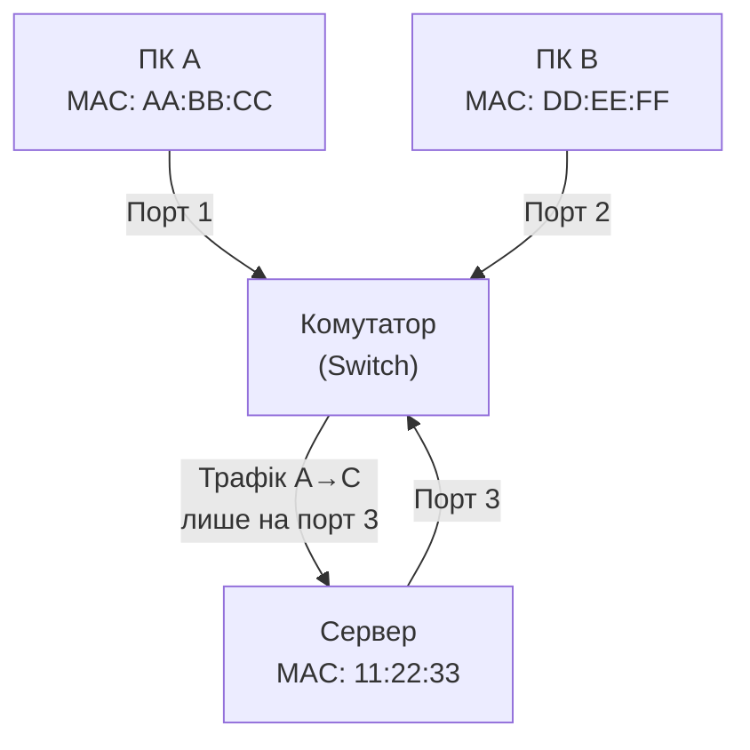
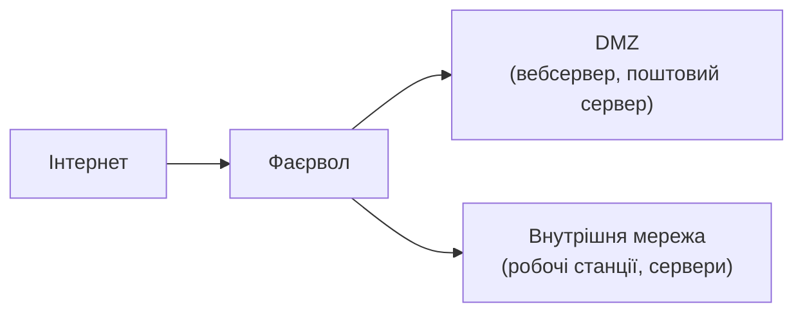
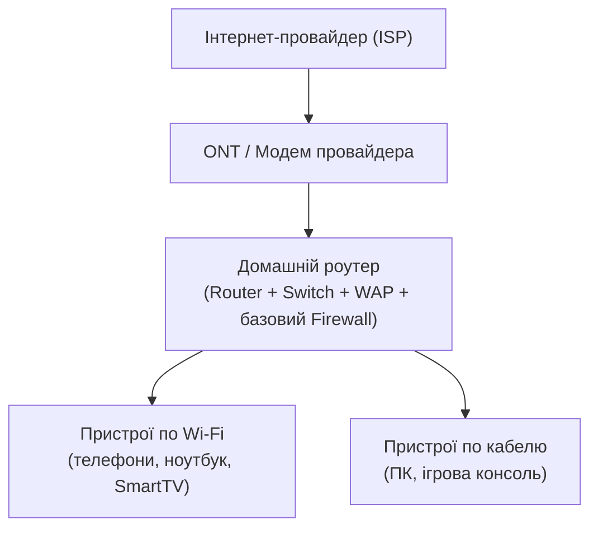

# 2.4. Мережеве обладнання: роутери, комутатори, точки доступу

Розуміти мережеве обладнання — значить розуміти, де саме в ланцюжку з'являється захист або його відсутність. Кожен пристрій у мережі — або потенційна точка захисту, або потенційна точка вразливості. Інколи — і те, і інше одночасно.

> 📖 Ключові терміни — у [глосарії модуля](00-glosariy.md).

## Концентратор (Hub) — застарілий і небезпечний

**Hub** — найпростіший пристрій мережевого рівня 1 (фізичний): він просто транслює кожен вхідний пакет на **всі** порти одночасно, незалежно від адресата. Усі пристрої підключені до hub «чують» весь трафік мережі.

Чому це важливо для безпеки: будь-який пристрій у мережі з hub може **пасивно перехоплювати** весь трафік без жодних маніпуляцій — просто увімкнувши режим promiscuous mode на мережевому інтерфейсі. Саме тому hub практично зник з сучасних мереж, поступившись місцем комутаторам. Проте в деяких старих або погано обслуговуваних мережах (в т.ч. в окремих українських підприємствах) hub досі зустрічається.

## Комутатор (Switch) — основа сучасної ЛМ

**Switch** (рівень 2 OSI) — «розумна» версія hub. Він навчається, яка MAC-адреса підключена до якого порту, і надсилає пакети лише на потрібний порт — а не всім одразу. Це і підвищує продуктивність мережі, і унеможливлює пасивне підслуховування трафіку (на відміну від hub).

**MAC-таблиця (CAM table)** — внутрішня база даних комутатора, що зберігає відповідність MAC-адреса → порт. Атака **MAC flooding** переповнює цю таблицю фальшивими MAC-адресами — комутатор «забуває» таблицю і починає вести себе як hub, транслюючи трафік усім портам, що дозволяє зловмиснику знову перехоплювати трафік.

**Керовані комутатори** (managed switches) додають функції безпеки:
- **VLAN (Virtual LAN)** — логічна сегментація мережі на рівні комутатора (детально — розділ 2.8).
- **Port Security** — обмеження кількості MAC-адрес на порту, запобігання MAC flooding.
- **DHCP Snooping** — захист від rogue DHCP-серверів.
- **Dynamic ARP Inspection (DAI)** — перевірка ARP-пакетів, захист від ARP-спуфінгу.

## Маршрутизатор (Router) — між мережами

**Router** (рівень 3 OSI) маршрутизує пакети між різними мережами — наприклад, між вашою домашньою мережею і публічним інтернетом. Він читає IP-адресу призначення кожного пакету й вирішує, куди далі його передати, спираючись на **таблицю маршрутизації**.

**Базові функції безпеки роутера:**
- **NAT** (розділ 2.3) — приховує внутрішню топологію.
- **Вбудований фаєрвол** — майже всі сучасні роутери мають базовий stateful firewall.
- **Пакетна фільтрація** — блокування трафіку за IP або портом.
- **ACL (Access Control List)** — правила дозволу/заборони трафіку.

**Типові помилки конфігурації роутера:**
- Заводський пароль адміністратора (`admin/admin`, `admin/password`).
- Увімкнений WPS — атакується за лічені години (розділ 2.9).
- Відкритий порт адмін-панелі назовні (80/443 для WAN-інтерфейсу).
- Застаріла прошивка з відомими CVE, для яких є публічні експлойти.

## Точка бездротового доступу (WAP/AP)

**Wireless Access Point (WAP)** надає бездротовий доступ до мережі по протоколу 802.11 (Wi-Fi). У домашніх роутерах WAP вбудований — це «коробка», що стоїть вдома. У корпоративних мережах WAP — окремі пристрої, що підключаються до комутаторів і керуються централізовано через контролер (Wireless LAN Controller, WLC).

Детально безпека бездротових мереж — розділ 2.9.

## Фаєрвол як пристрій

**Фаєрвол (Firewall)** — пристрій або ПЗ, що контролює мережевий трафік на основі заздалегідь визначених правил. Детально типи фаєрволів і їх конфігурацію розглядає розділ 2.8. Тут важливо зафіксувати місце фаєрвола в архітектурі:

## Типова домашня мережа: що де стоїть

Більшість домашніх мереж виглядає приблизно так:

Домашній роутер — найважливіший пристрій безпеки домашньої мережі: він виконує функції маршрутизатора, NAT, базового фаєрвола і точки доступу одночасно. Компрометація роутера означає компрометацію всієї домашньої мережі.

## Міні-вправа

Увійдіть до адміністративної панелі вашого домашнього роутера (зазвичай `192.168.0.1` або `192.168.1.1`, логін і пароль — на наклейці знизу або в документації). Перевірте:
1. Чи змінено заводський пароль адміністратора?
2. Яка версія прошивки встановлена і чи є доступне оновлення?
3. Чи увімкнено WPS?
4. Чи доступна адмін-панель з WAN-інтерфейсу (опція «Remote Management»)?

Якщо WPS увімкнено — вимкніть. Якщо є оновлення прошивки — встановіть. Це займе 10 хвилин і закриє кілька реальних векторів атаки.

## Джерела та додаткові матеріали

- CIS, *Benchmarks for Network Devices* — рекомендації щодо hardening роутерів і комутаторів.
- NIST SP 800-189 — рекомендації щодо захисту маршрутизаторів від атак на маршрутизацію.
- IEEE 802.11 — стандарт Wi-Fi.

---

**Попередній розділ:** [2.3. IP-адресація, підмережі, NAT](03-ip-adresatsiia.md)
**Далі:** [2.5. DNS у деталях і безпека DNS](05-dns-bezpeka.md)
**Назад до модуля:** [README модуля 02](README.md)
