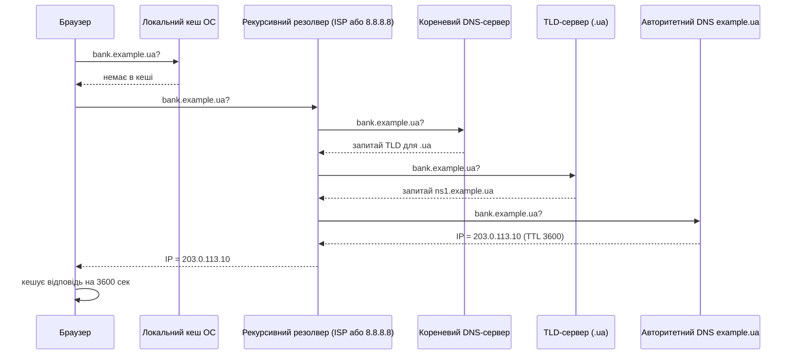

# 2.5. DNS у деталях і безпека DNS

DNS — одна з найважливіших і водночас найчастіше ігнорованих складових безпеки. Коли хтось каже «сайт недоступний», у половині випадків причина саме в DNS. Коли зловмисник «угонить» домен або підмінить DNS-відповіді, жертва буде вводити правильну адресу і переходити на шкідливий сервер — не підозрюючи нічого. Саме тому DNS-безпека — це не екзотика, а базова гігієна.

> 📖 Ключові терміни — у [глосарії модуля](00-glosariy.md).

## Як насправді працює DNS: повний ланцюжок

Коли ви набираєте `bank.example.ua` в браузері, у фоні відбувається складна й швидка послідовність кроків:



Весь цей ланцюжок зазвичай займає менше 100 мілісекунд — і при цьому є кілька точок, де зловмисник може втрутитися.

## DNS-ієрархія

- **Кореневі сервери (Root servers)** — 13 кластерів (позначених A–M), що знають адреси TLD-серверів. Фактично — вершина всієї системи DNS.
- **TLD-сервери (Top-Level Domain)** — знають адреси авторитетних серверів для конкретних доменних зон (`.ua`, `.com`, `.org`).
- **Авторитетний сервер (Authoritative NS)** — містить фактичні записи конкретного домену (A, MX, TXT тощо).
- **Рекурсивний резолвер** — виконує весь ланцюжок запитів від імені клієнта і кешує відповіді (зазвичай надається ISP або публічними сервісами: 8.8.8.8 Google, 1.1.1.1 Cloudflare).

## Основні атаки на DNS

### DNS Spoofing / Cache Poisoning

Зловмисник підміняє DNS-відповідь або «отруює» кеш рекурсивного резолвера хибними записами. Клієнт запитує IP для `bank.example.ua`, а резолвер повертає IP зловмисника — браузер відкриває фальшивий сайт за правильною URL-адресою.

**Класична атака Каміньського (2008):** дослідник Ден Камінський знайшов спосіб практично паралельно надсилати тисячі підроблених DNS-відповідей, намагаючись «вгадати» transaction ID і отруїти кеш до того, як прийде справжня відповідь. Уразливість стосувалась більшості резолверів того часу і вимагала термінового патчування всієї галузі.

### DNS Hijacking

На відміну від cache poisoning, DNS hijacking відбувається на рівні самого DNS-сервера: зловмисник компрометує авторитетний DNS-сервер або змінює NS-записи домену (зламавши обліковий запис реєстратора) і змінює записи легітимно.

**Реальний кейс:** у 2019 році зловмисники атакували реєстраторів і провайдерів DNS у Близькосхідному регіоні, змінивши NS-записи урядових і телеком-доменів. Трафік перенаправлявся через підконтрольні зловмисникам сервери для перехоплення даних.

### DNS Amplification (DDoS)

Зловмисник надсилає DNS-запити з підробленою IP-адресою жертви. DNS-відповіді — зазвичай набагато більші за запити — надходять на адресу жертви, перевантажуючи її канал. Коефіцієнт підсилення може сягати 70:1 і більше (запит 40 байт → відповідь 2800 байт).

### DNS Tunneling

Протокол DNS зазвичай дозволений крізь фаєрволи, бо «без нього нічого не працює». Зловмисники використовують це для передачі даних через DNS-запити та відповіді — навіть у суворо контрольованих мережах, де весь інший трафік заблоковано.

```
# Спрощена схема: зашифровані дані в субдомені
data_chunk.c2server.evil.com -> авторитетний сервер evil.com відповідає "командою"
```

## Захист DNS: DNSSEC

**DNSSEC (DNS Security Extensions)** додає криптографічні підписи до DNS-записів. Резолвер може перевірити цифровий підпис і переконатися, що відповідь справді походить від авторитетного сервера й не була підмінена по дорозі.

DNSSEC не шифрує DNS-запити — зловмисник все ще може бачити, що саме ви запитуєте. Він лише гарантує **цілісність** і **автентичність** відповіді.

**Стан в Україні:** домен `.ua` підтримує DNSSEC, але фактичне впровадження підписів на рівні конкретних доменів залишає бажати кращого — більшість комерційних і навіть деяких державних сайтів підписів не мають.

## Захист DNS: DoH і DoT

**DNS over HTTPS (DoH)** і **DNS over TLS (DoT)** шифрують DNS-трафік, унеможливлюючи його перехоплення й моніторинг ISP або зловмисником у локальній мережі.

| Протокол | Порт | Шифрування | Підтримка |
|---|---|---|---|
| DNS (класичний) | 53 UDP/TCP | Немає | Усюди |
| DoT | 853 TCP | TLS | Зростає |
| DoH | 443 TCP | HTTPS | Firefox, Chrome вбудовано |

**Налаштування DoH у Firefox:**
Налаштування → Конфіденційність і захист → DNS через HTTPS → увімкнути, обрати провайдера (Cloudflare 1.1.1.1, NextDNS тощо).

## Захист пошти: SPF, DKIM, DMARC

Три TXT-записи DNS, що захищають від підробки відправника електронної пошти (email spoofing):

- **SPF (Sender Policy Framework):** вказує, які IP-адреси мають право надсилати пошту від імені домену. Отримуючий сервер перевіряє SPF і відхиляє листи з «несанкціонованих» IP.
- **DKIM (DomainKeys Identified Mail):** лист підписується приватним ключем домену; публічний ключ публікується в DNS-записі. Отримуючий сервер перевіряє підпис.
- **DMARC (Domain-based Message Authentication, Reporting & Conformance):** визначає, що робити з листами, що не пройшли SPF/DKIM (відхилити, відправити в спам, нічого) і куди надсилати звіти.

Відсутність хоча б SPF для домену означає, що будь-хто може відправити лист «від» вашого домену, і багато поштових серверів його прийматимуть — класична основа для фішингу.

## Корисні інструменти для аудиту DNS

```bash
# Отримати A-запис
dig example.ua A

# Отримати MX-записи
dig example.ua MX

# Перевірити SPF
dig example.ua TXT

# Перевірити DMARC
dig _dmarc.example.ua TXT

# Перевірити DNSSEC
dig +dnssec example.ua A

# Зворотний DNS-запис
dig -x 203.0.113.10

# Явно задати інший резолвер (1.1.1.1 Cloudflare)
dig @1.1.1.1 example.ua A
```

## Міні-вправа

1. Виконайте `dig yourdomain.ua TXT` (або будь-якого домену, яким ви адмініструєте). Чи є SPF? Як він виглядає?
2. Перевірте `dig _dmarc.yourdomain.ua TXT` — чи налаштовано DMARC?
3. Перевірте свій домен на сайті `mxtoolbox.com` — він покаже стан SPF/DKIM/DMARC і попередить про проблеми.
4. Якщо ви звичайний користувач без власного домену: перевірте будь-який знайомий український державний сайт — чи є в нього DNSSEC (dig +dnssec)?

## Джерела та додаткові матеріали

- IETF RFC 4033-4035 — специфікація DNSSEC.
- IETF RFC 7858 — DNS over TLS (DoT).
- IETF RFC 8484 — DNS over HTTPS (DoH).
- IETF RFC 7208 — SPF; RFC 6376 — DKIM; RFC 7489 — DMARC.
- Kaminsky D., *It's The End Of The Cache As We Know It* (2008) — оригінальна презентація про DNS cache poisoning.

---

**Попередній розділ:** [2.4. Мережеве обладнання](04-merezheve-obladnannia.md)
**Далі:** [2.6. Шифрування трафіку: TLS, HTTPS, PKI](06-shyfruvannia-trafiku.md)
**Назад до модуля:** [README модуля 02](README.md)
