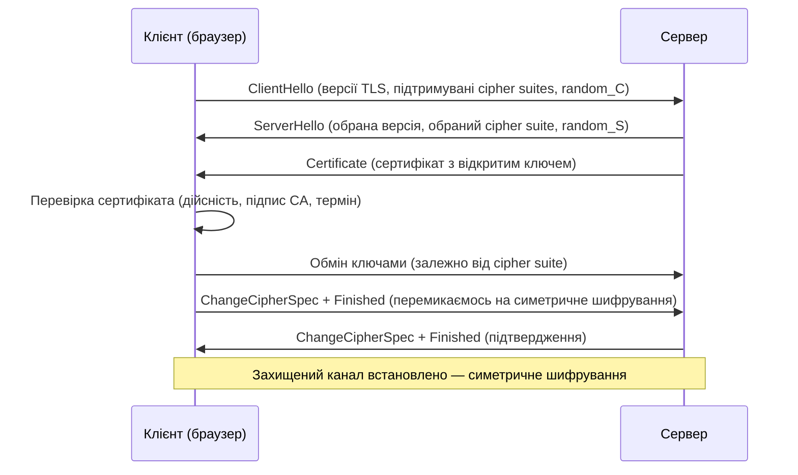
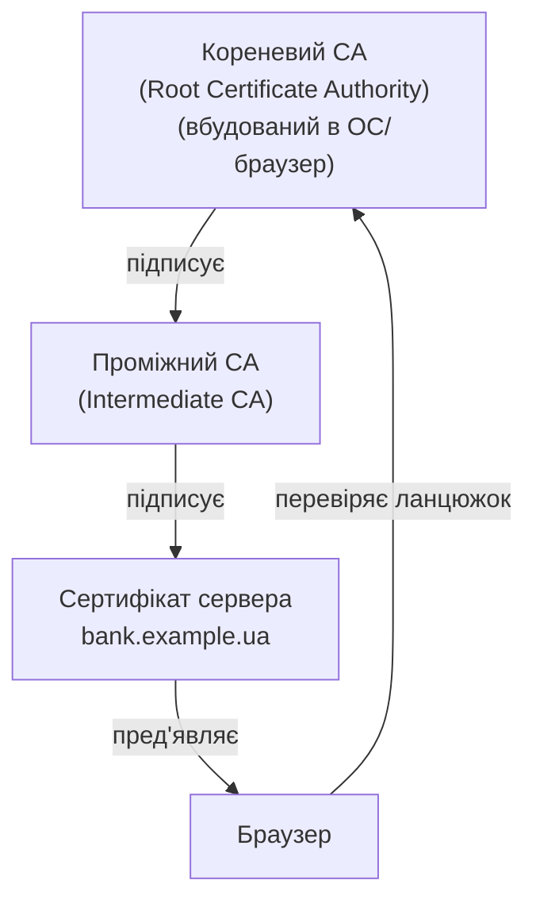
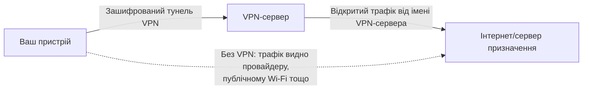

# 2.6. Шифрування трафіку: TLS, HTTPS та інфраструктура відкритих ключів (PKI)

Уявіть: ви вводите пароль від банку в браузері. Між вашим пристроєм і сервером банку — мережа провайдера, кілька маршрутизаторів, можливо Wi-Fi-хотспот. Без шифрування всі ці вузли бачили б ваш пароль у відкритому тексті. Саме TLS вирішує цю проблему — і робить це так непомітно, що більшість людей не замислюється над тим, як саме. Це не зручна магія, а добре продуманий протокол, розуміння якого є базовою вимогою для будь-якого фахівця з безпеки.

> 📖 Ключові терміни — у [глосарії модуля](00-glosariy.md).

## Симетричне vs асиметричне шифрування: два підходи

Перш ніж розуміти TLS, потрібно розуміти два фундаментальних підходи до шифрування. Детально криптографія розглядається в модулі 04 — тут лише те, що необхідно для розуміння TLS.

**Симетричне шифрування:** один і той самий ключ використовується і для шифрування, і для дешифрування. Швидке та ефективне, але виникає проблема: як передати ключ іншій стороні по незахищеному каналу, щоб його ніхто не перехопив?

**Асиметричне шифрування (криптографія з відкритим ключем):** два пов'язані ключі — **відкритий (public key)** і **приватний (private key)**. Що зашифровано відкритим ключем, може розшифрувати лише відповідний приватний ключ. Відкритий ключ можна вільно публікувати — він не є секретом. Повільніше, але вирішує проблему обміну ключами.

TLS поєднує обидва підходи: асиметричне шифрування для безпечного обміну ключами на початку сесії, симетричне — для шифрування всього подальшого трафіку (бо воно значно швидше).

## TLS-рукостискання: що відбувається перед першим байтом даних

Кожного разу, коли ваш браузер відкриває HTTPS-сайт, відбувається TLS-рукостискання (handshake). Це займає десятки мілісекунд і залишається повністю невидимим для користувача:



Після рукостискання обидві сторони мають спільний **сесійний ключ (session key)** — рядок випадкових байт, який ніколи не передавався по мережі у відкритому вигляді. Всі подальші дані шифруються саме ним.

## Cipher Suite: набір алгоритмів

**Cipher suite** — це комбінація чотирьох алгоритмів, що визначає, яке саме шифрування використовується в сесії:

`TLS_ECDHE_RSA_WITH_AES_256_GCM_SHA384`

- `ECDHE` — алгоритм обміну ключами (Elliptic Curve Diffie-Hellman Ephemeral).
- `RSA` — алгоритм автентифікації сервера (підпис сертифіката).
- `AES_256_GCM` — симетричний шифр для шифрування даних.
- `SHA384` — алгоритм HMAC для перевірки цілісності.

Ключова деталь: `ECDHE` — **ephemeral** (тимчасовий) означає, що ключ обміну генерується заново для кожної сесії. Це забезпечує **Perfect Forward Secrecy (PFS)**: навіть якщо приватний ключ сервера буде скомпрометовано в майбутньому, розшифрувати записаний у минулому трафік не вийде. Cipher suites без `DHE`/`ECDHE` не мають PFS і вважаються слабшими.

## SSL vs TLS: термінологічна плутанина

**SSL (Secure Sockets Layer)** — попередник TLS. SSL 2.0 і 3.0 давно визнані небезпечними (атака POODLE та ін.) і мають бути вимкнені. **TLS (Transport Layer Security)** — сучасний стандарт, поточна актуальна версія — **TLS 1.3** (2018). TLS 1.0 і 1.1 офіційно виведено з використання.

На практиці люди часто кажуть «SSL», маючи на увазі TLS — це поширена, але технічно неточна термінологія. Коли хтось каже «SSL-сертифікат», він майже напевно має на увазі TLS-сертифікат.

**Рекомендований стандарт 2024:** підтримка лише TLS 1.2 і TLS 1.3, вимкнення всього старішого.

## X.509-сертифікати: хто засвідчує особу сервера

Відкритий ключ сервера упакований у **сертифікат X.509**. Сертифікат містить:
- Доменне ім'я (або кілька — **SAN, Subject Alternative Names**).
- Відкритий ключ сервера.
- Термін дії.
- Цифровий підпис **Центру сертифікації (Certificate Authority, CA)**.

Браузер довіряє сертифікату сервера тому, що він підписаний **CA**, якому браузер (точніше — ОС) довіряє апріорі. Ці «кореневі» CA вбудовані в ОС і браузери — це і є основа **ланцюжка довіри (chain of trust)**.



## PKI: інфраструктура відкритих ключів

**PKI (Public Key Infrastructure)** — система правил, ролей, політик і технологій для керування цифровими сертифікатами і ключами. Компоненти PKI:

- **CA (Certificate Authority)** — видає, підписує й відкликає сертифікати.
- **RA (Registration Authority)** — верифікує особу заявника перед видачею сертифіката.
- **CRL (Certificate Revocation List)** — список відкликаних сертифікатів.
- **OCSP (Online Certificate Status Protocol)** — онлайн-перевірка статусу сертифіката.

## Типи сертифікатів

| Тип | Що верифікується | Термін | Підходить для |
|---|---|---|---|
| **DV (Domain Validation)** | Лише право на домен | Зазвичай 90 днів (Let's Encrypt) або до 1 року | Звичайні сайти |
| **OV (Organization Validation)** | Домен + організація | До 1 року | Корпоративні сайти |
| **EV (Extended Validation)** | Домен + організація (розширена перевірка) | До 1 року | Банки, фінансові установи |
| **Wildcard** | `*.example.com` — усі субдомени | Відповідно до типу | Зручно, але ризик: один сертифікат на всі субдомени |

**Let's Encrypt** — безкоштовний публічний CA, що автоматизує видачу і поновлення DV-сертифікатів. Зробив HTTPS загальнодоступним і суттєво підвищив рівень шифрування в інтернеті.

## Certificate Transparency: публічний журнал сертифікатів

Навіть якщо TLS налаштовано правильно, лишається питання: а що якщо хтось отримав сертифікат для вашого домену без вашого відома? Скомпрометований CA, недбалий реєстратор або соціальна інженерія можуть призвести до видачі «законного» сертифіката зловмиснику.

**Certificate Transparency (CT)** — відповідь на цю проблему: з 2018 року всі публічно довірені CA зобов'язані записувати кожен виданий сертифікат у публічні, криптографічно верифіковані **CT Logs**. Браузер Chrome відхиляє сертифікати, що не містяться в CT Logs. Це дає власникам доменів можливість моніторити, які сертифікати видані для їхніх доменів.

**Практичний інструмент:** сайт `crt.sh` дозволяє побачити всі сертифікати, коли-небудь видані для будь-якого домену. Спробуйте `crt.sh/?q=example.ua` — ви побачите всю історію сертифікатів: коли видано, ким (CA), які субдомени охоплено. Це корисно і для моніторингу власних доменів, і для розвідки в рамках легітимного пентесту.

## VPN: захищений тунель

**VPN (Virtual Private Network)** — технологія, що створює зашифрований «тунель» між вашим пристроєм і VPN-сервером, через який проходить весь (або частина) ваш трафік. VPN часто рекомендується в цьому модулі як захід захисту в недовірених мережах — час пояснити, чому і як саме це працює.



**Що VPN захищає:**
- Трафік між вами і VPN-сервером шифрується — зловмисник у локальній мережі (Evil Twin, ARP-спуфінг) бачить лише зашифрований потік.
- Ваша реальна IP-адреса прихована від сервера призначення — він бачить IP VPN-сервера.
- DNS-запити також проходять через тунель (залежно від налаштувань) — провайдер не бачить, які домени ви відвідуєте.

**Що VPN НЕ захищає:**
- VPN не замінює HTTPS: якщо сайт доступний лише по HTTP, VPN-сервер бачитиме ваш трафік у відкритому вигляді.
- VPN-провайдер бачить ваш трафік так само, як раніше бачив ISP — питання довіри просто переміщується.
- VPN не захищає від шкідливого ПЗ на вашому пристрої чи від фішингу.

**Протоколи VPN:**

| Протокол | Особливості | Рекомендованість |
|---|---|---|
| **WireGuard** | Сучасний, швидкий, мінімальна кодова база | ✅ Рекомендовано |
| **OpenVPN** | Перевірений часом, гнучкий | ✅ Рекомендовано |
| **IKEv2/IPSec** | Вбудований у iOS/macOS, швидкий | ✅ Рекомендовано |
| **PPTP** | Застарілий, зламаний | ❌ Не використовувати |
| **L2TP/IPSec** | Потенційно скомпрометований | ⚠️ Краще уникати |

**Корпоративний VPN** (split tunneling, site-to-site) — окрема велика тема, що виходить за межі цього модуля. Тут йдеться про персональні VPN для захисту трафіку в публічних мережах.

| Атака/Вразливість | Суть | Захист |
|---|---|---|
| **MITM зі підробленим сертифікатом** | Зловмисник пред'являє власний сертифікат, підписаний підконтрольним CA | Certificate Pinning, HSTS, HPKP |
| **Downgrade attack** | Примушення до старішої версії TLS або слабшого cipher suite | Вимкнення TLS 1.0/1.1, відключення слабких cipher suites |
| **POODLE** (2014) | Атака на SSL 3.0 через паддінг | Вимкнення SSL 3.0 |
| **BEAST** (2011) | Атака на TLS 1.0 | Перехід на TLS 1.2+ |
| **HEARTBLEED** (2014) | Вразливість у реалізації OpenSSL: витік пам'яті сервера через перевірку heartbeat | Оновлення OpenSSL |
| **Cert pinning bypass** | Обхід certificate pinning через компрометацію пристрою | Комплексний захист пристрою |

## Що перевіряти практично

```bash
# Перевірка TLS-конфігурації сервера (SSL Labs — онлайн)
# https://ssllabs.com/ssltest/

# Або через CLI:
openssl s_client -connect example.ua:443 -tls1_3

# Переглянути сертифікат
echo | openssl s_client -connect example.ua:443 2>/dev/null | openssl x509 -noout -text | grep -E "Subject:|Not After:|DNS:"

# Перевірити підтримувані cipher suites (потребує nmap)
nmap --script ssl-enum-ciphers -p 443 example.ua
```

## Міні-вправа

1. Відкрийте будь-який HTTPS-сайт у браузері, натисніть на замочок у адресному рядку і перегляньте деталі сертифіката: ким видано, до якої дати, які домени охоплює (SAN).
2. Зайдіть на `ssllabs.com/ssltest/` і перевірте рейтинг будь-якого відомого українського сайту. Чи підтримує він TLS 1.3? Чи є Forward Secrecy?
3. Знайдіть у результатах тесту SSL Labs будь-який cipher suite з позначкою «WEAK» — що саме в ньому слабке?

## Джерела та додаткові матеріали

- IETF RFC 8446 — специфікація TLS 1.3.
- IETF RFC 5280 — специфікація X.509 та PKI.
- IETF RFC 6962 — Certificate Transparency.
- Let's Encrypt (letsencrypt.org) — безкоштовні DV-сертифікати.
- SSL Labs (ssllabs.com/ssltest/) — онлайн-перевірка TLS-конфігурації.
- crt.sh — публічний пошук за CT Logs.
- WireGuard (wireguard.com) — сучасний VPN-протокол.
- ENISA, *Algorithms, Key Size and Parameters Report* — актуальні рекомендації щодо криптографічних алгоритмів.

---

**Попередній розділ:** [2.5. DNS у деталях і безпека DNS](05-dns-bezpeka.md)
**Далі:** [2.7. Мережеві загрози та атаки](07-merezhevi-zahrozy.md)
**Назад до модуля:** [README модуля 02](README.md)
