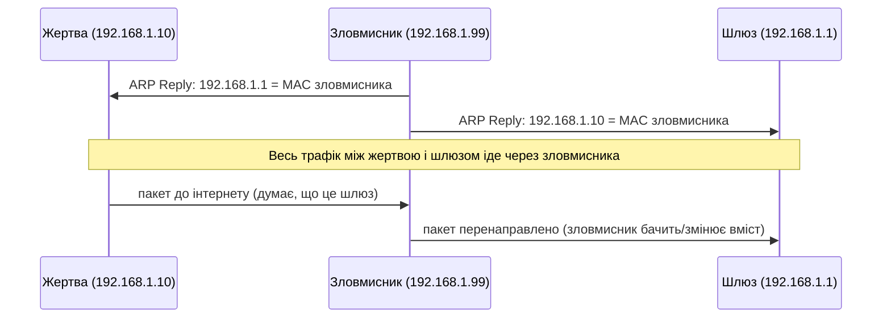

# 2.7. Мережеві загрози та атаки

Найкращий спосіб зрозуміти захист — це зрозуміти атаку. Коли ви бачите рядок у налаштуваннях фаєрвола «block ARP spoofing», ця опція залишається абстракцією, поки ви не уявили конкретно: зловмисник у тій самій кав'ярні, де ви сидите з ноутбуком, надсилає один-єдиний пакет — і відтепер весь ваш незашифрований трафік проходить через його машину. Розуміння механізму перетворює галочку в налаштуваннях на свідоме рішення.

> **Важливе застереження:** усі техніки в цьому розділі описані виключно в контексті розуміння та захисту. Застосування будь-якої з них до систем, на аудит яких немає явного письмового дозволу власника, може порушувати законодавство — зокрема ст. 361–363 КК України.

> 📖 Ключові терміни — у [глосарії модуля](00-glosariy.md).

## Пасивний сніфінг (Passive Sniffing)

**Сніфінг** — перехоплення мережевого трафіку для його аналізу. Є два режими:

- **Пасивний:** прослуховування трафіку, що природньо проходить через зловмисника (наприклад, у мережі з hub або через Wi-Fi в режимі моніторингу). Не вносить зміни в трафік і важко виявляється.
- **Активний:** зловмисник активно маніпулює мережею, щоб змусити трафік проходити через себе (наприклад, через ARP-спуфінг).

**Що можна перехопити:**
- Трафік незашифрованих протоколів (HTTP, FTP, Telnet, SMTP без TLS): паролі, вміст сесій, дані форм.
- Метадані навіть зашифрованих з'єднань: IP-адреси, домени (SNI у TLS), часові патерни.
- DNS-запити (якщо не DoH/DoT): список сайтів, що відвідуються.

**Захист:** використовувати лише зашифровані протоколи (HTTPS, SSH, SMTPS), DoH/DoT для DNS, VPN у недовірених мережах.

## ARP Spoofing / ARP Poisoning

Як описано в розділі 2.2, ARP не має автентифікації. ARP-спуфінг дозволяє зловмиснику «переконати» пристрої в локальній мережі, що він є шлюзом (роутером), і таким чином перенаправити весь трафік через себе.

Це класична основа для MITM-атаки в локальній мережі. Зловмисник може:
- Пасивно читати незашифрований трафік.
- Активно модифікувати HTTP-відповіді (наприклад, впроваджувати шкідливий JavaScript).
- Перехоплювати облікові дані.

**Захист:** Dynamic ARP Inspection (DAI) на керованих комутаторах; використання HTTPS (принаймні шифрування захищає вміст від читання, хоч і не від перехоплення); VPN у корпоративних мережах.

## Man-in-the-Middle (MITM)

MITM — загальна назва класу атак, де зловмисник непомітно перебуває між двома сторонами, що спілкуються. ARP-спуфінг — один з методів здійснення MITM у локальній мережі. Але MITM буває і на значно більших масштабах:

- **Rogue AP** — зловмисна точка доступу Wi-Fi, що видає себе за легітимну (детально — розділ 2.9).
- **SSL Stripping** — примушення жертви використовувати HTTP замість HTTPS: зловмисник «знімає» HTTPS-перенаправлення і підтримує незашифроване з'єднання з жертвою, тоді як сам з'єднується з сервером по HTTPS. Для жертви сайт виглядає доступним, але трафік йде у відкритому вигляді. Захист: HSTS.
- **BGP Hijacking** — атака на рівні глобальної маршрутизації інтернету. BGP (Border Gateway Protocol) — протокол, за яким інтернет-провайдери й великі мережі (автономні системи) обмінюються інформацією про маршрути. BGP проєктувався в 1989 році і, як ARP, не має вбудованої автентифікації маршрутних анонсів. Зловмисник (або скомпрометований/недбалий провайдер) може оголосити BGP-маршрут до чужих IP-префіксів — і частина трафіку інтернету почне маршрутизуватись через його мережу. Це може тривати від хвилин до годин, поки інші провайдери не відкличуть хибний маршрут. **Реальний приклад з українським контекстом:** у 2017 році частина трафіку до українських мереж маршрутизувалась через Росію через BGP-інцидент — це дозволяло перехоплювати та аналізувати трафік на рівні магістральних каналів. Захист: RPKI (Resource Public Key Infrastructure) — криптографічна верифікація BGP-анонсів, що повільно, але впроваджується провайдерами.

## DDoS: розподілений відказ у обслуговуванні

**DDoS (Distributed Denial of Service)** — атака, мета якої — зробити сервіс недоступним для легітимних користувачів шляхом перевантаження ресурсів (каналу, процесора, пам'яті) потоком трафіку з великої кількості джерел.

### Типи DDoS за рівнем OSI

| Рівень | Тип атаки | Механізм | Захист |
|---|---|---|---|
| **L3/L4 (Volumetric)** | UDP flood, ICMP flood, DNS amplification | Перевантаження смуги пропускання | CDN, scrubbing center, BGP blackholing |
| **L4 (Protocol)** | SYN flood | Виснаження таблиці напіввідкритих з'єднань | SYN cookies, rate limiting |
| **L7 (Application)** | HTTP flood, Slowloris | Виснаження ресурсів вебсервера «розумними» запитами | WAF, rate limiting, CAPTCHA |

**Словникова довідка:**
- **SYN flood:** зловмисник надсилає масу SYN-пакетів, не завершуючи рукостискання (немає фінального ACK). Сервер тримає ресурси для кожного «напіввідкритого» з'єднання, поки вони не тімуть-аут — уявіть сотні людей, що одночасно відчинили двері вашого офісу й застигли на порозі, не входячи і не виходячи.
- **Amplification:** зловмисник надсилає невеликий запит на UDP-сервіс (DNS, NTP, SSDP) з підробленою IP-адресою жертви, отримуючи набагато більшу відповідь на адресу жертви. Коефіцієнт підсилення для DNS може сягати 70:1 (запит 40 байт → відповідь 2800 байт).
- **Slowloris:** замість того щоб заливати сервер гігабітами трафіку, Slowloris робить протилежне — встановлює якомога більше HTTP-з'єднань і надсилає заголовки «по краплині», ніколи не завершуючи запит. Сервер чекає завершення і тримає з'єднання відкритими, доки не вичерпається ліміт — і нові клієнти не можуть підключитись. Атаку може проводити один комп'ютер зі звичайним підключенням, і вона непомітна для мережевих фільтрів, що блокують лише об'ємний трафік.

**Реальний контекст для України:** DDoS-атаки на українські державні сайти, ЗМІ й фінансові установи стали постійним явищем з 2022 року і часто синхронізуються з фізичними подіями (ракетними ударами). Показовим прикладом є атаки на урядові портали напередодні і під час великих подій — типова тактика гібридної війни.

## Сканування портів: розвідка перед атакою

**Port scanning** — визначення відкритих портів на хості з метою розвідки: які сервіси запущено, які версії, чи є відомі вразливості. Це перший крок більшості пентестів і реальних атак.

Найпопулярніший інструмент — **Nmap**. Різні типи сканування:

| Тип | Опція nmap | Як працює | Помітність |
|---|---|---|---|
| TCP Connect | `-sT` | Повне трьохетапне рукостискання | Добре помітне в логах |
| SYN scan | `-sS` | Надсилає SYN, не завершує рукостискання | Менш помітне |
| UDP scan | `-sU` | Надсилає UDP-пакети, аналізує відповіді | Повільне, ненадійне |
| OS Detection | `-O` | Аналізує відповіді для визначення ОС | — |
| Version Detection | `-sV` | Визначає версії сервісів | — |

> **Нагадування:** сканування виконуйте лише на власних системах або системах, на аудит яких є письмовий дозвіл. Несанкціоноване сканування може порушувати законодавство — зокрема ст. 363-1 КК України (несанкціоноване втручання в роботу ЕОМ).

**Захист від сканування:**
- Закрити всі непотрібні порти (фаєрвол).
- Виявляти аномальну кількість з'єднань до різних портів (IDS/SIEM).
- Приховати версії сервісів у банерах (ускладнює автоматизований вибір експлойтів).

## Session Hijacking (викрадення сесії)

Коли ви входите на сайт, сервер видає вам **session cookie** — «посвідчення», яке браузер надсилає з кожним наступним запитом. Якщо зловмисник перехопить цю cookie (через сніфінг, XSS або інші методи), він може «стати вами» без пароля.

Основні вектори викрадення сесії:
- **Перехоплення через HTTP** (без шифрування) — застосування HTTPS виключає.
- **XSS (Cross-Site Scripting)** — впровадження скрипту, що читає cookies — захист: `HttpOnly` flag на cookies.
- **CSRF (Cross-Site Request Forgery)** — примушення браузера жертви зробити запит від її імені без її відома — захист: CSRF-токени, `SameSite` cookie attribute.

## Джерела та додаткові матеріали

- MITRE ATT&CK — Tactic «Collection», «Credential Access», «Lateral Movement» — опис реальних технік.
- Gordon «Fyodor» Lyon, *Nmap Network Scanning* — офіційний посібник Nmap (nmap.org/book/).
- CISA, *Understanding and Responding to Distributed Denial-of-Service Attacks* (2022).
- CERT-UA — звіти про конкретні DDoS-кампанії проти України.
- RIPE NCC, *RPKI Dashboard* (rpki.ripe.net) — стан впровадження криптографічної верифікації BGP.

---

**Попередній розділ:** [2.6. Шифрування трафіку: TLS, HTTPS, PKI](06-shyfruvannia-trafiku.md)
**Далі:** [2.8. Фаєрволи, IDS/IPS, сегментація мережі](08-faiervoly-ids-segmentatsiia.md)
**Назад до модуля:** [README модуля 02](README.md)
