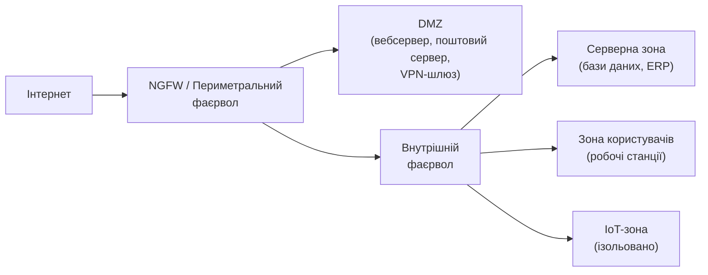
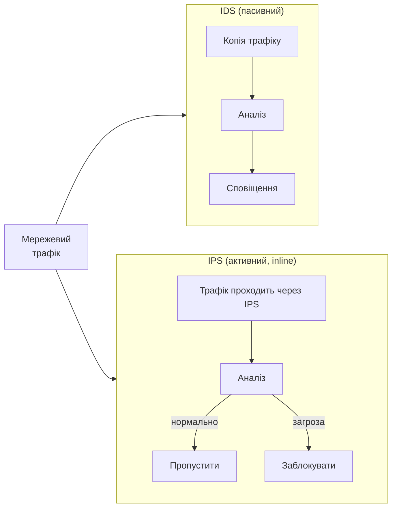

# 2.8. Фаєрволи, IDS/IPS та сегментація мережі

Якщо мережеві загрози з попереднього розділу — це хвороби, то фаєрволи, IDS/IPS і сегментація — це імунна система організму. Жоден з цих механізмів не дає абсолютного захисту сам по собі, але їх правильне поєднання створює той самий захист «у глибину» (defense in depth), про який ішлося ще в першому модулі.

> 📖 Ключові терміни — у [глосарії модуля](00-glosariy.md).

## Фаєрволи: класифікація і принцип роботи

**Фаєрвол** контролює мережевий трафік на основі заздалегідь визначених правил, дозволяючи або блокуючи пакети.

### Типи фаєрволів за рівнем аналізу

**Пакетні фільтри (Packet Filtering)** — найпростіший тип, рівень 3-4 OSI. Аналізують кожен пакет окремо за набором правил (IP-адреса джерела/призначення, порт, протокол). Не мають «пам'яті» про стан з'єднань.

**Stateful Firewall** — відстежує стан TCP/UDP-з'єднань і приймає рішення в контексті сесії, а не окремого пакету. Наприклад, дозволяє вхідні пакети лише якщо вони є частиною вже встановленого з'єднання, ініційованого зсередини.

**Application Layer Gateway (ALG) / Proxy Firewall** — розуміє конкретні протоколи прикладного рівня (HTTP, FTP, DNS) і може аналізувати вміст, а не лише заголовки.

**Next-Generation Firewall (NGFW)** — об'єднує stateful inspection, DPI (Deep Packet Inspection), IPS, SSL-inspection, ідентифікацію застосунків і користувачів, URL-фільтрацію. Сучасний стандарт для корпоративних мереж.

| Тип | Рівень OSI | Що аналізує | Де застосовується |
|---|---|---|---|
| Packet Filter | 3-4 | IP, порт, протокол | Застарілий, маршрутизатори |
| Stateful | 4 | Стан сесії | Периметр, домашній роутер |
| ALG/Proxy | 7 | Вміст протоколу | Вебпроксі, поштові шлюзи |
| NGFW | 3-7 | Усе вище + додаток, користувач | Корпоративний периметр |

### WAF: Web Application Firewall

**WAF (Web Application Firewall)** — спеціалізований фаєрвол, що «розуміє» HTTP/HTTPS і захищає вебзастосунки від атак прикладного рівня. Якщо NGFW захищає мережу, WAF захищає конкретний вебзастосунок — від атак, що знаходяться «всередині» дозволеного HTTPS-трафіку і непомітні для мережевого фаєрвола.

WAF аналізує вміст HTTP-запитів і блокує характерні патерни атак:
- SQL-ін'єкції у параметрах запитів.
- XSS-навантаження у полях форм.
- Path traversal (`../../etc/passwd`).
- Підозрілий розмір або структуру запиту (Slowloris, HTTP flood).

WAF може бути розгорнутий як хмарний сервіс (Cloudflare WAF, AWS WAF), як апаратний пристрій перед сервером або як програмне рішення (ModSecurity для Nginx/Apache). Для будь-якого публічного вебзастосунку WAF — це **should** рівня, що наближається до **must** при наявності чутливих даних користувачів.

### Базові принципи написання правил

Фаєрвол правила обробляються зверху вниз, перше спрацьоване правило визначає долю пакету.

```
# Приклад логіки правил (псевдокод)
# Дозволити встановлені/пов'язані з'єднання
ALLOW  ESTABLISHED,RELATED  any -> any

# Дозволити вхідний HTTPS
ALLOW  tcp  any -> 203.0.113.10:443

# Дозволити вхідний SSH лише з конкретного IP
ALLOW  tcp  198.51.100.5 -> 203.0.113.10:22

# Все інше — заблокувати (implicit deny)
DENY   any  any -> any
```

Принцип **implicit deny** (або **default deny**): те, що явно не дозволено — заборонено. Більшість безпечних конфігурацій будуються саме так, а не навпаки.

### Типовий периметр мережі



## DMZ: демілітаризована зона

**DMZ (Demilitarized Zone)** — мережевий сегмент, що розташований між публічним інтернетом і внутрішньою мережею. У DMZ розміщуються сервіси, до яких потрібен публічний доступ (вебсервер, поштовий сервер, VPN-шлюз), але які не повинні мати вільний доступ до внутрішніх ресурсів.

Якщо сервер у DMZ скомпрометовано, фаєрвол між DMZ і внутрішньою мережею обмежує «радіус вибуху» — зловмисник у DMZ не може вільно діставатись до баз даних і робочих станцій всередині.

## IDS та IPS: виявлення і запобігання вторгненням

**IDS (Intrusion Detection System)** — пасивно аналізує трафік і генерує сповіщення при виявленні підозрілої активності. Не блокує трафік.

**IPS (Intrusion Prevention System)** — активно блокує трафік при виявленні загрози, розташовується «в розрив» потоку даних (inline).

Обидва аналізують трафік двома методами:

- **Signature-based (за сигнатурами):** порівнює трафік із базою відомих патернів атак (як антивірус). Ефективно проти відомих загроз, але «сліпий» до нульових днів.
- **Anomaly-based (аномалії):** будує модель нормальної поведінки мережі та сигналізує про відхилення. Може виявляти нові атаки, але генерує більше хибних спрацювань.



## Сегментація мережі та VLAN

**Сегментація мережі** — поділ мережі на ізольовані сегменти з контрольованим трафіком між ними. Це один з найефективніших засобів обмеження «радіуса вибуху» при компрометації.

**VLAN (Virtual LAN)** — логічне розділення мережі на рівні комутатора без фізичного поділу. Пристрої в різних VLAN не можуть спілкуватись напряму — лише через маршрутизатор або фаєрвол.

Типова сегментація для малого бізнесу:

| VLAN | Призначення | Доступ до інших сегментів |
|---|---|---|
| VLAN 10 | Робочі станції | Заборонений доступ до серверної, лише через фаєрвол |
| VLAN 20 | Сервери | Доступ лише з VLAN 10 за потребою |
| VLAN 30 | IoT пристрої | Лише вихід в інтернет, ізольовані від решти |
| VLAN 40 | Гостьова Wi-Fi | Лише інтернет |

## Zero Trust: мережева безпека в 2020-х

Традиційна модель безпеки виходила з припущення: «все всередині периметру — довірено, все зовні — ні». Зростання хмарних сервісів, віддаленої роботи і складних інсайдерських загроз зробило цю модель застарілою.

**Zero Trust** («нульова довіра») — парадигма, що переосмислює периметр:

> **Ніколи не довіряти, завжди перевіряти.** Кожен запит — від будь-кого, з будь-якого місця — автентифікується, авторизується й логується незалежно від того, чи він прийшов «зсередини» чи «ззовні».

Ключові принципи:
- **Verify explicitly:** автентифікуй кожного користувача і кожен пристрій постійно (не лише при вході).
- **Least privilege access:** мінімально необхідний доступ для конкретного завдання.
- **Assume breach:** діяти так, ніби компрометація вже сталась — обмежувати «радіус вибуху», шифрувати трафік навіть всередині мережі.

Zero Trust — не окремий продукт, а архітектурний підхід, що реалізується через комбінацію технологій (MFA, мікросегментація, EDR, CASB тощо). Він поступово стає стандартом для організацій, що усвідомили: периметр мережі розмивається — хмара, віддалена робота і мобільні пристрої знищили чіткий кордон між «всередині» і «зовні».

## Практичне застосування: базові правила iptables/nftables (Linux)

```bash
# Перегляд поточних правил iptables
sudo iptables -L -n -v

# Дозволити вхідний SSH
sudo iptables -A INPUT -p tcp --dport 22 -j ACCEPT

# Дозволити вхідний HTTPS
sudo iptables -A INPUT -p tcp --dport 443 -j ACCEPT

# Дозволити встановлені з'єднання (stateful)
sudo iptables -A INPUT -m state --state ESTABLISHED,RELATED -j ACCEPT

# Заблокувати все інше вхідне
sudo iptables -A INPUT -j DROP

# УВАГА: зберегти правила перед виходом, інакше після перезавантаження зникнуть
sudo iptables-save > /etc/iptables/rules.v4
```

> Для домашнього Linux-користувача зручніша обгортка `ufw` (Uncomplicated Firewall): `sudo ufw enable && sudo ufw default deny incoming && sudo ufw allow ssh`.

## Джерела та додаткові матеріали

- NIST SP 800-41 Rev. 1 — рекомендації щодо фаєрволів.
- NIST SP 800-207 — Zero Trust Architecture.
- Snort (snort.org) та Suricata (suricata.io) — провідні open-source IDS/IPS.
- ModSecurity (modsecurity.org) — open-source WAF для Nginx/Apache.
- OWASP ModSecurity Core Rule Set — базовий набір правил для WAF.
- CIS Controls v8, Control 13 — сегментація мережі.

---

**Попередній розділ:** [2.7. Мережеві загрози та атаки](07-merezhevi-zahrozy.md)
**Далі:** [2.9. Бездротові мережі та їх безпека](09-bezdrotovi-merezhi.md)
**Назад до модуля:** [README модуля 02](README.md)
