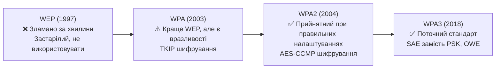

# 2.9. Бездротові мережі та їх безпека

Wi-Fi — мабуть, найбільш очевидна поверхня атаки для звичайної людини. На відміну від проводової мережі, де зловмисник має фізично під'єднатись до кабелю, бездротовий сигнал виходить за межі вашого дому або офісу і доступний будь-кому в радіусі дії. Водночас більшість людей ніколи не заглядають у налаштування роутера після того, як підключили його вперше. Ця комбінація й робить домашній Wi-Fi одним з найпоширеніших векторів атаки на приватних осіб.

> 📖 Ключові терміни — у [глосарії модуля](00-glosariy.md).

## Еволюція протоколів захисту Wi-Fi

### WEP (Wired Equivalent Privacy) — 1997, мертвий

WEP використовував RC4 з надзвичайно слабким управлінням ключами. Атака FMS (2001) і пізніші інструменти дозволяють зламати WEP мережу за **лічені хвилини**, зібравши достатньо пакетів. Якщо ваш роутер підтримує лише WEP — це обладнання 2000-х років, і його час замінити.

### WPA2 (Wi-Fi Protected Access 2) — поточний мінімум

WPA2 використовує **AES-CCMP** — значно сильніше шифрування за WEP. Має два режими:
- **WPA2-Personal (PSK):** один попередньо узгоджений ключ (пароль) для всіх — підходить для домашніх мереж.
- **WPA2-Enterprise:** кожен користувач автентифікується окремо через RADIUS-сервер (802.1X) — стандарт для корпоративних мереж.

**Вразливість WPA2-PSK: PMKID Attack і Offline Dictionary Attack.** Атакуючий перехоплює handshake (або PMKID без очікування підключення клієнта) і виконує офлайн атаку по словнику. Якщо пароль Wi-Fi — `password123` або `квартира31Київ` — його зламають. Захист: довгий, складний, унікальний пароль Wi-Fi (24+ випадкових символи або довгий passphrase).

**KRACK (Key Reinstallation Attack, 2017):** вразливість у протоколі WPA2 handshake, що дозволяла за певних умов розшифровувати трафік. Закрита патчами, але підкреслила: навіть «безпечний» протокол може мати реалізаційні вразливості.

### WPA3 — поточний стандарт (2018+)

WPA3 усуває ключову слабкість WPA2-PSK — вразливість до офлайн-атак по словнику:

- **SAE (Simultaneous Authentication of Equals)** замінює PSK: навіть якщо зловмисник перехопив handshake, він не може виконати офлайн атаку по словнику — кожна спроба вимагає живої взаємодії з точкою доступу.
- **Forward Secrecy:** кожна сесія має унікальний ключ, тому запис трафіку в минулому не можна розшифрувати, знаючи поточний пароль.
- **OWE (Opportunistic Wireless Encryption):** шифрування для відкритих мереж (без пароля) — принаймні захищає від пасивного сніфінгу.
- **WPA3-Enterprise:** підтримує 192-бітний криптографічний режим.

**Практична рекомендація:** якщо ваш роутер підтримує WPA3 — увімкніть. Більшість сучасних пристроїв (2018+) підтримують WPA3. Якщо є старі пристрої — використовуйте режим WPA2/WPA3 Transition Mode.

## WPS: зручно і небезпечно

**WPS (Wi-Fi Protected Setup)** задумувався для спрощення підключення пристроїв — натиснути кнопку або ввести 8-значний PIN. Проблема з PIN-режимом:

- 8 цифр → 10⁸ = 100 мільйонів комбінацій? Ні. PIN перевіряється двома частинами: перші 4 цифри і останні 4 (остання — контрольна). Це лише 10⁴ + 10³ = **11 000 спроб** для повного перебору.
- Деякі роутери навіть не обмежують частоту спроб → перебір займає **від кількох годин до кількох днів**.
- Інструмент Reaver автоматизує цю атаку.

**Рекомендація:** вимкніть WPS у налаштуваннях роутера. Якщо потрібно підключити новий пристрій — введіть пароль вручну.

## Атаки, специфічні для Wi-Fi

### Evil Twin / Rogue Access Point

Зловмисник створює точку доступу з тим самим SSID (назвою мережі), що і легітимна, але з сильнішим сигналом. Пристрої клієнтів автоматично підключаються до «кращого» сигналу, і зловмисник стає MITM для всього їхнього трафіку.

Особливо небезпечно у громадських місцях (кафе, аеропорти, готелі): зловмисник оголошує «вільний Wi-Fi готелю» — жертви підключаються самі.

**Захист:** не підключатись до відкритих/незнайомих мереж без VPN; для критичних дій використовувати мобільний інтернет замість публічного Wi-Fi.

### Deauthentication Attack

WPA2 не захищає management-фрейми (пакети керування з'єднанням) автентифікацією. Зловмисник може надсилати підроблені Deauthentication фрейми від імені точки доступу, примушуючи клієнтів відключитись — а потім перехопити handshake при повторному підключенні для офлайн-атаки.

WPA3 і функція 802.11w (PMF — Protected Management Frames) закривають цю вразливість.

### Wardriving

Систематичне сканування бездротових мереж з автомобіля (або пішки) з ноутбуком і антеною. Використовується як для легітимного аудиту покриття, так і для пошуку незахищених точок доступу.

## Hardening домашньої Wi-Fi мережі: повний чек-лист

| Дія | Пріоритет | Чому важливо |
|---|---|---|
| Змінити заводський пароль адмін-панелі роутера | **Must** | Заводські паролі — публічна інформація |
| Вимкнути WPS | **Must** | Атака за годинник (розділ вище) |
| Встановити WPA3 або WPA2 (мінімум) | **Must** | WEP/відкрита мережа — катастрофа |
| Пароль Wi-Fi: 20+ символів, унікальний | **Must** | Захист від офлайн dictionary attack |
| Оновити прошивку роутера | **Must** | Закриває відомі CVE |
| Вимкнути Remote Management (доступ до адмін-панелі ззовні) | **Must** | Усуває зовнішній вектор атаки |
| Ввімкнути мережевий брандмауер роутера | **Must** | Базовий захист від вхідних з'єднань |
| Приховати SSID (hide network) | Should | Незначний захист: легко виявляється пасивним скануванням |
| Увімкнути гостьову мережу для відвідувачів і IoT | Should | Ізолює ненадійні пристрої від основної мережі |
| Вимкнути UPnP | Should | UPnP може автоматично відкривати порти без вашого відома |
| Перевіряти список підключених пристроїв | Should | Виявлення несанкціонованих підключень |

## Публічний Wi-Fi: мінімум безпеки

Якщо після цього розділу ви перевірили налаштування свого роутера і вимкнули WPS — це вже практичний результат. Наступний крок: подивитись, які пристрої підключені до вашої мережі прямо зараз. Більшість роутерів показують цей список у адмін-панелі. Незнайомий пристрій у списку — це сигнал.

Але навіть ідеально захищена домашня мережа не рятує, якщо ви регулярно підключаєтесь до публічного Wi-Fi без додаткового захисту. Ось мінімум:

1. **VPN обов'язковий** — шифрує весь трафік між вами і VPN-сервером, навіть якщо сама мережа скомпрометована.
2. Переконайтесь, що всі сайти, які ви відвідуєте, використовують HTTPS.
3. Вимкніть автоматичне підключення до відомих мереж (`Connect automatically`).
4. Не виконуйте чутливі операції (банкінг, корпоративна пошта) через публічний Wi-Fi без VPN.
5. Увімкніть фаєрвол на пристрої.

## Джерела та додаткові матеріали

- Wi-Fi Alliance, *WPA3 Specification* (wi-fi.org).
- IEEE 802.11w — Protected Management Frames.
- NIST SP 800-97 — рекомендації з безпеки бездротових мереж.
- Vanhoef M., Piessens F., *Key Reinstallation Attacks: Forcing Nonce Reuse in WPA2* (2017) — оригінальна стаття про KRACK.

---

**Попередній розділ:** [2.8. Фаєрволи, IDS/IPS, сегментація](08-faiervoly-ids-segmentatsiia.md)
**Далі:** [2.10. Практична лабораторна на Python](10-praktychna-laboratorna.md)
**Назад до модуля:** [README модуля 02](README.md)
