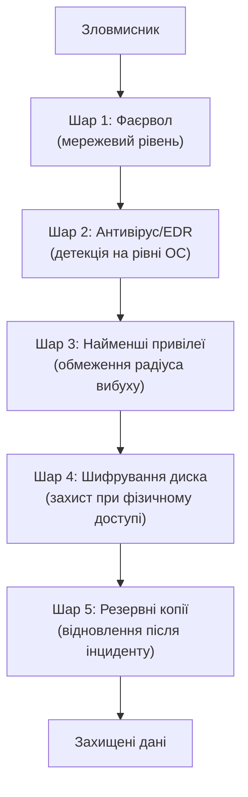
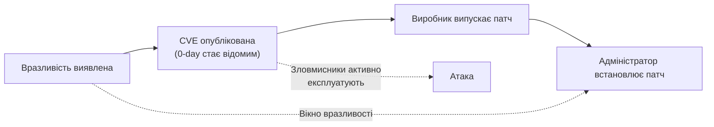

# 3.1. Принципи hardening

Уявіть, що ви щойно придбали новий ноутбук. З коробки він вже вміє підключатися до мережі, запускати застосунки, відтворювати медіа — і при цьому, найімовірніше, має відкриті сервіси, які ви ніколи не використовуватимете, адміністративні можливості, про які ви не здогадуєтесь, і налаштування, оптимізовані для зручності, а не для безпеки. Hardening — це процес переходу від «зручного за замовчуванням» до «безпечного та свідомого». Не нова коробка з більшим замком, а системна ревізія того, що вже є.

> 📖 Ключові терміни — у [глосарії модуля](00-glosariy.md).

## Принцип 1: Least Privilege (найменші привілеї)

Кожен користувач, процес або служба має отримувати рівно той мінімум прав, що необхідний для виконання конкретного завдання — і ні байтом більше.

Це звучить як очевидна ідея, але на практиці порушується надзвичайно часто. Більшість користувачів Windows працюють під обліковим записом адміністратора — бо так «зручніше встановлювати програми». Більшість веб-застосунків підключаються до бази даних як `root` — бо «так простіше налаштувати». Більшість корпоративних сервісів запущені під системними обліковими записами з максимальними привілеями — бо «завжди так робили».

Наслідок: якщо шкідливий код потрапляє на машину і виконується в контексті адміністратора, він має доступ до всього. Якщо той самий код потрапляє на машину і виконується в контексті звичайного користувача — він може нашкодити лише в межах того, що цьому користувачу дозволено. Це і є «радіус вибуху».

**Практичні наслідки:**
- Окремий стандартний обліковий запис для щоденної роботи; адміністративний — лише для встановлення ПЗ.
- Веб-сервер запускається від імені непривілейованого системного користувача (`www-data`, `nginx`).
- Базові даних-з'єднання з мінімальними правами (лише `SELECT/INSERT` для читання, а не `DROP TABLE`).
- Сервіси не запускаються від `root`/`SYSTEM`, якщо це не абсолютно необхідно.

## Принцип 2: Defense in Depth (захист у глибину)

Жоден окремий контроль не є достатнім. Захист будується як серія незалежних шарів, так що прорив одного не означає компрометацію всієї системи.

Класична помилка: «у нас є антивірус, тому ми захищені». Антивірус — один шар. Він пропускає нові або невідомі загрози. Якщо одночасно не налаштовано фаєрвол, права доступу і бекапи — компрометація антивірусу (або просто його обхід) означає повну катастрофу.

**Паралель з фізичним світом:** банк не покладається лише на броньовані двері. Є охоронці, камери, сейфи, тривожна кнопка, обмежений доступ до різних приміщень, журнали відвідувань. Провал будь-якого одного рівня не відчиняє шлях до грошей — потрібно подолати всі.

## Принцип 3: Attack Surface Reduction (зменшення поверхні атаки)

Кожна функція, яка встановлена але не використовується, — це потенційна вразливість. Найбезпечніший код — той, якого немає.

**Що входить до поверхні атаки:**
- Встановлені програми (кожна може мати вразливості).
- Запущені сервіси і демони (кожен відкритий порт — точка входу).
- Відкриті мережеві порти.
- Інтерфейси управління (Telnet, RDP, SSH, веб-адмін-панелі).
- Встановлені розширення браузера (кожне має доступ до вмісту сторінок).
- Підключені USB-пристрої.
- Увімкнені протоколи і функції ОС (SMBv1, WScript, PowerShell v2).

**Правило:** якщо ви не знаєте, навіщо ця функція увімкнена, — вона вимкнена.

## Принцип 4: Secure Defaults (безпека за замовчуванням)

Системи слід налаштовувати так, щоб стан «з коробки» вже був максимально безпечним. Усе, що потрібне понад базовий мінімум, вмикається явно і свідомо.

Це принцип для розробників ПЗ і адміністраторів однаково. Якщо сервіс потребує явного увімкнення небезпечної функції — це краще, ніж якщо небезпечна функція увімкнена за замовчуванням, а безпечна вимагає окремого налаштування.

**Приклад порушення:** SSH за замовчуванням дозволяє вхід під root з паролем. Більшість систем залишають це так, бо «потрібно явно виправити конфіг». Результат — мільйони серверів з відкритим root-входом по SSH, що скануються ботами цілодобово.

**Приклад дотримання:** сучасні дистрибутиви Linux при встановленні SSH (OpenSSH) у нових версіях вже за замовчуванням вимикають вхід під root. Це secure defaults у дії.

## Принцип 5: Patch Management (управління оновленнями)

За даними галузевих звітів, переважна більшість успішних атак на реальні системи використовує **вже відомі** вразливості, для яких існує публічне виправлення. Зловмисники масово сканують інтернет у пошуку систем з певними версіями ПЗ, знаючи, що CVE для них вже опублікована.

Висновок невтішний і водночас оптимістичний: просте, своєчасне встановлення оновлень ліквідує більшу частину реальних векторів атаки.

Чим коротше «вікно вразливості» між публікацією CVE і встановленням патча — тим менше шансів у зловмисника. Автоматичні оновлення скорочують це вікно до мінімуму для більшості звичайних користувачів.

**Управління оновленнями в організації** — складніша тема: патчі тестуються перед розгортанням, щоб не зламати критичні системи. Але для домашнього ПК чи малого бізнесу без ресурсів на тестування автооновлення — явно краще, ніж місяцями не оновлюватись зовсім.

## Принцип 6: Fail Securely (безпечний відказ)

Якщо щось йде не так — система має перейти в безпечний стан, а не в небезпечний. Приклади:

- Якщо перевірка автентифікації повертає помилку — доступ **закрито**, а не відкрито.
- Якщо фаєрвол «падає» — трафік **блокується**, а не пропускається.
- Якщо процес шифрування перервано — файл **не зберігається**, а не зберігається у відкритому вигляді.

Цей принцип часто порушується через помилки в коді або невірне розуміння «зручності для користувача». Fail-open — зручно, але небезпечно. Fail-secure — незручно, але правильно.

## Як ці принципи пов'язані

Ці шість принципів — не окремі чек-листи, а взаємопов'язана система мислення. Least privilege обмежує радіус вибуху, якщо defense in depth не зупинить атаку. Attack surface reduction знижує кількість можливих векторів атаки для тих самих шарів захисту. Patch management усуває вразливості, що могли б стати точкою входу попри фаєрвол. Secure defaults гарантує, що нові компоненти не з'являються в системі в незахищеному стані.

Усі практичні розділи цього модуля (3.3–3.11) — це застосування саме цих принципів до конкретних компонентів ОС.

## Стандарти, що формалізують hardening

- **CIS Benchmarks** (Center for Internet Security) — найдетальніші публічно доступні інструкції з hardening для кожної ОС, версії, сервісу. Безкоштовні для читання. Саме на них спирається більша частина практичних рекомендацій у розділах 3.6 і 3.7.
- **NIST SP 800-70** — керівництво з використання чек-листів безпеки (Security Configuration Checklists).
- **DISA STIGs** (Security Technical Implementation Guides) — надзвичайно детальні вимоги американського Міністерства оборони; корисні як референс найвищої суворості.

## Міні-вправа

Подумайте про три пристрої, якими ви користуєтесь щодня (ноутбук, телефон, домашній роутер). Для кожного спробуйте відповісти на п'ять питань:

1. Який принцип найбільш очевидно порушується зараз?
2. Чи встановлені всі оновлення?
3. Чи є увімкнені функції/сервіси, якими ви не користуєтесь?
4. Який рівень привілеїв має ваш щоденний обліковий запис?
5. Якщо цей пристрій буде вкрадено або скомпрометовано — який найгірший сценарій наслідків?

Відповіді на ці питання — ваша особиста відправна точка для hardening.

## Джерела та додаткові матеріали

- CIS Benchmarks (cisecurity.org/cis-benchmarks) — конкретні рекомендації для кожної ОС.
- NIST SP 800-123 — Guide to General Server Security.
- DISA STIGs (public.cyber.mil/stigs) — найсуворіший публічний стандарт hardening.
- OWASP, *Security by Design Principles* — принципи безпечного проєктування.

---

**Далі:** [3.2. Архітектура ОС з погляду безпеки](02-arkhitektura-os.md)
**Назад до модуля:** [README модуля 03](README.md)
