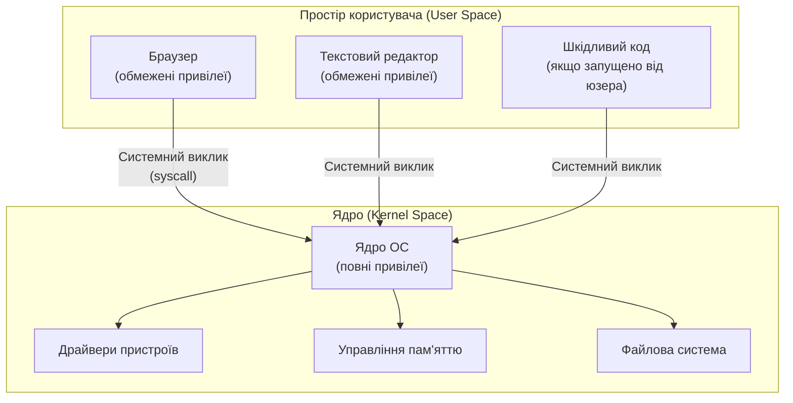
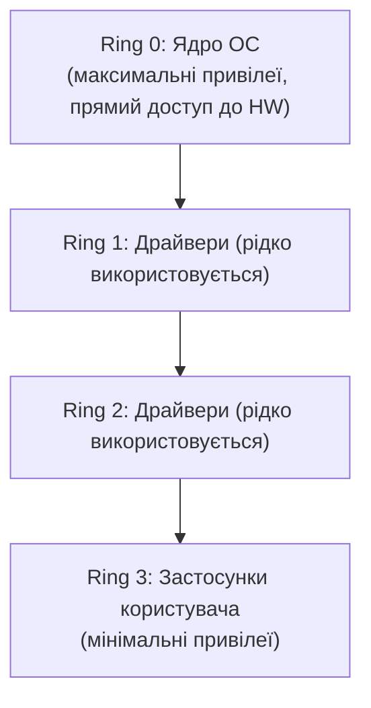

# 3.2. Архітектура ОС з погляду безпеки

Уявіть великий завод із зонами допуску. Звичайний робітник може заходити у свій цех, але не в серверну і не в директорський кабінет. Керівник цеху — у трохи більше місць. Директор — майже скрізь. А технічний директор — у всі приміщення без винятку, включно з кімнатою управління, де можна вимкнути весь завод одним перемикачем. Саме за таким принципом влаштована операційна система: різні компоненти мають різний рівень доступу, і межі між ними є одночасно і лінією захисту, і найбажанішою ціллю для зловмисника. Зрозуміти ці межі — значить зрозуміти, що реально захищає ОС, а де вона безсила.

> 📖 Ключові терміни — у [глосарії модуля](00-glosariy.md).

## Ядро (Kernel) і простір користувача (User Space)

Фундаментальний поділ сучасних ОС — між **ядром** і **простором користувача**:



**Ядро** має прямий доступ до апаратного забезпечення і виконується з максимальними привілеями. **Простір користувача** — де виконуються всі застосунки: браузер, офісні програми, шкідливий код. Застосунки не можуть напряму звертатись до апаратного забезпечення — вони просять ядро це зробити через **системні виклики (syscall)**.

Цей поділ є критичним захисним механізмом: навіть якщо застосунок скомпрометовано, він не може безпосередньо перезаписати апаратний диск або отримати доступ до пам'яті іншого процесу — лише через ядро, яке перевіряє дозволи.

## Кільця захисту (Protection Rings)

Архітектура x86/x86-64 реалізує ієрархію привілеїв у вигляді **кілець захисту**:



На практиці більшість сучасних ОС використовують лише Ring 0 (ядро) і Ring 3 (застосунки). Різниця в привілеях між ними реалізується апаратно — це не програмне обмеження, яке можна обійти кодом, а фізичне обмеження процесора.

**Що це означає для безпеки:**
- Атаки, що залишаються в Ring 3 (компрометація застосунку), значно менш небезпечні.
- Атаки, що досягають Ring 0 (privilege escalation до ядра, руткіти), дають зловмиснику повний контроль над системою — і виявити їх набагато складніше.
- Уразливості в драйверах пристроїв (Ring 0) — особливо критичні: вони дають зловмиснику доступ до Ring 0 через відносно доступний вектор (встановлення шкідливого драйвера).

## Процеси і потоки

**Процес** — ізольована одиниця виконання з власним адресним простором пам'яті. Кожен запущений застосунок — один або більше процесів. Ізоляція пам'яті між процесами — ключовий захисний механізм: процес А не може прочитати пам'ять процесу Б без явного системного виклику і відповідних дозволів.

**Потік (Thread)** — одиниця виконання всередині процесу; потоки одного процесу поділяють його адресний простір.

**Атрибути процесу, важливі для безпеки:**
- **PID (Process ID)** — унікальний ідентифікатор.
- **UID/GID** (Linux) або **SID** (Windows) — ідентифікатор користувача, від імені якого виконується процес.
- **Привілеї** — конкретний набір дозволених дій (Windows Privileges/Linux Capabilities).
- **Батьківський процес (PPID)** — хто породив цей процес; аномальний батьківський процес — частий індикатор атаки.

```bash
# Linux: переглянути процеси з UID і PPID
ps aux --forest

# Windows PowerShell: переглянути процеси з батьківськими PID
Get-Process | Select-Object Name, Id, @{N='ParentId';E={(Get-WmiObject Win32_Process -Filter "ProcessId=$($_.Id)").ParentProcessId}}
```

## Управління пам'яттю і захисні механізми

Сучасні ОС реалізують кілька апаратних механізмів захисту пам'яті:

| Механізм | Що захищає | Windows | Linux |
|---|---|---|---|
| **ASLR** (Address Space Layout Randomization) | Рандомізує адреси завантаження коду і даних у пам'яті; ускладнює ROP-атаки і використання buffer overflow | Увімкнено за замовчуванням | Увімкнено за замовчуванням |
| **DEP/NX** (Data Execution Prevention / No-Execute) | Забороняє виконання коду в областях пам'яті, позначених як «дані»; захист від shellcode у стеку | Увімкнено за замовчуванням | Підтримується ядром |
| **Stack Canaries** | «Канарейки» — спеціальні значення між стеком і адресою повернення; їх пошкодження виявляє buffer overflow | Компілятор | Компілятор |
| **CFG/CET** (Control Flow Guard/Enforcement Technology) | Перевірка легітимності переходів між функціями; захист від ROP-ланцюжків | Windows 8.1+ | Linux ядро 5.18+ |

Розуміння цих механізмів важливе: багато реальних атак (зокрема, більшість браузерних exploit-ланцюжків) спрямовані на їх обхід.

## Файлова система і права доступу

Файлова система — не просто сховище файлів. Це система контролю доступу, де кожен файл і директорія мають власника, групу і набір прав. Детально права доступу розглядає розділ 3.3, але архітектурно важливо зрозуміти такі концепції:

**Inode** (Linux) — структура, що зберігає метадані файлу (власник, права, розміри, timestamps) окремо від самих даних. Права доступу пов'язані з inode, а не з іменем файлу.

**ACL (Access Control List)** — розширена модель прав, що дозволяє задавати права не лише для власника/групи/всіх, а для довільного набору користувачів і груп.

**Жорсткі та символічні посилання** — різні механізми посилань на один файл; обидва мають специфічні безпекові наслідки (наприклад, hard links на SUID-файли можуть обходити деякі перевірки).

## Системний реєстр Windows

Реєстр Windows — централізована база даних конфігурації ОС і застосунків. З погляду безпеки критично важливий тому, що:

- Містить налаштування запуску (автозавантаження — `HKCU\Software\Microsoft\Windows\CurrentVersion\Run`).
- Зберігає хеші паролів (SAM: `HKLM\SAM`).
- Конфігурує поведінку UAC, фаєрвола, Defender.
- Є мішенню для шкідливого ПЗ, що хоче закріпитись у системі.

Ключові гілки реєстру для безпеки:

| Гілка | Скорочення | Що містить |
|---|---|---|
| `HKEY_LOCAL_MACHINE` | HKLM | Системні налаштування, спільні для всіх користувачів |
| `HKEY_CURRENT_USER` | HKCU | Налаштування поточного користувача |
| `HKEY_USERS` | HKU | Профілі всіх користувачів |
| `HKEY_CLASSES_ROOT` | HKCR | Асоціації файлів і COM-об'єкти |

## Mechanisms: Windows vs Linux vs macOS — ключові відмінності

| Концепція | Windows | Linux | macOS |
|---|---|---|---|
| Ідентифікація користувача | SID (Security Identifier) | UID/GID (числові) | UID/GID (числові, схоже на Linux) |
| Підвищення привілеїв | UAC (запит підтвердження) | sudo/su (введення пароля) | sudo + запит пароля / Touch ID |
| Централізована конфігурація | Реєстр | Файли у `/etc/` | plist-файли у `/Library/`, defaults |
| Логи безпеки | Event Log (Security) | syslog, auditd, journald | Unified Log (log show), /var/log |
| Мандатний контроль доступу | AppLocker, WDAC | AppArmor, SELinux | SIP (System Integrity Protection), TCC |
| Шифрування диска | BitLocker | LUKS/dm-crypt | FileVault 2 |
| Захист від шкідливого ПЗ | Defender | ClamAV, rkhunter | XProtect, Gatekeeper |
| Secure Boot | Secure Boot (UEFI) | Secure Boot (shim/GRUB) | Apple Secure Boot (T2/Apple Silicon) |

> **macOS у цьому посібнику** розглядається як базовий орієнтир порівняння — деталізований hardening macOS виходить за рамки поточного модуля, що фокусується на Windows і Linux. Ключові аналоги: FileVault ≈ BitLocker/LUKS, Gatekeeper ≈ AppLocker, SIP ≈ захищені системні файли chattr+i.

## Міні-вправа

Запустіть один з наступних запитів на своїй машині і спробуйте інтерпретувати результат:

**Windows (PowerShell):**
```powershell
# Переглянути всі запущені процеси, їх PID і шлях до виконуваного файлу
Get-Process | Select-Object Name, Id, Path | Sort-Object Name | Format-Table -AutoSize
```

**Linux:**
```bash
# Переглянути дерево процесів з UID і PID
ps auxf | head -40
```

Зверніть увагу: чи є процеси, що запущені від `root`/`SYSTEM`, але назви яких вам незнайомі? Чи є застосунки без вказаного шляху? Ці аномалії — перший крок виявлення підозрілої активності.

## Джерела та додаткові матеріали

- Intel, *Software Developer's Manual* (Vol. 3A) — специфікація кілець захисту x86.
- Microsoft, *Windows Internals* (Russinovich et al.) — найповніший опис архітектури Windows.
- Robert Love, *Linux Kernel Development* — архітектура Linux зсередини.
- MITRE ATT&CK, Tactic *Privilege Escalation* — реальні техніки виходу з Ring 3 у Ring 0.

---

**Попередній розділ:** [3.1. Принципи hardening](01-pryntsypy-hardening.md)
**Далі:** [3.3. Користувачі, групи та права доступу](03-korystuvachi-ta-prava.md)
**Назад до модуля:** [README модуля 03](README.md)
