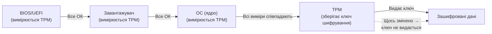
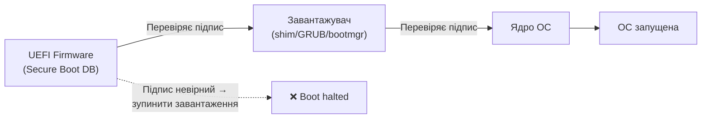

# 3.5. Шифрування дисків

Є один сценарій, де всі попередньо описані захисні заходи — паролі, права доступу, фаєрвол — не мають жодного значення: коли зловмисник фізично забирає ваш жорсткий диск. Він просто підключає його до власної машини і читає все, що захоче, ігноруючи будь-яку ОС і будь-які паролі входу. Шифрування диска — єдиний засіб, що захищає дані при фізичному доступі до носія.

> 📖 Ключові терміни — у [глосарії модуля](00-glosariy.md).

## Сценарії, де шифрування диска критично важливе

- **Крадіжка або втрата ноутбука** — найпоширеніший сценарій. Статистика показує, що в аеропортах, готелях і кафе втрачаються тисячі ноутбуків щорічно.
- **Фізичний доступ у відсутність власника** — колега, обслуговуючий персонал, правоохоронні органи (якщо пристрій вилучено без відключення).
- **Вилучення диска із справного комп'ютера** — підключення до іншої машини для обходу ОС.
- **Утилізація обладнання** — диск, «відформатований» звичайним чином, відновлюється стандартними інструментами.

Без шифрування диска: пароль Windows/Linux захищає лише від входу через ОС, але не від прямого читання диска.

## TPM: апаратна основа шифрування

**TPM (Trusted Platform Module)** — спеціалізований мікроконтролер, що вбудований у сучасні ноутбуки і настільні ПК (вимога для Windows 11). TPM виконує кілька функцій:

- Зберігає ключі шифрування та криптографічні матеріали у захищеному апаратному сховищі.
- **Перевіряє цілісність завантаження** — вимірює стан BIOS/UEFI, завантажувача і ядра ОС при кожному увімкненні. Якщо щось змінилось (наприклад, підмінено завантажувач) — TPM відмовляється видати ключ шифрування.
- Захищає від атаки **Cold Boot Attack** — витягування ключів з оперативної пам'яті після раптового вимкнення.



## BitLocker (Windows)

**BitLocker** — вбудований інструмент шифрування дисків Windows (Pro, Enterprise, Education).

### Режими захисту BitLocker

| Режим | Як розблоковується | Рівень зручності | Рівень безпеки |
|---|---|---|---|
| **TPM-only** | Автоматично при нормальному завантаженні | Максимальний (прозоро) | Середній — не захищає від атак після завантаження |
| **TPM + PIN** | TPM + введення PIN перед завантаженням ОС | Середній | Високий — **рекомендований** |
| **TPM + USB** | TPM + підключення USB-ключа при завантаженні | Незручний | Високий |
| **Лише пароль** | Пароль при кожному завантаженні | Низький | Середній (без апаратного захисту) |

### Увімкнення BitLocker

```powershell
# Увімкнути BitLocker на системному диску (C:) з TPM + PIN
# Спочатку налаштувати PIN через GUI: Панель керування → Шифрування диска BitLocker

# Або через PowerShell (вимагає Run as Administrator):
Enable-BitLocker -MountPoint "C:" -EncryptionMethod XtsAes256 `
    -TpmAndPinProtector -Pin (ConvertTo-SecureString "YourPIN" -AsPlainText -Force)

# Переглянути статус BitLocker
Get-BitLockerVolume -MountPoint "C:"

# ОБОВ'ЯЗКОВО: зберегти Recovery Key у безпечному місці
# (обліковий запис Microsoft, Azure AD, або роздрукувати)
Get-BitLockerVolume -MountPoint "C:" | Select-Object -ExpandProperty KeyProtector
```

### Recovery Key — найважливіший момент

**Recovery Key** — 48-значний числовий код, що дозволяє розблокувати диск у разі втрати PIN або проблем з TPM. Якщо ви втратите Recovery Key і забудете PIN — дані зашифровані назавжди. Зберігати Recovery Key:
- ✅ У хмарному обліковому записі Microsoft (автоматично, якщо вийшли через MS account)
- ✅ Роздрукований і збережений у фізично захищеному місці
- ✅ У корпоративному AD/Intune (для організацій)
- ❌ На тому самому зашифрованому диску

## LUKS/dm-crypt (Linux)

**LUKS (Linux Unified Key Setup)** — стандарт шифрування дисків Linux, реалізований через `dm-crypt`. Підтримує кілька слотів ключів (до 8 паролів або ключових файлів на один контейнер).

### Шифрування розділу LUKS

```bash
# Зашифрувати розділ (УВАГА: знищує всі дані на розділі!)
sudo cryptsetup luksFormat --type luks2 --cipher aes-xts-plain64 \
    --key-size 512 --hash sha512 /dev/sdb1

# Відкрити (розшифрувати) розділ
sudo cryptsetup luksOpen /dev/sdb1 my_encrypted_volume

# Тепер він доступний як /dev/mapper/my_encrypted_volume
# Створити файлову систему і змонтувати
sudo mkfs.ext4 /dev/mapper/my_encrypted_volume
sudo mount /dev/mapper/my_encrypted_volume /mnt/secret

# Закрити (заблокувати)
sudo umount /mnt/secret
sudo cryptsetup luksClose my_encrypted_volume
```

### Управління ключами LUKS

```bash
# Додати другий пароль (резервний)
sudo cryptsetup luksAddKey /dev/sdb1

# Переглянути зайняті слоти ключів
sudo cryptsetup luksDump /dev/sdb1 | grep "Key Slot"

# Видалити ключ зі слоту
sudo cryptsetup luksKillSlot /dev/sdb1 1
```

### LUKS для шифрування при встановленні

Більшість сучасних дистрибутивів Linux (Ubuntu, Fedora, Debian) пропонують опцію «Encrypt the installation» при інсталяції — це найпростіший спосіб налаштувати шифрування всього диска. Рекомендовано увімкнути під час встановлення, а не після.

## VeraCrypt: кросплатформне рішення

**VeraCrypt** (наступник TrueCrypt) — безкоштовний інструмент з відкритим кодом, що працює на Windows, macOS і Linux. Корисний для:

- Шифрування зовнішніх накопичувачів (USB-флешки, зовнішні диски).
- Шифрування окремих контейнерів (файл-контейнер, який монтується як диск).
- Кросплатформного обміну зашифрованими даними.
- **Прихованих томів (Hidden Volumes)** — можливість мати два паролі для одного контейнера: один показує «легальні» дані, другий — справжні (захист під примусом).

```
# Типовий сценарій: зашифрований USB-диск
1. Відкрити VeraCrypt → Create Volume → Encrypt a non-system partition
2. Вибрати USB-розділ, алгоритм (AES + SHA-512), задати пароль
3. Монтувати при підключенні через VeraCrypt, розмонтувати після роботи
```

## Secure Boot: захист ланцюжка завантаження

Шифрування диска (BitLocker/LUKS) захищає дані від зчитування при вилученому диску. Але є ще один вектор атаки, що обходить шифрування: **підміна завантажувача**. Зловмисник із фізичним доступом до вимкненого ноутбука може підмінити GRUB або Windows Boot Manager на шкідливу версію, яка перехоплює PIN шифрування ще до того, як ОС завантажиться. Цю атаку називають **Evil Maid Attack**.

**Secure Boot** — механізм UEFI, що вирішує цю проблему: при кожному завантаженні UEFI перевіряє криптографічний підпис кожного компонента ланцюжка завантаження (завантажувача, ядра ОС, драйверів). Якщо підпис не збігається з довіреними ключами в базі даних UEFI — завантаження зупиняється. Непідписаний або підмінений завантажувач просто не запуститься.



**Перевірка та увімкнення Secure Boot:**

```powershell
# Windows: перевірити стан Secure Boot
Confirm-SecureBootUEFI
# True = увімкнено, False = вимкнено, помилка = BIOS/legacy режим

# Або через msinfo32: System Summary → Secure Boot State
```

```bash
# Linux: перевірити стан Secure Boot
mokutil --sb-state
# "SecureBoot enabled" або "SecureBoot disabled"

# Або через efivar
efivar -l | grep -i secure
```

**Якщо Secure Boot вимкнено** — увімкніть у налаштуваннях UEFI/BIOS (зазвичай розділ Security або Boot).

**Secure Boot і Linux:** більшість сучасних дистрибутивів (Ubuntu, Fedora, Debian) підтримують Secure Boot через **shim** — підписаний Microsoft проміжний завантажувач. Якщо ваш дистрибутив не завантажується з увімкненим Secure Boot — найімовірніше, потрібно встановити `shim-signed` або аналог.

**Secure Boot не є абсолютним захистом:** він захищає ланцюжок завантаження, але не дані на диску і не запущену ОС. Саме тому Secure Boot + TPM + BitLocker з PIN — це три взаємодоповнюючих рівні, а не один замість іншого.


| Підхід | Що шифрує | Захищає від |
|---|---|---|
| **FDE (Full Disk Encryption)** — BitLocker/LUKS | Весь диск | Фізичної крадіжки, відключення диска |
| **Шифрування окремих файлів/папок** — EFS (Windows), eCryptfs | Обрані файли | Несанкціонованого доступу до конкретних даних |
| **Шифрування контейнерів** — VeraCrypt | Вміст контейнера | Доступу до контейнера при його відключенні |

FDE і шифрування на рівні файлів **не замінюють** одне одного — вони вирішують різні завдання. FDE захищає від фізичної крадіжки диска, але не захищає від зловмисника, що отримав доступ до запущеної системи (де диск вже розшифровано). Шифрування на рівні файлів захищає конкретні файли навіть від адміністратора системи.

## Підводні камені шифрування дисків

**Продуктивність:** сучасні процесори мають апаратне прискорення AES (AES-NI), тому вплив на продуктивність незначний (1–5% для більшості задач).

**Небезпека при спрощеному налаштуванні:** BitLocker у режимі «лише TPM» (без PIN) автоматично розблоковується при завантаженні. Якщо ноутбук вкрадено у сплячому режимі (sleep) — зловмисник може відновити роботу і отримати доступ.

**Cold Boot Attack:** якщо ноутбук вкрадено у режимі роботи, спеціалізоване обладнання може вилучити ключ шифрування з оперативної пам'яті (ключ ще присутній кілька секунд/хвилин після вимкнення живлення). Захист: вимикати (а не переводити в сон) комп'ютер при будь-якій потенційно ризикованій ситуації.

**Swap/Hibernate файл:** якщо ОС використовує swap-розділ або файл гібернації поза зашифрованим томом — там можуть опинитися фрагменти даних або ключів. Для повного захисту swap/hibernate мають бути зашифровані або вимкнені.

## Міні-вправа

**Перевірка стану шифрування:**

*Windows (PowerShell):*
```powershell
# Переглянути статус BitLocker для всіх дисків
Get-BitLockerVolume | Select-Object MountPoint, VolumeStatus, EncryptionPercentage, ProtectionStatus
```

*Linux:*
```bash
# Переглянути наявність LUKS-розділів
sudo lsblk -o NAME,TYPE,SIZE,MOUNTPOINT,FSTYPE | grep -E "crypt|luks"

# Або
sudo cryptsetup status /dev/sda
```

Якщо шифрування не увімкнено — вирішіть, чи є на вашому пристрої дані, що потребують такого захисту (переважно так, особливо для ноутбука).

## Джерела та додаткові матеріали

- Microsoft Docs, *BitLocker Overview* — повна документація BitLocker.
- `man cryptsetup` — офіційна документація LUKS.
- VeraCrypt Documentation (veracrypt.fr) — документація VeraCrypt.
- NIST SP 800-111 — Guide to Storage Encryption Technologies.
- TPM 2.0 Library Specification (trustedcomputinggroup.org).

---

**Попередній розділ:** [3.4. Автентифікація в ОС](04-avtentyfikatsiia-v-os.md)
**Далі:** [3.6. Hardening Windows](06-hardening-windows.md)
**Назад до модуля:** [README модуля 03](README.md)
