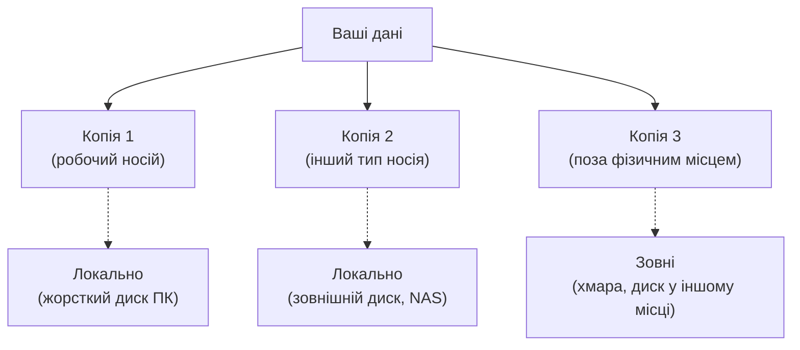

# 3.9. Резервне копіювання

Є один тип кіберінциденту, від якого навіть найкраще налаштована система не гарантує повного захисту: ransomware, що успішно зашифрував дані, або катастрофічний апаратний збій. Єдиний засіб, що гарантує відновлення в обох випадках, — резервна копія. При цьому «бекап» без перевіреного відновлення — це не бекап, а відчуття впевненості, яке може виявитись хибним саме у найгірший момент.

> 📖 Ключові терміни — у [глосарії модуля](00-glosariy.md).

## Правило 3-2-1

**Правило 3-2-1** — галузевий стандарт стратегії резервного копіювання:



- **3** копії даних (оригінал + 2 резервних).
- **2** різних типи носіїв або місця зберігання.
- **1** копія поза основним фізичним місцем (offsite).

**Чому саме так:**
- Проти апаратного збою: два різних носії забезпечують, що відмова одного не знищить обидва.
- Проти пожежі/повені/крадіжки: offsite-копія виживає при фізичних катастрофах.
- Проти ransomware: якщо шкідливий код зашифрував основні дані і підключений зовнішній диск — offsite-копія (хмара або окремий диск) залишається незачепленою.

## Типи резервних копій

| Тип | Що копіює | Швидкість | Розмір | Відновлення |
|---|---|---|---|---|
| **Повна (Full)** | Всі дані повністю | Повільно | Великий | Просте — один набір |
| **Інкрементальна (Incremental)** | Лише зміни з останнього бекапу (будь-якого) | Дуже швидко | Найменший | Складне — потрібна вся ланцюжок |
| **Диференційна (Differential)** | Всі зміни з останньої ПОВНОЇ копії | Середньо | Середній | Помірно — повна + остання диф |
| **Синхронізація (Sync/Mirror)** | Точна копія джерела | Швидко | Рівний | Просте, але видалення переноситься |

**Для домашнього використання:** повна копія раз на тиждень + інкрементальна щодня — хороший баланс між захистом і витратами місця.

**Для бізнесу:** залежить від RPO (Recovery Point Objective — скільки даних можна втратити) і RTO (Recovery Time Objective — скільки часу займе відновлення).

## Інструменти резервного копіювання

### Windows

**Вбудований History Files (Windows 10/11):**
```powershell
# Увімкнути History Files через Панель керування → History Files
# Або PowerShell:
Enable-ComputerRestore -Drive "C:\"
Checkpoint-Computer -Description "Before hardening"

# History Files — не повноцінний бекап: лише версії файлів, не системи
```

**Windows Backup (вбудований, для Windows 11):**
```powershell
# Через GUI: Пуск → Settings → System → Storage → Advanced storage settings → Backup
# Або через wbadmin для командного рядка:
wbadmin start backup -backuptarget:E: -include:C: -allCritical -quiet
```

**Рекомендований сторонній інструмент: Veeam Agent for Windows (безкоштовний для одного ПК)**

### Linux

```bash
# rsync: базовий і надійний інструмент синхронізації/бекапу
rsync -avz --delete \
    --exclude='/proc/*' \
    --exclude='/sys/*' \
    --exclude='/dev/*' \
    --exclude='/run/*' \
    --exclude='/tmp/*' \
    /home/alice/ \
    /mnt/backup/alice/

# Або на віддалений сервер по SSH:
rsync -avz -e ssh /home/alice/ backup_server:/backups/alice/

# BorgBackup: дедуплікація, стиснення, шифрування
sudo apt install borgbackup

# Ініціалізувати шифрований репозиторій
borg init --encryption=repokey /mnt/backup/borg_repo

# Створити бекап (автоматично дедуплікація і стиснення)
borg create --stats --progress \
    /mnt/backup/borg_repo::backup-{now:%Y-%m-%d} \
    /home/alice \
    --exclude /home/alice/.cache

# Переглянути список архівів
borg list /mnt/backup/borg_repo

# Відновити з бекапу
borg extract /mnt/backup/borg_repo::backup-2026-06-01 home/alice/important_file.txt
```

### Хмарні рішення для домашнього використання

| Сервіс | Шифрування | Безкоштовно | Примітка |
|---|---|---|---|
| **Backblaze B2** | E2E (з Cryptomator) | 10 ГБ безкоштовно | Дешеве хмарне сховище |
| **Rclone** | E2E + будь-яке хмарне | Самоналаштування | Відкритий код, гнучкість |
| **Duplicati** | AES-256 | Так (open source) | GUI-інтерфейс, хмарний бекап |
| **Google Drive/OneDrive** | TLS + at rest | 15/5 ГБ | Не E2E — провайдер бачить файли |
| **Nextcloud** | E2E (розширення) | Self-hosted | Повний контроль |

**Важливо:** Google Drive, OneDrive і Dropbox — це синхронізація, а не бекап. Якщо ransomware зашифрує файли на диску — синхронізація перезапише хмарні копії зашифрованими файлами. Потрібен інструмент, що зберігає версії або окремі знімки.

## Шифрування резервних копій

Резервна копія часто містить найцінніші дані організації чи людини — і при цьому часто зберігається у менш захищеному місці (зовнішній диск в шухляді, хмарний акаунт). Незашифрований бекап — це готовий «подарунок» для зловмисника.

**Правило:** кожна резервна копія, що виходить за межі вашого зашифрованого диска, **must** бути зашифрована.

```bash
# Шифрування резервної копії за допомогою gpg
tar czf - /home/alice/ | gpg --symmetric --cipher-algo AES256 -o backup_alice.tar.gz.gpg

# Розшифрування
gpg -d backup_alice.tar.gz.gpg | tar xzf -

# BorgBackup шифрує автоматично (при --encryption=repokey)
# Restic також шифрує за замовчуванням
```

## Верифікація відновлення: найважливіший крок

> Нетестована резервна копія — це не резервна копія. Це надія.

**Тест відновлення** — найчастіше ігнорований, але найважливіший елемент будь-якої стратегії бекапу. Регулярне тестування виявляє:
- Пошкоджені або неповні файли бекапу.
- Проблеми з ключами шифрування (не той ключ, ключ втрачено).
- Несумісність версій ПЗ.
- Реальний час відновлення (часто значно більший від очікуваного).

```bash
# Перевірити цілісність BorgBackup-архіву
borg check /mnt/backup/borg_repo

# Тестове відновлення конкретного файлу у тимчасову директорію
borg extract --dry-run /mnt/backup/borg_repo::backup-2026-06-01 home/alice/document.docx
borg extract /mnt/backup/borg_repo::backup-2026-06-01 home/alice/document.docx --strip-components=2 --dest /tmp/test_restore/

# Порівняти відновлений файл з оригіналом
md5sum /home/alice/document.docx /tmp/test_restore/document.docx
```

**Рекомендований графік тестування:**
- Перевірка цілісності: автоматично після кожного бекапу.
- Тест відновлення конкретних файлів: щомісяця.
- Повне тест-відновлення системи: раз на 6–12 місяців (якщо критично важливо).

## Захист бекапів від ransomware

Ransomware все частіше цілеспрямовано атакує резервні копії — або шифрує їх разом з основними файлами (якщо вони на підключеному диску), або видаляє їх через Volume Shadow Copies (VSS).

**Захисні заходи:**
- **Offsite/хмара:** бекап на неприєднаному ресурсі недосяжний для шкідливого коду.
- **Immutable backups:** деякі рішення підтримують «незмінні» бекапи (object lock в S3, borg/restic append-only mode) — записані дані не можна змінити чи видалити протягом заданого терміну.
- **Захист VSS (Windows):** заборонити стороннім застосункам видаляти тіньові копії:

```powershell
# Перевірити стан VSS
vssadmin list shadows

# Налаштувати максимальний розмір VSS (збільшити кількість точок відновлення)
vssadmin resize shadowstorage /on=C: /for=C: /maxsize=20%
```

## Автоматизація бекапів

Бекап, що вимагає ручного запуску, рано чи пізно не запускається. Автоматизація — must.

**Linux: cron:**
```bash
# Додати в crontab (sudo crontab -e для root-бекапів)
# Щодня о 2:00 — інкрементальний бекап
0 2 * * * /usr/bin/borg create --stats /mnt/backup/borg_repo::daily-{date:%Y%m%d} /home/ 2>> /var/log/borg.log

# Щотижня в неділю о 3:00 — повний бекап
0 3 * * 0 rsync -avz /home/ /mnt/external/weekly_backup/ >> /var/log/rsync.log 2>&1

# Видаляти старі архіви (зберігати лише останні 30 щоденних, 4 тижневих, 6 місячних)
30 3 * * * /usr/bin/borg prune --keep-daily=30 --keep-weekly=4 --keep-monthly=6 /mnt/backup/borg_repo
```

**Windows: Task Scheduler:**
```powershell
# Створити задачу бекапу в планувальнику
$action = New-ScheduledTaskAction -Execute "wbadmin" -Argument "start backup -backuptarget:E: -include:C: -quiet"
$trigger = New-ScheduledTaskTrigger -Daily -At "2:00AM"
Register-ScheduledTask -TaskName "DailyBackup" -Action $action -Trigger $trigger -RunLevel Highest
```

## Міні-вправа: аудит поточної стратегії бекапу

Дайте чесну відповідь на сім запитань. Якщо на будь-яке з них відповідь «не знаю» або «ні» — це і є ваш наступний практичний крок.

1. Де зберігаються ваші найцінніші цифрові файли? Чи є у вас копія в іншому місці?
2. Коли востаннє ви свідомо створювали резервну копію?
3. Чи є у вас **offsite-копія** (хмара або диск в іншому місці)?
4. Чи зашифровані ваші резервні копії?
5. Ви зберегли ключ шифрування бекапу окремо від самого бекапу?
6. Чи автоматизований бекап (чи вимагає ручного запуску)?
7. Ви коли-небудь **реально відновлювали** файл з резервної копії (навіть як тест)?

```bash
# Linux: швидка перевірка — чи є cron-задачі для бекапу
crontab -l 2>/dev/null | grep -i "borg\|rsync\|backup\|restic" || echo "Автоматичних бекап-задач не знайдено у crontab"
sudo crontab -l 2>/dev/null | grep -i "borg\|rsync\|backup\|restic" || echo "(root crontab: порожній або без бекапу)"

# Перевірити наявні BorgBackup-репозиторії
find /mnt /media /home -name "config" -path "*/borg*" 2>/dev/null | head -5
```

```powershell
# Windows: переглянути налаштовані задачі бекапу
Get-ScheduledTask | Where-Object {$_.TaskName -like "*backup*" -or $_.TaskName -like "*Backup*"} |
    Select-Object TaskName, State, @{N='LastRun';E={$_.LastRunTime}}
```

## Чек-лист: мінімальна стратегія бекапу

- [ ] Визначено, які дані є критичними і мають резервуватись.
- [ ] Мінімум 2 незалежних місця зберігання (1 локальне + 1 offsite/хмара).
- [ ] Резервні копії шифруються перед збереженням поза зашифрованим диском.
- [ ] Ключі шифрування бекапів зберігаються окремо від самих бекапів.
- [ ] Бекапи виконуються автоматично за розкладом.
- [ ] Цілісність бекапів перевіряється автоматично.
- [ ] Тест відновлення проводився протягом останніх 3 місяців.
- [ ] Підключений зовнішній диск відключається після завершення бекапу.

## Джерела та додаткові матеріали

- BorgBackup documentation (borgbackup.readthedocs.io).
- Restic documentation (restic.readthedocs.io) — альтернатива Borg.
- Rclone documentation (rclone.org/docs) — підключення до хмарних сховищ.
- NIST SP 800-34 Rev. 1 — Contingency Planning Guide (включає стратегії бекапу).

---

**Попередній розділ:** [3.8. Браузер і мережева безпека](08-brauzer-ta-merezha.md)
**Далі:** [3.10. Моніторинг і логи](10-monitorynh-ta-lohы.md)
**Назад до модуля:** [README модуля 03](README.md)
