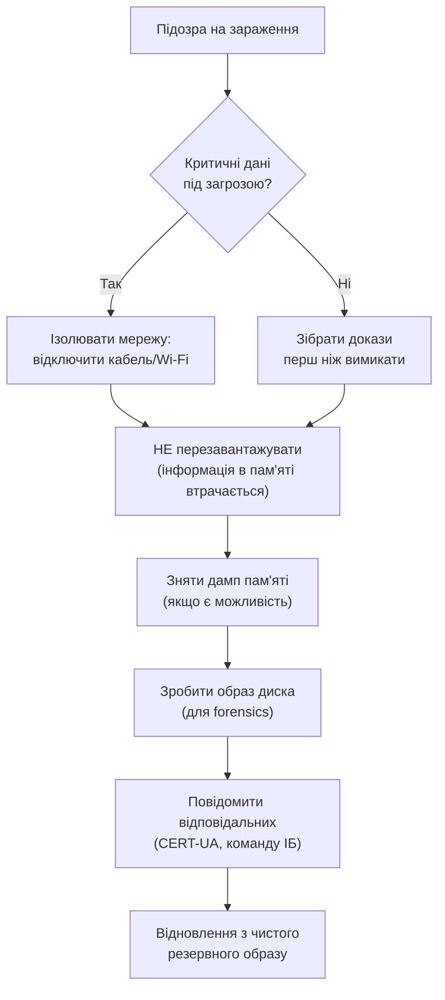

# 3.11. Шкідливе ПЗ і антивірусні рішення

Шкідливе програмне забезпечення — не абстрактна загроза з новин. Це конкретний код, що виконується на реальних пристроях, використовує реальні техніки для обходу захисту і завдає реальної шкоди: від шифрування файлів і вимоги викупу до непомітного збору даних роками. Розуміти, як шкідливий код працює зсередини, — значить розуміти, чому одні засоби захисту ефективні, а інші легко обходяться, і що реально потрібно для надійного захисту.

> 📖 Ключові терміни — у [глосарії модуля](00-glosariy.md).

## Класифікація шкідливого ПЗ

### За механізмом поширення

**Вірус** — код, що прикріплюється до легітимного файлу і поширюється при його запуску або копіюванні. Потребує участі користувача. Перші комп'ютерні віруси 1980-х розповсюджувались через дискети — механізм той самий, змінився лише носій.

**Черв'як (Worm)** — самостійно поширюється мережею без участі користувача, використовуючи вразливості ОС або мережевих служб. WannaCry (2017) — черв'як, що використовував EternalBlue (вразливість SMBv1) і за кілька годин заразив сотні тисяч машин по всьому світу, включаючи українські підприємства.

**Троян (Trojan)** — маскується під легітимну програму. Не поширюється самостійно — покладається на обман користувача (соціальна інженерія). Після запуску виконує приховану шкідливу функцію.

**Дроппер (Dropper)** — невеликий код, єдина функція якого — завантажити і встановити інший шкідливий код. Часто використовується як «перший рівень» у багатоступеневих атаках — дроппер може бути зовсім простим і важче виявляється.

### За призначенням і поведінкою

**Ransomware (програми-вимагачі)** — шифрують дані жертви і вимагають викуп за ключ розшифрування. Найбільш фінансово руйнівна категорія. Сучасні ransomware-групи (Conti, LockBit, BlackCat та ін.) діють як організовані злочинні підприємства з підтримкою, партнерськими програмами (RaaS — Ransomware-as-a-Service) і переговорниками. NotPetya (2017), що розпочався в Україні через M.E.Doc і поширився глобально — технічно був псевдо-ransomware (ключ розшифрування не існував), а насправді — деструктивний wipер.

**Spyware** — приховано збирає інформацію про користувача: паролі, дані форм, знімки екрана, натискання клавіш (keylogger). Часто не виявляється місяцями.

**Keylogger** — окремий клас spyware, що записує все, що вводиться з клавіатури. Може бути програмним (малвар) або апаратним (фізичний пристрій між клавіатурою і комп'ютером).

**Адваре (Adware)** — відображає небажану рекламу, перенаправляє браузер. Технічно не руйнівне, але заважає роботі і є індикатором ненадійного ПЗ.

**Ботнет / Bot** — скомпрометована машина (бот), підключена до командного сервера (C2/C&C) і виконує команди оператора: DDoS-атаки, розсилка спаму, майнінг криптовалюти, участь у подальших атаках.

**Rootkit** — приховує присутність шкідливого коду у системі: маскує процеси, файли, мережеві з'єднання. Може діяти на рівні ОС (user-space rootkit) або ядра (kernel rootkit / ring 0). Kernel rootkit — найскладніший для виявлення і видалення тип.

**Fileless Malware** — не залишає файлів на диску: виконується лише в пам'яті (in-memory), використовує легітимні системні інструменти (PowerShell, WMI, mshta) для виконання шкідливого коду. Дуже складно виявляється традиційними антивірусами, що аналізують файли.

**Wiper** — знищує дані без можливості відновлення. Використовується в кібервійнах для максимальної шкоди. Приклади в Україні: HermeticWiper, CaddyWiper (2022), IsaacWiper — хвиля вайперів, що атакувала українські організації напередодні та під час повномасштабного вторгнення.

### Typical attack lifecycle (ланцюжок атаки)

```mermaid
graph LR
    R["Розвідка\n(Reconnaissance)"] --> I["Початковий доступ\n(Initial Access)\nФішинг, вразливість"]
    I --> E["Виконання\n(Execution)\nMacro, PowerShell, скрипт"]
    E --> P["Закріплення\n(Persistence)\nАвтозапуск, служба, завдання"]
    P --> PE["Ескалація привілеїв\n(Privilege Escalation)\nUAC bypass, exploit"]
    PE --> DE["Обхід захисту\n(Defense Evasion)\nОбфускація, disable AV"]
    DE --> LA["Lateral Movement\nПереміщення в мережі"]
    LA --> EX["Ексфільтрація\n(Exfiltration)\nПередача даних на C2"]
    EX --> IM["Вплив\n(Impact)\nШифрування, видалення"]
```



Цей ланцюжок відповідає **MITRE ATT&CK** тактикам — стандартній мові опису поведінки зловмисників.

## Як працюють антивіруси

### Покоління 1: Сигнатурний аналіз

Найстаріший і найпростіший метод: AV-рушій порівнює файл з базою відомих сигнатур шкідливого ПЗ (як правило — хеш або характерна послідовність байт).

**Переваги:** швидко, мало хибних спрацювань для відомих загроз.
**Недоліки:** абсолютно сліпий до нових загроз (zero-day). Зловмисники легко обходять, просто змінюючи один байт у файлі (поліморфний код) або пакуючи код у різні обгортки.

### Покоління 2: Евристичний аналіз

Замість порівняння з базою — аналіз підозрілих характеристик: чи намагається код змінити системні файли? Чи відкриває сокет? Чи звертається до реєстру автозапуску? Код оцінюється за шкалою «підозрілості».

**Переваги:** може виявляти нові варіанти відомих загроз.
**Недоліки:** хибні спрацювання; складний код може поводитись «нормально» при аналізі.

### Покоління 3: Поведінковий аналіз і пісочниця (Sandbox)

**Пісочниця (Sandbox)** — ізольоване середовище виконання, де підозрілий файл запускається і спостерігається його реальна поведінка: які API-виклики робить, до яких файлів звертається, що пише в реєстр, куди підключається по мережі.

**Переваги:** виявляє загрози, що «добре поводяться» при статичному аналізі.
**Недоліки:** сучасне шкідливе ПЗ виявляє пісочницю (перевіряє наявність VM, кількість CPU/RAM, інтерактивність користувача) і не активується в ній.

### Покоління 4: Machine Learning і AI-детекція

Моделі ML навчаються на мільйонах зразків і виявляють аномальні патерни без необхідності сигнатур або явних правил.

**Переваги:** ефективний проти нових і поліморфних загроз.
**Недоліки:** «чорна скринька» — важко пояснити, чому спрацювало; хибні спрацювання; adversarial ML (навмисне обхід ML-детектора).

## AV vs EDR: ключова різниця

**Антивірус (AV)** — традиційний: захищає від відомих загроз, переважно аналізує файли на диску. Реагує на загрозу при її появі.

**EDR (Endpoint Detection and Response)** — сучасне рішення нового покоління:

| Характеристика | AV | EDR |
|---|---|---|
| Фокус | Файли на диску | Поведінка процесів у реальному часі |
| Зберігання даних | Локально | Хмара/SIEM (historical telemetry) |
| Виявлення fileless malware | Слабке | Сильне |
| Реагування | Видалення файлу | Ізоляція хоста, kill process, forensics |
| Розслідування | Немає | Повний слід подій (timeline) |
| Приклади | Windows Defender, ESET NOD32 | CrowdStrike Falcon, SentinelOne, Microsoft Defender for Endpoint |

**XDR (Extended Detection and Response)** — розширення EDR: інтегрує телеметрію з кінцевих пристроїв, мережі, хмари і пошти для кореляції між джерелами.

## Техніки обходу захисту (для розуміння, а не застосування)

Зловмисники активно обходять AV/EDR. Розуміння технік допомагає налаштовувати захист:

**Обфускація коду:** шкідливий код «заплутується» — кодується Base64, XOR, шифрується — щоб уникнути сигнатурного виявлення. Розшифровується лише в пам'яті при виконанні.

**Living off the Land (LOLBAS/LOLBins):** зловмисник використовує лише легітимні системні утиліти (PowerShell, certutil, mshta, rundll32, wmic) для виконання шкідливих дій. AV не блокує `powershell.exe` — це системна утиліта. Але детектувати підозрілий командний рядок PowerShell можна через ScriptBlock Logging.

**Process Injection:** шкідливий код впроваджується в адресний простір легітимного процесу (наприклад, explorer.exe або svchost.exe). З точки зору AV — виконується легітимний процес.

**DLL Sideloading:** легітимна програма завантажує шкідливу DLL замість справжньої, бо шукає DLL у директорії застосунку перед системною.

**Timestomping:** зміна метаданих часу файлу для ускладнення криміналістичного аналізу.

## Реагування на підозріле зараження

Якщо ви підозрюєте, що система скомпрометована:



**Практичні кроки при підозрі:**

```powershell
# Windows: переглянути підозрілі процеси
Get-Process | Sort-Object CPU -Descending | Select-Object -First 20 Name, Id, CPU, Path

# Переглянути мережеві з'єднання з PID
Get-NetTCPConnection -State Established | Select-Object LocalPort, RemoteAddress, RemotePort, OwningProcess |
    ForEach-Object {
        $proc = Get-Process -Id $_.OwningProcess -ErrorAction SilentlyContinue
        [PSCustomObject]@{
            Process = $proc.Name
            PID = $_.OwningProcess
            Remote = "$($_.RemoteAddress):$($_.RemotePort)"
        }
    }

# Переглянути автозапуск (підозрілі записи)
Get-ItemProperty -Path "HKCU:\Software\Microsoft\Windows\CurrentVersion\Run"
Get-ItemProperty -Path "HKLM:\Software\Microsoft\Windows\CurrentVersion\Run"
```

```bash
# Linux: підозрілі процеси
ps auxf | grep -v "^\[" | awk '{if ($3 > 50.0) print}'

# Мережеві з'єднання
ss -tulpn
netstat -anp | grep ESTABLISHED

# Нещодавно змінені файли в системних директоріях (підозрілий ознака)
find /bin /usr/bin /etc -newer /etc/passwd -type f 2>/dev/null
```

## Онлайн-інструменти аналізу

При підозрілому файлі або URL:

- **VirusTotal** (virustotal.com) — перевірка файлу або хешу по 70+ AV-рушіях. Але: завантажені файли стають частково публічними — не завантажуйте конфіденційні документи.
- **Any.run** (any.run) — інтерактивна пісочниця з візуалізацією поведінки.
- **Hybrid Analysis** (hybrid-analysis.com) — автоматизована пісочниця Falcon.
- **URLscan.io** — безпечна перевірка підозрілого URL без відкривання.
- **Joe Sandbox** (joesandbox.com) — детальний поведінковий аналіз.

```bash
# Перевірити хеш файлу (для пошуку на VirusTotal без завантаження)
sha256sum suspicious_file.exe  # Linux
Get-FileHash suspicious_file.exe -Algorithm SHA256  # Windows PowerShell
```

## Microsoft Defender: налаштування захисту

Windows Defender (Microsoft Defender Antivirus) — вбудований і достатньо ефективний для більшості сценаріїв. Детально налаштування описано в розділі 3.6; ключові компоненти:

- **Real-time protection** — сканування файлів при доступі.
- **Cloud-delivered protection** — перевірка нових файлів у хмарі Microsoft; значно скорочує час між появою нової загрози і її виявленням.
- **Automatic sample submission** — надсилає підозрілі файли в Microsoft для аналізу.
- **Controlled Folder Access** — захист від ransomware (заблокованих папок).
- **Attack Surface Reduction (ASR) rules** — набір правил, що блокують конкретні техніки атак:

```powershell
# Увімкнути ASR-правила (кожне має GUID)
# Block Office macros from spawning child processes
Add-MpPreference -AttackSurfaceReductionRules_Ids D4F940AB-401B-4EFC-AADC-AD5F3C50688A -AttackSurfaceReductionRules_Actions Enabled

# Block execution of potentially obfuscated scripts
Add-MpPreference -AttackSurfaceReductionRules_Ids 5BEB7EFE-FD9A-4556-801D-275E5FFC04CC -AttackSurfaceReductionRules_Actions Enabled

# Block credential stealing from LSASS
Add-MpPreference -AttackSurfaceReductionRules_Ids 9E6C4E1F-7D60-472F-BA1A-A39EF669E4B2 -AttackSurfaceReductionRules_Actions Enabled

# Переглянути всі ASR-правила і їх стан
Get-MpPreference | Select-Object -ExpandProperty AttackSurfaceReductionRules_Ids
```

## Рекомендовані AV/EDR для різних сценаріїв

**Домашній ПК (Windows):**
- Microsoft Defender Antivirus — достатньо, якщо увімкнений і оновлений.
- ESET NOD32/Internet Security — альтернатива з хорошим виявленням.
- Malwarebytes — як додатковий сканер для перевірки (не замість основного).

**Малий бізнес:**
- Microsoft Defender for Business — EDR-рівень за доступною ціною.
- ESET Protect — централізоване управління для кількох машин.

**Корпоративний рівень:**
- Microsoft Defender for Endpoint (Plan 2) — глибока інтеграція з Windows.
- CrowdStrike Falcon — лідер галузі за виявленням загроз.
- SentinelOne — сильна автономна відповідь без хмарної залежності.

**Linux-сервери:**
- ClamAV — open-source, безкоштовний, стандарт для поштових шлюзів.
- Sophos for Linux / ESET for Linux — комерційні рішення.
- Wazuh — SIEM+EDR з відкритим кодом.

## Міні-вправа

```powershell
# Windows: знайти підозрілі AutoRun записи
$paths = @(
    "HKCU:\Software\Microsoft\Windows\CurrentVersion\Run",
    "HKCU:\Software\Microsoft\Windows\CurrentVersion\RunOnce",
    "HKLM:\Software\Microsoft\Windows\CurrentVersion\Run",
    "HKLM:\Software\Microsoft\Windows\CurrentVersion\RunOnce"
)
foreach ($path in $paths) {
    Write-Host "`n=== $path ===" -ForegroundColor Cyan
    Get-ItemProperty -Path $path -ErrorAction SilentlyContinue
}
```

```bash
# Linux: знайти нещодавно додані файли до /etc/cron* і системних директорій
find /etc/cron* /var/spool/cron -newer /etc/passwd -type f 2>/dev/null
find /etc/init.d /etc/systemd/system -newer /etc/passwd -type f 2>/dev/null

# Перевірити системні файли через rkhunter (з розділу 3.7)
sudo rkhunter --check --skip-keypress 2>&1 | grep -E "Warning|Found"
```

Зверніть увагу на результати: будь-який незнайомий запис в автозавантаженні або нещодавно змінений системний файл — це привід для детальнішого розслідування.

## Джерела та додаткові матеріали

- MITRE ATT&CK (attack.mitre.org) — повна база техніки та тактик.
- VirusTotal (virustotal.com) — аналіз файлів і URL.
- MalwareBazaar (bazaar.abuse.ch) — відкрита база зразків шкідливого ПЗ (для дослідників).
- CERT-UA (cert.gov.ua) — актуальні звіти про кампанії проти України.
- Microsoft, *Attack Surface Reduction Rules Reference* — документація ASR.
- Lenny Zeltser, *Malware Analysis Cheat Sheet* (zeltser.com) — практична шпаргалка.

---

**Попередній розділ:** [3.10. Моніторинг і логи](10-monitorynh-ta-lohы.md)
**Далі:** [3.12. Практична лабораторна на Python](12-praktychna-laboratorna.md)
**Назад до модуля:** [README модуля 03](README.md)
