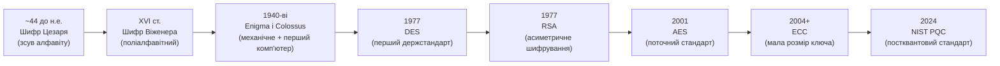
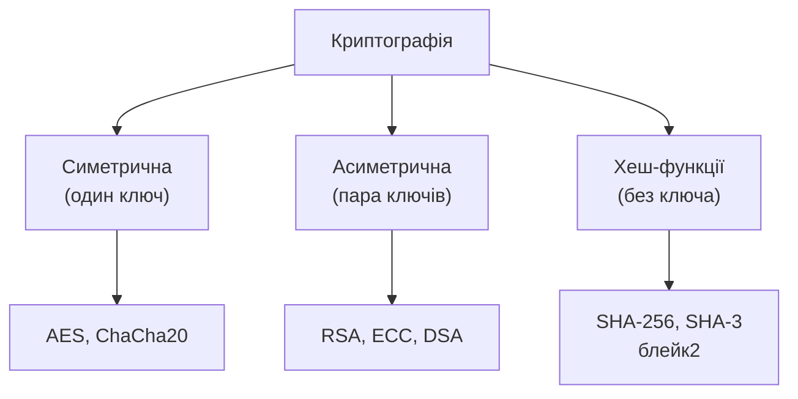

# 4.1. Основи криптографії

У 44 році до нашої ери Гай Юлій Цезар надсилав своїм командирам накази, в яких кожна літера була замінена на іншу, зсунуту на три позиції в алфавіті. Це не була витончена математика — це була домовленість між тими, хто знав «ключ» (зсув = 3), і нездатність перехоплювача прочитати незрозумілий текст. Дві тисячі років по тому основна ідея залишилась незмінною: перетворити повідомлення на щось нечитабельне для всіх, крім тих, хто знає секрет. Змінилась лише складність математики — і ставки, бо тепер на ній тримається безпека всього інтернету.

> 📖 Ключові терміни — у [глосарії модуля](00-glosariy.md).

## Визначення і цілі

**Криптографія** (від грецьких κρυπτός — «прихований» і γράφω — «пишу») — наука про методи захисту інформації за допомогою математичних перетворень.

Сучасна криптографія вирішує чотири фундаментальні проблеми безпеки, що відповідають складовим CIA-тріади і розширеної моделі (розділ 1.2 модуля 01):

| Проблема | Криптографічне рішення | Що гарантує |
|---|---|---|
| **Конфіденційність** | Шифрування | Лише авторизовані сторони читають повідомлення |
| **Цілісність** | Хеш-функції, MAC | Повідомлення не змінено по дорозі |
| **Автентичність** | Цифрові підписи | Повідомлення дійсно від зазначеного відправника |
| **Неспростовність** | Цифрові підписи | Відправник не може заперечити факт відправки |

## Ключова термінологія

**Відкритий текст (Plaintext)** — вихідне повідомлення до шифрування.

**Шифротекст (Ciphertext)** — результат шифрування; нечитабельний без ключа.

**Ключ (Key)** — секретний параметр, що контролює шифрування/дешифрування. Безпека сучасних систем базується на секретності ключа, а не алгоритму.

**Алгоритм (Cipher)** — математична процедура перетворення. Алгоритм є публічним; ключ — секретним. Це **принцип Кірхгофа** (1883): криптосистема має бути безпечною навіть якщо все, крім ключа, є загальновідомим.

```
Шифрування:   Plaintext + Key → Ciphertext
Дешифрування: Ciphertext + Key → Plaintext
```

## Коротка історія: від Цезаря до AES



**Кілька поворотних моментів:**

**Enigma і Colossus (1940-ві).** Нацистська шифрувальна машина Enigma здавалась нерозкривною: 158 квінтильйонів можливих початкових конфігурацій. Але команда Алана Тюрінга в Блетчлі-Парк (Великобританія) знайшла структурні слабкості у використанні Enigma — і побудувала Colossus, перший у світі програмований комп'ютер, для їх експлуатації. Це розкриття, за різними оцінками, скоротило Другу світову війну на два роки. Урок: навіть складний алгоритм ламається через помилки впровадження і використання.

**DES і його злам (1977–1998).** Data Encryption Standard — перший публічний держстандарт шифрування США — мав ключ 56 біт. У 1998 році Electronic Frontier Foundation побудувала машину DES Cracker за \$250 000 і зламала DES за 22 години повним перебором. 56 біт виявились замало навіть для 1998 року. Урок: розмір ключа — критичний параметр; технологічний прогрес постійно знецінює «достатні» ключі минулого.

**RSA і революція асиметричної криптографії (1977).** До RSA всі криптосистеми мали одну проблему: як безпечно передати спільний ключ по незахищеному каналу? Відповідь Рівеста, Шаміра і Адлемана була контрінтуїтивною: один ключ для шифрування (публічний), інший для дешифрування (приватний). Те, що зашифровано публічним ключем, можна розшифрувати лише приватним. Ця ідея зробила безпечний інтернет можливим.

**AES (2001).** Результат відкритого конкурсу NIST (1997–2001), в якому 15 кандидатів з усього світу змагались за стандарт. Переміг бельгійський алгоритм Rijndael (розроблений Йоаном Дайменом і Вінсентом Рейменом). AES досі є стандартом симетричного шифрування і не має відомих практичних атак на повну 128/192/256-бітну версію.

## Що НЕ є криптографією (поширені помилки)

Важливо відрізняти справжню криптографію від технік, що лише імітують безпеку:

- **Кодування (Encoding)** — Base64, URL encoding, hex — це трансформація представлення, а не захист. Base64 декодується будь-яким інструментом за мілісекунди.
- **Обфускація (Obfuscation)** — «заплутування» коду або даних без математичного ключа. «Security through obscurity» — не безпека.
- **Стиснення (Compression)** — ZIP, gzip зменшують розмір, але не захищають конфіденційність (хоча ZIP з AES-шифруванням — це вже криптографія).
- **Хешування ≠ шифрування** — хеш є однонаправленим; з хешу неможливо відновити оригінал. Тому хеш не «зашифровує» — він підписує цілісність.

## Типи криптографічних систем



- **Симетрична криптографія:** один і той самий ключ для шифрування і дешифрування. Швидка, але проблема безпечного обміну ключем.
- **Асиметрична криптографія:** пара публічний/приватний ключ. Вирішує проблему обміну, але повільніша.
- **Гібридна схема (реальний світ):** асиметрична криптографія для безпечного обміну симетричним ключем → симетричне шифрування для всього іншого трафіку. Саме так працює TLS.

## Криптографія і законодавство України

Використання криптографії в Україні регулюється рядом нормативних актів:

- **ЗУ «Про електронні довірчі послуги»** (2017) — визначає правовий статус електронного підпису, вимоги до кваліфікованого електронного підпису (КЕП).
- **ЗУ «Про електронні документи та електронний документообіг»** — основа для використання цифрових підписів у документообігу.
- **Постанова КМУ № 693 (2013)** — вимоги до криптографічного захисту інформації в державних інформаційних системах.
- **ДСТУ 4145, ДСТУ 7564, ДСТУ 7624** — українські криптографічні стандарти (детально — розділ 4.9).

Ключовий момент для практиків: якщо система обробляє **конфіденційну інформацію, що є власністю держави**, — вона зобов'язана використовувати сертифіковані засоби криптографічного захисту, зокрема вітчизняні стандарти. Для комерційних систем без державних даних вимоги гнучкіші.

## Міні-вправа

Шифр Цезаря із зсувом 13 — це ROT13, особливий випадок, де шифрування і дешифрування — одна й та сама операція. Спробуйте:

```python
def rot13(text: str) -> str:
    result = []
    for ch in text:
        if 'a' <= ch <= 'z':
            result.append(chr((ord(ch) - ord('a') + 13) % 26 + ord('a')))
        elif 'A' <= ch <= 'Z':
            result.append(chr((ord(ch) - ord('A') + 13) % 26 + ord('A')))
        else:
            result.append(ch)
    return ''.join(result)

msg = "Кібербезпека починається з розуміння основ"
encoded = rot13("Hello, Security!")
print(f"ROT13: {encoded}")
print(f"ROT13 двічі: {rot13(encoded)}")  # Повертає оригінал
```

Тепер уявіть, що зловмисник знає, що використовується шифр Цезаря, але не знає зсув. Скільки варіантів треба перевірити для латиниці? Для кирилиці? Чому це демонструє, що «розмір простору ключів» є критичним параметром безпеки?

## Джерела та додаткові матеріали

- Singh S., *The Code Book* — популярна книга з історії криптографії від Цезаря до сучасності.
- Boneh D., Shoup V., *A Graduate Course in Applied Cryptography* (crypto.stanford.edu/~dabo/cryptobook) — безкоштовний академічний підручник.
- NIST, *Cryptographic Standards and Guidelines* (csrc.nist.gov) — офіційні стандарти.
- Kirckhoff A., *La cryptographie militaire* (1883) — оригінальна стаття з принципом Кірхгофа.

---

**Далі:** [4.2. Симетричне шифрування](02-symetrychne-shyfruvannia.md)
**Назад до модуля:** [README модуля 04](README.md)
