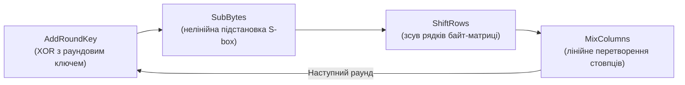

# 4.2. Симетричне шифрування

Симетричне шифрування — найстаріший і найшвидший клас криптографії. «Симетричне» означає одне: той самий ключ і шифрує, і дешифрує. Це інтуїтивно зрозуміло — як звичайний замок із ключем — але породжує класичну дилему: як безпечно передати ключ тому, з ким хочеш спілкуватись? Цю проблему вирішує асиметрична криптографія (розділ 4.3), але поки давайте розберемось, чому симетричне шифрування залишається основним «робочим конем» усіх сучасних систем — включаючи TLS, BitLocker і encrypted messengers.

> 📖 Ключові терміни — у [глосарії модуля](00-glosariy.md).

## Потокові і блокові шифри

Симетричні шифри поділяються на два фундаментальних типи:

**Потоковий шифр (Stream cipher)** — шифрує дані по одному байту (або біту) за раз. Генерує «ключовий потік» (keystream), що XOR-ується з відкритим текстом. Дуже швидкі; підходять для потокових даних.

```
Plaintext:  01001000 01101001
Keystream:  11010101 10110011
Ciphertext: 10011101 11011010  (XOR)
```

Приклади: RC4 (застарілий, зламаний), **ChaCha20** (сучасний, використовується в TLS 1.3 і WireGuard).

**Блоковий шифр (Block cipher)** — шифрує дані фіксованими блоками (наприклад, 128 біт = 16 байт для AES). Дані розбиваються на блоки, кожен шифрується незалежно або у взаємозв'язку (залежно від режиму роботи).

Приклади: **AES** (стандарт), DES/3DES (застарілі).

## AES: Довершений стандарт шифрування

**AES (Advanced Encryption Standard)** — симетричний блоковий шифр, що переміг у відкритому конкурсі NIST 1997–2001. Розмір блоку — 128 біт (16 байт). Розмір ключа — 128, 192 або 256 біт.

### Чому розмір ключа важливий

| Розмір ключа | Кількість можливих ключів | Час перебору (1 млрд ключів/с) |
|---|---|---|
| 56 біт (DES) | 7.2 × 10¹⁶ | ~830 днів (зламано за 22 год у 1998) |
| 128 біт (AES-128) | 3.4 × 10³⁸ | ~10²² років |
| 256 біт (AES-256) | 1.2 × 10⁷⁷ | Нескінченно для будь-якого класичного комп'ютера |

AES-128 вважається безпечним для більшості цивільних застосувань. AES-256 є стандартом для державних секретних даних і захисту від потенційних квантових комп'ютерів.

### Внутрішня структура AES (спрощено)

AES обробляє блок у 10–14 раундів (залежно від розміру ключа). Кожен раунд складається з чотирьох операцій:



- **AddRoundKey:** додавання (XOR) поточного стану з раундовим ключем (похідним від основного ключа).
- **SubBytes:** кожен байт замінюється за нелінійною таблицею підстановки (S-box) — це основне джерело «плутанини» (confusion).
- **ShiftRows:** рядки байт-матриці зсуваються на різну кількість позицій — «дифузія» між рядками.
- **MixColumns:** стовпці перемножуються на матрицю в полі GF(2⁸) — «дифузія» між байтами стовпця.

Ці операції реалізують два принципи Шеннона: **confusion** (нелінійна залежність між ключем і шифротекстом) і **diffusion** (зміна одного біта відкритого тексту впливає на весь шифротекст — **avalanche effect**).

## Режими роботи блокових шифрів

Блоковий шифр сам по собі шифрує лише один блок. Для реальних даних (що зазвичай довші за 16 байт) потрібен **режим роботи**, що визначає, як обробляти послідовність блоків. Вибір режиму критично важливий для безпеки.

### ECB (Electronic Codebook) — НЕБЕЗПЕЧНИЙ, не використовуйте

ECB шифрує кожен блок незалежно з тим самим ключем:

```
Block1: Plaintext1 → AES(Key) → Ciphertext1
Block2: Plaintext2 → AES(Key) → Ciphertext2
```

**Проблема:** однакові блоки відкритого тексту дають однакові блоки шифротексту. Структура даних «просвічує» крізь шифрування.

Класичний приклад: зображення, зашифроване ECB-AES, зберігає контури — жодна дійсно безпечна система не використовує ECB. Детально про цей і інші артефакти — розділ 4.8.

### CBC (Cipher Block Chaining) — базовий, але є нюанси

Кожен блок перед шифруванням XOR-ується з попереднім шифротекстом. Перший блок XOR-ується з **Initialization Vector (IV)** — випадковим значенням:

```
C₁ = AES(P₁ XOR IV)
C₂ = AES(P₂ XOR C₁)
C₃ = AES(P₃ XOR C₂)
```

**Переваги:** однакові блоки відкритого тексту дають різні шифротексти. **Вразливість:** IV має бути унікальним і непередбачуваним для кожного повідомлення; CBC вразливий до атаки Padding Oracle (розділ 4.8).

### CTR (Counter Mode) — перетворює блоковий в потоковий

Шифрує послідовні значення лічильника (nonce + counter), і XOR-ує результат з відкритим текстом:

```
Keystream₁ = AES(Nonce || 0)
Keystream₂ = AES(Nonce || 1)
Ciphertext = Plaintext XOR Keystream
```

**Переваги:** паралельне шифрування, не потребує padding, помилка в одному блоці не поширюється. **Критичний момент:** nonce (number used once) має бути унікальним для кожного повідомлення з тим самим ключем — повторення nonce у CTR катастрофічне (дозволяє відновити XOR двох відкритих текстів).

### GCM (Galois/Counter Mode) — сучасний стандарт

GCM = CTR-шифрування + GHASH-автентифікація. Це **AEAD (Authenticated Encryption with Associated Data)**: одночасно шифрує і автентифікує, виявляючи будь-яку модифікацію шифротексту.

```
Ciphertext, Tag = AES-GCM(Key, Nonce, Plaintext, [AAD])
```

- **Tag** (128 біт) — автентифікаційний тег; перевіряється при дешифруванні.
- **AAD (Additional Authenticated Data)** — додаткові дані (наприклад, заголовки пакету), що не шифруються, але автентифікуються.

**AES-256-GCM — рекомендований стандарт** для нових систем. Використовується в TLS 1.3, WireGuard, Signal.

| Режим | Padding | Паралельне | Автентифікація | Рекомендація |
|---|---|---|---|---|
| ECB | Так | Так | Ні | ❌ Ніколи |
| CBC | Так | Частково | Ні | ⚠️ Лише з MAC |
| CTR | Ні | Так | Ні | ⚠️ Лише з MAC |
| GCM | Ні | Так | Вбудована | ✅ Рекомендовано |
| ChaCha20-Poly1305 | Ні | Так | Вбудована | ✅ Рекомендовано |

## ChaCha20-Poly1305: альтернатива AES-GCM

**ChaCha20** — потоковий шифр, розроблений Даніелем Бернштейном. **Poly1305** — автентифікаційний код (MAC). Разом — конкурент AES-GCM.

**Переваги ChaCha20-Poly1305:**
- Швидший на пристроях без апаратного прискорення AES (мобільні ARM без AES-NI).
- Стійкий до timing attacks за архітектурою (не використовує таблиці підстановки).
- Використовується в TLS 1.3, WireGuard, SSH, Signal.

**Висновок:** AES-256-GCM або ChaCha20-Poly1305 — вибір залежить від платформи. Обидва є безпечними сучасними стандартами.

## Управління симетричними ключами

Безпека симетричного шифрування повністю залежить від безпеки ключа. Найкраще шифрування у світі марне, якщо ключ зберігається в коді, в незахищеному файлі або передається по незахищеному каналу.

**Принципи управління ключами:**
- **Генерація:** використовувати криптографічно стійкий PRNG (Cryptographically Secure Pseudo-Random Number Generator). Ніколи не генерувати ключі з `rand()` або `Math.random()`.
- **Зберігання:** ключі зберігаються у захищених сховищах (HSM, KMS, Vault, TPM), а не у конфіг-файлах або коді (детально — розділ 4.8).
- **Ротація:** регулярна зміна ключів обмежує «вікно компрометації».
- **Передача:** ніколи по незахищеному каналу. Для обміну симетричним ключем — асиметрична криптографія (наступний розділ).
- **Знищення:** ключ після використання має бути безпечно знищений (очищення пам'яті, а не просто `free()`).

## Міні-вправа

Подумайте над таким сценарієм: розробник зашифрував базу даних паролів клієнтів алгоритмом AES-128-ECB з фіксованим ключем, захардкодованим у коді. Знайдіть не менше трьох проблем безпеки в цьому рішенні, спираючись на матеріал цього розділу та розділу 4.8 (до якого можна заглянути). Відповідь: ECB-режим дозволяє виявити однакові паролі (структура «просвічує»); захардкоджений ключ доступний усім, хто має доступ до коду (репозиторій, дизасемблер); відсутність автентифікації дозволяє модифікувати шифротекст непомітно; паролі взагалі не мають шифруватись — вони мають хешуватись (розділ 4.4).

## Джерела та додаткові матеріали

- NIST FIPS 197 — офіційна специфікація AES.
- NIST SP 800-38A/D — специфікації режимів роботи блокових шифрів.
- Bernstein D., *ChaCha, a variant of Salsa20* — оригінальна стаття.
- Boneh D., Shoup V., *A Graduate Course in Applied Cryptography*, Ch. 4–5.

---

**Попередній розділ:** [4.1. Основи криптографії](01-osnovy-kryptohrafii.md)
**Далі:** [4.3. Асиметричне шифрування](03-asymetrychne-shyfruvannia.md)
**Назад до модуля:** [README модуля 04](README.md)
