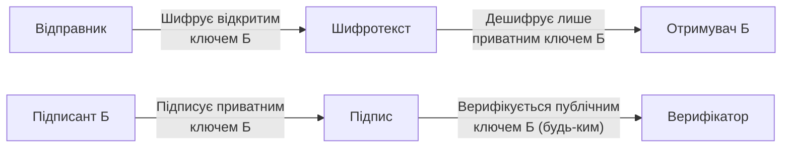
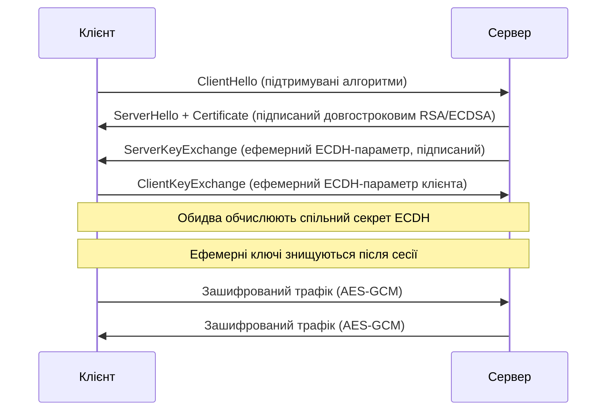

# 4.3. Асиметричне шифрування

У 1976 році Вітфілд Діффі і Мартін Геллман опублікували статтю, що перевернула криптографію. Їхня ідея здавалась майже магічною: два учасники можуть домовитись про спільний секрет через відкритий канал, що повністю прослуховується, і жоден підслухувач не зможе відтворити цей секрет. Без жодної попередньої зустрічі. Без жодного фізичного обміну. Це вирішило «проблему розподілу ключів» — найбільшу практичну перешкоду для криптографії до того моменту — і дало поштовх до розвитку RSA, ECC і, зрештою, сучасного безпечного інтернету.

> 📖 Ключові терміни — у [глосарії модуля](00-glosariy.md).

## Ключова відмінність від симетричної криптографії

У симетричній криптографії — один ключ, спільний секрет. Проблема: як безпечно домовитись про цей секрет?

В асиметричній криптографії — **пара математично пов'язаних ключів**:
- **Публічний ключ (Public Key)** — можна вільно публікувати. Використовується для шифрування або перевірки підпису.
- **Приватний ключ (Private Key)** — зберігається в таємниці. Використовується для дешифрування або створення підпису.



Математична основа: операції, що легко виконуються в одному напрямку, але практично нереверсивні без секретної інформації (траpdoor functions / «backdoor functions»).

## Обмін ключами Діффі-Геллмана (DH)

**Задача:** двоє хочуть домовитись про спільний секрет через незахищений канал.

Класична аналогія з кольорами: Аліса і Боб мають спільний жовтий колір (публічний параметр). Аліса обирає свій секретний червоний, змішує з жовтим → отримує помаранчевий і надсилає Бобу. Боб обирає свій секретний синій, змішує з жовтим → надсилає зелений. Аліса додає до помаранчевого від Боба свій червоний; Боб додає до зеленого від Аліси свій синій. Обидва отримують однаковий результат. Підслухувач бачить лише жовтий, помаранчевий і зелений — він не може відтворити суміш.

**Математична реалізація (класичний DH):**

```
Публічні параметри: велике просте число p і генератор g

1. Аліса обирає випадкове a (приватне)
   Публікує: A = g^a mod p

2. Боб обирає випадкове b (приватне)
   Публікує: B = g^b mod p

3. Аліса обчислює: s = B^a mod p = g^(ab) mod p
   Боб обчислює:   s = A^b mod p = g^(ab) mod p

Спільний секрет s однаковий, але ні a, ні b ніколи не передавались.
```

Безпека DH базується на **задачі дискретного логарифмування**: знаючи g, p і A = g^a mod p, знайти a — обчислювально нереально для достатньо великих p.

**ECDH (Elliptic Curve Diffie-Hellman)** — варіант DH на еліптичних кривих з набагато меншими ключами (256 біт ECC ≈ 3072 біт DH за рівнем безпеки).

## RSA: асиметричне шифрування і підпис

**RSA** (Рівест, Шамір, Адлеман, 1977) — перший практичний алгоритм асиметричного шифрування.

### Математична основа

Безпека RSA базується на **задачі факторизації великих чисел**: якщо взяти два великих простих числа p і q, добуток n = p × q обчислюється за мікросекунди; але факторизувати n назад у p і q для n довжиною 2048 біт — обчислювально нереально для класичних комп'ютерів.

**Генерація ключів (спрощено):**
```
1. Обрати два великих простих p і q
2. n = p × q (модуль, публічний)
3. φ(n) = (p-1)(q-1)
4. Обрати e, взаємно просте з φ(n) — публічна експонента (зазвичай 65537)
5. d = e⁻¹ mod φ(n) — приватна експонента

Публічний ключ: (e, n)
Приватний ключ: (d, n)  [або (p, q, d)]

Шифрування:   C = M^e mod n
Дешифрування: M = C^d mod n
```

### Практичне використання RSA

На практиці RSA **не шифрує дані напряму** — він занадто повільний і має обмеження на розмір шифрованого блоку. Реальна схема:

1. Генерується випадковий симетричний ключ (AES-256).
2. Дані шифруються AES-256-GCM цим ключем.
3. AES-ключ шифрується RSA-публічним ключем отримувача.
4. Отримувач дешифрує AES-ключ своїм RSA-приватним ключем, потім дешифрує дані AES.

Це **гібридна схема** — основа TLS, PGP і більшості реальних криптосистем.

**Безпечні розміри RSA-ключів:**

| Розмір ключа | Рівень безпеки | Статус |
|---|---|---|
| 512 біт | < 56 біт | ❌ Зламаний (1999) |
| 1024 біт | ~80 біт | ❌ Небезпечний, не використовувати |
| 2048 біт | ~112 біт | ✅ Мінімально допустимий (до ~2030) |
| 3072 біт | ~128 біт | ✅ Рекомендований |
| 4096 біт | ~140 біт | ✅ Параноїдальний, значно повільніший |

## ECC: криптографія на еліптичних кривих

**ECC (Elliptic Curve Cryptography)** — альтернатива RSA з набагато меншими ключами при еквівалентному рівні безпеки. Базується на задачі дискретного логарифмування на еліптичній кривій.

**Еліптична крива** — множина точок (x, y), що задовольняють рівнянню:

```
y² = x³ + ax + b  (над скінченним полем)
```

Операція «додавання точок» на кривій є основою криптографії: знаючи G (базова точка) і k (скалярний множник), обчислити P = kG легко; знаючи G і P, знайти k — задача ECDLP (Elliptic Curve Discrete Logarithm Problem).

**Порівняння ключів ECC і RSA:**

| Рівень безпеки | RSA | ECC |
|---|---|---|
| 80 біт | 1024 біт | 160 біт |
| 112 біт | 2048 біт | 224 біт |
| 128 біт | 3072 біт | 256 біт |
| 192 біт | 7680 біт | 384 біт |
| 256 біт | 15360 біт | 512 біт |

**Популярні криві:**
- **P-256 (secp256r1, NIST)** — найпоширеніша в TLS і сертифікатах.
- **P-384** — для вищого рівня безпеки.
- **Curve25519 (X25519)** — розроблена Даніелем Бернштейном; дуже швидка, стійка до timing attacks, використовується в Signal, WireGuard, новому SSH.
- **secp256k1** — використовується в Bitcoin.

## Perfect Forward Secrecy (PFS)

Класичний RSA має проблему: якщо приватний ключ сервера буде скомпрометовано в майбутньому, зловмисник, що записував трафік, зможе розшифрувати **всі** минулі сесії.

**Perfect Forward Secrecy** (або Forward Secrecy) вирішує це: для кожної сесії генерується новий тимчасовий (ephemeral) ключ обміну (DHE або ECDHE), що знищується після сесії. Довгостроковий приватний ключ сервера використовується лише для автентифікації, а не для шифрування.



Саме тому в cipher suite `TLS_ECDHE_RSA_WITH_AES_256_GCM_SHA384` є `ECDHE` (Elliptic Curve Diffie-Hellman Ephemeral) — це і є PFS.

## Міні-вправа

Поміркуйте: банк публікує свій публічний ключ RSA на сайті. Клієнт завантажує цей ключ і хоче надіслати банку номер свого рахунку зашифрованим. 

1. Хто може прочитати повідомлення клієнта?
2. Якщо зловмисник підмінив публічний ключ на сайті банку на свій власний — що станеться?
3. Як цифрові сертифікати (розділ 4.5) захищають від цієї атаки?
4. Чому браузер показує «небезпечне з'єднання» при самопідписаному сертифікаті, хоча шифрування технічно працює?

## Джерела та додаткові матеріали

- Diffie W., Hellman M., *New Directions in Cryptography* (1976) — оригінальна стаття.
- Rivest R., Shamir A., Adleman L., *A Method for Obtaining Digital Signatures and Public-Key Cryptosystems* (1978).
- Bernstein D., Lange T., *Safecurves* (safecurves.cr.yp.to) — порівняння безпеки кривих ECC.
- NIST SP 800-56A Rev 3 — рекомендації щодо схем обміну ключами.

---

**Попередній розділ:** [4.2. Симетричне шифрування](02-symetrychne-shyfruvannia.md)
**Далі:** [4.4. Хеш-функції](04-khesh-funktsii.md)
**Назад до модуля:** [README модуля 04](README.md)
