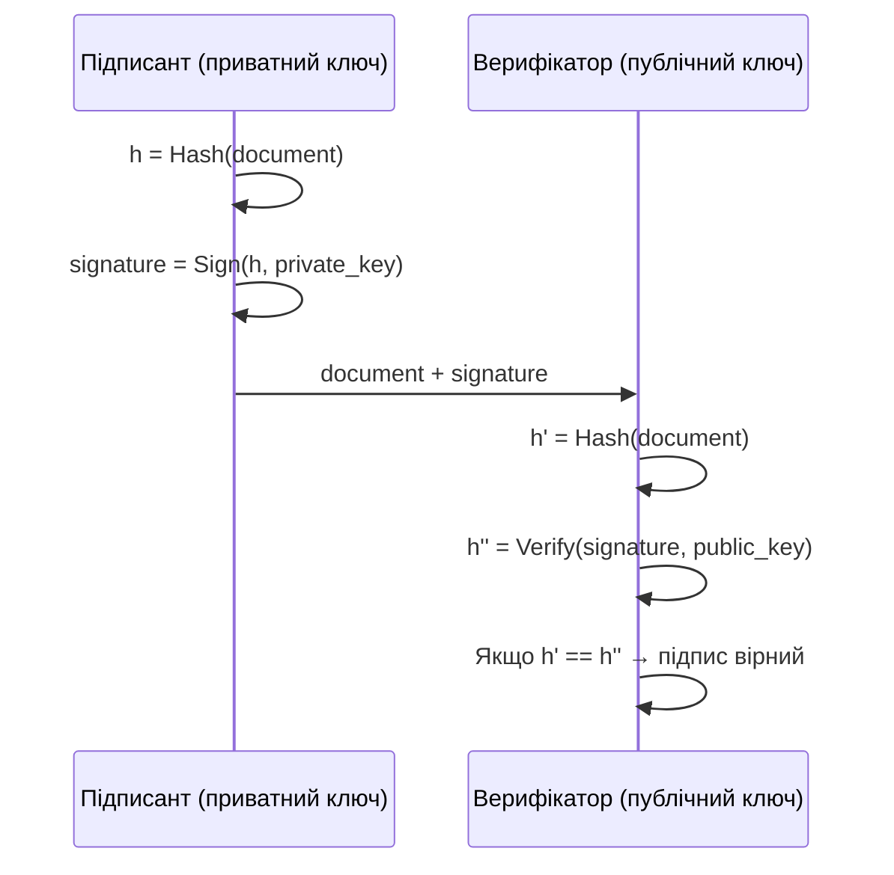
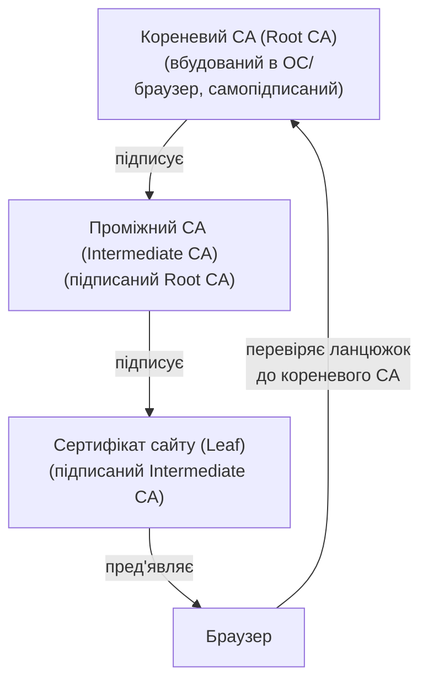

# 4.5. Цифрові підписи

Уявіть, що вам прийшов лист нібито від вашого банку з проханням підтвердити дані картки. Але хто насправді його відправив? В аналоговому світі підпис від руки або печатка організації дають певну впевненість. У цифровому — будь-хто може поставити будь-яке ім'я в полі «Від». Цифровий підпис вирішує цю проблему математично і надійніше, ніж будь-який фізичний аналог: він доводить, що документ підписано конкретним приватним ключем, і що жоден байт не змінився після підписання.

> 📖 Ключові терміни — у [глосарії модуля](00-glosariy.md).

## Що таке цифровий підпис

Цифровий підпис — це криптографічний механізм, що одночасно забезпечує:

- **Автентичність** — документ підписано власником конкретного приватного ключа.
- **Цілісність** — документ не змінено після підписання.
- **Неспростовність** — підписант не може заперечити факт підписання.

Принцип роботи (загальна схема):



Важливо: **підписується хеш документа**, а не сам документ. Це ефективніше (підпис фіксованого розміру незалежно від розміру документа) і безпечніше для більшості схем.

## RSA-підписи

В RSA, підпис і шифрування є «оберненими» операціями:

```
Підписання:  s = hash(m)^d mod n   (приватний ключ d)
Верифікація: h = s^e mod n          (публічний ключ e)
             Якщо h == hash(m) → підпис вірний
```

**PKCS#1 v1.5** — класична схема доповнення для RSA-підписів; має відомі вразливості у деяких реалізаціях.

**RSASSA-PSS (Probabilistic Signature Scheme)** — сучасний стандарт, рекомендований для нових систем. Використовує рандомізоване доповнення, що усуває вразливості PKCS#1 v1.5. Вимагається в TLS 1.3 для RSA-підписів.

## ECDSA: підпис на еліптичних кривих

**ECDSA (Elliptic Curve Digital Signature Algorithm)** — стандартний алгоритм підпису на базі ECC. Значно коротші підписи при еквівалентному рівні безпеки.

| Алгоритм | Розмір ключа | Розмір підпису | Швидкість |
|---|---|---|---|
| RSA-2048 | 2048 біт | 256 байт | Помірна |
| RSA-3072 | 3072 біт | 384 байт | Повільна |
| ECDSA P-256 | 256 біт | 64 байт | Швидка |
| Ed25519 | 256 біт | 64 байт | Дуже швидка |

**Критична вразливість ECDSA: повторення nonce.** При підписанні ECDSA використовує випадкове число k. Якщо k повториться для двох різних підписів — приватний ключ можна відновити! Цей нюанс зламав систему Sony PlayStation 3 у 2010 році: Sony використовувала фіксоване k для всіх підписів прошивки, і дослідники відновили приватний ключ підпису.

## Ed25519: сучасний стандарт

**Ed25519** (алгоритм підпису Edwards25519) — розроблений Даніелем Бернштейном на базі кривої Curve25519. Є найкращим вибором для нових систем:

**Переваги:**
- Deterministic (детерміновані підписи) — нема випадкового k, нема ризику Sony-ps3 атаки.
- Дуже швидкий (швидший за ECDSA P-256 в більшості реалізацій).
- Стійкий до timing attacks за архітектурою.
- Малий розмір підпису (64 байти).
- Широко підтримується: OpenSSH, TLS 1.3, Signal, GPG.

```python
# pip install cryptography
from cryptography.hazmat.primitives.asymmetric.ed25519 import Ed25519PrivateKey
from cryptography.hazmat.primitives.serialization import Encoding, PublicFormat, PrivateFormat, NoEncryption

# Генерація ключів
private_key = Ed25519PrivateKey.generate()
public_key = private_key.public_key()

# Підписання
message = b"Це важливий документ"
signature = private_key.sign(message)
print(f"Підпис (hex): {signature.hex()}")
print(f"Довжина підпису: {len(signature)} байт")

# Верифікація (кидає виняток якщо підпис невірний)
try:
    public_key.verify(signature, message)
    print("✅ Підпис вірний")
except Exception as e:
    print(f"❌ Підпис невірний: {e}")

# Серіалізація публічного ключа
pub_bytes = public_key.public_bytes(Encoding.Raw, PublicFormat.Raw)
print(f"Публічний ключ (hex): {pub_bytes.hex()}")
```

## PKI: інфраструктура відкритих ключів і ланцюжок довіри

Якщо хтось надсилає вам свій публічний ключ — як переконатись, що це справді його ключ, а не підміна? **PKI (Public Key Infrastructure)** вирішує це через **цифрові сертифікати** і **ланцюжок довіри**.

### X.509-сертифікат

**X.509** — стандарт цифрового сертифіката (RFC 5280). Сертифікат містить:

```
X.509 Certificate:
├── Version: 3
├── Serial Number: унікальний в рамках CA
├── Issuer: хто видав (CA)
├── Validity: Not Before / Not After
├── Subject: для кого (CN=example.com, O=Example Org)
├── Subject Public Key Info: алгоритм + публічний ключ
├── Extensions:
│   ├── Subject Alternative Names (SAN): example.com, www.example.com
│   ├── Key Usage: digitalSignature, keyEncipherment
│   ├── Extended Key Usage: serverAuth, clientAuth
│   └── Basic Constraints: CA:FALSE
└── Signature: підпис CA (над всіма полями вище)
```

### Ланцюжок довіри



**Кореневих CA** у браузерах і ОС — кілька сотень (конкретні набори у Windows, Mozilla, Apple). Якщо будь-який з них компрометований — всі сертифікати, підписані ним, стають ненадійними. Саме тому компрометація CA (як у випадку DigiNotar 2011 — нідерландський CA, зламаний і видаляв сертифікати для спостереження за іранськими дисидентами) — катастрофічна подія для екосистеми PKI.

### Відкликання сертифікатів

Якщо приватний ключ скомпрометовано або сертифікат видано помилково — його потрібно відкликати до закінчення терміну:

- **CRL (Certificate Revocation List)** — CA публікує список відкликаних серійних номерів. Застарілий підхід: файл може бути великим і кешується.
- **OCSP (Online Certificate Status Protocol)** — онлайн-запит статусу конкретного сертифіката. Актуальніший, але додає затримку і може витікати інформацію (які сайти ви відвідуєте).
- **OCSP Stapling** — сервер сам прикладає підписану OCSP-відповідь до TLS-рукостискання; усуває приватність-проблему OCSP і додаткову затримку.

## PGP/GPG і модель «павутини довіри» (Web of Trust)

PKI з CA — не єдина модель довіри до публічних ключів. **PGP (Pretty Good Privacy)** і його відкрита реалізація **GPG (GNU Privacy Guard)** використовують принципово іншу модель: **Web of Trust**. Замість централізованого CA, кожен користувач підписує публічні ключі тих людей, яким особисто довіряє. Якщо Аліса довіряє Бобу, а Боб підписав ключ Карла — Аліса може «прийняти» ключ Карла через ланцюжок підписів.

```bash
# Практика GPG: підпис файлу і верифікація
gpg --gen-key                    # Генерація ключової пари
gpg --sign-key bob@example.com   # Підписати ключ Боба (ви йому особисто довіряєте)
gpg --detach-sign document.pdf   # Підписати документ (створить document.pdf.sig)
gpg --verify document.pdf.sig document.pdf  # Верифікація

# Перевірка підпису коміту в git (якщо автор підписав)
git log --show-signature -1
```

PGP широко використовується для підпису пакетів у Linux-дистрибутивах (`apt-key`), підпису релізів програмного забезпечення (перевірте підписи на сайтах завантаження!) і захищеної пошти. Головний недолік Web of Trust — складність масштабування: для нових учасників складно знайти ланцюжок довіри.

В Україні законом встановлена юридична сила електронного підпису. **КЕП (Кваліфікований Електронний Підпис)** є найвищим рівнем:

- Видається **Акредитованими центрами сертифікації ключів (АЦСК)**.
- Базується на ДСТУ 4145-2002 (алгоритм ECC) або ДСТУ 7564 (хеш Купина).
- Має повну юридичну рівнозначність власноручному підпису.
- Використовується для документообігу з держорганами, ДПС, ПФУ, судами.

**Провайдери КЕП в Україні:**
- Дія (Мінцифри) — безкоштовний КЕП через застосунок.
- Приватбанк — для клієнтів банку.
- АЦСК «Укрзалізниця», АЦСК «ІДД» та ін.

## Міні-вправа

Відкрийте будь-який HTTPS-сайт у браузері, натисніть на замочок → «Сертифікат» і знайдіть:
1. Ким виданий сертифікат (Issuer)?
2. Яке доменне ім'я захищено (Subject / SAN)?
3. До якої дати дійсний?
4. Який алгоритм підпису використано (RSA-256? ECDSA? Ed25519)?
5. Чи є Certificate Transparency записи?

Тепер перевірте сертифікат `diia.gov.ua` і будь-якого комерційного банку. Порівняйте алгоритми і термін дії.

## Джерела та додаткові матеріали

- RFC 5280 — X.509 Internet PKI Certificate and CRL Profile.
- RFC 8032 — Edwards-Curve Digital Signature Algorithm (Ed25519).
- NIST FIPS 186-5 — Digital Signature Standard (ECDSA, Ed25519, RSA-PSS).
- ЗУ «Про електронні довірчі послуги» — правова база КЕП в Україні.
- Eckersley P., *Sovereign Keys* (EFF) — обговорення проблем поточного PKI.

---

**Попередній розділ:** [4.4. Хеш-функції](04-khesh-funktsii.md)
**Далі:** [4.6. Криптографічні протоколи](06-protokoly-bezpeky.md)
**Назад до модуля:** [README модуля 04](README.md)
