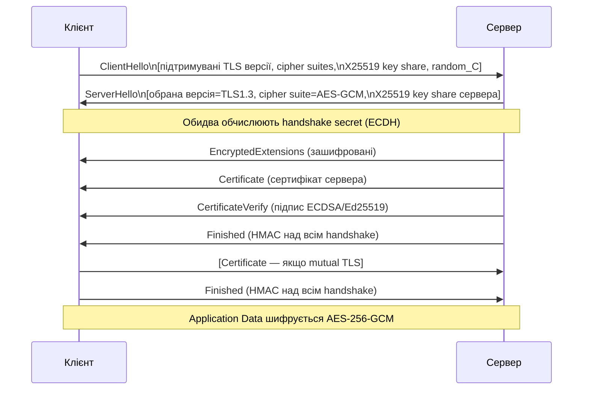
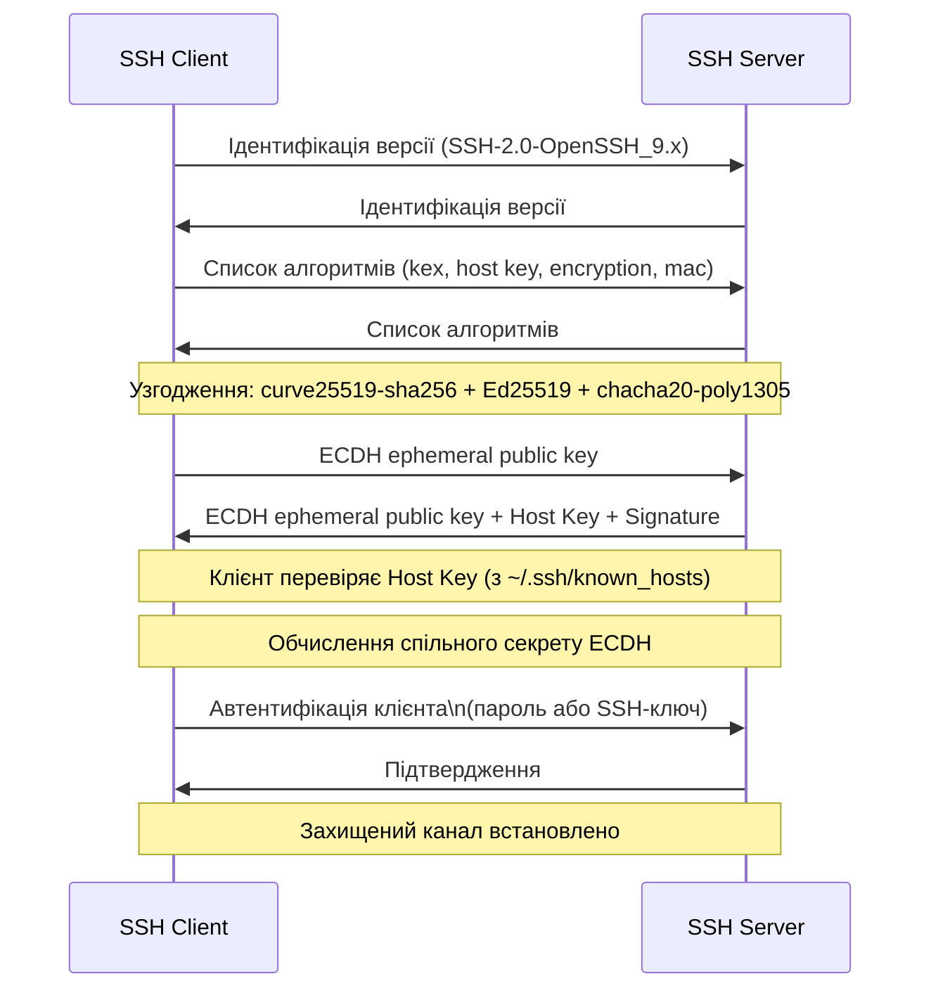
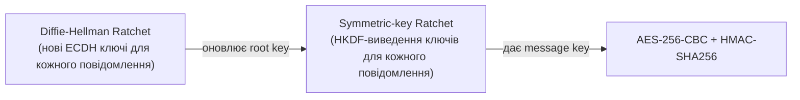

# 4.6. Криптографічні протоколи

Попередні розділи вивчали будівельні блоки: симетричне шифрування, асиметричне шифрування, хеші, підписи. Але самі по собі ці блоки не захищають комунікацію — потрібен **протокол**, що визначає, коли і в якому порядку використовується кожен блок, як сторони ідентифікують одна одну і як узгоджують спільні параметри. Неправильно скомбіновані навіть ідеальні криптографічні примітиви можуть дати хибне відчуття безпеки. Цей розділ — про те, як правильні комбінації виглядають у реальних протоколах.

> 📖 Ключові терміни — у [глосарії модуля](00-glosariy.md).

## TLS 1.3: анатомія захищеного з'єднання

Модуль 02 (розділ 2.6) описав TLS з мережевої перспективи. Тут — детальніший погляд зсередини, з криптографічної.

### Рукостискання TLS 1.3 (повна схема)



**Що відбувається на кожному кроці:**

1. **ClientHello** — клієнт пропонує параметри і надсилає свій публічний ключ ECDH (X25519). У TLS 1.3 клієнт надсилає key share відразу, без очікування вибору сервера.
2. **ServerHello** — сервер обирає параметри і надсилає свій публічний ключ ECDH.
3. **ECDH** — обидві сторони обчислюють спільний секрет. З нього через HKDF (HMAC-based Key Derivation Function) виводяться всі ключі для сесії.
4. **Сертифікат і підпис** — сервер доводить свою ідентичність; підпис покриває весь handshake (захист від downgrade атак).
5. **Finished** — HMAC-автентифікація всього handshake; захист від MITM, що міг модифікувати ClientHello.

**Ключові покращення TLS 1.3 над 1.2:**
- Лише одна RTT (Round Trip Time) замість двох — швидше встановлення з'єднання.
- 0-RTT (Zero Round Trip Time) для повторних підключень — але з ризиками (replay attacks).
- Видалено небезпечні cipher suites (RSA key exchange без PFS, RC4, DES, 3DES, MD5, SHA-1).
- Шифрування починається раніше (EncryptedExtensions вже зашифрований).
- Обов'язковий PFS (всі дозволені cipher suites використовують ECDHE або DHE).

### Cipher Suites TLS 1.3

TLS 1.3 підтримує лише 5 cipher suites (проти десятків у TLS 1.2):

```
TLS_AES_256_GCM_SHA384         ← рекомендовано
TLS_CHACHA20_POLY1305_SHA256   ← рекомендовано (особливо для мобільних)
TLS_AES_128_GCM_SHA256         ← прийнятно
TLS_AES_128_CCM_SHA256         ← рідко
TLS_AES_128_CCM_8_SHA256       ← IoT
```

Key Exchange тепер окремо від cipher suite: завжди ECDHE (X25519, P-256) або DHE.

### Чому TLS 1.3 такий суттєво кращий — конкретні атаки на попередні версії

TLS 1.3 не просто «оновлення» — це відповідь на конкретні зламані конструкції в попередніх версіях. Ось три найгучніші атаки:

**BEAST (Browser Exploit Against SSL/TLS, 2011)** — атака на CBC-шифрування в TLS 1.0. Проблема: вибір IV для CBC передбачуваний (попередній шифротекст), що дозволяє атаку Chosen Plaintext через JavaScript у браузері. Зловмисник, що контролює частину відкритого тексту (наприклад, JavaScript у браузері), може відновити сесійні cookie. Виправлення: перехід на TLS 1.1+, де IV рандомізований; або 1/n-split workaround. TLS 1.3 взагалі не має CBC без MAC.

**POODLE (Padding Oracle On Downgraded Legacy Encryption, 2014)** — атака на SSL 3.0 (і частково TLS 1.0) через вразливість у Padding Oracle. Зловмисник примушує браузер «деградувати» до SSL 3.0 через помилку з'єднання, потім використовує padding oracle для побайтового відновлення cookie. TLS 1.3 вирішує: SSL 3.0 заборонений; GCM не має padding oracle.

**HEARTBLEED (CVE-2014-0160)** — не вразливість самого TLS, а помилка в реалізації розширення Heartbeat в OpenSSL. Сервер повертав до 64 КБ пам'яті на кожен Heartbeat-запит — там могли бути приватні ключі, паролі, сесійні дані. Зламало мільйони серверів по всьому інтернету, включаючи українські. Урок: навіть правильний протокол стає вразливим через помилки реалізації.

Ці три атаки пояснюють конкретні рішення TLS 1.3: заборона CBC без MAC, заборона старих версій, обов'язковий AEAD, шифрування ранньої стадії рукостискання.

SSH (Secure Shell) — протокол для захищеного віддаленого управління серверами. З погляду криптографії, SSH вирішує два незалежних завдання: автентифікацію сервера (щоб клієнт знав, що підключається до правильного хоста) і автентифікацію клієнта (щоб сервер знав, хто підключається).

### SSH-рукостискання (спрощено)



### Безпека SSH: known_hosts і Trust on First Use (TOFU)

На відміну від TLS (де сертифікати перевіряються через PKI), SSH використовує **TOFU**: при першому підключенні клієнт питає «чи довіряєте цьому host key?», і якщо ви погоджуєтесь — ключ зберігається в `~/.ssh/known_hosts`. При наступних підключеннях цей ключ перевіряється.

**Проблема:** якщо при першому підключенні ви вже в MITM — ви «заучуєте» ключ зловмисника. **Рішення для критичних систем:** верифікація host key через позасмуговий канал (out-of-band verification) — наприклад, адміністратор публікує fingerprint сервера в захищеному місці.

**Сучасні алгоритми для SSH (рекомендована конфігурація):**

```
# ~/.ssh/config (клієнт) або /etc/ssh/sshd_config (сервер)

KexAlgorithms curve25519-sha256,curve25519-sha256@libssh.org,diffie-hellman-group18-sha512
HostKeyAlgorithms ssh-ed25519,rsa-sha2-512,rsa-sha2-256
PubkeyAcceptedAlgorithms ssh-ed25519,rsa-sha2-512,rsa-sha2-256
Ciphers chacha20-poly1305@openssh.com,aes256-gcm@openssh.com,aes128-gcm@openssh.com
MACs hmac-sha2-512-etm@openssh.com,hmac-sha2-256-etm@openssh.com
```

## IPSec: шифрування на рівні мережі

TLS і SSH захищають конкретні застосункові з'єднання — браузер чи SSH-сесію. Але що, якщо потрібно захистити **весь IP-трафік** між двома мережами, незалежно від застосунків? Саме цю задачу вирішує IPSec — він «опускається» на рівень 3 і шифрує пакети до того, як застосунки взагалі дізнаються про маршрутизацію. На відміну від TLS (рівень 4–7), IPSec шифрує весь IP-трафік, включаючи заголовки пакетів (у tunnel mode).

**Два основних компоненти:**
- **AH (Authentication Header)** — автентифікація і цілісність, без шифрування.
- **ESP (Encapsulating Security Payload)** — шифрування + автентифікація.

**Два режими:**
- **Transport mode** — захищає лише payload (дані), не заголовок. Для комунікації між двома хостами.
- **Tunnel mode** — захищає весь пакет (включаючи оригінальний IP-заголовок), додаючи новий зовнішній заголовок. Основа для Site-to-Site VPN.

**IKEv2 (Internet Key Exchange version 2)** — протокол обміну ключами для IPSec; використовує ECDH, автентифікацію через сертифікати або PSK. IKEv2 з EAP-TLS — сучасний стандарт для корпоративних VPN.

## Signal Protocol: E2E шифрування для повідомлень

TLS, SSH і IPSec мають спільний архітектурний ліміт: вони захищають канал до сервера, але сервер сам бачить ваш трафік. Якщо Google підтримує HTTPS для Gmail — Google читає ваші листи. Якщо Signal-сервер є посередником — він теоретично міг би читати повідомлення. Signal Protocol вирішує саме цю проблему: наскрізне шифрування, де навіть сервер не має ключів до повідомлень., а також шифрування повідомлень WhatsApp, Google Messages і Facebook Messenger. Він вирішує задачу, складнішу за TLS: забезпечити **наскрізне шифрування** (End-to-End, E2E) з **Perfect Forward Secrecy** навіть для асинхронної комунікації (де отримувач може бути офлайн).

### Extended Triple Diffie-Hellman (X3DH)

Початкове встановлення сесії між двома учасниками, де одна сторона може бути офлайн:

1. Боб публікує на сервері набір «prekey-матеріалів» (підписаних public key-пакетів).
2. Аліса завантажує prekey Боба і виконує X3DH: чотири ECDH-операції між різними парами ключів.
3. Результат — спільний сесійний ключ, що Боб може відновити, коли повернеться онлайн.

### Double Ratchet Algorithm

Після X3DH Signal використовує **Double Ratchet** для кожного повідомлення:



**Властивості Double Ratchet:**
- **Forward Secrecy:** компрометація поточного ключа не відкриває минулі повідомлення.
- **Break-in Recovery (Backward Secrecy):** після відновлення від компрометації нові повідомлення знову захищені.
- **Deniability:** неможливо криптографічно довести, хто саме написав повідомлення (додатковий захист приватності).

## Порівняння протоколів

| Аспект | TLS 1.3 | SSH | IPSec | Signal |
|---|---|---|---|---|
| Рівень OSI | 4–7 | 4–7 | 3 | 4–7 |
| PFS | ✅ Завжди | ✅ Є | ✅ IKEv2 | ✅ Завжди |
| Автентифікація сервера | PKI/сертифікати | TOFU/known_hosts | PSK/сертифікати | Key fingerprint |
| E2E шифрування | Ні (до сервера) | Ні (до хоста) | Ні (до шлюзу) | ✅ До пристрою |
| Основне застосування | HTTPS, API | Адмін-доступ | Site-to-Site VPN | Мессенджери |

## Міні-вправа

Спробуйте «пройти» TLS 1.3 рукостискання самостійно через CLI:

```bash
# Переглянути реальне TLS 1.3 рукостискання до сайту
openssl s_client -connect diia.gov.ua:443 -tls1_3 2>&1 | head -40

# Знайти у виводі:
# - Який cipher suite обрано? (шукайте рядок "Cipher is")
# - Яка версія TLS? ("Protocol : TLSv1.3")
# - Який алгоритм підпису сертифіката? ("Signature Algorithm")
# - Чи є ECDHE у key exchange? (є Forward Secrecy)

# Порівняти з TLS 1.2 (якщо сервер підтримує)
openssl s_client -connect example.com:443 -tls1_2 2>&1 | grep -E "Cipher|Protocol|Signature"
```

Потім перевірте на практиці PFS: запустіть Wireshark (або `tcpdump`), захопіть HTTPS-сесію, збережіть — і переконайтесь, що без приватного ключа сервера розшифрувати трафік неможливо. Це і є Perfect Forward Secrecy в дії.

## Джерела та додаткові матеріали

- RFC 8446 — TLS 1.3 специфікація.
- RFC 4251–4254 — SSH Protocol Architecture.
- RFC 7296 — IKEv2.
- Marlinspike M., *The X3DH Key Agreement Protocol* (signal.org/docs).
- Cohn-Gordon K. et al., *A Formal Security Analysis of the Signal Messaging Protocol* (2020).

---

**Попередній розділ:** [4.5. Цифрові підписи](05-tsyfrovi-pidpysy.md)
**Далі:** [4.7. Постквантова криптографія](07-postkvantovist.md)
**Назад до модуля:** [README модуля 04](README.md)
