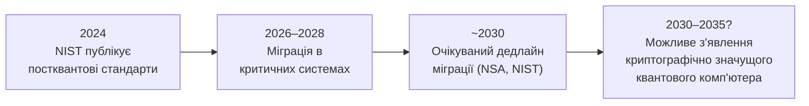

# 4.7. Постквантова криптографія

У 1994 році математик Пітер Шор опублікував алгоритм для квантового комп'ютера, здатний факторизувати великі числа за поліноміальний час. Для класичного комп'ютера факторизація числа RSA-2048 зайняла б більше часу, ніж існує Всесвіт. Для достатньо потужного квантового комп'ютера з алгоритмом Шора — кілька годин. Якщо такий комп'ютер буде побудований — RSA, DSA і ECDH стануть марними. Це не фантастика і не далеке майбутнє: в 2024 році NIST опублікував перші постквантові криптографічні стандарти, а національні спецслужби світу вже зараз збирають і зберігають зашифрований трафік — в розрахунку розшифрувати його пізніше («harvest now, decrypt later»).

> 📖 Ключові терміни — у [глосарії модуля](00-glosariy.md).

## Що таке квантовий комп'ютер

Класичний комп'ютер оперує бітами (0 або 1). Квантовий комп'ютер оперує **кубітами (qubits)**, що завдяки суперпозиції можуть бути одночасно «0 і 1» — аж до моменту вимірювання. Це дозволяє деяким алгоритмам паралельно досліджувати величезний простір рішень.

**Ключово:** квантові комп'ютери НЕ є «просто більш швидкими класичними комп'ютерами». Вони краще лише для специфічних задач — і більшість класичних алгоритмів вони не прискорюють. Але деякі математичні задачі, на яких базується криптографія, — прискорюють катастрофічно.

## Загроза: алгоритми Шора і Гровера

### Алгоритм Шора (1994): смерть RSA/ECC

Алгоритм Шора вирішує **задачу факторизації** і **задачу дискретного логарифмування** (ECDLP) за **поліноміальний** час на квантовому комп'ютері.

**Наслідок:** RSA, DSA, ECDSA, Ed25519, ECDH, DH — всі вони базуються на цих задачах. **Достатньо потужний квантовий комп'ютер зробить їх непридатними.**

Зловмисник з квантовим комп'ютером може:
- Виводити приватний ключ з публічного (зламати будь-який RSA/ECC ключ).
- Підробляти цифрові підписи.
- Розшифрувати весь трафік, захищений RSA/ECC key exchange.

### Алгоритм Гровера (1996): ослаблення симетричних алгоритмів

Алгоритм Гровера прискорює пошук у невпорядкованій базі даних з O(N) до O(√N). Для симетричної криптографії це означає:

- AES-128: ефективний ключ знижується з 128 біт до ~64 біт → **потенційно небезпечний**.
- AES-256: ефективний ключ знижується з 256 біт до ~128 біт → **все ще безпечний**.

**Висновок:** симетричне шифрування AES-256 і SHA-384/512 залишаються безпечними проти квантових атак — просто потрібні більші ключі і хеші, ніж раніше.

## Часові рамки: коли очікувати «Quantum Day»



**Поточний стан (2024):** найбільші квантові комп'ютери мають кілька тисяч «фізичних» кубітів, але для злому RSA-2048 потрібні мільйони **логічних** (коригованих від помилок) кубітів. Різниця — в 1000 разів. Консенсус: 10–15 років до криптографічно значущого квантового комп'ютера, але:

1. **Harvest now, decrypt later** — зловмисники (особливо держави) вже зараз збирають зашифрований трафік, в розрахунку розшифрувати пізніше. Дані з терміном конфіденційності 10+ років вже під загрозою.
2. **Міграція займає роки** — уряди, фінансові системи, критична інфраструктура не оновлюються за рік.
3. **Невизначеність:** розвиток квантових комп'ютерів може прискоритись несподівано.

## NIST PQC: постквантові стандарти

У 2024 році NIST (National Institute of Standards and Technology) опублікував перші три постквантових стандарти — результат 7-річного конкурсу (2017–2024):

### FIPS 203: ML-KEM (Module-Lattice Key Encapsulation Mechanism)

Базується на задачі **Module Learning With Errors (MLWE)** — математична задача на структурах у модульних гратках (lattices). Замінює ECDH для обміну ключами.

**Rекомендований рівень:** ML-KEM-768 (еквівалент ~192 бітам класичної безпеки).

```
Публічний ключ: ~1184 байт (проти 64 байт для X25519)
Приватний ключ: ~2400 байт
Ciphertext: ~1088 байт (проти 32 байт для X25519 key share)
```

### FIPS 204: ML-DSA (Module-Lattice Digital Signature Algorithm)

Базується на задачі **Module LWE** для цифрових підписів. Замінює ECDSA/Ed25519.

```
Публічний ключ: ~1312 байт (проти 32 байт Ed25519)
Приватний ключ: ~2528 байт
Підпис: ~2420 байт (проти 64 байт Ed25519)
```

### FIPS 205: SLH-DSA (Stateless Hash-Based Digital Signature)

Базується на безпеці хеш-функцій (а не математичних задачах), що є більш «консервативним» вибором — безпека залежить лише від безпеки SHA-2/SHA-3, а не від нових математичних задач.

```
Підпис: ~8–50 КБ (залежно від параметрів) — значно більший
```

## Гібридна схема: перехідний підхід

Рекомендований підхід зараз — **гібридне шифрування**: поєднання класичного (ECDH) і постквантового (ML-KEM) алгоритмів. Якщо один з них ненадійний — інший зберігає безпеку.

```
Session Secret = ECDH(X25519) || ML-KEM-768
Combined Key = KDF(ECDH_secret, ML-KEM_secret)
```

Це вже реалізовано в:
- Google Chrome / Mozilla Firefox (X25519Kyber768 в TLS 1.3) — з 2023.
- Cloudflare (гібридний X25519+ML-KEM в TLS).
- Open Quantum Safe (liboqs) — open-source бібліотека.

## Quantum Key Distribution (QKD): квантова роздача ключів

**QKD** — принципово інший підхід: використовує квантову механіку (фотони) для передачі ключів таким чином, що будь-яке підслуховування фізично змінює стан і виявляється.

**BB84** (Bennett-Brassard 1984) — перший QKD-протокол: відправник надсилає поляризовані фотони, отримувач вимірює їх; підслухувач порушить квантові стани і буде виявлений.

**Реальний статус QKD:**
- Потребує спеціального обладнання (оптоволокно або оптичний супутниковий зв'язок).
- Обмежена відстань (~100–200 км без квантових ретрансляторів).
- Дорого і складно масштабувати.
- **Не є альтернативою постквантовим алгоритмам** для інтернету — скоріше нішевий інструмент для урядових і фінансових комунікацій.

Китай активно розвиває QKD-інфраструктуру (кілька тисяч км наземних і супутникових QKD-каналів). Деякі українські дослідники також працюють у цій галузі в рамках міжнародних проектів.

## Міні-вправа

1. Зайдіть на `test.openquantumsafe.org` — сайт Open Quantum Safe Project, що підтримує тестові TLS-з'єднання з постквантовими алгоритмами. Підключіться через curl і перегляньте, який cipher suite використано:
```bash
curl -v --tlsv1.3 https://test.openquantumsafe.org 2>&1 | grep -E "Cipher|MLKEM|Kyber"
```

2. Перевірте, чи ваш браузер вже підтримує гібридний X25519+ML-KEM:
   - Chrome/Edge: відкрийте `chrome://flags/#enable-tls13-kyber` — чи увімкнено?
   - Firefox: `about:config` → `security.tls.enable_kyber`

3. Порахуйте: які дані у вашій організації або особистому житті потребують конфіденційності на 10+ років? Медичні записи? Юридичні документи? Фінансова інформація? Чим вони захищені зараз і чи варто вже сьогодні переходити на гібридне шифрування?

## Практичні рекомендації прямо зараз

1. **Для нових систем:** використовуйте AES-256 (а не AES-128), SHA-384/SHA-512 (а не SHA-256) — вже зараз захищені від Гровера.
2. **Відстежуйте NIST PQC:** бібліотеки (OpenSSL 3.x, BouncyCastle, liboqs) вже починають інтегрувати ML-KEM і ML-DSA.
3. **Криптографічна гнучкість (Crypto-agility)** — одне з найважливіших архітектурних рішень на найближче десятиліття. Ідея: система не має бути «зшита» з конкретним алгоритмом, щоб заміна алгоритму не потребувала переписування всієї кодової бази.

   **Що це означає на практиці:**
   - Алгоритм шифрування і розмір ключа зберігаються у конфігурації або передаються як параметр, а не вшиті в код константами.
   - Клас/модуль роботи з ключами є абстракцією (інтерфейс `Encryptor`), а не прямим викликом `AES.encrypt(...)`.
   - Протокол (наприклад, TLS) оголошує підтримувані алгоритми через negotiation — і нові алгоритми додаються без зміни протоколу.
   - У PKI-системах сертифікати можна перевипустити з новим алгоритмом без зміни процедур довіри.

   Практичний приклад: Signal вже використовує гібридний PQXDH (X25519 + Kyber) поряд з класичним X25519 — цей перехід стався без зміни протоколу Double Ratchet, бо архітектура дозволяла замінити key exchange «зовні».

4. **«Harvest now» загроза:** будь-які дані, що потребують конфіденційності на 10+ років — вже сьогодні варто захищати постквантовими алгоритмами або мінімум гібридними схемами.

## Джерела та додаткові матеріали

- NIST FIPS 203, 204, 205 — офіційні постквантові стандарти (csrc.nist.gov).
- Shor P., *Algorithms for Quantum Computation* (1994) — оригінальна стаття.
- NIST, *Post-Quantum Cryptography Standardization* — повна документація конкурсу.
- Open Quantum Safe Project (openquantumsafe.org) — open-source реалізації.
- NSA, *Commercial National Security Algorithm Suite 2.0* (2022) — дедлайни міграції.

---

**Попередній розділ:** [4.6. Криптографічні протоколи](06-protokoly-bezpeky.md)
**Далі:** [4.8. Поширені помилки реалізації](08-pomylky-realizatsii.md)
**Назад до модуля:** [README модуля 04](README.md)
