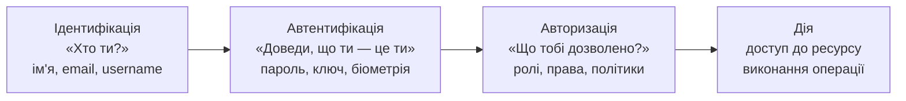
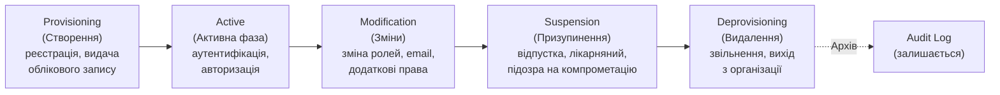

# 5.1. IAM: ідентифікація, автентифікація, авторизація

Кожного разу, коли ви входите в систему, відбуваються три окремі операції, які більшість людей сприймають як одну. Ви говорите системі «я — Аліса» (ідентифікація), система перевіряє, що ви справді Аліса (автентифікація), і потім вирішує, що Аліса може робити (авторизація). Змішування цих понять — не просто термінологічна неточність. Це архітектурна помилка, що призводить до реальних вразливостей: системи, що плутають «я знаю твій пароль» з «я знаю, хто ти», і системи, що плутають «ти аутентифікований» з «тобі дозволено» — по-різному, але однаково небезпечно.

> 📖 Ключові терміни — у [глосарії модуля](00-glosariy.md).

## Тріада IAM: три різних запитання

**Ідентифікація (Identification)** — твердження про особу. «Я — user@example.com». Це лише заявка, без жодних доказів. Ідентифікатор може бути публічним — ім'я користувача, email, номер телефону.

**Автентифікація (Authentication)** — доведення твердження. Система перевіряє, що ви дійсно є тим, ким себе назвали. Саме тут вступають паролі, ключі, біометрія і MFA.

**Авторизація (Authorization)** — визначення дозволів. Навіть якщо ви успішно аутентифіковані як user@example.com, це не означає, що вам дозволено все. Авторизація відповідає: чи може цей користувач читати цей файл? видаляти цей запис? отримувати доступ до цього API?

**Облік (Accounting / Auditing)** — четвертий елемент, що часто додається: журналювання того, хто, що і коли робив. Разом ці чотири елементи утворюють **AAAA-фреймворк**.

## Чому плутанина між ними небезпечна

**Помилка 1: Ідентифікатор = автентифікація.** Класика — системи, що перевіряють лише наявність сесійного токена без верифікації його підпису («якщо токен є — користувач аутентифікований»). JWT без перевірки підпису, сесійний cookie без HttpOnly і Secure прапорів.

**Помилка 2: Автентифікація = авторизація.** «Якщо ти увійшов — тобі все дозволено». Відсутня перевірка прав для конкретних дій. Класична IDOR (Insecure Direct Object Reference): аутентифікований користувач A змінює `id=42` на `id=43` в URL і отримує дані користувача B, бо авторизація не перевіряється.

**Помилка 3: Авторизація без автентифікації.** API-ендпоінт перевіряє роль («тільки для адмінів»), але не перевіряє, чи токен підтверджений. Атакуючий підробляє роль у параметрі запиту.

## Identity Lifecycle: від створення до видалення

Управління ідентичністю — не одноразова дія, а процес. **Identity Lifecycle Management** охоплює:

**Найбільш ігнорований етап — Deprovisioning.** Дослідження показують: у середній організації до 30% облікових записів у Active Directory належать колишнім співробітникам або системам, що більше не існують. Ці «привиди» — зручний вектор для зловмисника: акаунт існує, ніхто не слідкує за активністю.

**Joiners, Movers, Leavers (JML)** — стандартна модель для HR-інтеграції:
- **Joiner** → новий співробітник → provisioning з мінімально необхідними правами.
- **Mover** → зміна посади/відділу → перегляд і коригування прав (не додавання поверх старих!).
- **Leaver** → звільнення → негайне відключення всіх акаунтів і відкликання токенів.

## Принцип найменших привілеїв у контексті IAM

Розглянутий у модулі 03 (розділ 3.1) як один із шести принципів hardening, тут він набуває конкретної операційної форми:

- **Need-to-know** — доступ лише до інформації, необхідної для конкретного завдання.
- **Need-to-use** — доступ лише до систем, що використовуються для виконання ролі.
- **Time-bound access** — права видаються лише на потрібний термін (не назавжди).
- **Location-based access** — доступ лише з очікуваних місць (IP, country, network).

**Creeping privileges (повзучі привілеї)** — поширена проблема: користувач переходить між відділами, отримуючи нові права, але старі не відкликаються. Через кілька років він має права всіх посад, через які проходив.

## Атрибути і Claims у сучасних IAM-системах

Сучасні IAM-системи описують ідентичність через **атрибути** і **claims** (твердження):

- **Subject** — хто (user ID, email, service account).
- **Attributes** — властивості (department, role, clearance_level, location).
- **Claims** — підписані твердження про атрибути (JWT claim: `"role": "admin"`, `"dept": "finance"`).

**SCIM (System for Cross-domain Identity Management)** — стандартний REST API для синхронізації атрибутів між IdP (Identity Provider) і сервісами. Дозволяє автоматично провізіонувати і деактивувати акаунти при змінах у HR-системі.

## Різниця між Identity Provider (IdP) і Service Provider (SP)

У федеративних системах з'являються дві ролі:

- **IdP (Identity Provider)** — система, що зберігає і верифікує ідентичності. Наприклад: Azure Active Directory / Entra ID, Okta, Google Workspace, Keycloak.
- **SP (Service Provider)** або **RP (Relying Party)** — система, що надає сервіс і довіряє IdP для автентифікації користувачів. Наприклад: GitHub, Salesforce, ваш корпоративний застосунок.

Ключовий принцип: SP не зберігає паролі користувачів — він лише отримує підтвердження від IdP. Якщо SP зламаний — паролі в безпеці (вони у IdP). Якщо IdP зламаний — всі SP під загрозою.

## Міні-вправа

Подумайте про будь-яку систему, з якою ви регулярно працюєте (корпоративна або навчальна). Дайте відповіді:

1. Де відбувається ідентифікація? (email, username, phone number?)
2. Де відбувається автентифікація? (пароль? MFA? SSO через Google?)
3. Де зберігаються і перевіряються права? (в тій самій системі чи в окремій?)
4. Що відбудеться з акаунтом, якщо ви покинете організацію завтра? Є процес deprovisioning?
5. Чи є акаунти, що «залишились від попередника» або сервісні акаунти, про які ніхто не знає?

## Джерела та додаткові матеріали

- NIST SP 800-63 — Digital Identity Guidelines (чотири томи).
- NIST SP 800-53, AC Control Family — Access Control.
- ISO/IEC 24760 — IT Security — A framework for identity management.
- SCIM 2.0 (RFC 7642–7644) — System for Cross-domain Identity Management.

---

**Далі:** [5.2. Фактори автентифікації і MFA](02-mfa-faktory.md)
**Назад до модуля:** [README модуля 05](README.md)
