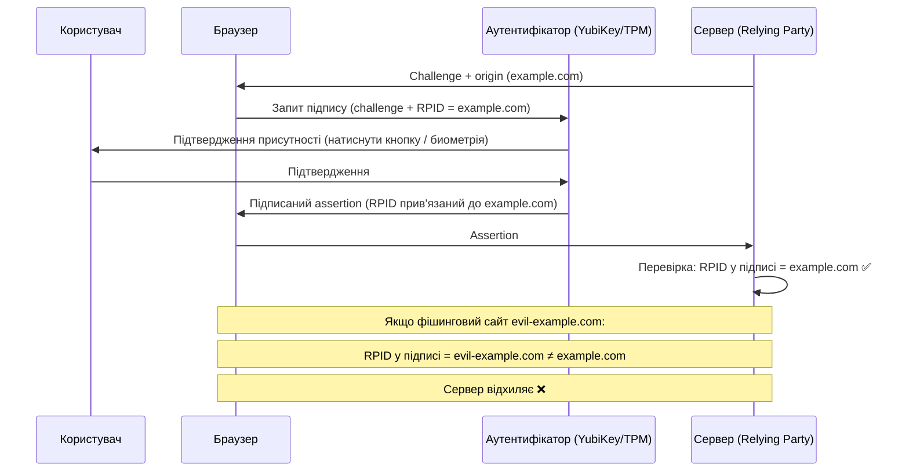

# 5.2. Фактори автентифікації і MFA

Пароль — найпоширеніший спосіб автентифікації і водночас найслабший. Він може бути вгаданий, перехоплений, викрадений з бази даних, соціально зінженерований або просто повторно використаний на десятках сайтів. Ідея MFA (Multi-Factor Authentication) проста: навіть якщо зловмисник отримає один фактор — він не матиме другого. Це не ускладнення заради ускладнення — це математичне множення вартості атаки. За даними Microsoft, MFA блокує понад 99.9% автоматизованих атак на акаунти.

> 📖 Ключові терміни — у [глосарії модуля](00-glosariy.md).

## Класифікація факторів

| Тип | Назва | Приклади | Вразливості |
|---|---|---|---|
| **Щось знаєш** | Knowledge | Пароль, PIN, секретне запитання | Може бути вгадано, витікти, соціально зінженеровано |
| **Щось маєш** | Possession | TOTP-застосунок, SMS, смарт-карта, YubiKey | Може бути втрачено, SIM-swap, реальний фішинг |
| **Щось є** | Inherence | Відбиток, обличчя, сітківка, голос | Не можна замінити після компрометації; false positive/negative |
| **Десь є** | Location | IP-адреса, геолокація, мережа | Легко підробити через VPN/proxy |
| **Щось робиш** | Behavior | Динаміка набору, хода, патерн використання | Нестабільний, потребує ML, false positive |

**MFA = мінімум два фактори **різних** категорій.** Пароль + PIN — це два фактори категорії «знаєш», а не MFA. Пароль + SMS-код — це «знаєш» + «маєш» = справжня MFA.

## TOTP: одноразові паролі на основі часу

**TOTP (Time-based One-Time Password, RFC 6238)** — найпоширеніший другий фактор. Реалізується застосунками Google Authenticator, Authy, Microsoft Authenticator, Bitwarden.

**Механізм:**
```
1. При реєстрації: сервер і клієнт обмінюються спільним секретом (seed) через QR-код
2. Кожні 30 секунд:
   TOTP = HOTP(secret, floor(Unix_time / 30))
   де HOTP = HMAC-SHA1(secret, counter)[...truncate to 6 digits]
3. Сервер обчислює той самий код і порівнює
```

**Вразливості TOTP:**
- **Фішинг** — зловмисник в реальному часі перехоплює введений код і використовує його протягом 30-секундного вікна. Автоматизовані набори для reverse proxy (Evilginx, Modlishka) роблять це без участі людини.
- **SIM-swap і SMS** — SMS-коди є найслабшою формою «другого фактора»: оператор може бути соціально зінженерований. SMS не є справжнім TOTP, але часто плутається з ним.
- **Синхронізація часу** — якщо годинник пристрою відхиляється сильно (>2 хвилини), TOTP перестає працювати.

```python
# Демонстрація TOTP (для розуміння механізму)
import hmac, hashlib, struct, time, base64

def generate_totp(secret_base32: str, digits: int = 6) -> str:
    """Генерує TOTP-код. secret_base32 — той самий, що у QR-коді."""
    secret = base64.b32decode(secret_base32.upper())
    counter = int(time.time()) // 30  # кожні 30 секунд новий лічильник

    # HMAC-SHA1 від counter
    msg = struct.pack('>Q', counter)
    h = hmac.new(secret, msg, hashlib.sha1).digest()

    # Dynamic truncation
    offset = h[-1] & 0xF
    code = struct.unpack('>I', h[offset:offset+4])[0] & 0x7FFFFFFF
    return str(code % (10 ** digits)).zfill(digits)
```

## Біометрія: «щось є» — і його ризики

Категорія «ознака» (биометрія) інтуїтивно здається найнадійнішою — адже відбиток або обличчя не можна вкрасти як пароль. Але є важливі нюанси, про які замовчують маркетинги смартфонів.

**Незамінність після компрометації.** Якщо зловмисник отримав ваш біометричний шаблон — ви не можете «змінити відбиток» як пароль. Саме тому сучасні реалізації (Face ID, Touch ID, Windows Hello) ніколи не зберігають сам біометричний зразок у хмарі — лише математичну модель у захищеному апаратному сховищі (Secure Enclave, TPM).

**Deepfake і liveness attacks.** Зі зростанням якості AI-генерації відео з'являються атаки на системи розпізнавання обличчя через підроблені відео. **Liveness detection** — механізм, що відрізняє живу людину від фото або відео: перевірка руху очей, реакції на підказки («відкрийте рот», «поверніть голову»), аналіз текстури шкіри. Банківські застосунки, що використовують відеоселфі для KYC, зобов'язані мати liveness detection — без нього атака deepfake тривіальна.

**False Accept Rate / False Reject Rate.** Кожна біометрична система має дві похибки: FAR (хибне прийняття чужої людини) і FRR (хибне відхилення справжнього власника). Налаштування «ліберальнішого» порогу знижує FRR (зручніше), але підвищує FAR (небезпечніше). Для критичних систем FAR має бути < 0.001%.

**Висновок щодо біометрії:** використовувати як один із факторів MFA — так, але з апаратним захистом шаблону і liveness detection. Ніколи — як єдиний фактор для критичних систем.

## FIDO2 і WebAuthn: фішинг-стійка автентифікація

**FIDO2** (Fast IDentity Online 2) — альянсовий стандарт, що усуває головну проблему TOTP — вразливість до фішингу. Складається з двох компонентів:
- **WebAuthn** — Web API для браузерів і застосунків.
- **CTAP2** (Client-to-Authenticator Protocol) — протокол між пристроєм і аутентифікатором (YubiKey, вбудований TPM).

**Чому FIDO2 захищений від фішингу:**



**Ключова ідея:** RPID (Relying Party ID) — це домен, для якого генерується підпис. Аутентифікатор підписує виклик разом з RPID. Якщо користувач потрапив на фішинговий сайт `evil-example.com` — підпис містить цей домен, а сервер `example.com` відхилить його. Жоден перехоплювач не може «перекинути» підпис на інший домен.

**Форм-фактори FIDO2-аутентифікаторів:**
- **Роумінгові** — YubiKey, Token2, Google Titan Key (USB-A, USB-C, NFC, Bluetooth).
- **Платформні** — вбудовані в пристрій: Windows Hello (TPM), Touch ID / Face ID (Secure Enclave), Android (Strongbox).

## Passkeys: FIDO2 для мас

**Passkeys** — розширення FIDO2 з синхронізацією через хмару. Apple iCloud Keychain, Google Password Manager і 1Password дозволяють синхронізувати passkeys між пристроями одного екосистему. Це вирішує основну проблему FIDO2 — «що робити, якщо втратив пристрій».

**Технічно:** passkey — це credential на базі public-key cryptography (ECDSA P-256 або Ed25519). Приватний ключ ніколи не залишає захищене сховище (Secure Enclave, TPM). При «синхронізації» передається не сам ключ, а зашифрований blob.

**Порівняння методів другого фактора:**

| Метод | Фішинг-стійкість | Зручність | Доступність | Рекомендація |
|---|---|---|---|---|
| SMS OTP | ❌ Ні | ✅ Висока | ✅ Висока | ⚠️ Краще ніж нічого |
| Email OTP | ❌ Ні | ✅ Висока | ✅ Висока | ⚠️ Краще ніж нічого |
| TOTP App | ⚠️ Частково | ✅ Висока | ✅ Висока | ✅ Рекомендовано |
| Push notification | ⚠️ Частково | ✅ Висока | Потрібен смартфон | ✅ Рекомендовано |
| TOTP Hardware | ⚠️ Частково | Середня | Потрібен пристрій | ✅ Рекомендовано |
| FIDO2 Hardware | ✅ Так | Середня | Потрібен пристрій | ✅✅ Найкраще |
| Passkeys | ✅ Так | ✅ Висока | ✅ Висока | ✅✅ Рекомендовано |
| SMS alone | ❌ Ні | ✅ Висока | ✅ Висока | ❌ Не рекомендовано як єдиний |

Якщо дати одну практичну рекомендацію з цієї таблиці: для будь-якого важливого акаунту сьогодні — перейдіть з SMS на TOTP-застосунок. Для корпоративних адміністраторів — на FIDO2 Hardware або Passkeys. Різниця між рядком «SMS» і рядком «FIDO2 Hardware» — це різниця між тим, що обходиться Evilginx за три секунди, і тим, що не обходиться взагалі.

## MFA Fatigue та Push Bombing

**MFA Fatigue (MFA bombing)** — атака, де зловмисник, знаючи пароль жертви, надсилає нескінченний потік push-сповіщень «Підтвердити вхід?», розраховуючи, що жертва випадково або через виснаження натисне «Так». Саме цей метод використовувався у гучних атаках на Uber (2022), Cisco (2022) і Twilio (2022).

**Захист від MFA Fatigue:**
- **Number Matching** — додаток показує число, що треба ввести в push-сповіщення (а не просто «підтвердити»). Це унеможливлює випадкове підтвердження.
- **Additional Context** — push показує IP і геолокацію спроби входу.
- **FIDO2/Passkeys** — не використовують push-підтвердження взагалі; фізична присутність необхідна.
- **Rate limiting** — обмеження кількості спроб автентифікації.

## Вимоги до MFA за рівнями безпеки

| Сценарій | Мінімальний рівень MFA |
|---|---|
| Звичайний корпоративний акаунт | TOTP або push з number matching |
| Адміністратор систем | FIDO2 Hardware або Passkey |
| Привілейований доступ (PAM) | FIDO2 Hardware + додаткова авторизація |
| Доступ до production | FIDO2 + just-in-time approval |
| Державні системи (Україна, критична інфраструктура) | КЕП або FIDO2 |

## Головний висновок: ієрархія захисту

Не всі методи MFA рівнозначні. Якщо уявити їх як шкалу від «краще ніж нічого» до «захищено навіть від найдосвідченіших зловмисників»:

```
SMS OTP < Email OTP < TOTP App < Push (з number matching) < FIDO2 Hardware / Passkeys
  ↑                                                                           ↑
"Краще ніж пароль без MFA"                           "Захищено від AITM фішингу"
```

Для персональних акаунтів: будь-яка MFA краща за відсутність MFA. Для корпоративних систем: мета — просунутись якомога правіше по цій шкалі, починаючи з найбільш чутливих акаунтів (адміністратори → розробники → всі користувачі).

## Міні-вправа
2. Якщо у вас є YubiKey або сучасний смартфон (з Face/Touch ID і підтримкою passkeys) — зареєструйте passkey на `account.google.com` або `github.com` і порівняйте досвід входу з паролем і TOTP.
3. Реалізуйте власний TOTP-генератор (або запустіть наш з лабораторної 5.10) і переконайтесь, що він генерує той самий код, що і Google Authenticator для того самого секрету.

## Джерела та додаткові матеріали

- RFC 6238 — TOTP: Time-Based One-Time Password Algorithm.
- W3C WebAuthn Level 2 — специфікація WebAuthn.
- FIDO Alliance (fidoalliance.org) — документація FIDO2 і Passkeys.
- NIST SP 800-63B, Section 5 — Authenticator Types and Assurance Levels.
- Microsoft, *How MFA reduces account compromise* (microsoft.com/security/blog).

---

**Попередній розділ:** [5.1. IAM: концепції](01-iam-kontseptsii.md)
**Далі:** [5.3. Паролі і парольні менеджери](03-paroli-ta-menedzhery.md)
**Назад до модуля:** [README модуля 05](README.md)
