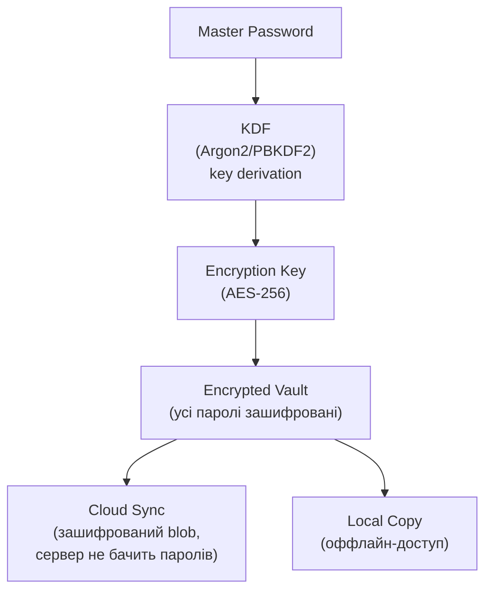

# 5.3. Паролі і парольні менеджери

Пароль — найстаріший і найненадійніший спосіб автентифікації, що продовжує домінувати виключно через інерцію. Дослідження Verizon DBIR незмінно показують: 80%+ підтверджених витоків даних пов'язані зі слабкими, вкраденими або повторно використаними паролями. При цьому більшість людей мають від 50 до 200 онлайн-акаунтів і пам'ятають від 3 до 7 паролів — різницю «вирішують» повторним використанням. Парольний менеджер — не просто зручний інструмент, а єдина реалістична відповідь на цю математику.

> 📖 Ключові терміни — у [глосарії модуля](00-glosariy.md).

## Чому паролі такі слабкі: анатомія проблеми

### Людська психологія проти безпеки

Вимоги до паролів, що десятиліттями вважались стандартом («мінімум 8 символів, велика/мала літера, цифра, спецсимвол, змінювати кожні 90 днів»), насправді підштовхують до передбачуваних патернів:

```
Password1!  → Password2!  → Password3!     (ротація)
Winter2024! → Spring2024! → Summer2024!    (сезонність)
P@ssw0rd    → P@ssw0rd1   → P@ssw0rd2     (інкремент)
```

Зловмисники знають ці патерни і включають їх у словники. Дослідження показують: примусова ротація паролів **знижує** безпеку, бо користувачі обирають більш передбачувані зміни.

### Атаки на паролі і їх ефективність

| Атака | Механізм | Ефективна проти |
|---|---|---|
| **Brute force** | Перебір усіх комбінацій | Коротких паролів (<8 символів) |
| **Dictionary** | Список слів і варіацій | Слів природної мови і популярних паролів |
| **Credential stuffing** | Паролі з витоків інших сервісів | Повторно використаних паролів |
| **Rainbow table** | Передобчислені таблиці хешів | Хешів без salt |
| **Password spraying** | 1-2 простих паролі проти тисяч акаунтів | Слабких парольних політик без блокування |
| **Phishing** | Обман користувача | Будь-яких паролів, незалежно від складності |
| **Keylogging** | Перехоплення натискань | Будь-яких паролів у реальному часі |
| **Shoulder surfing** | Фізичне спостереження | Любых паролів при введенні |

**Credential stuffing** заслуговує на окрему увагу. Щороку витікають мільярди пар логін/пароль з різних сервісів. База Have I Been Pwned (hibp) на 2024 рік містить понад 14 мільярдів зламаних облікових записів. Зловмисники автоматично пробують ці пари на інших сервісах. Якщо ви використовуєте той самий пароль на двох сервісах і один з них зламали — інший теж компрометований, незалежно від «складності» пароля.

## NIST SP 800-63B: сучасні рекомендації

У 2017 році NIST (National Institute of Standards and Technology) переглянув свої рекомендації щодо паролів, відмовившись від застарілої «складності». Ключові принципи:

**Що NIST рекомендує:**
- Мінімальна довжина: **8 символів** для звичайних, **6** для пам'ятаних PIN.
- Максимум: **64 символи** (підтримувати довгі passphrase).
- Дозволяти **всі символи** Unicode, включаючи пробіли.
- Перевіряти пароль по базі відомих витоків (Have I Been Pwned API).
- Блокувати прості паролі: `password`, `123456`, `qwerty`, назву сервісу.
- **Не** вимагати обов'язкової ротації без підстав.
- **Не** вимагати певних класів символів (це стимулює `P@ssw0rd`).

**Що рекомендується замість:**
- Довгі парольні фрази (`ЛисицяБіжитьЧерезПоле!2026` — легко запам'ятати, важко підібрати).
- MFA як основний захист замість складних правил для паролів.
- Менеджер паролів для генерації унікальних паролів для кожного сервісу.

## Парольні менеджери: єдиний реалістичний підхід

Людина не може пам'ятати 150 унікальних, випадкових, довгих паролів. Парольний менеджер вирішує цю задачу: потрібно пам'ятати лише один надійний **master password**, а всі інші генеруються і зберігаються автоматично.

### Архітектура безпечного парольного менеджера



**Zero-knowledge архітектура:** сервер зберігає лише зашифрований vault. Ключ шифрування виводиться з master password на пристрої клієнта і ніколи не передається на сервер. Якщо сервер зламаний — зловмисник отримує лише зашифровані дані без ключа.

### Порівняння парольних менеджерів

| Менеджер | Тип | Open Source | Self-hosted | Особливості |
|---|---|---|---|---|
| **Bitwarden** | Хмара + self-hosted | ✅ | ✅ | Кращий публічно-аудитований варіант |
| **KeePassXC** | Локальний файл | ✅ | ✅ | Максимальна приватність, без хмари |
| **1Password** | Хмара | ❌ | ❌ | Зручний UX, корпоративні функції |
| **Dashlane** | Хмара | ❌ | ❌ | Вбудований VPN, зручний |
| **LastPass** | Хмара | ❌ | ❌ | Два великих витоки vault (2022) — **не рекомендується** |
| **Enpass** | Хмара | ❌ | ✅ (через Dropbox/Drive) | Локальне шифрування + ваше хмарне сховище |

**LastPass incident 2022** — показовий приклад: зловмисники отримали зашифровані vault'и мільйонів користувачів. Vault'и захищені master password через PBKDF2-SHA256 з 100 100 ітерацій (замість рекомендованих 600 000). Для слабких master passwords — можливий підбір. Це підкреслює: навіть при zero-knowledge архітектурі якість KDF і master password має значення.

### Master Password: вибір і захист

```
❌ Погані master passwords:
- Слово зі словника: "sunshine", "football"
- Дата: "15031990"
- Ім'я + цифра: "Alice2024"
- Той самий пароль від іншого сервісу

✅ Хороші master passwords:
- Passphrase з 5+ слів: "МаківкаВерсняСпіваєТихоРанком"
- Diceware (кидання кубика за словником): 5 слів = ~65 біт ентропії
- Комбінація 4 слів + число + символ: "Фіалка-Дощ-Ліс-2024!"
```

## Account Lockout: блокування після невдалих спроб

Парольний менеджер і MFA захищають конкретного користувача. Account Lockout — це захист на рівні сервера: після N невдалих спроб входу акаунт тимчасово блокується, унеможливлюючи автоматизований перебір.

**Типові значення (NIST SP 800-63B рекомендує поєднувати з throttling):**

| Тип системи | Рекомендоване значення N | Тривалість блокування |
|---|---|---|
| Корпоративні системи (Windows AD) | 5–10 спроб | 15–30 хвилин або до розблокування адміном |
| Публічні вебсервіси | 5–10 спроб | Прогресивна затримка (1с → 2с → 4с → капча) |
| Критичні системи (банки, держ.) | 3–5 спроб | Повне блокування + SMS-сповіщення власнику |

**Smart Lockout (Microsoft Entra ID):** на відміну від «hard» блокування, розрізняє легітимні спроби з відомих пристроїв і підозрілі з нових IP — блокує лише підозрілі, не заважаючи справжньому власнику.

**Увага: lockout ≠ захист від Password Spraying.** Spraying спеціально розроблений для обходу lockout: замість 100 спроб для одного акаунту — 1 спроба проти 100 різних акаунтів. Lockout блокує лише один вектор (брутфорс одного акаунту).

```powershell
# Windows: налаштувати Account Lockout через Local Security Policy
# Або PowerShell (домен):
Set-ADDefaultDomainPasswordPolicy -LockoutDuration 00:30:00 `
    -LockoutObservationWindow 00:15:00 `
    -LockoutThreshold 5

# Linux (PAM): /etc/pam.d/common-auth
# auth required pam_faillock.so deny=5 unlock_time=1800
```

## Account Lockout: захист від брутфорсу на рівні системи

Парольна політика без блокування після невдалих спроб — це замок без механізму блокування: зловмисник може підбирати пароль нескінченно. **Account Lockout Policy** визначає, що після N невдалих спроб обліковий запис тимчасово або постійно блокується.

**Налаштування Account Lockout (Windows GPO):**
```
Computer Configuration → Windows Settings → Security Settings → Account Policies → Account Lockout Policy

Account lockout threshold:     5 (невдалих спроб)
Account lockout duration:      30 хвилин (або до ручного розблокування адміном)
Reset account lockout counter: 15 хвилин
```

**Linux (PAM pam_faillock):**
```bash
# /etc/pam.d/common-auth або /etc/security/faillock.conf

# Після 5 невдалих спроб — блокування на 15 хвилин
deny = 5
unlock_time = 900
fail_interval = 300

# Перевірити статус блокування:
sudo faillock --user alice

# Розблокувати вручну:
sudo faillock --user alice --reset
```

**Smart Lockout vs Hard Lockout:**
- **Hard Lockout** — блокування після N спроб без винятків. Ризик: DoS-атака (зловмисник спеціально блокує акаунти, щоб заблокувати легітимних користувачів).
- **Smart Lockout** (Azure AD) — алгоритм враховує геолокацію, IP і поведінкові паттерни: відомі IP блокуються м'якше, підозрілі — суворіше. Вирішує проблему DoS через навмисне блокування.

**Важливо:** Account Lockout захищає від онлайн-брутфорсу, але не від офлайн-підбору хешів (якщо база даних витікла). Для офлайн-захисту — виключно Argon2/bcrypt і достатня складність пароля.

У корпоративному середовищі індивідуальні парольні менеджери недостатні. Потрібні:

**Shared credentials management** — безпечний спільний доступ команди до паролів від спільних систем (без передачі паролів через месенджери).

**Password rotation** — автоматична ротація паролів для технічних акаунтів, сервісних облікових записів, API-ключів.

**Auditing** — хто, коли і до яких паролів мав доступ.

**Break-glass access** — доступ до критичних акаунтів в надзвичайних ситуаціях з контрольованим workflow.

Інструменти: **HashiCorp Vault**, **CyberArk**, **Delinea Secret Server**, **Bitwarden for Business**.

## Перевірка паролів через Have I Been Pwned

```python
import hashlib
import urllib.request

def check_pwned_password(password: str) -> int:
    """
    Перевіряє пароль через HIBP API.
    Використовує k-anonymity: сервер отримує лише перші 5 символів SHA1-хешу.
    Повертає кількість разів, що пароль фігурував у витоках (0 = не знайдено).
    """
    sha1 = hashlib.sha1(password.encode()).hexdigest().upper()
    prefix, suffix = sha1[:5], sha1[5:]

    url = f"https://api.pwnedpasswords.com/range/{prefix}"
    with urllib.request.urlopen(url) as resp:
        hashes = resp.read().decode()

    for line in hashes.splitlines():
        h, count = line.split(':')
        if h == suffix:
            return int(count)
    return 0


if __name__ == "__main__":
    test_passwords = ["password123", "P@ssw0rd!", "CorrectHorseBatteryStaple", "qwerty"]
    for pwd in test_passwords:
        count = check_pwned_password(pwd)
        if count:
            print(f"❌ '{pwd}': знайдено {count:,} разів у витоках!")
        else:
            print(f"✅ '{pwd}': не знайдено у відомих витоках")
```

**Як працює k-anonymity у HIBP:** ваш клієнт надсилає лише перші 5 символів SHA1-хешу пароля (наприклад `5BAA6`). Сервер повертає список усіх хешів, що починаються з цих 5 символів. Клієнт локально порівнює залишок хешу. Сервер ніколи не дізнається, який саме пароль ви перевіряли.

## Міні-вправа

1. Завантажте і налаштуйте Bitwarden або KeePassXC, якщо ще не маєте парольного менеджера.
2. Запустіть скрипт перевірки HIBP для п'яти паролів, що ви колись використовували (або популярних: `123456`, `password`, `qwerty123`).
3. Відкрийте список збережених паролів у браузері (`chrome://password-manager/passwords`). Скільки паролів у вас повторюється? Скільки акаунтів ви не пам'ятаєте, що реєстрували?

## Джерела та додаткові матеріали

- NIST SP 800-63B — Digital Identity Guidelines: Authentication (nist.gov).
- Troy Hunt, *Have I Been Pwned* (haveibeenpwned.com).
- Bitwarden Security White Paper (bitwarden.com/help/bitwarden-security-white-paper).
- Herley C., van Oorschot P., *A Research Agenda Acknowledging the Persistence of Passwords* (2012).

---

**Попередній розділ:** [5.2. Фактори автентифікації і MFA](02-mfa-faktory.md)
**Далі:** [5.4. SSO, SAML, OAuth 2.0 і OpenID Connect](04-sso-oauth-saml.md)
**Назад до модуля:** [README модуля 05](README.md)
