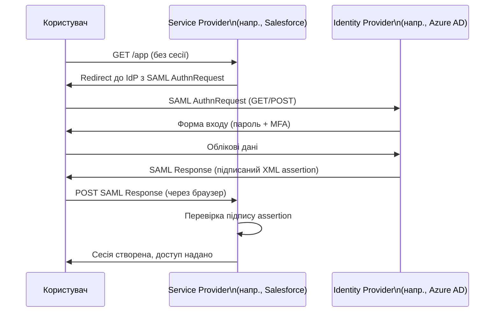
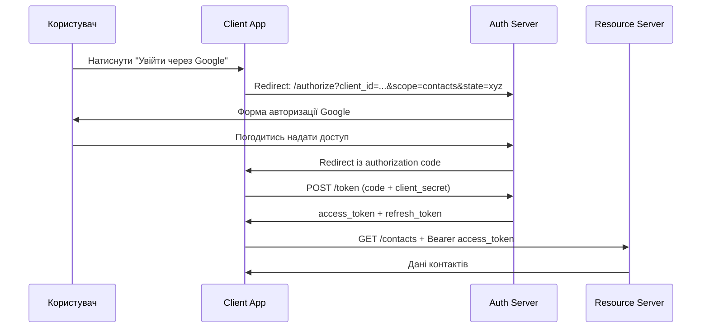

# 5.4. SSO, SAML, OAuth 2.0 і OpenID Connect

Щоразу, коли ви бачите кнопку «Увійти через Google» або «Увійти через Microsoft» — за нею стоїть один із протоколів цього розділу. Вони вирішують фундаментальну задачу: як дозволити користувачу одного сервісу (Identity Provider) автентифікуватись на іншому (Service Provider) без передачі пароля між ними. Зовні — зручність. Зсередини — складна криптографічна і протокольна взаємодія, де помилки у реалізації призводять до захоплення акаунтів, обходу автентифікації і доступу до чужих даних.

> 📖 Ключові терміни — у [глосарії модуля](00-glosariy.md).

## Single Sign-On (SSO): концепція

**SSO (Single Sign-On)** — механізм, що дозволяє користувачу аутентифікуватись один раз і отримати доступ до множини пов'язаних сервісів без повторного введення облікових даних.

**Переваги SSO:**
- Один надійний пароль (і MFA) замість десятків.
- Централізований контроль: деактивація акаунта в IdP миттєво відключає доступ до всіх SP.
- Аудит в одному місці.
- Кращий UX.

**Ризики SSO:**
- **Single point of failure**: якщо IdP недоступний — всі сервіси недоступні.
- **Single point of compromise**: якщо IdP зламаний — всі сервіси скомпрометовані.
- Складніша реалізація = більше потенційних вразливостей.

## SAML 2.0: SSO для корпоративного середовища

**SAML (Security Assertion Markup Language)** — XML-базований стандарт для передачі автентифікаційних тверджень (assertions) між IdP і SP. Переважно використовується в корпоративному B2B SSO.



**Структура SAML Assertion:**
```xml
<saml:Assertion>
  <saml:Issuer>https://idp.example.com</saml:Issuer>
  <saml:Subject>
    <saml:NameID>user@example.com</saml:NameID>
  </saml:Subject>
  <saml:Conditions NotBefore="..." NotOnOrAfter="..."/>
  <saml:AttributeStatement>
    <saml:Attribute Name="role">
      <saml:AttributeValue>admin</saml:AttributeValue>
    </saml:Attribute>
  </saml:AttributeStatement>
  <ds:Signature>...підпис IdP...</ds:Signature>
</saml:Assertion>
```

**Типові вразливості SAML:**
- **XML Signature Wrapping (XSW)** — підпис перевіряється для одного елемента XML, але застосунок обробляє інший. Зловмисник «обгортає» підписаний елемент новим з іншими атрибутами.
- **Signature exclusion** — деякі реалізації не перевіряють, чи assertion взагалі підписаний.
- **Replay attack** — перехоплена відповідь використовується повторно (захист: `NotOnOrAfter`, унікальний `ID`).

## OAuth 2.0: делегована авторизація

**OAuth 2.0 (RFC 6749)** — стандарт **авторизації** (не автентифікації!). Дозволяє користувачу надати третьому застосунку обмежений доступ до своїх ресурсів без передачі пароля.

Класичний приклад: «Застосунок X хоче отримати доступ до ваших контактів Google». Ви не передаєте пароль Google застосунку X — ви авторизуєте обмежений доступ через Google.

**Ключові ролі OAuth 2.0:**
- **Resource Owner** — користувач (власник ресурсів).
- **Client** — застосунок, що запитує доступ.
- **Authorization Server** — видає access tokens (наприклад, Google OAuth server).
- **Resource Server** — API, що надає ресурси при валідному токені (наприклад, Google Contacts API).

**Authorization Code Flow (найбезпечніший):**



**PKCE (Proof Key for Code Exchange)** — обов'язкове розширення для публічних клієнтів (SPA, мобільні застосунки), де неможливо безпечно зберегти `client_secret`. Клієнт генерує `code_verifier`, хешує в `code_challenge` і надсилає при отриманні authorization code. При обміні на токен підтверджує `code_verifier`. Це захищає від перехоплення authorization code.

**Типові вразливості OAuth 2.0:**
- **Open Redirect** — параметр `redirect_uri` не перевіряється → токен відправляється зловмиснику.
- **CSRF** — відсутність параметра `state` → зловмисник може ініціювати OAuth flow від імені жертви.
- **Token leakage** — access token потрапляє в URL або логи.
- **Insufficient scope validation** — сервер не перевіряє, чи запитаний scope відповідає використаному.

## OpenID Connect (OIDC): автентифікація поверх OAuth 2.0

**OAuth 2.0 — не автентифікація.** Access token підтверджує доступ до ресурсу, але не особу користувача. «Увійти через Google» через чистий OAuth — це помилка дизайну, що призводила до реальних захоплень акаунтів.

**OpenID Connect (OIDC)** — тонкий шар автентифікації поверх OAuth 2.0. Додає:
- **ID Token** — JWT із claims про користувача (`sub`, `email`, `name`, `iss`, `aud`, `iat`, `exp`).
- **UserInfo Endpoint** — API для отримання додаткових атрибутів користувача.
- **Discovery Document** — `.well-known/openid-configuration` для автоматичного налаштування.

```json
// Приклад ID Token (декодований JWT payload)
{
  "iss": "https://accounts.google.com",
  "sub": "110169484474386276334",
  "email": "user@example.com",
  "aud": "client_id_of_your_app",
  "iat": 1700000000,
  "exp": 1700003600,
  "nonce": "uniquevalue123"
}
```

**Критичні параметри перевірки ID Token:**
- `iss` — емітент має збігатись з очікуваним IdP.
- `aud` — аудиторія має бути вашим `client_id`.
- `exp` — токен не має бути прострочений.
- `nonce` — має збігатись з надісланим при запиті (захист від replay).

**Без перевірки `aud`:** зловмисник, що має ID Token для іншого застосунку від того самого IdP, може автентифікуватись у вашому застосунку.

## Порівняння протоколів

| Аспект | SAML 2.0 | OAuth 2.0 | OIDC |
|---|---|---|---|
| Призначення | Автентифікація + SSO | Авторизація | Автентифікація поверх OAuth |
| Формат | XML | JSON (токени) | JWT |
| Типове застосування | Enterprise B2B SSO | API authorization | Consumer SSO («Увійти через Google») |
| Складність | Висока | Середня | Середня |
| Популярність (новий код) | Спадає | Висока | Висока |

## Міні-вправа

Відкрийте будь-який JWT (наприклад, ID Token від OAuth) на сайті `jwt.io`:

1. Знайдіть у Header: алгоритм підпису (`alg`). Чи є там `"alg": "none"` (критична вразливість)?
2. У Payload знайдіть: `iss`, `aud`, `exp`. Чи ваш застосунок перевіряє всі три?
3. Спробуйте змінити payload в jwt.io і верифікувати зміненим токеном — чи прийме його ваш сервер?

Також: знайдіть у вашому проекті або будь-якому відкритому коді місце, де перевіряється JWT. Чи перевіряється `aud`? Чи є підтримка `alg: none`?

## Джерела та додаткові матеріали

- RFC 6749 — The OAuth 2.0 Authorization Framework.
- RFC 7636 — PKCE for OAuth 2.0 Public Clients.
- OpenID Connect Core 1.0 (openid.net/specs/openid-connect-core-1_0.html).
- OWASP, *OAuth 2.0 Security Best Current Practice* (RFC 9700).
- PortSwigger Web Academy, *OAuth 2.0 authentication vulnerabilities*.

> Протоколи федерації (SAML, OAuth, OIDC) відповідають на питання «як перевірити особу?». Але навіть після успішної автентифікації система повинна вирішити: «що цій особі дозволено?» — це вже завдання наступного розділу про моделі контролю доступу.

---

**Попередній розділ:** [5.3. Паролі і парольні менеджери](03-paroli-ta-menedzhery.md)
**Далі:** [5.5. Моделі контролю доступу](05-modeli-dostupu.md)
**Назад до модуля:** [README модуля 05](README.md)
