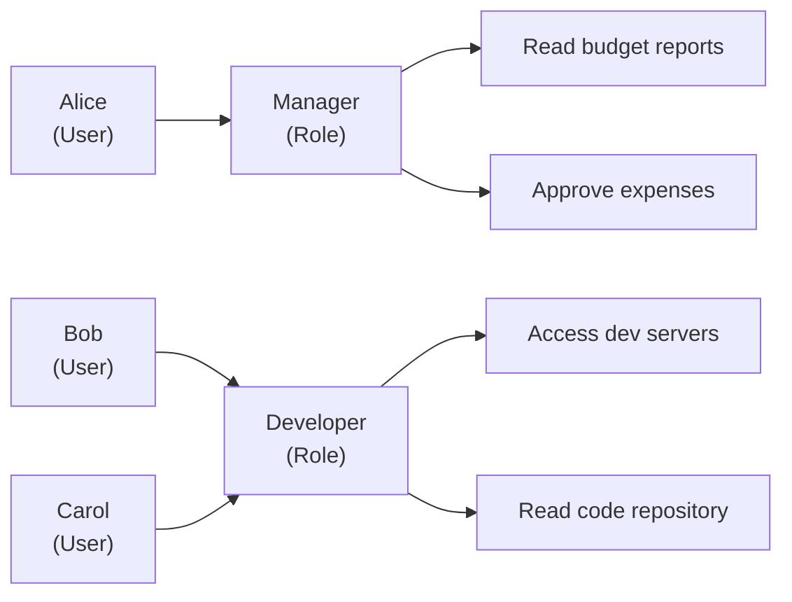

# 5.5. Моделі контролю доступу: DAC, MAC, RBAC, ABAC

Розділ 5.4 відповів, як організації «довіряють» ідентичностям з чужих систем — через SAML, OAuth і OIDC. Але сам факт того, що IdP підтвердив «це Аліса» — ще нічого не означає. Які саме файли вона може читати? Які API — викликати? Яких систем — торкатися взагалі? Відповідь залежить від архітектурного рішення, що часто ухвалюється одного разу і живе роками — моделі контролю доступу. Обрати її неправильно — і ви або будуєте «решето» (всім дозволено занадто багато), або «в'язницю» (нічого не працює без адміна). У реальних системах ці дві крайнощі зустрічаються однаково часто.

> 📖 Ключові терміни — у [глосарії модуля](00-glosariy.md).

## DAC: Discretionary Access Control

**DAC (Discretionary Access Control)** — власник ресурсу сам вирішує, кому надати доступ. Це «стандартна» модель більшості файлових систем (Linux chmod, Windows NTFS ACL) і більшості вебзастосунків.

**Ключова характеристика:** «discretionary» означає «на розсуд власника». Власник файлу може надати доступ будь-кому — система не обмежує цей вибір.

**Сильні сторони DAC:**
- Гнучкість: кожен власник вирішує сам.
- Простота реалізації.
- Зрозуміла для кінцевих користувачів.

**Слабкі сторони DAC:**
- **Проблема Trojan Horse**: якщо зловмисний процес запущений від імені Alice, він може читати і копіювати всі файли Alice — навіть без її відома. DAC не розрізняє «Alice» і «програму, що виконується від імені Alice».
- Відсутність centralized enforcement: власники можуть помилково надати занадто широкий доступ.
- Складно аудитувати: хто кому що надав?

## MAC: Mandatory Access Control

**MAC (Mandatory Access Control)** — система сама накладає обмеження доступу на основі **класифікацій** (labels) об'єктів і суб'єктів. Власник не може дати доступ в обхід системних правил.

**Класична реалізація — Bell-LaPadula Model (для конфіденційності):**

```
Рівні класифікації: Top Secret > Secret > Confidential > Unclassified

Правила:
- No Read Up: суб'єкт не може читати документ вищого рівня
  (Confidential-співробітник не читає Secret)
- No Write Down: суб'єкт не може записувати на нижчий рівень
  (Secret-процес не може вставляти дані в Unclassified-документ)
  → Запобігає витоку секретних даних через запис
```

**Практичні реалізації MAC:**
- **SELinux** (Red Hat/CentOS/Fedora) — детальна MAC-система з типовими мітками для кожного файлу, процесу і порту.
- **AppArmor** (Ubuntu/Debian) — профілі-обмеження для конкретних застосунків.
- **Windows Integrity Levels** — рівні цілісності (System/High/Medium/Low) обмежують, що можуть робити різні процеси.
- **MLS (Multi-Level Security)** — використовується в держсекторі та армії.

**Приклад SELinux:**
```bash
# SELinux контекст файлу: user:role:type:level
ls -Z /var/www/html/index.html
# → system_u:object_r:httpd_sys_content_t:s0

# Процес httpd може читати httpd_sys_content_t, але не shadow_t
# Навіть якщо процес запущений від root — SELinux блокує доступ до /etc/shadow
```

**Сильні сторони MAC:**
- Захист від Trojan Horse (процес обмежений незалежно від прав власника).
- Centralized policy enforcement.
- Ефективний для захисту від lateral movement.

**Слабкі сторони MAC:**
- Висока складність конфігурації.
- Помилки в policy можуть зламати легітимні застосунки.
- Складно пояснити кінцевим користувачам.

## RBAC: Role-Based Access Control

**RBAC (Role-Based Access Control)** — права призначаються **ролям** (посадам, функціям), а не окремим користувачам. Користувачі отримують права через членство в ролях.



**Ключові концепції RBAC:**
- **Role hierarchy** — ролі можуть успадковувати права від інших ролей (Manager успадковує права Employee).
- **Separation of Duties (SoD)** — конфліктуючі ролі не можуть бути призначені одночасно (той, хто створює платіж, не може його підтвердити).
- **Role activation** — користувач може мати роль, але активувати її лише за потребою.

**NIST RBAC Model** визначає чотири рівні:
- **Core RBAC** — базова модель: users → roles → permissions.
- **Hierarchical RBAC** — ієрархія ролей.
- **Constrained RBAC** — SoD-обмеження.
- **Symmetric RBAC** — можливість управляти і ролями, і дозволами через ролі.

**RBAC у базах даних (PostgreSQL):**
```sql
-- Створення ролей
CREATE ROLE readonly;
CREATE ROLE analyst;
CREATE ROLE admin;

-- Права для ролей
GRANT SELECT ON ALL TABLES IN SCHEMA public TO readonly;
GRANT readonly TO analyst;
GRANT analyst TO admin;
GRANT ALL ON ALL TABLES IN SCHEMA public TO admin;

-- Призначення ролей користувачам
GRANT analyst TO alice;
GRANT readonly TO bob;
```

**Слабкі сторони RBAC:**
- **Role explosion** — в організаціях зі складною структурою кількість ролей може сягати тисяч, стаючи некерованою.
- Не гнучкий для динамічних умов: «Alice може читати файл X лише у вівторок між 9 і 17» — потребує нових ролей або ABAC.
- Не враховує контекст: IP-адресу, рівень ризику транзакції, геолокацію.

## ABAC: Attribute-Based Access Control

**ABAC (Attribute-Based Access Control)** — рішення про доступ приймається на основі атрибутів суб'єкта, об'єкта, дії і середовища.

```
Правило ABAC:
IF subject.department == "Finance"
   AND object.classification == "Financial"
   AND action == "read"
   AND environment.time BETWEEN 09:00 AND 18:00
   AND environment.location == "office_network"
THEN PERMIT
```

**Компоненти ABAC:**
- **Subject attributes** — роль, підрозділ, рівень допуску, геолокація, тип пристрою.
- **Object attributes** — класифікація, власник, тип, чутливість.
- **Action** — read, write, delete, execute, approve.
- **Environment attributes** — час, IP-адреса, рівень ризику сесії, тип мережі.

**XACML (eXtensible Access Control Markup Language)** — XML-стандарт для опису ABAC-політик.

**ReBAC (Relationship-Based Access Control)** — розширення ABAC: права залежать від стосунків між суб'єктом і об'єктом. Наприклад: «Аліса може редагувати документ, бо вона є його співавтором» або «Боб може читати звіт, бо він є менеджером Аліси». Реалізована в Google Zanzibar (основа Google Drive, Docs, YouTube permissions) і OpenFGA.

**Порівняльна таблиця:**

| Аспект | DAC | MAC | RBAC | ABAC |
|---|---|---|---|---|
| Контроль | Власник ресурсу | Система | Адміністратор | Система (на основі правил) |
| Гнучкість | Висока | Низька | Середня | Дуже висока |
| Складність | Низька | Дуже висока | Середня | Висока |
| Масштаб | Малий | Держсектор | Корпорації | Великі системи |
| Контекстність | Ні | Так (рівні) | Часткова | Так (повна) |
| Захист від insider threats | Слабкий | Сильний | Середній | Сильний |
| Приклади | Linux chmod, NTFS | SELinux, AppArmor | Active Directory, AWS IAM | Google Zanzibar, XACML |

## Separation of Duties (SoD) і Four-Eyes Principle

**SoD** — фундаментальний принцип: жодна особа не повинна мати повноважень для самостійного виконання потенційно шкідливої дії від початку до кінця.

Класичні SoD-правила:
- Той, хто створює платіжне доручення ≠ той, хто його підтверджує.
- Той, хто замовляє товар ≠ той, хто приймає товар ≠ той, хто підтверджує оплату.
- Розробник не має права деплоїти код в production самостійно.

**Four-Eyes Principle (правило чотирьох очей)** — будь-яка критична операція потребує підтвердження від двох незалежних осіб.

## Міні-вправа

Подумайте про систему, з якою ви знайомі (корпоративна, навчальна або відкрита). Визначте:

1. Яку модель контролю доступу вона використовує?
2. Чи є RBAC? Якщо так — чи є роль з надмірно широкими правами («супер-адмін» для всього)?
3. Чи є SoD для критичних операцій?
4. Якщо ви самостійно адмініструєте будь-яку систему — перегляньте список ролей. Чи є «мертві» ролі без користувачів? Ролі з правами, що ніколи не використовуються?

## Джерела та додаткові матеріали

- NIST SP 800-162 — Guide to ABAC Definition and Considerations.
- NIST, *Role-Based Access Control* (csrc.nist.gov/projects/role-based-access-control).
- Zanzibar: Google's Consistent, Global Authorization System (2019) — оригінальна стаття.
- OWASP, *Access Control Cheat Sheet*.

> RBAC і ABAC описують, як розподіляти права між звичайними користувачами. Але є окрема категорія — **привілейовані** акаунти (адміністратори, root, DBA), де помилка в контролі доступу має найбільш руйнівні наслідки. Саме вони — тема наступного розділу.

---

**Попередній розділ:** [5.4. SSO, SAML, OAuth 2.0 і OIDC](04-sso-oauth-saml.md)
**Далі:** [5.6. Привілейований доступ: PAM і JIT](06-pam-pryvileiovanyy-dostup.md)
**Назад до модуля:** [README модуля 05](README.md)
