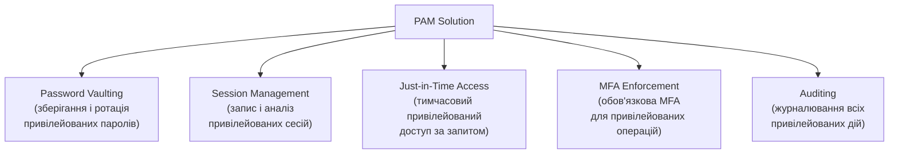

# 5.6. Привілейований доступ: PAM і Just-in-Time

Привілейовані акаунти — адміністратори, root, service accounts, DBA — це ключі від замку. Хто контролює їх, той контролює систему. Саме тому зловмисники після початкового доступу завжди прагнуть до привілейованих акаунтів: lateral movement, privilege escalation, credential dumping — все спрямоване на те, щоб отримати ключі. Організації, що не мають спеціалізованих процесів управління привілейованим доступом, зазвичай виявляють це лише після інциденту.

> 📖 Ключові терміни — у [глосарії модуля](00-glosariy.md).

## Чому привілейований доступ — окрема проблема

**Масштаб проблеми у типовій організації:**
- 3–5 облікових записів адміністратора домену (часто зі спільним або рідко змінюваним паролем).
- Десятки або сотні локальних адміністраторів з однаковим паролем на всіх машинах.
- Сотні сервісних акаунтів, чиї паролі ніколи не мінялись і часто захардкоджені.
- Спільні «технічні» акаунти (`admin`, `oracle`, `sa`) без персональної відповідальності.
- Колишні співробітники, чиї акаунти ще активні.

**Чому це критично:** у більшості значущих кіберінцидентів зловмисник використовував привілейований акаунт — не обов'язково зламаний, часто просто недостатньо захищений.

## PAM: Privileged Access Management

**PAM (Privileged Access Management)** — сукупність технологій, процесів і політик для управління, моніторингу і захисту привілейованого доступу.

**Ключові функції PAM-рішень:**



**Провідні рішення PAM:**
- **CyberArk** — лідер ринку корпоративного PAM.
- **Delinea (Thycotic/Centrify)** — альтернатива CyberArk.
- **BeyondTrust** — акцент на endpoint privilege management.
- **HashiCorp Vault** — open-source, популярний для DevOps/cloud.
- **Microsoft PIM** (Privileged Identity Management) — для Azure AD / Entra ID.

## Just-in-Time (JIT) Access

**JIT Access** — привілейований доступ видається лише тоді, коли він потрібен, на обмежений час і для конкретного завдання. Між завданнями привілейовані права не існують.

**Традиційна модель (Standing Privileges):**
```
Адміністратор → завжди має права адміна → завжди привабливий таргет
```

**JIT модель:**
```
Адміністратор → запитує доступ → approval workflow → тимчасові права (30 хвилин) → автоматичне відкликання
```

**Переваги JIT:**
- Вікно можливостей для зловмисника скорочується з постійного до часу активної сесії.
- Кожне підвищення прав залишає слід в журналі.
- Неможливо забути відкликати доступ — він відкликається автоматично.

**Реалізація JIT у Microsoft Azure (PIM):**
```powershell
# Активація ролі через PIM (Azure CLI)
az role assignment create \
  --role "Contributor" \
  --assignee user@example.com \
  --scope /subscriptions/<sub-id> \
  --duration P1H  # 1 година

# Перевірити активні привілейовані призначення
az role assignment list --assignee user@example.com --scope /subscriptions/<sub-id>
```

## LAPS: локальні паролі адміністраторів

**LAPS (Local Administrator Password Solution)** — безкоштовний інструмент Microsoft для автоматичної генерації і ротації унікальних паролів локального адміністратора на кожній машині в домені.

**Проблема без LAPS:**
```
Всі 500 ПК мають однаковий пароль локального адміна: "AdminPass123"
→ Один скомпрометований ПК → lateral movement на всі 500
```

**З LAPS:**
```
ПК1: LocalAdmin пароль = "X7kQ@mP2nL9v"  (генерується автоматично)
ПК2: LocalAdmin пароль = "R3tY#wS8jA1m"  (унікальний, інший)
ПК3: LocalAdmin пароль = "K5bN!eD6qM4p"  (ротується щомісяця)
→ Один скомпрометований ПК ≠ доступ до інших
```

**Налаштування LAPS:**
```powershell
# Встановлення LAPS (PowerShell)
Install-Module -Name LAPS

# Увімкнути LAPS для OU
Set-LapsADComputerSelfPermission -Identity "OU=Workstations,DC=corp,DC=local"

# Переглянути пароль для конкретного комп'ютера (адмін)
Get-LapsADPassword -Identity "PC01" -AsPlainText
```

**Windows LAPS** (вбудований у Windows 11/Server 2022, квітень 2023) — вдосконалена версія, що підтримує Azure AD і зберігання в Azure Key Vault.

## Сервісні акаунти і секрети: найбільша сліпа пляма

**Сервісні акаунти** — технічні облікові записи, під якими виконуються застосунки, сервіси, CI/CD pipeline. Типові проблеми:

```
❌ Найгірші практики (поширені):
- Сервіс виконується від Domain Admin — «так простіше»
- Пароль сервісного акаунту = "Service@2020!" → ніколи не змінювався
- Один акаунт для 30 різних сервісів → неможливо відстежити що що робить
- Пароль захардкоджений у коді або конфіг-файлі (модуль 04 розділ 4.8)
- Сервісний акаунт для звільненого адміна, що мав доступ до продакшену

✅ Правильні практики:
- Один сервісний акаунт = один застосунок/сервіс
- Мінімально необхідні права (не Domain Admin!)
- Автоматична ротація паролів через PAM/Vault
- Managed Service Accounts (Windows) або Workload Identity (Cloud)
- Секрети через environment variables, Vault, KMS — не в коді
```

**Managed Service Accounts (MSA) і Group MSA (gMSA)** — Windows-рішення, де Active Directory автоматично управляє паролями для сервісних акаунтів:

```powershell
# Створення Group Managed Service Account
New-ADServiceAccount -Name "WebAppSvc" `
    -DNSHostName "webapp.corp.local" `
    -PrincipalsAllowedToRetrieveManagedPassword "WebServers_group"

# Встановлення gMSA на сервері
Install-ADServiceAccount -Identity "WebAppSvc"

# Налаштування служби для використання gMSA
sc.exe config "MyWebApp" obj= "corp\WebAppSvc$" password= ""
# Пароль не потрібен — AD управляє ним автоматично
```

**Cloud Workload Identity** — хмарні аналоги MSA:
- **AWS IAM Roles for EC2/ECS** — EC2-інстанція отримує тимчасові credentials автоматично.
- **GCP Service Accounts with Workload Identity Federation** — аналог для GCP.
- **Azure Managed Identity** — аналог для Azure.

Ключова перевага: жодного статичного пароля або ключа, що може бути викрадений.

## Аудит привілейованого доступу

PAM без аудиту — охоронець без журналу відвідувань. Необхідно фіксувати:

| Подія | Що логувати |
|---|---|
| Запит JIT-доступу | Хто, коли, для чого, скільки часу |
| Активація привілею | Затверджено ким, підстава |
| Використання привілею | Кожна команда/дія в привілейованій сесії |
| Відкликання привілею | Автоматичне чи ручне |
| Ротація пароля | Для якого акаунту, ким ініційована |
| Спроба несанкціонованого доступу | Хто намагався отримати доступ без запиту |

**Session recording** — відеозапис привілейованих сесій (CyberArk, Delinea, BeyondTrust підтримують це). Аналог CCTV для адміністративної роботи: навіть якщо зловмисний адміністратор знищить логи — відеозапис сесії залишиться.

> **Зв'язок з атаками:** саме привілейовані акаунти є основними цілями Pass-the-Hash, Kerberoasting і Golden Ticket атак. LAPS захищає від lateral movement через локальних адміністраторів; gMSA — від Kerberoasting сервісних акаунтів; JIT обмежує вікно доступу для потенційного Golden Ticket. Детально механізми атак і контрзаходи — у розділі 5.9.

## Міні-вправа

Проведіть аудит привілейованих акаунтів у середовищі, до якого маєте доступ:

**Windows (PowerShell):**
```powershell
# Знайти всіх членів групи Administrators
Get-LocalGroupMember -Group "Administrators"

# У домені: знайти всіх Domain Admins
Get-ADGroupMember -Identity "Domain Admins" -Recursive |
    Select-Object Name, SamAccountName, Enabled,
    @{N='LastLogon';E={(Get-ADUser $_.SamAccountName -Properties LastLogonDate).LastLogonDate}}
```

**Linux:**
```bash
# Всі користувачі з UID 0 (root-рівень)
awk -F: '($3 == 0) {print $1}' /etc/passwd

# Всі sudo-права
sudo cat /etc/sudoers | grep -v "^#" | grep -v "^$"

# Сервісні акаунти з shell (не повинні мати shell якщо не потрібно)
awk -F: '($3 >= 1000 && $NF != "/usr/sbin/nologin" && $NF != "/bin/false") {print $1, $NF}' /etc/passwd
```

## Джерела та додаткові матеріали

- CyberArk, *Privileged Access Security Reference Architecture* (docs.cyberark.com).
- Microsoft, *What is Privileged Identity Management?* (docs.microsoft.com).
- HashiCorp Vault documentation (developer.hashicorp.com/vault).
- NIST SP 800-53, AC-6 — Least Privilege; AC-17 — Remote Access.
- Center for Internet Security, *CIS Control 5: Account Management*.

> Саме привілейовані акаунти, описані в цьому розділі, є первинною ціллю для технік Pass-the-Hash, Kerberoasting і Golden Ticket — детально розглянутих у розділі 5.9. Розуміння PAM і розуміння атак на нього — дві сторони одного захисного рішення.

> Далі: управління ідентичностями у хмарних і федеративних середовищах — де кількість систем і облікових записів зростає в рази, а ручний контроль стає неможливим.

---

**Попередній розділ:** [5.5. Моделі контролю доступу](05-modeli-dostupu.md)
**Далі:** [5.7. Федеративна ідентифікація і хмарний IAM](07-federatyvna-identyfikatsiia.md)
**Назад до модуля:** [README модуля 05](README.md)
