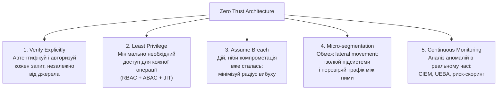
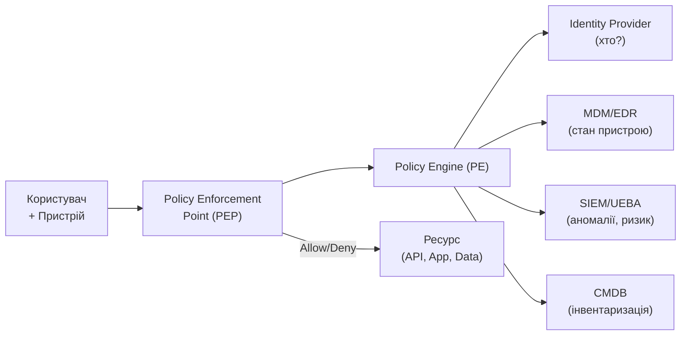

# 5.8. Zero Trust у корпоративному середовищі

«Ніколи не довіряти, завжди перевіряти» — фраза, що з'явилась у 2010 році в дослідженні Forrester і стала мантрою сучасної корпоративної безпеки. Але Zero Trust — не продукт, що можна купити. Це архітектурна парадигма, що потребує переосмислення того, що означає «безпечна мережа» в добу хмари, мобільних пристроїв і роботи з будь-якої точки світу. Модуль 02 (розділ 2.8) ввів Zero Trust концептуально; тут — операційне розуміння: що конкретно треба будувати і вимірювати.

> 📖 Ключові терміни — у [глосарії модуля](00-glosariy.md).

## Чому традиційна модель периметру зламалась

**Традиційна модель («Замок і Рів»):**
```
Все всередині периметру → Довірено
Все ззовні              → Недовірено
```

Ця модель ґрунтувалась на трьох припущеннях, що більше не є вірними:
1. Є чіткий фізичний периметр.
2. Хто «всередині» — той надійний.
3. Зловмисники переважно зовні.

**Реальність 2024 року:**
- 40%+ трафіку йде в хмарні SaaS, що поза корпоративною мережею.
- Співробітники працюють з home Wi-Fi, готелів, кафе.
- VPN «розтягує» периметр до кожного домашнього роутера.
- Insider threats (розділ 3.11 модуля 03) і lateral movement після початкової компрометації — стандарт атак.

## BeyondCorp: Google як прецедент

Концепція Zero Trust прийшла з реального досвіду. У 2009 році Google зазнала атаки **Operation Aurora** (Китай), де зловмисники отримали доступ через корпоративну мережу. Google відреагувала радикально: скасувала внутрішню «довірену» мережу і побудувала систему **BeyondCorp** (2011–2017), де кожен запит до корпоративних ресурсів перевіряється незалежно від мережевого розташування.

**Результат:** інженер Google може відкрити ноутбук у кафе і мати такий самий (захищений) доступ до внутрішніх систем, як і в офісі, — без VPN. Рішення про доступ приймається на основі ідентичності пристрою, користувача і контексту, а не IP-адреси.

## П'ять принципів Zero Trust (NIST SP 800-207)



## Компоненти ZT-архітектури

**Policy Engine (PE)** — «мозок» ZT. Приймає рішення про надання доступу, оцінюючи:
- Ідентичність (хто?) — від IdP.
- Стан пристрою (чи compliant?) — від MDM/EDR.
- Контекст (звідки? коли? що?) — геолокація, тип мережі, час.
- Ризик сесії (аномалії?) — від UEBA/SIEM.

**MDM (Mobile Device Management)** — система централізованого управління пристроями організації. У контексті Zero Trust MDM є джерелом «device compliance» — підтвердження того, що пристрій відповідає корпоративним вимогам безпеки перед отриманням доступу до ресурсів.

Що MDM перевіряє для визначення compliance:
- Пристрій зареєстрований в організації (enrolled).
- Встановлені останні оновлення ОС і патчі безпеки.
- Увімкнено шифрування диска (BitLocker/FileVault).
- Встановлено і активований EDR-агент.
- Не виявлено jailbreak/root.
- Виконуються парольні вимоги.

**Провідні MDM-рішення:**
- **Microsoft Intune** — інтеграція з Entra ID і Conditional Access; для Windows, macOS, iOS, Android.
- **Jamf Pro** — спеціалізується на Apple-пристроях (Mac, iPhone, iPad); стандарт для Apple-орієнтованих організацій.
- **VMware Workspace ONE** — кросплатформний, сильний у BYOD-сценаріях.

```
Приклад ZT-рішення з MDM:
1. Alice входить з домашнього MacBook
2. Entra ID: автентифікація успішна (FIDO2)
3. Intune: MacBook enrolled? ✅ | FileVault увімкнено? ✅ | Defender активний? ✅ → Compliant
4. Conditional Access: user=Alice, device=compliant, risk=low → Allow
5. Alice отримує доступ до SharePoint
```

**Policy Enforcement Point (PEP)** — «охоронець», що виконує рішення PE. Може бути реалізований як:
- Proxy (Zscaler, Cloudflare Access, Netskope).
- API Gateway з перевіркою JWT.
- Мережеві NAC-пристрої.
- Endpoint agent.



## Мікросегментація: обмеження lateral movement

**Мікросегментація** — поділ мережі на мінімальні ізольовані сегменти з явним дозволом трафіку між ними. На відміну від традиційних VLAN (великі сегменти), мікросегментація може ізолювати до рівня окремого workload або контейнера.

**Традиційна сегментація:**
```
Internet → Firewall → Corp Network (all trusted)
```

**Мікросегментація:**
```
[Web Tier] ←→ [App Tier] ←→ [DB Tier]
     ↕ (заборонено)             ↕ (заборонено)
[HR App]                    [Finance App]
```

Якщо зловмисник компрометує Web Tier — мікросегментація заважає йому напряму звернутись до DB Tier або до HR App.

**Інструменти мікросегментації:**
- **VMware NSX** — для VMware-середовищ.
- **Illumio** — vendor-agnostic мікросегментація.
- **Kubernetes Network Policies** — для контейнерних середовищ.
- **AWS Security Groups** — де кожен інстанс має власний firewall.

## MDM і Device Compliance: пристрій як фактор довіри

Якщо Zero Trust перевіряє «хто ти» через IdP, то «чим ти це робиш» перевіряє **MDM (Mobile Device Management)**. Пристрій без MDM-enrollment — невідома змінна: чи встановлені оновлення? Чи є антивірус? Чи не jailbroken? Zero Trust-архітектура вимагає відповіді на ці питання перед тим, як надати доступ.

**MDM-рішення:**
- **Microsoft Intune** — хмарний MDM для Windows, macOS, iOS, Android; інтегрований з Entra ID Conditional Access.
- **Jamf Pro** — стандарт для Apple-пристроїв (Mac, iPhone, iPad) у корпоративному середовищі.
- **VMware Workspace ONE** — крос-платформне рішення для великих організацій.

**Що MDM перевіряє (Device Compliance Policy):**
- ОС і пристрій оновлені до мінімальної версії.
- Шифрування диска увімкнено (BitLocker/FileVault).
- Антивірус активний і оновлений.
- Пристрій не jailbroken/rooted.
- PIN/пароль на блокуванні екрана налаштований.
- Пристрій зареєстрований в організації (managed device).

**Compliant device у Conditional Access:** якщо пристрій не відповідає policy → Entra ID відмовляє в доступі до корпоративних ресурсів, навіть якщо пароль і MFA правильні. Це і є device-based Zero Trust у дії.

## SASE: Secure Access Service Edge

**SASE (Secure Access Service Edge, вимовляється "sassy")** — архітектурна концепція Gartner (2019), що об'єднує мережеві функції (SD-WAN) і функції безпеки (CASB, SWG, FWaaS, ZTNA) у єдину хмарну платформу.

| Компонент | Функція |
|---|---|
| **SD-WAN** | Оптимізована маршрутизація між офісами і хмарою |
| **SWG (Secure Web Gateway)** | Фільтрація вебтрафіку, малварі |
| **CASB (Cloud Access Security Broker)** | Видимість і контроль SaaS-застосунків |
| **FWaaS (Firewall as a Service)** | Хмарний фаєрвол |
| **ZTNA (Zero Trust Network Access)** | Заміна VPN з принципом найменших привілеїв |

**ZTNA vs VPN:**

| Аспект | VPN | ZTNA |
|---|---|---|
| Доступ | До всієї мережі | До конкретного застосунку/ресурсу |
| Перевірка | Одноразова при підключенні | Постійна для кожного запиту |
| Бокове переміщення | Можливе | Заблоковано |
| Видимість | Обмежена | Повна (хто, що, коли) |
| Складність для користувача | VPN-клієнт | Прозоро або легкий агент |

**Провідні SASE-платформи:** Zscaler, Cloudflare One, Netskope, Palo Alto Prisma SASE.

## Continuous Verification і UEBA

**UEBA (User and Entity Behavior Analytics)** — система, що будує профіль нормальної поведінки кожного користувача і пристрою, виявляючи аномалії:

- Вхід з незвичного географічного місця.
- Незвично великий обсяг завантажених даних.
- Доступ до ресурсів у неробочий час.
- Різкий стрибок активності після тривалої пасивності («sleeping agent»).

**Ризик-скоринг** дозволяє автоматично посилювати вимоги до автентифікації при підвищенні ризику: нормальний вхід → пароль; незвичне місце → MFA; дуже незвичне місце + нестандартна поведінка → блокування + alert SOC.

## Практичний шлях до Zero Trust

Zero Trust — це не «встановлений» стан, а безперервний процес. CISA (Cybersecurity and Infrastructure Security Agency) визначає п'ять стовпів і рівні зрілості для кожного:

| Стовп | Традиційний | Початковий ZT | Зрілий ZT |
|---|---|---|---|
| **Identity** | Пароль | MFA | Ризик-адаптивна MFA + UEBA |
| **Device** | Довіра до домен-членів | MDM enrollment | Compliant device required |
| **Network** | VPN | Мікросегментація | ZTNA, мікросегментація |
| **Application** | IP-based access | RBAC | ABAC + JIT + App-level logging |
| **Data** | Мінімальне шифрування | Шифрування at rest | DLP + класифікація + CASB |

## Міні-вправа

Для вашої поточної організації або домашньої мережі оцініть рівень ZT за кожним стовпом CISA за шкалою 1–5. Потім визначте: який стовп отримав найнижчу оцінку і що можна зробити протягом наступного місяця для покращення?

Додатково: зайдіть на `cloudflare.com/zero-trust` — Cloudflare Zero Trust має безкоштовний tier до 50 users. Спробуйте налаштувати Access Application для захисту будь-якого порту або URL за OIDC-автентифікацією.

## Джерела та додаткові матеріали

- NIST SP 800-207 — Zero Trust Architecture.
- CISA, *Zero Trust Maturity Model v2* (cisa.gov).
- Google BeyondCorp (cloud.google.com/beyondcorp).
- Gartner, *The Future of Network Security Is in the Cloud* (2019) — оригінальна SASE-стаття.
- Cloudflare, *Zero Trust Reference Architecture* (developers.cloudflare.com).

---

**Попередній розділ:** [5.7. Федеративна ідентифікація і хмарний IAM](07-federatyvna-identyfikatsiia.md)
**Далі:** [5.9. Атаки на автентифікацію](09-ataky-na-avtentyfikatsiiu.md)
**Назад до модуля:** [README модуля 05](README.md)
