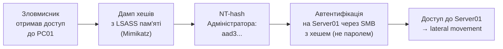

# 5.9. Атаки на автентифікацію

Зловмисник, що отримав доступ до привілейованого акаунту, стає «авторизованим» з точки зору всіх систем безпеки. Антивірус не спрацьовує — немає шкідливого коду. Фаєрвол не блокує — трафік легітимний. SIEM не видає алерт — поведінка схожа на нормальну. Саме тому атаки на автентифікацію і компрометація облікових записів є найпривабливішим вектором для зловмисника: після отримання облікових даних решта атаки відбувається «легітимно». Цей розділ розглядає конкретні техніки — не для їх застосування, а для розуміння, яку саме захисну міру вони обходять і що треба додати.

> 📖 Ключові терміни — у [глосарії модуля](00-glosariy.md).

## Credential Stuffing і Password Spraying

**Credential Stuffing** — автоматизоване тестування пар логін/пароль, що витікли з інших сервісів, проти цільового сервісу. Ефективний виключно завдяки повторному використанню паролів.

```
Атака:
1. Купити/завантажити dump з 100 млн пар email:password з попередніх витоків
2. Автоматично тестувати проти target.com/login
3. Успіх: 0.1–2% (залежно від сервісу)
   → 100,000–2,000,000 зламаних акаунтів
```

**Захист:** унікальні паролі для кожного сервісу (парольний менеджер), MFA, rate limiting, CAPTCHA, IP-репутація.

**Password Spraying** — інверсія brute force: не перебір паролів для одного акаунту, а одного-двох паролів проти тисяч акаунтів. Уникає блокування облікового запису після N невдалих спроб.

```
Атака:
1. Отримати список валідних email/username організації (LinkedIn, HaveIBeenPwned)
2. Спробувати "Winter2024!" проти всіх 10,000 акаунтів
3. 1–5% успішних входів — кілька сотень акаунтів
```

**Захист:** заборона популярних паролів (парольний blacklist), MFA, anomaly detection (сотні різних users, один пароль, короткий часовий проміжок).

## Pass-the-Hash (PtH)

**Pass-the-Hash** — атака в Windows-середовищах, що дозволяє автентифікуватись з NT-хешем пароля **без знання самого пароля**. Це можливо тому, що протокол NTLM використовує хеш безпосередньо.



**Інструмент:** Mimikatz (`sekurlsa::logonpasswords`) — дамп облікових даних з пам'яті LSASS-процесу.

**Захист:**
- **Credential Guard** (Windows 10+) — ізолює LSASS у VBS (Virtualization-Based Security), де Mimikatz не може дістати хеші.
- **Protected Users Security Group** — члени групи не кешують credentials локально.
- **LAPS** — унікальні локальні паролі унеможливлюють lateral movement через однаковий хеш.
- Вимкнути **WDigest** (зберігало паролі у відкритому вигляді — детально в розділі 3.6).
- Перехід з NTLM на **Kerberos** де можливо.

## Pass-the-Ticket (PtT)

Аналог PtH для Kerberos: зловмисник краде Kerberos Ticket (TGT або Service Ticket) і використовує його для автентифікації без знання пароля.

```
Mimikatz: sekurlsa::tickets /export
→ .kirbi файл з TGT Адміністратора
→ kerberos::ptt administrator.kirbi
→ доступ до ресурсів від імені Адміністратора
```

**Захист:** обмеження терміну дії Kerberos tickets, AES шифрування замість RC4, Credential Guard.

## Kerberoasting

**Kerberoasting** — атака на Kerberos Service Principal Names (SPN), що дозволяє виявити облікові записи сервісів і отримати зашифровані service tickets для офлайн-підбору пароля.

**Механізм:**
1. Будь-який доменний користувач може запросити Service Ticket для будь-якого SPN.
2. Service Ticket зашифрований NTLM-хешем пароля сервісного акаунту.
3. Зловмисник запитує tickets для всіх SPN, зберігає їх і запускає офлайн-підбір паролів.
4. Якщо сервісний акаунт має слабкий пароль — він підбирається за хвилини.

```powershell
# Запит Service Tickets для всіх SPN (легітимна операція!)
# Зловмисник запускає: Invoke-Kerberoast -OutputFormat Hashcat
# Потім: hashcat -m 13100 hash.txt wordlist.txt
```

**Захист:**
- Довгі, складні, випадкові паролі для сервісних акаунтів (краще — gMSA).
- **AES шифрування** для сервісних акаунтів (замість RC4 — RC4-хеші підбираються швидше).
- **Моніторинг**: велика кількість TGS-запитів від одного користувача за короткий час (Event ID 4769).
- Обмежити SPN до мінімально необхідних.

## Golden Ticket і Silver Ticket

**Golden Ticket** — найбільш руйнівна атака на Active Directory. Зловмисник, що скомпрометував KRBTGT-акаунт (спеціальний акаунт, яким Kerberos підписує всі TGT), може генерувати підроблені TGT для **будь-якого** користувача домену зі **будь-якими** правами, що тривають довго.

```
Умова: зловмисник має NT-hash KRBTGT акаунту
→ Може генерувати TGT для "Administrator" 
   з терміном дії 10 років
→ Має доступ до будь-якого ресурсу домену
→ Навіть якщо пароль Administrator змінено —
   Golden Ticket залишається дійсним
   до зміни пароля KRBTGT двічі
```

**Чому «Золотий»:** це «золотий ключ» до всього домену — за наявності KRBTGT-хешу і після виявлення і «очистки» середовища організація все ще залишається скомпрометованою.

**Захист:**
- Виявлення: EventID 4769 з аномальним терміном дії, 4768 з аномальними прапорами.
- Після підозри на Golden Ticket — **двічі** змінити пароль KRBTGT (оскільки Kerberos зберігає попередній пароль для плавного переходу).
- Обмежити доступ до Domain Controller; аудит всіх операцій на DC.

**Silver Ticket** — схожа атака, але компрометується хеш конкретного сервісного акаунту (не KRBTGT). Дає доступ лише до того сервісу, якому відповідає цей акаунт.

## MFA Bypass техніки

Зловмисники активно адаптуються до MFA. Основні техніки обходу:

| Техніка | Механізм | Захист |
|---|---|---|
| **Real-time phishing (AITM)** | Proxy між жертвою і сайтом; перехоплює код TOTP миттєво | FIDO2/Passkeys (прив'язані до домену) |
| **MFA Fatigue** | Нескінченні push-сповіщення | Number matching, rate limit |
| **SIM Swap** | Переконати оператора перенести номер | Не використовувати SMS MFA |
| **SS7 Attack** | Перехоплення SMS через вразливості телефонних мереж | Не використовувати SMS MFA |
| **Recovery code theft** | Викрадення backup-кодів | Зберігати безпечно; одноразові |
| **Session hijacking** | Крадіжка сесійного cookie після MFA | Secure, HttpOnly, SameSite cookie; device binding |
| **Adversary-in-the-middle (AiTM)** | Evilginx2, Modlishka — reverse proxy фішинг | FIDO2/Passkeys |

**Evilginx2** — реальний інструмент AITM-фішингу, що автоматично: реєструє фішинговий домен → розгортає reverse proxy → перехоплює сесійні токени після успішного MFA → дозволяє зловмиснику увійти без знання пароля і без MFA-коду. Захист — лише FIDO2/Passkeys.

## OAuth Token Hijacking і Consent Phishing

**Consent Phishing** — замість фішингу пароля, зловмисник фішингує **OAuth consent**:

1. Зловмисник реєструє OAuth застосунок з назвою «Microsoft Teams Update» і запитує широкі права (mail.read, files.readwrite).
2. Надсилає жертві легітимне OAuth consent посилання Microsoft.
3. Жертва «авторизує» застосунок (не вводячи пароль — лише натискаючи «Дозволити»).
4. Зловмисник отримує тривалий access token без необхідності в паролі або MFA.

**Захист:**
- Увімкнути Azure AD App Consent Policies — дозволяти consent лише для перевірених застосунків.
- Регулярно переглядати авторизовані OAuth-застосунки.
- Навчати користувачів: ніколи не авторизувати OAuth-запити без перевірки Publisher.

## Реальний контекст: атаки на Україну

CERT-UA документує численні кампанії з компрометації облікових записів українських організацій:

- **Sandworm / APT44** використовує credential phishing проти держустанов; спеціалізовані фішинг-сторінки Microsoft 365 і Google Workspace.
- **UAC-0006** — фінансово мотивовані атаки через credential stuffing і spear-phishing банківського сектору.
- **UAC-0010** (Armageddon/Gamaredon) — масовий фішинг для збору Microsoft 365 credentials.

Загальна тенденція: зловмисники уникають написання нового шкідливого ПЗ там, де можна просто вкрасти облікові дані.

## Міні-вправа

**Перевірка середовища (Windows/Active Directory — якщо є доступ):**

```powershell
# Перевірити, чи увімкнений Credential Guard
Get-CimInstance -ClassName Win32_DeviceGuard -Namespace root\Microsoft\Windows\DeviceGuard |
    Select-Object VirtualizationBasedSecurityStatus, CredentialGuardRunning

# Знайти акаунти з SPN (потенційні цілі Kerberoasting)
Get-ADUser -Filter {ServicePrincipalName -ne "$null"} -Properties ServicePrincipalName |
    Select-Object Name, ServicePrincipalName

# Перевірити членів Protected Users
Get-ADGroupMember -Identity "Protected Users"
```

**Практично:** зайдіть на `haveibeenpwned.com` і перевірте ваш корпоративний email. Якщо він фігурує у витоках — необхідна обов'язкова зміна пароля (навіть якщо витік «старий»).

## Джерела та додаткові матеріали

- MITRE ATT&CK, Tactic «Credential Access» — T1110 (Brute Force), T1558 (Steal/Forge Kerberos Tickets), T1550 (Use Alternate Authentication).
- Mimikatz documentation (github.com/gentilkiwi/mimikatz/wiki) — для захисного розуміння.
- Specterops, *Kerberoasting Revisited* — поглиблений аналіз.
- CERT-UA (cert.gov.ua) — актуальні звіти про кампанії проти України.
- Microsoft, *Protecting on-premises AD from Golden Ticket attacks*.

---

**Попередній розділ:** [5.8. Zero Trust у корпоративному середовищі](08-zero-trust.md)
**Далі:** [5.10. Практична лабораторна на Python](10-praktychna-laboratorna.md)
**Назад до модуля:** [README модуля 05](README.md)
