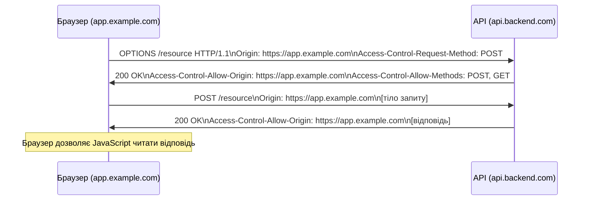

# 6.1. Веб-архітектура і моделі безпеки

Браузер — найскладніша програма, що запускає ненадійний код із мільярдів різних серверів на вашій машині. Кожен вебсайт, який ви відкриваєте, виконує JavaScript у вашому браузері, читає DOM, відправляє мережеві запити — і при цьому не повинен мати доступу до даних інших вкладок, до файлової системи, до облікових даних інших сайтів. Механізми безпеки браузера — це складна система стримань і противаг, що виросла з 30 років «латання дірок». Розуміти їх — значить розуміти, чому XSS, CSRF і CORS-атаки взагалі можливі.

> 📖 Ключові терміни — у [глосарії модуля](00-glosariy.md).

## HTTP: протокол без пам'яті

**HTTP (HyperText Transfer Protocol)** — stateless протокол: кожен запит незалежний, сервер не «пам'ятає» попередніх. Це базова архітектурна властивість, що породжує цілий клас проблем безпеки.

**HTTP-методи і їх семантика з погляду безпеки:**

| Метод | Семантика | Ідемпотентний | Безпечний | Примітки |
|---|---|---|---|---|
| GET | Читання ресурсу | Так | Так | Параметри в URL — потрапляють у логи, Referer, history |
| POST | Створення/дія | Ні | Ні | Тіло запиту — не в URL, але не «приховано» |
| PUT | Повна заміна | Так | Ні | |
| PATCH | Часткова зміна | Ні | Ні | |
| DELETE | Видалення | Так | Ні | |
| OPTIONS | Preflight для CORS | Так | Так | |
| HEAD | Заголовки без тіла | Так | Так | |

**Чому GET не має використовуватись для мутуючих дій:** Google Web Accelerator 2005 «перепвантажував» сторінки з GET-посиланнями у фоні для кешування. В результаті видалилися тисячі записів на сайтах, що реалізували видалення через GET. Це і є порушення семантики HTTP.

**HTTP-коди відповідей, важливі для безпеки:**

| Код | Значення | Безпекові імплікації |
|---|---|---|
| 200 OK | Успішно | — |
| 301/302 | Redirect | Open Redirect якщо `Location` контролюється атакуючим |
| 400 | Bad Request | Не розкривати деталі помилки у відповіді |
| 401 | Unauthorized | Автентифікація потрібна |
| 403 | Forbidden | Авторизований, але немає прав |
| 404 | Not Found | Різниця між 401 і 404 може розкривати існування ресурсу (user enumeration) |
| 500 | Server Error | **Ніколи** не повертати stack trace або деталі БД клієнту |

## Cookies: механізм стану для stateless протоколу

**Cookie** — невеликий текстовий рядок, що браузер зберігає і надсилає з кожним запитом до домену. Основний механізм підтримки сесій.

**Атрибути cookie:**

```
Set-Cookie: session=abc123; 
            Secure;          ← надсилати тільки по HTTPS
            HttpOnly;        ← недоступний через JavaScript (захист від XSS)
            SameSite=Strict; ← надсилати тільки при same-site запитах (захист від CSRF)
            Domain=.example.com;
            Path=/;
            Expires=...;     ← або Max-Age
            Partitioned;     ← CHIPS (Cookies Having Independent Partitioned State)
```

**HttpOnly** — найважливіший атрибут для сесійних cookies: JavaScript не може прочитати `document.cookie`. Навіть якщо XSS-вразливість присутня — атакуючий не зможе вкрасти сесійний cookie.

**SameSite** — захист від CSRF:
- `Strict` — cookie надсилається лише при переходах з того самого сайту. Найбезпечніший, але ламає сценарії типу «перейти на сайт за посиланням і залишитись залогіненим».
- `Lax` — дозволяє GET top-level navigation. Дефолт у сучасних браузерах.
- `None` — дозволяє cross-site (вимагає `Secure`). Потрібен для embedded widgets і OAuth.

## Same-Origin Policy (SOP)

**Same-Origin Policy** — фундаментальний механізм безпеки браузера: скрипт, завантажений з одного origin, **не може** читати вміст або стан іншого origin.

**Origin = Схема + Хост + Порт:**
```
https://example.com:443  ← origin
https://example.com:443/path/page.html  ← той самий origin
https://api.example.com  ← РІЗНИЙ origin (інший хост)
http://example.com       ← РІЗНИЙ origin (інша схема)
https://example.com:8080 ← РІЗНИЙ origin (інший порт)
```

**Що SOP захищає:**
- JavaScript зі `evil.com` не може читати вміст `bank.com`, навіть якщо користувач залогінений в обох.
- Сторінка не може читати cookies або localStorage іншого origin.
- `XMLHttpRequest` і `fetch` не можуть читати відповіді cross-origin запитів без явного дозволу сервера (CORS).

**Що SOP НЕ захищає:**
- Форма може `POST`-ити на інший origin (звідси CSRF).
- ``, `<script src>`, `<link>` — завантажуються з будь-якого origin.
- CSS може завантажуватись з будь-якого origin.

## CORS: контрольоване послаблення SOP

**CORS (Cross-Origin Resource Sharing)** — механізм, що дозволяє серверу явно вказати, яким origins він дозволяє читати відповіді на cross-origin запити.

**Preflight request (для «не-простих» запитів):**


**Небезпечна конфігурація CORS — топ-3 помилки:**

```python
# ❌ Найгірше: дозволяє все
response.headers['Access-Control-Allow-Origin'] = '*'
response.headers['Access-Control-Allow-Credentials'] = 'true'
# УВАГА: * і credentials=true — несумісна комбінація; браузер відхилить,
# але деякі фреймворки обходять це — і дозволяють читати відповіді будь-кому

# ❌ Небезпечно: відбиваємо будь-який Origin без перевірки
origin = request.headers.get('Origin')
response.headers['Access-Control-Allow-Origin'] = origin  # довіряємо будь-якому!

# ✅ Правильно: whitelist перевірених origins
ALLOWED_ORIGINS = {'https://app.example.com', 'https://staging.example.com'}
origin = request.headers.get('Origin')
if origin in ALLOWED_ORIGINS:
    response.headers['Access-Control-Allow-Origin'] = origin
```

## Content Security Policy (CSP): превентивний захист від XSS

**CSP (Content Security Policy)** — HTTP-заголовок, що повідомляє браузеру, з яких джерел він може завантажувати ресурси. Навіть якщо XSS-вразливість присутня — суворий CSP не дозволить виконати ін'єктований скрипт.

```
Content-Security-Policy:
  default-src 'self';                  ← тільки з того самого origin
  script-src 'self' cdn.example.com;   ← скрипти: лише self і CDN
  style-src 'self' 'unsafe-inline';    ← стилі: self + inline (не ідеально)
  img-src 'self' data: https:;         ← зображення: self + data: + будь-який HTTPS
  connect-src 'self' api.example.com;  ← fetch/XHR: self + API
  frame-ancestors 'none';              ← заборона вбудовування (clickjacking)
  base-uri 'self';                     ← захист від base tag injection
  form-action 'self';                  ← форми тільки на self
  upgrade-insecure-requests;           ← HTTP → HTTPS автоматично
```

Детально CSP і всі Security Headers — розділ 6.10.

## Sessionless vs Session-based автентифікація у вебі

| Підхід | Як працює | Плюси | Ризики |
|---|---|---|---|
| **Session Cookie** | Сервер зберігає сесію; клієнт має cookie з session_id | Прості до revoke; малий розмір | CSRF; потребує session store |
| **JWT (Bearer Token)** | Токен у header/localStorage; сервер stateless | Масштабується; корисний для API | XSS може вкрасти з localStorage; складний revoke |
| **Cookie + CSRF Token** | Session cookie + CSRF-токен у hidden field | Захист від CSRF + HttpOnly | Складніша реалізація |

**Чому не варто зберігати JWT в localStorage:** localStorage доступний через JavaScript з будь-якого скрипта сторінки. При XSS зловмисник отримує весь JWT. Cookie з `HttpOnly` недоступні JavaScript навіть при XSS.

## Міні-вправа

Відкрийте DevTools у браузері на будь-якому сайті (F12 → Network → перший запит → Response Headers):

1. Чи є заголовок `Content-Security-Policy`? Яка його директива `default-src`?
2. Чи є `Strict-Transport-Security`? Яке значення `max-age`?
3. Переглянь cookies (Application → Cookies): чи є у сесійних cookies атрибути `HttpOnly` і `Secure`? Яке значення `SameSite`?
4. Спробуй в консолі: `document.cookie` — чи повертає він сесійний cookie (якщо `HttpOnly` встановлено — не повинен)?

## Джерела та додаткові матеріали

- MDN Web Docs, *HTTP* — повна документація протоколу.
- MDN Web Docs, *Same-origin policy* — деталі SOP.
- W3C, *Content Security Policy Level 3* — специфікація.
- OWASP, *Testing Guide v4.2*, Section 4.2 — тестування конфігурацій.

---

**Далі:** [6.2. OWASP Top 10: огляд](02-owasp-top10-ohliad.md)
**Назад до модуля:** [README модуля 06](README.md)
