# 6.2. OWASP Top 10: огляд і методологія

У 2017 році Equifax — одне з трьох найбільших кредитних бюро США — зазнало злому: 147 мільйонів записів, що містили SSN, дати народження, адреси і номери кредитних карток. Вектор атаки: відома вразливість у Apache Struts (CVE-2017-5638), патч для якої існував ще за два місяці до злому. Це одна вразливість у залежності, жоден SCА-інструмент не запущений, жоден патч не встановлений вчасно. Вартість: $700 мільйонів штрафів і врегулювань. OWASP включив би це в A06 (Vulnerable Components). Весь цей збиток — через одну категорію з десяти.

OWASP (Open Web Application Security Project) — некомерційна організація, що з 2003 року публікує «Топ-10» найкритичніших вразливостей вебзастосунків. Список оновлюється раз на 3–4 роки і базується на агрегованих даних від сотень організацій і мільйонів перевірених застосунків. OWASP Top 10 — не академічна класифікація і не повний перелік вразливостей: це практичний орієнтир для розробників і команд безпеки, де зосередити увагу в першу чергу.

> 📖 Ключові терміни — у [глосарії модуля](00-glosariy.md).

## OWASP Top 10 2021: актуальний список

```mermaid
graph TD
    A01["A01: Broken Access Control\n↑ з #5 до #1 (2021)\nНайпоширеніша категорія"]
    A02["A02: Cryptographic Failures\n↑ з #3 (перейменовано)"]
    A03["A03: Injection\n↓ з #1 (SQLi, XSS тут)"]
    A04["A04: Insecure Design\nНОВА категорія 2021"]
    A05["A05: Security Misconfiguration\n↑"]
    A06["A06: Vulnerable & Outdated Components\n↑ з #9"]
    A07["A07: Identification & Authentication Failures\n↓ з #2"]
    A08["A08: Software & Data Integrity Failures\nНОВА (десеріалізація + CI/CD)"]
    A09["A09: Security Logging & Monitoring Failures\n↑ з #10"]
    A10["A10: Server-Side Request Forgery\nНОВА (за опитуванням спільноти)"]
```

## Що змінилось у 2021 порівняно з 2017

| 2021 | 2017 | Зміна |
|---|---|---|
| A01: Broken Access Control | A05 | ↑ +4 позиції — стала вразливістю №1 |
| A02: Cryptographic Failures | A03: Sensitive Data Exposure | Перейменовано — акцент на першопричину |
| A03: Injection | A01: Injection | ↓ з першого місця |
| **A04: Insecure Design** | — | **Нова категорія** |
| A05: Security Misconfiguration | A06 | ↑ |
| A06: Vulnerable & Outdated Components | A09 | ↑ +3 |
| A07: Identification & Auth Failures | A02: Broken Authentication | ↓ |
| **A08: Software & Data Integrity Failures** | A08: Insecure Deserialization | **Розширена** |
| A09: Logging & Monitoring Failures | A10 | ↑ |
| **A10: SSRF** | — | **Нова** (top community vote) |

## Методологія OWASP Top 10

**Як складається список:**
1. Зібрані дані від організацій-партнерів: кількість застосунків, кількість знахідок кожного типу.
2. Для кожної категорії обчислюється: Incidence Rate (% застосунків з вразливістю) × Weighted Average Exploitability × Weighted Average Impact.
3. Community survey визначає нові категорії, що мають стратегічне значення навіть без великої кількості даних (A04, A10 у 2021).

**Обмеження списку:**
- Топ-10 — **категорії**, а не конкретні вразливості. A03 «Injection» охоплює SQL, NoSQL, Command, LDAP, XSS і десятки інших.
- Список не охоплює business logic flaws, складні multi-step атаки, supply chain attacks (частково A08).
- Для мобільних застосунків є **OWASP Mobile Top 10**; для API — **OWASP API Security Top 10**.

## CWE-класифікація і зв'язок з MITRE

Кожна OWASP-категорія відображається на **CWE (Common Weakness Enumeration)** — таксономію слабкостей ПЗ від MITRE:

| OWASP 2021 | CWEs, що охоплюються |
|---|---|
| A01: Broken Access Control | CWE-200, CWE-201, CWE-352, CWE-359 та ін. |
| A02: Cryptographic Failures | CWE-261, CWE-296, CWE-310 та ін. |
| A03: Injection | CWE-79 (XSS), CWE-89 (SQLi), CWE-77 (Command) та ін. |
| A07: Auth Failures | CWE-255, CWE-259, CWE-287 та ін. |

**CVE (Common Vulnerabilities and Exposures)** — конкретні екземпляри вразливостей у конкретних продуктах. CWE — загальні класи слабкостей у коді.

## Як використовувати OWASP Top 10 на практиці

**Для розробника:**
- Чек-лист під час code review.
- Орієнтир для навчання secure coding.
- Основа для unit-тестів безпеки.

**Для тестувальника безпеки:**
- Мінімальний обов'язковий список для тестування.
- Структура звіту (за категоріями Top 10).

**Для менеджера/CISO:**
- Комунікація ризиків командам.
- Критерії «Definition of Done» для безпеки.
- Базова метрика зрілості (скільки A01–A10 покрито контролями?).

## OWASP ASVS: від топ-10 до стандарту верифікації

**OWASP ASVS (Application Security Verification Standard)** — детальний стандарт для верифікації безпеки застосунків, що доповнює Top 10:

| Рівень | Для кого | Кількість вимог |
|---|---|---|
| Level 1 | Мінімум для всіх | ~70 |
| Level 2 | Більшість застосунків | ~130 |
| Level 3 | Критичні системи (банки, медицина, держ) | ~210 |

Кожна вимога ASVS відображена на CWE і OWASP Top 10. Використовується як технічний додаток до угод з замовниками («ваш застосунок має відповідати ASVS Level 2»).

## Міні-вправа

Для будь-якого вебзастосунку, з яким ви регулярно працюєте або розробляєте:

1. Пройдіться по списку A01–A10 і дайте відповідь: який контроль реалізований для кожної категорії? (наприклад: A01 → перевірка прав на кожен ендпоінт, A05 → видалено дефолтні сторінки помилок)
2. Знайдіть на `owasp.org/www-project-application-security-verification-standard` чек-лист ASVS Level 1. Скільки пунктів ваш застосунок вже виконує?

## Джерела та додаткові матеріали

- OWASP Top 10 2021 (owasp.org/www-project-top-ten) — офіційний проєкт.
- OWASP ASVS (owasp.org/www-project-application-security-verification-standard).
- OWASP Testing Guide v4.2 — методологія ручного тестування.
- CWE Top 25 Most Dangerous Software Weaknesses (cwe.mitre.org/top25).

---

**Попередній розділ:** [6.1. Веб-архітектура](01-veb-arkhitektura.md)
**Далі:** [6.3. A01: Broken Access Control](03-a01-broken-access-control.md)
**Назад до модуля:** [README модуля 06](README.md)
