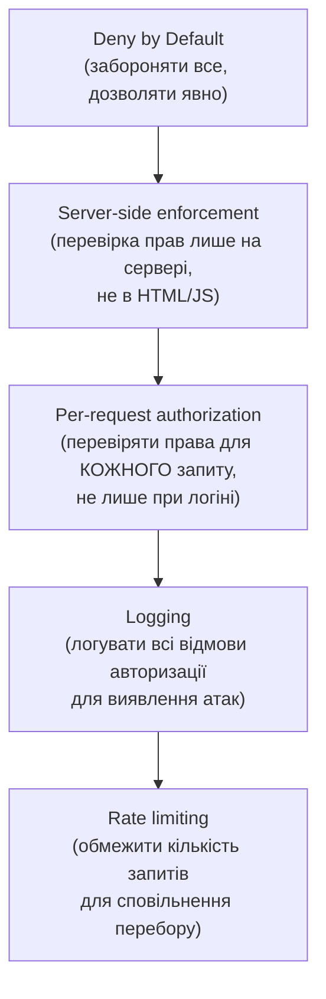

# 6.3. A01: Broken Access Control

Broken Access Control — найпоширеніша категорія вразливостей у 2021 році: вона присутня у 94% перевірених застосунків у тій чи іншій формі. Ідея проста і руйнівна: застосунок правильно автентифікує користувача, але не перевіряє, чи має він право на конкретний ресурс або дію. Аліса може переглянути свій профіль — і змінивши `id=42` на `id=43` в URL, переглянути профіль Боба. Або, маючи роль «user», надіслати запит на ендпоінт для «admin» — і він спрацює. Ці сценарії — не екзотика: вони трапляються у виробничих системах щодня.

> 📖 Ключові терміни — у [глосарії модуля](00-glosariy.md).

## IDOR: Insecure Direct Object Reference

**IDOR (Insecure Direct Object Reference)** — один з найпоширеніших різновидів Broken Access Control: застосунок використовує безпосередньо контрольований користувачем ідентифікатор (id, filename, UUID) для доступу до об'єкта без перевірки, чи має цей користувач доступ до нього.

**Типові патерни IDOR:**

```
# Числові ID (найочевидніше)
GET /api/orders/42         ← змінюємо на /api/orders/43 — бачимо чужий замовлення

# Предсказуваний UUID — якщо UUID не random v4
GET /api/documents/0001-0001-0001-0001

# Filename в параметрах
GET /download?file=report_user_42.pdf
→ GET /download?file=report_user_43.pdf

# Посилання через email
GET /reset?token=user_42_reset_token
```

**Приклад вразливого коду (Python/Flask):**

```python
# ❌ ВРАЗЛИВО: довіряємо параметру без перевірки власника
@app.route('/api/orders/<int:order_id>')
def get_order(order_id):
    order = db.query(Order).filter_by(id=order_id).first()
    if not order:
        abort(404)
    return jsonify(order.to_dict())  # Будь-який авторизований user бачить будь-яке замовлення!

# ✅ ПРАВИЛЬНО: перевіряємо, що замовлення belongs to current user
@app.route('/api/orders/<int:order_id>')
@login_required
def get_order(order_id):
    order = db.query(Order).filter_by(
        id=order_id,
        user_id=current_user.id  # ← обов'язкова умова!
    ).first()
    if not order:
        abort(404)  # Однаковий 404 для "не існує" і "чужий" — не розкриваємо інформацію
    return jsonify(order.to_dict())
```

## BOLA і BFLA: API-специфічні терміни

**BOLA (Broken Object Level Authorization)** — еквівалент IDOR в API-контексті (OWASP API Security Top 10 #1). Замість HTML-сторінки з параметром — REST API ендпоінт, що повертає JSON.

**BFLA (Broken Function Level Authorization)** — доступ до функцій (endpoints/actions), на які у користувача немає прав:

```
# Звичайний user надсилає запит на admin endpoint
DELETE /api/admin/users/42
→ 200 OK  ← застосунок не перевіряє роль для цього ендпоінту!

# Горизонтальна ескалація (same level, different user)
POST /api/users/43/promote_to_admin  ← user 42 впливає на user 43

# Вертикальна ескалація (lower → higher privilege)
GET /api/admin/dashboard  ← user (не admin) отримує доступ
```

## Path Traversal (Directory Traversal)

**Path Traversal** — коли вхідні дані використовуються для формування шляху до файлу без валідації, зловмисник може «вийти» за межі дозволеної директорії:

```
# Уразливий параметр
GET /download?filename=report.pdf
# Атака
GET /download?filename=../../../etc/passwd
GET /download?filename=..%2F..%2F..%2Fetc%2Fshadow  ← URL-encoded
GET /download?filename=....//....//etc/passwd         ← подвоєний слеш
```

**Захист:**

```python
import os
from pathlib import Path

ALLOWED_DIR = Path('/var/app/reports').resolve()

def safe_file_download(filename: str) -> Path:
    # Варіант 1: resolve() виявляє вихід за межі
    requested = (ALLOWED_DIR / filename).resolve()
    if not str(requested).startswith(str(ALLOWED_DIR)):
        raise PermissionError("Path traversal detected")
    return requested

    # Варіант 2: whitelist + os.path.basename
    safe_name = os.path.basename(filename)  # видаляє шлях, залишає лише ім'я
    return ALLOWED_DIR / safe_name
```

## Privilege Escalation через параметри

**Mass Assignment** — фреймворки, що автоматично маплять параметри запиту на поля моделі, можуть дозволити привласнення полів, що не мали бути змінені:

```python
# ❌ ВРАЗЛИВО: direct mass assignment
@app.route('/api/users/me', methods=['PUT'])
def update_profile():
    current_user.update_from_dict(request.json)  # Що якщо JSON містить {"role": "admin"}?
    db.commit()

# ✅ ПРАВИЛЬНО: whitelist полів для оновлення
ALLOWED_FIELDS = {'name', 'email', 'bio', 'avatar_url'}

@app.route('/api/users/me', methods=['PUT'])
def update_profile():
    data = {k: v for k, v in request.json.items() if k in ALLOWED_FIELDS}
    current_user.update_from_dict(data)
    db.commit()
```

## Forced Browsing і Hidden Endpoints

**Forced Browsing** — доступ до ресурсів, URL яких «відомий» але не публічно доступний (security through obscurity):

```
/admin           ← не в меню, але існує і доступний
/backup.sql      ← файл резервної копії в webroot
/api/internal/   ← «внутрішній» API без автентифікації
/.git/           ← git-репозиторій доступний через веб
/phpinfo.php     ← діагностична сторінка PHP
```

**Інструменти виявлення:** gobuster, dirbuster, feroxbuster — перебирають відомі шляхи по словнику.

## Контрзаходи (OWASP рекомендації)



**Чек-лист захисту від Broken Access Control:**

- [ ] Кожен ендпоінт перевіряє права конкретного поточного користувача (не тільки «чи залогінений»).
- [ ] Доступ до об'єктів перевіряється на рівні бази даних (фільтр по `user_id`), а не тільки на рівні бізнес-логіки.
- [ ] Admin/management ендпоінти відключені за замовчуванням або захищені додатковим рівнем автентифікації.
- [ ] Файлова система: не зберігати конфіденційні файли в webroot; використовувати безпечні шляхи з резолюцією.
- [ ] Rate limiting на API-ендпоінти з об'єктними ідентифікаторами.
- [ ] Логування всіх 403/401 відповідей для аналізу аномалій.
- [ ] Тестування: ручний обхід кожного ресурсу з акаунтом іншого користувача.

## Реальний кейс: дефейсмент українських держсайтів (2022)

У ніч з 13 на 14 січня 2022 року зловмисники (за висновком CERT-UA — пов'язані з Росією) здійснили масову атаку на офіційні вебсайти українських державних органів: Міністерства закордонних справ, Кабінету Міністрів, низки інших відомств. На головних сторінках з'явились провокаційні повідомлення польською, українською і російською мовами.

CERT-UA і подальший технічний аналіз виявили, що зловмисники використали комбінацію векторів, включаючи **вразливості у системі керування контентом OctoberCMS** (CVE-2021-32648 — Broken Authentication / Broken Access Control у механізмі скидання пароля). Ця CVE дозволяла скинути пароль адміністратора без знання поточного, якщо система була недостатньо налаштована.

**Урок:** недостатньо просто встановити CMS. Вимкнена двофакторна автентифікація для адмін-панелі, застаріла версія CMS з відомою CVE і відсутність моніторингу спроб входу — це поєднання, що перетворило відомий і виправлений баг у реальний інцидент з наслідками для репутації держави.

## Реальний кейс: Facebook 2018 (Access Token Bug)

У жовтні 2018 Facebook розкрив вразливість Broken Access Control у функціоналі «View As»: помилка у відео-завантажувачі генерувала access token не для поточного сесійного користувача, а для того, чий профіль переглядався. Зловмисник, що використав «View As» для профілю жертви, отримував її access token. Через цю вразливість потенційно скомпрометовано 50 мільйонів акаунтів. Механізм: не перевірявся «хто» є власником сесії під час генерації токена — класичний IDOR на рівні сесійних атрибутів.

## Міні-вправа

Для тестування IDOR у власному або навчальному застосунку:

```python
# Простий тест: чи доступні чужі ресурси?
import requests

# Логін як User A (власний акаунт)
session_a = requests.Session()
session_a.post('http://localhost:5000/login', json={'user': 'alice', 'pass': 'pass1'})

# Логін як User B (другий акаунт)
session_b = requests.Session()
session_b.post('http://localhost:5000/login', json={'user': 'bob', 'pass': 'pass2'})

# Отримати ресурс User A з сесією User B
resource_id = 1  # ID ресурсу User A
response = session_b.get(f'http://localhost:5000/api/documents/{resource_id}')

if response.status_code == 200:
    print(f"❌ ВРАЗЛИВІСТЬ: User B бачить ресурс User A!")
    print(response.json())
else:
    print(f"✅ Доступ заблоковано: {response.status_code}")
```

## Джерела та додаткові матеріали

- OWASP, *A01:2021 – Broken Access Control* (owasp.org/Top10/A01_2021-Broken_Access_Control).
- OWASP, *Testing for IDOR* (owasp.org/www-project-web-security-testing-guide).
- PortSwigger Web Academy, *Access control vulnerabilities* — безкоштовні практичні завдання.

---

**Попередній розділ:** [6.2. OWASP Top 10: огляд](02-owasp-top10-ohliad.md)
**Далі:** [6.4. A02: Cryptographic Failures](04-a02-cryptographic-failures.md)
**Назад до модуля:** [README модуля 06](README.md)
