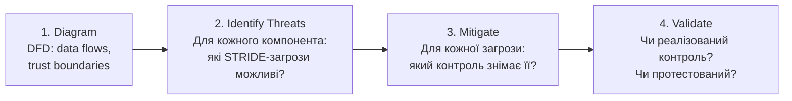
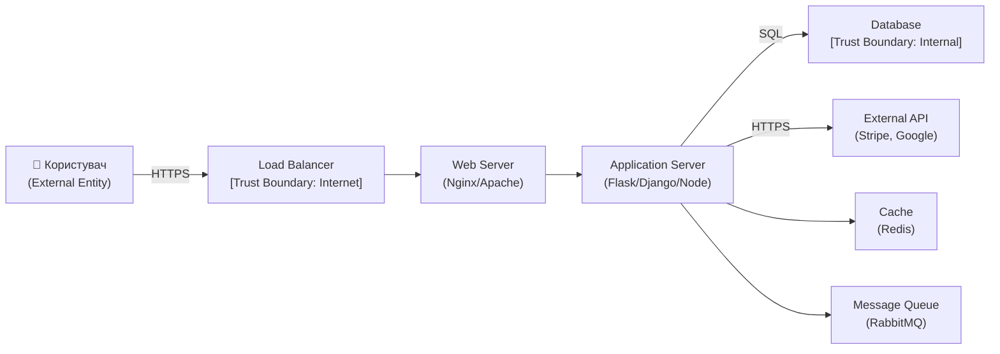

# 6.6. A04: Insecure Design

У 2011 році соціальна мережа з мільйонами користувачів дозволяла скидання пароля через «секретне запитання»: «Ім'я першого вчителя?» або «Дівоче прізвище матері?». Ці дані знайшли в соціальних мережах, в публічних записах, у відповідях на інших сайтах. Зламати такий механізм не потрібно — достатньо відповісти правильно. Пропатчити це неможливо — проблема не в коді, а в самій ідеї. Ось що таке Insecure Design: вразливість не у реалізації, а в архітектурному рішенні.

> 📖 Ключові терміни — у [глосарії модуля](00-glosariy.md).

## Різниця між Insecure Design і Security Misconfiguration

```
Insecure Implementation (A05, A07...):
"Є правильний спосіб зробити X, але ми зробили неправильно"
→ Виправляється конфігурацією або кодом

Insecure Design (A04):
"Сам спосіб вирішення задачі фундаментально небезпечний"
→ Виправляється лише зміною архітектури або бізнес-логіки
```

**Класичний приклад Insecure Design:** система відновлення пароля через «секретні запитання» (`Ім'я першого вчителя?`). Це не помилка реалізації — це помилка дизайну: секретне запитання є слабким фактором автентифікації за своєю природою. Замінити бібліотеку або виправити SQL-запит не допоможе.

## Threat Modeling для вебзастосунків

**Threat Modeling** — структурований аналіз того, що може піти не так у системі, до того як вона буде побудована. Основні методології:

### STRIDE (Microsoft)

| Загроза | Що порушує | Приклад для вебзастосунку |
|---|---|---|
| **S**poofing | Автентичність | Підміна session cookie; фіктивний IdP |
| **T**ampering | Цілісність | Зміна параметрів замовлення в запиті |
| **R**epudiation | Неспростовність | Відсутність логів — неможливо довести дію |
| **I**nformation Disclosure | Конфіденційність | Stack trace у відповіді; verbose error messages |
| **D**enial of Service | Доступність | Брутфорс без rate limiting; гігантські файли |
| **E**levation of Privilege | Авторизація | IDOR; SSRF для доступу до internal API |

**Процес STRIDE Threat Modeling:**



### Data Flow Diagram (DFD) для вебзастосунку



Кожна **Trust Boundary** — місце, де потрібна додаткова перевірка: автентифікація, авторизація, валідація даних.

## Abuse Cases: проектування від зловмисника

**Abuse Case** — сценарій, що описує, як система може бути використана зловмисно на відміну від Use Case (сценарій легітимного використання).

**Приклад:**

```
Use Case: Користувач реєструється на сайті
  → Завантажує фото профілю

Abuse Cases:
  → Завантажує виконуваний .php файл замість зображення
  → Завантажує SVG з <script> тегом (stored XSS)
  → Завантажує 10 ГБ файл (DoS)
  → Завантажує файл з ім'ям "../../../etc/passwd" (path traversal)
  → Завантажує зображення з вбудованим EXIF-шкідливим кодом
```

Кожен Abuse Case повинен мати відповідний контроль у специфікації.

## Secure Design Patterns для вебзастосунків

**Principle of Complete Mediation** — кожен доступ до ресурсу перевіряється кожного разу (не кешується рішення про авторизацію без TTL).

**Defense in Depth на рівні дизайну:**
```
Запит на чутливий ресурс:
1. WAF → базова фільтрація очевидних атак
2. Load Balancer → rate limiting, DDoS захист
3. API Gateway → автентифікація JWT/API key
4. Application → авторизація (RBAC/ABAC)
5. Database → Row-level security (RLS)
6. Audit Log → незалежний запис кожного доступу
```

**Fail Securely:**
```python
# ❌ Fail-open: при помилці — дозволяємо
def check_permission(user, resource):
    try:
        return permission_service.check(user, resource)
    except Exception:
        return True  # "краще пропустити, ніж зламати"

# ✅ Fail-secure: при помилці — забороняємо
def check_permission(user, resource):
    try:
        return permission_service.check(user, resource)
    except Exception:
        log.error(f"Permission check failed for {user}/{resource}")
        return False  # безпечне значення за замовчуванням
```

**Economy of Mechanism** — прості механізми безпеки надійніші за складні. Чим простіша реалізація перевірки прав — тим менше місць для помилок.

**Separation of Privilege** — критичні дії вимагають кількох незалежних умов:
```python
# Замість: if user.is_admin
# Краще: if user.is_admin AND request.mfa_verified AND user.ip in allowed_ips
```

## Бізнес-логіка як джерело дизайн-вразливостей

**Business Logic Flaws** — вразливості, що використовують легітимний функціонал у непередбаченому порядку:

**Приклад 1: Race Condition при списанні балансу**
```
Сценарій: Аліса має 100 грн. Надсилає два запити одночасно на виведення 100 грн.
Очікується: один успішний, один відмовлений
Вразливість: обидва запити читають баланс (100 грн), обидва проходять перевірку,
             обидва списують — баланс стає -100 грн

Захист: database-level lock або optimistic locking:
  UPDATE accounts SET balance = balance - 100
  WHERE user_id = 1 AND balance >= 100
  → якщо рядків змінено 0 — операція не пройшла
```

**Приклад 2: Негативна кількість у кошику**
```
Атака: додати товар зі значенням quantity = -1
Якщо система не валідує знак → загальна сума знижується
Захист: валідація quantity > 0 на сервері (не тільки на клієнті!)
```

## Міні-вправа

Виберіть будь-яку функцію застосунку (реального або навчального) і проведіть мінімальний STRIDE-аналіз:

1. Намалюйте спрощений Data Flow Diagram для цієї функції (навіть на папері або в Mermaid).
2. Для кожної стрілки (потоку даних) запитайте: яка STRIDE-загроза можлива тут?
3. Для кожної Trust Boundary (наприклад, «браузер → сервер», «сервер → БД»): чи є явна перевірка авторизації?
4. Запишіть мінімум 3 Abuse Cases для цієї функції.

**Шаблон для заповнення:**

```
Функція: [назва]
DFD: [User] → [Frontend] → [API] → [DB]

Trust Boundaries: Internet/Frontend, Frontend/API, API/DB

Threat | Місце | Контроль
Spoofing | User → Frontend | Session cookie + MFA
Tampering | Frontend → API | CSRF токен + валідація на сервері
...

Abuse Cases:
1. Користувач надсилає від'ємну суму — перевірка: amount > 0 на сервері
2. ...
```

## Чек-лист Secure Design Review

Перед початком розробки або при архітектурному ревю:

- [ ] Проведено Threat Modeling (STRIDE або аналог) для ключових flow.
- [ ] Trust Boundaries явно позначені у DFD.
- [ ] Для кожної Trust Boundary визначено механізм авторизації.
- [ ] Abuse Cases підготовані для кожного User Story з чутливими даними.
- [ ] Принцип Fail Secure реалізований для всіх компонентів безпеки.
- [ ] Логування передбачено на рівні дизайну (не «добавимо потім»).
- [ ] Race conditions проаналізовані для фінансових і критичних операцій.
- [ ] Rate limiting передбачено на рівні архітектури.

## Джерела та додаткові матеріали

- OWASP, *A04:2021 – Insecure Design*.
- OWASP, *Threat Modeling Cheat Sheet*.
- Adam Shostack, *Threat Modeling: Designing for Security* — стандартна книга.
- Microsoft SDL Threat Modeling Tool (microsoft.com).
- OWASP SAMM v2 — Software Assurance Maturity Model.

> **Далі по модулю:** Якщо Insecure Design — це помилка архітектора, то наступна категорія — помилка адміністратора: Security Misconfiguration (A05), залежності з вразливостями (A06) і решта A05–A10. Перейдіть до [6.7 →](07-a05-a10-ohliady.md)

---

> Ми розглянули проблеми дизайну, що виникають ще до написання коду. Наступна категорія — ширша: вразливості, що з'являються після того, як правильно написаний і правильно спроєктований застосунок розгортається у **неправильно налаштованому** середовищі, зі **застарілими** залежностями або без достатнього **моніторингу**. Саме такий «зазор між кодом і продакшеном» охоплюють A05–A10.

**Попередній розділ:** [6.5. A03: Injection](05-a03-iniektsiia.md)
**Далі:** [6.7. A05–A10: огляди](07-a05-a10-ohliady.md)
**Назад до модуля:** [README модуля 06](README.md)
