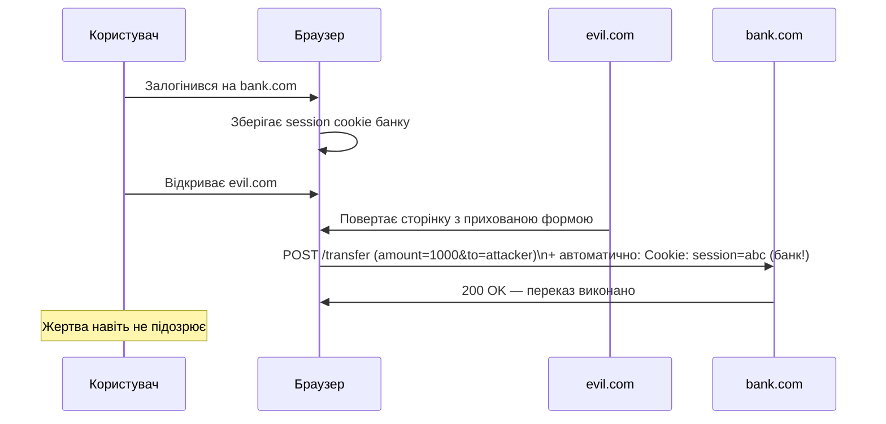

# 6.9. CSRF і Clickjacking

CSRF і Clickjacking — дві атаки, що експлуатують довіру між браузером і вебсайтом, але різними способами. CSRF змушує браузер користувача ненавмисно надіслати запит від його імені. Clickjacking змушує користувача ненавмисно клікнути на прихований елемент чужого сайту. Обидві атаки використовують те, що браузер автоматично надсилає cookies і виконує дії, і обидві захищаються відносно простими, але специфічними механізмами.

> 📖 Ключові терміни — у [глосарії модуля](00-glosariy.md).

## CSRF: Cross-Site Request Forgery

**CSRF (Cross-Site Request Forgery)** — атака, де зловмисний сайт змушує браузер аутентифікованого користувача виконати небажану дію на іншому сайті.

**Механізм:**



**Вразливий код (немає CSRF-захисту):**

```python
# ❌ ВРАЗЛИВО: POST-запит обробляється лише за наявністю сесії
@app.route('/transfer', methods=['POST'])
@login_required
def transfer():
    amount = request.form['amount']
    recipient = request.form['recipient']
    bank.transfer(current_user, recipient, amount)
    return "Успіх"
```

**Атакуючий розміщує на evil.com:**

```html
<!-- Автоматично відправляється при відкритті сторінки -->
<body onload="document.forms[0].submit()">
<form action="https://bank.com/transfer" method="POST" style="display:none">
    <input name="amount" value="1000">
    <input name="recipient" value="attacker_account">
</form>
</body>

<!-- Або через img тег (GET-запити) -->

```

## CSRF-захист: Synchronizer Token Pattern

**CSRF Token (Synchronizer Token)** — непередбачуваний токен, що генерується сервером, вставляється у форму і перевіряється при обробці запиту:

```python
# Flask-WTF (рекомендована бібліотека)
from flask_wtf import FlaskForm, CSRFProtect
from wtforms import StringField, IntegerField
from wtforms.validators import DataRequired

csrf = CSRFProtect(app)  # Автоматично захищає всі POST-форми

class TransferForm(FlaskForm):
    amount = IntegerField('Сума', validators=[DataRequired()])
    recipient = StringField('Одержувач', validators=[DataRequired()])

@app.route('/transfer', methods=['GET', 'POST'])
@login_required
def transfer():
    form = TransferForm()
    if form.validate_on_submit():  # ← перевіряє CSRF-токен автоматично
        bank.transfer(current_user, form.recipient.data, form.amount.data)
        return redirect('/success')
    return render_template('transfer.html', form=form)
```

```html
<!-- Шаблон: CSRF-токен автоматично додається Flask-WTF -->
<form method="POST">
    {{ form.hidden_tag() }}  ← вставляє <input type="hidden" name="csrf_token" value="...">
    {{ form.amount.label }} {{ form.amount() }}
    {{ form.recipient.label }} {{ form.recipient() }}
    <button type="submit">Переказати</button>
</form>
```

**Для API (без форм) — токен у заголовку:**

```python
# Клієнт отримує CSRF-токен через meta tag або endpoint
@app.route('/api/csrf-token')
def get_csrf_token():
    return jsonify({'token': generate_csrf()})

# Клієнт надсилає у заголовку
# X-CSRF-Token: {token}
# або X-Requested-With: XMLHttpRequest (застаріший метод)
```

## SameSite Cookie: вбудований захист від CSRF

**SameSite** — атрибут cookie, що вирішує проблему CSRF на рівні браузера без необхідності у токенах:

```python
# Flask
response.set_cookie('session', session_token,
    samesite='Strict',    # або 'Lax'
    secure=True,
    httponly=True
)
```

| Значення | Поведінка | CSRF захист |
|---|---|---|
| `Strict` | Cookie надсилається лише при same-site navigation | ✅ Повний |
| `Lax` | Cookie надсилається при top-level navigation GET | ✅ Частковий (POST блоковано) |
| `None` | Cookie надсилається завжди (потрібен Secure) | ❌ Немає |

**Чому Lax є дефолтом у сучасних браузерах:** `Strict` ламає UX (наприклад, перехід за посиланням з email не матиме cookies). `Lax` захищає від POST CSRF (найнебезпечніші) і дозволяє нормальний UX.

**Чи можна відмовитись від CSRF-токенів з SameSite=Lax?** Для більшості застосунків — так, якщо session cookie має `SameSite=Lax` (або `Strict`) і `Secure`. Але CSRF-токени залишаються кращою практикою для legacy браузерів і edge cases.

## Double Submit Cookie Pattern

Альтернатива токенам для stateless API:

```python
import secrets

# 1. Генерується випадковий токен і надсилається як cookie
@app.before_request
def set_csrf_cookie():
    if 'csrf_token' not in request.cookies:
        token = secrets.token_urlsafe(32)
        g.new_csrf_token = token

@app.after_request
def add_csrf_cookie(response):
    if hasattr(g, 'new_csrf_token'):
        response.set_cookie('csrf_token', g.new_csrf_token, samesite='Strict')
    return response

# 2. Клієнт зчитує cookie (доступний без HttpOnly) і надсилає у заголовку
# X-CSRF-Token: {cookie value}

# 3. Сервер перевіряє, що cookie і заголовок співпадають
def verify_csrf():
    cookie_token = request.cookies.get('csrf_token')
    header_token = request.headers.get('X-CSRF-Token')
    if not cookie_token or not secrets.compare_digest(cookie_token, header_token or ''):
        abort(403)
```

## Clickjacking

**Clickjacking (UI Redressing)** — атака, де шкідливий сайт завантажує цільовий сайт у прозорому `<iframe>` і розміщує поверх нього обманну кнопку:

```html
<!-- evil.com -->
<style>
  .overlay { position: absolute; width: 100%; height: 100%; top: 0; left: 0; }
  iframe {
    opacity: 0.0001;    /* прозорий, але клікабельний! */
    position: absolute;
    top: 0; left: 0;
    width: 100%; height: 100%;
  }
</style>

<div class="overlay">
    <button style="position:absolute; top:300px; left:200px;">
        Отримати знижку 50%!  ← жертва думає, що клікає тут
    </button>
</div>

<!-- Прозорий iframe з bank.com, де кнопка "Підтвердити переказ" -->
<!-- розміщена точно під кнопкою "Знижка" -->
<iframe src="https://bank.com/transfer-confirm"></iframe>
```

**Захист: X-Frame-Options і frame-ancestors CSP:**

```python
# Метод 1: X-Frame-Options (старий, але широко підтримуваний)
response.headers['X-Frame-Options'] = 'DENY'        # заборонити будь-який iframe
response.headers['X-Frame-Options'] = 'SAMEORIGIN'  # дозволити лише свій origin

# Метод 2: CSP frame-ancestors (сучасний, гнучкіший)
response.headers['Content-Security-Policy'] = "frame-ancestors 'none';"
# або
response.headers['Content-Security-Policy'] = "frame-ancestors 'self' https://trusted.com;"
```

**Framebusting через JavaScript** — застаріла техніка, що легко обходиться:
```javascript
// ❌ Легко обходиться через sandbox iframe
if (top !== self) { top.location = self.location; }
// Атака: <iframe sandbox="allow-scripts" src="...">
```

Використовуйте заголовки, а не JavaScript для захисту від Clickjacking.

## Міні-вправа

```python
# Перевірка CSRF-захисту Flask-застосунку
import requests

# 1. Надіслати POST без CSRF-токена — має повернути 400/403
s = requests.Session()
s.get('http://localhost:5000')  # ініціалізуємо сесію

# Отримати сторінку з формою
page = s.get('http://localhost:5000/transfer')

# Надіслати POST без токена
response = s.post('http://localhost:5000/transfer', data={
    'amount': '100',
    'recipient': 'test'
    # CSRF токен не включено
})

if response.status_code == 400:
    print("✅ CSRF захист працює!")
elif response.status_code == 200:
    print("❌ ВРАЗЛИВІСТЬ: CSRF-запит прийнятий без токена!")
```

## Джерела та додаткові матеріали

- OWASP, *CSRF Prevention Cheat Sheet*.
- OWASP, *Clickjacking Defense Cheat Sheet*.
- Flask-WTF documentation (flask-wtf.readthedocs.io).
- PortSwigger Web Academy, *CSRF* — практичні завдання.
- MDN, *SameSite cookies explained*.

---

**Попередній розділ:** [6.8. XSS](08-xss.md)
**Далі:** [6.10. HTTP Security Headers і CSP](10-security-headers.md)
**Назад до модуля:** [README модуля 06](README.md)
