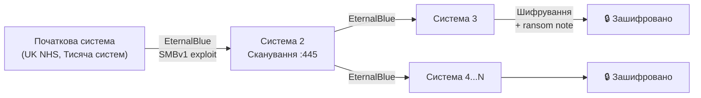

# 7.1. Класифікація шкідливого ПЗ

Першим вірусом у сучасному розумінні вважають «Brain» (1986) — пакистанські брати Амджад і Базіт Фарук Алві написали його для захисту власного ПЗ від піратства і, за їхнім твердженням, не очікували, що він поширюватиметься. Менш ніж за рік він добрався до США. Сьогодні щоденно з'являються понад 450 000 нових зразків шкідливого ПЗ. Кожен із них належить до певного класу — не за технологією, а за поведінкою і метою. Зрозуміти класифікацію — означає передбачити, що шкідливий код намагатиметься зробити, потрапивши в систему.

> 📖 Ключові терміни — у [глосарії модуля](00-glosariy.md).

## Класифікація за механізмом поширення

### Вірус (Virus)

Вірус прикріплюється до легітимного файлу (виконуваного, документа з макросами, скрипту) і поширюється разом із ним. Для активації необхідна участь користувача — запуск зараженого файлу.

**Ключові риси:**
- Потребує «хазяїна» — файлу, до якого прикріплюється.
- Самостійно не поширюється мережею (на відміну від черв'яка).
- Може бути поліморфним (змінює власний код при реплікації) або метаморфним (повністю переписує себе, зберігаючи функціональність).

**Сучасний стан:** класичні файлові віруси рідкісні; більш поширені макро-віруси у документах Office і скрипти, що поводяться як вірус.

### Черв'як (Worm)

Черв'як поширюється **самостійно** через мережу, без необхідності в «хазяїні» або участі користувача. Використовує вразливості мережевих служб, слабкі паролі або неправильні конфігурації.

**Класичний кейс — WannaCry (2017):**


WannaCry (EternalBlue, вразливість SMBv1) за 24 години заразив понад 200 000 систем у 150 країнах. Зупинила поширення лише «аварійна гальма» — домен `iuqerfsodp9ifjaposdfjhgosurijfaewrwergwea.com`, реєстрація якого (за $10.69) дослідником Маркусом Хатчінсом деактивувала механізм поширення.

### Троян (Trojan)

Маскується під легітимну програму (безкоштовний застосунок, патч, утиліта). Не поширюється самостійно — покладається на соціальну інженерію.

**Різновиди:**
- **RAT (Remote Access Trojan)** — надає зловмиснику повний віддалений контроль.
- **Downloader** — завантажує і встановлює інше шкідливе ПЗ (часто є «першою стадією»).
- **Banker** — перехоплює банківські дані, впроваджується в браузерні сесії.
- **Backdoor** — відкриває прихований канал доступу.

---

## Класифікація за призначенням

### Ransomware

Шифрує дані жертви і вимагає викуп за ключ розшифрування. Найфінансово руйнівна категорія: сукупні збитки у 2023 році перевищили $1 млрд (за даними Chainalysis).

**Еволюція:** перше покоління шифрувало лише локальні файли. Сучасний **double extortion** (подвійне здирство) додає ексфільтрацію перед шифруванням і погрозу публікації даних якщо викуп не сплачено.

**RaaS (Ransomware-as-a-Service)** — модель, де розробники (наприклад, LockBit, BlackCat/ALPHV, Conti) надають інфраструктуру і «продукт» партнерам-афілянтам, що здійснюють атаки в обмін на 20–30% від викупу. Знизила технічний поріг входу до кіберзлочинності.

**Українські реалії:** Kyivstar у грудні 2023 зазнав масштабної атаки, що на кілька годин позбавила зв'язку мільйони абонентів. Хоча механізм атаки офіційно не підтверджений як ransomware, аналітики пов'язують її з Sandworm (підрозділ ГРУ РФ). Раніше, у 2017 році, псевдо-ransomware NotPetya (початково поширювалась через оновлення M.E.Doc) знищила дані сотень українських організацій і завдала глобальних збитків більше $10 млрд.

### Spyware і Keylogger

**Spyware** — приховано збирає інформацію: паролі, листування, знімки екрана, геолокацію.

**Keylogger** — записує кожне натискання клавіші. Може бути програмним або **апаратним** (фізичний пристрій між клавіатурою і комп'ютером — практично невидимий для ПЗ-засобів захисту).

**Pegasus (NSO Group)** — найвідоміший приклад державного spyware: відноситься до категорії «零-click» — не потребує жодних дій з боку жертви; використовує zero-day вразливості в iMessage і WhatsApp. Відомі факти використання проти журналістів, активістів і урядовців у різних країнах.

### Botnet

**Bot** — скомпрометована система, підключена до C2/C&C (Command and Control) сервера. Ботнет із тисяч або мільйонів ботів використовується для:
- DDoS-атак (volumetric: генерація трафіку; application layer: атаки на рівні застосунку).
- Розсилки спаму і фішингу.
- Майнінгу криптовалюти (cryptojacking).
- Credential stuffing.
- Участі в подальших атаках як проміжні вузли (для приховання джерела).

**Mirai (2016)** — ботнет з IoT-пристроїв (IP-камери, роутери з дефолтними паролями) здійснив найбільший DDoS в історії: 620 Gbps проти Krebs on Security, 1.1 Tbps проти хостера OVH. Атака на Dyn DNS вивела з роботи Twitter, Netflix, Reddit, Airbnb на кілька годин.

### Rootkit

**Rootkit** приховує присутність шкідливого коду в системі: маскує процеси, файли, мережеві з'єднання, реєстрові записи від стандартних системних інструментів.

**Рівні rootkits:**

| Рівень | Де працює | Виявлення |
|---|---|---|
| User-mode | Ring 3 | Антивірус може виявити |
| Kernel-mode | Ring 0 (драйвер) | Дуже складне; потрібен зовнішній аналіз |
| Bootkit | MBR/UEFI | Виживає переустановку ОС; потрібна заміна MBR/прошивки |
| Firmware rootkit | BIOS/UEFI мікрокод | Практично незнищенний без заміни заліза |

**FinFisher/FinSpy** і **CosmicStrand** — відомі приклади firmware rootkits, що виявляли атрибуцію до державних акторів.

### Fileless Malware

Не залишає файлів на диску — виконується виключно в пам'яті або використовує легітимні системні інструменти (PowerShell, WMI, mshta, certutil). Традиційні антивіруси, що сканують файли, практично безсилі.

```
Типовий ланцюжок Fileless атаки:
1. Фішинговий лист → .docm з макросом
2. Макрос запускає PowerShell (легітимний інструмент!)
3. PowerShell завантажує в пам'ять shellcode (не файл!)
4. Shellcode виконує корисне навантаження в пам'яті
5. Persistence через реєстр (запис, що запускає той самий PowerShell при старті)
```

**Захист:** PowerShell ScriptBlock Logging, AMSI (Anti-Malware Scan Interface), EDR з аналізом поведінки в пам'яті, Credential Guard.

### Wiper (деструктивне ПЗ)

Незворотно знищує дані — без вимоги викупу. Використовується як зброя в кіберконфліктах.

**Українські кейси (2022):**
- **HermeticWiper** — розгорнуто за кілька годин до початку повномасштабного вторгнення 24 лютого. Атакував фінансові установи і держпідприємства.
- **CaddyWiper** — виявлено 14 березня 2022. Атакував щонайменше десять організацій.
- **IsaacWiper** — атаки на урядові мережі.
- **AcidRain** — вайпер для модему Viasat KA-SAT, що відключив десятки тисяч терміналів у Європі.

Спільна риса: всі вайпери 2022 були розгорнуті координовано і з коротким часовим проміжком від початку вторгнення — явна ознака завчасної підготовки і заздалегідь отриманого доступу.

---

## Класифікація за технікою прихованості

| Техніка | Опис | Ускладнює |
|---|---|---|
| **Поліморфізм** | Змінює власний код при реплікації (зберігаючи функцію) | Сигнатурне виявлення |
| **Метаморфізм** | Повністю переписує себе | Сигнатурне і евристичне |
| **Пакування (Packing)** | Стискає/шифрує код; розпаковується в пам'яті | Статичний аналіз |
| **Обфускація** | Заплутує логіку коду | Реверс-інжиніринг |
| **Anti-VM / Anti-Sandbox** | Виявляє середовище виконання і не активується | Пісочниці |
| **Process Injection** | Впроваджується в легітимний процес | Виявлення за процесом |
| **DLL Sideloading** | Підміняє DLL легітимного застосунку | AV-перевірки |
| **Timestomping** | Підробляє метадані часу файлів | Криміналістичний аналіз |

---

## Міні-вправа

Запустіть базовий аналіз зразка шкідливого ПЗ через публічні безпечні ресурси (без встановлення на власний комп'ютер):

1. Зайдіть на **MalwareBazaar** (`bazaar.abuse.ch`) — база зразків шкідливого ПЗ для дослідників.
2. Знайдіть будь-який нещодавній зразок категорії «Ransomware» і перегляньте його метадані: яка сімейство? Який розмір? Яка дата підвантаження?
3. Скопіюйте SHA256 хеш і перевірте на **VirusTotal** (`virustotal.com`). Скільки з 70+ антивірусних движків його виявляють? Які теги присвоєні?
4. Порівняйте знахідки: чи всі антивіруси згодні щодо класифікації?

## Джерела та додаткові матеріали

- MITRE ATT&CK (attack.mitre.org) — база знань тактик і технік зловмисників.
- MalwareBazaar (bazaar.abuse.ch) — відкрита база зразків.
- AV-TEST (av-test.org) — незалежне тестування антивірусів.
- CERT-UA (cert.gov.ua) — звіти про кампанії проти України.
- Mandiant, *M-Trends Annual Threat Report* — щорічний аналіз трендів.

---

**Далі:** [7.2. Вектори зараження](02-vektory-zarazhennia.md)
**Назад до модуля:** [README модуля 07](README.md)
