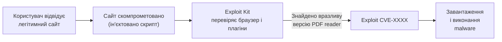

# 7.2. Вектори зараження

Зловмисник рідко «зламує» систему в романтичному сенсі — подолавши складний технічний захист. Значно частіше він просто знаходить найлегший шлях: незакритий порт, непропатчений застосунок, необережний клік. Розуміти вектори зараження — означає бачити ці шляхи раніше, ніж їх знайде зловмисник, і закривати їх систематично, а не реактивно.

> 📖 Ключові терміни — у [глосарії модуля](00-glosariy.md).

## Фішинг і шкідливі вкладення

Найпопулярніший початковий вектор у 2022–2024 роках за даними Mandiant M-Trends: більше 36% initial access — через фішинг.

**Шкідливі вкладення за типами:**

| Тип | Техніка | Прикриття |
|---|---|---|
| `.docm`, `.xlsm` | Office-макроси → VBA-код | «Рахунок-фактура», «Наказ» |
| `.pdf` | Посилання всередині PDF | «Документ для підпису» |
| `.iso`, `.img` | Контейнер з `.lnk` або `.exe` — обхід MotW | «Оновлення», «Установник» |
| `.lnk` (ярлик) | Виглядає як документ, запускає PowerShell | Будь-що |
| `.html` | HTML smuggling — JS відтворює EXE в браузері | «Захищений документ» |
| `.zip` password-protected | Архів із паролем — обхід email-сканерів | «Конфіденційні матеріали» |

**HTML Smuggling** — техніка, де шкідливий файл не надсилається вкладенням, а відтворюється прямо в браузері через JavaScript Blob API — email-шлюзи не бачать шкідливого файлу:

```javascript
// Техніка HTML Smuggling (спрощено для розуміння захисту)
const blob = new Blob([base64decode(encodedPayload)],
  {type: 'application/octet-stream'});
const a = document.createElement('a');
a.href = URL.createObjectURL(blob);
a.download = 'invoice.exe';
a.click();
```

**Mark of the Web (MotW)** — Windows позначає файли, завантажені з інтернету (NTFS alternate data stream `Zone.Identifier`). `.iso` і `.img` монтуються без передачі MotW вкладеним файлам — тому і стали популярними.

## Drive-by Download

Заражений або скомпрометований вебсайт автоматично завантажує шкідливий код на пристрій відвідувача — без жодної взаємодії:



**Exploit Kits** — автоматизовані набори для exploit'ів браузерних вразливостей (Angler, RIG, Magnitude). Стали менш поширені з покращенням sandbox браузерів і зменшенням залежності від Flash і Java.

**Захист:** оновлення браузера і плагінів, NoScript/uBlock Origin, ізоляція браузера.

## Watering Hole Attack

Замість прямої атаки на ціль — зловмисник компрометує сайти, які ціль *регулярно відвідує*:

```
APT компрометує → Галузевий форум / Конференція / Ресурс-«водопій»
                ↓
Директор компанії відвідує форум (регулярно, довіряє)
                ↓
Drive-by download / Шкідливий файл / Zero-day
```

**Чому ефективно:** жертва не очікує атаки на «безпечному» ресурсі.

**Приклад:** у 2019 році Google Project Zero виявила watering hole атаку через 14 zero-days проти iOS і Android, де скомпрометовані сайти цільно атакували конкретні етнічні групи.

## Знімні носії (USB)

**Випадково знайдений або підкинутий USB** — класична атака соціальної інженерії плюс технічний вектор. Дослідження 2016 (Tischer et al., Michigan University): 45–98% підібраних USB було підключено у різних сценаріях.

**AutoRun вразливість** — у старих Windows USB автоматично запускав `autorun.inf`. Сьогодні заблоковано, але:
- LNK-файли на USB, що виглядають як папки.
- Шкідливі документи замість очікуваних.
- BadUSB — перепрограмований контролер USB, що емулює клавіатуру і вводить команди.

**Захист:** заблокувати USB в GPO/MDM (дозволити лише корпоративні девайси), відключити AutoPlay, навчання персоналу.

## Supply Chain Attack (атаки на ланцюжок постачання)

Компрометація ПЗ або процесу розробки на етапі *до* отримання замовником:

```
Розробник ПЗ ←── Зловмисник компрометує
       ↓                репозиторій / CI/CD
  Легітимне оновлення
  (підписане, виглядає нормально)
       ↓
 18 000 клієнтів отримують
 backdoor з оновленням
```

**SolarWinds Orion (2020)** — найгучніший приклад: зловмисники (Cozy Bear / SVR) впровадили backdoor SUNBURST у процес збірки ПЗ SolarWinds Orion. Через оновлення backdoor отримали Microsoft, FireEye, різні агентства уряду США.

**3CX Desktop App (2023)** — атака на ланцюжок постачання де сам 3CX-клієнт спочатку встановлювався з поширення зараженого Trading Technologies (ще одна supply chain атака) — перший задокументований «supply chain через supply chain».

**Захист:** SLSA (Supply chain Levels for Software Artifacts), Sigstore/cosign для підписання артефактів, SBOM, перевірка хешів, Software Composition Analysis (SCA).

## Malvertising

Шкідлива реклама на легітимних майданчиках (Google Ads, великі видавці):

- Зловмисник купує рекламне місце → завантажує шкідливий банер.
- Або компрометує рекламну мережу.
- Банер може містити exploit або перенаправляти на фішингову сторінку.

**Реальний приклад (2023):** Зловмисники купили Google Ads для ключових слів «download CCleaner», «download Malwarebytes» — реклама показувалась вище органічних результатів і вела на сайти-близнюки з шкідливими installers.

**Захист:** uBlock Origin блокує більшість malvertising; `Enhanced Tracking Protection` у Firefox.

## Exploit публічних сервісів

Пряма атака на вразливі сервіси, відкриті в інтернеті:

```
Автоматичний Shodan/Censys скан → Знайдено Exchange Server 2013
                                  → CVE-2021-26855 (ProxyLogon)
                                  → Webshell встановлено
                                  → Initial access отримано
```

**Найпоширеніші цілі:** RDP (3389), VPN-шлюзи, Exchange/Outlook Web, Citrix, VMware vCenter, Fortinet/Pulse/Cisco VPN.

**Статистика:** за даними CISA, невстановлені патчі — вектор №1 для ransomware-атак на інфраструктуру.

## Credential-Based Access (компрометація облікових даних)

Технічно не «зараження», але часто початковий вектор:
- Придбані у darknet після витоків (credential stuffing).
- Підібрані через password spraying.
- Вкрадені через фішинг.
- Витягнуті через Pass-the-Hash або Kerberoasting після першого доступу.

Детально — модуль 05, розділ 5.9.

## Міні-вправа

Проаналізуйте реальний CERT-UA звіт за останній місяць (`cert.gov.ua/alerts`):

1. Знайдіть будь-який alert про фішингову кампанію.
2. Визначте: який вектор початкового доступу? Який тип шкідливого файлу?
3. Знайдіть у звіті IOC (Indicators of Compromise) — хеші файлів, IP-адреси, домени.
4. Перевірте один з доменів або хешів на VirusTotal.

## Джерела та додаткові матеріали

- CISA, *#StopRansomware* (cisa.gov/stopransomware) — актуальні рекомендації.
- Tischer et al., *Users Really Do Plug in USB Drives They Find* (2016).
- MITRE ATT&CK, Initial Access Tactic (TA0001).
- CERT-UA (cert.gov.ua) — звіти про активні кампанії.

---

**Попередній розділ:** [7.1. Класифікація шкідливого ПЗ](01-klasyfikatsiia-shkidlyvoho-po.md)
**Далі:** [7.3. Технічний аналіз шкідливого ПЗ](03-tekhnichnyy-analiz.md)
**Назад до модуля:** [README модуля 07](README.md)
