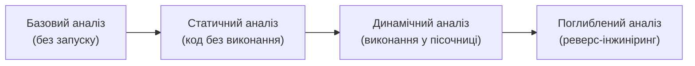

# 7.3. Технічний аналіз шкідливого ПЗ

Аналіз шкідливого ПЗ — дисципліна на межі між програмуванням, операційними системами і детективним розслідуванням. Мета аналітика: зрозуміти, що робить зразок, звідки він прийшов і які системи під загрозою — не потрапивши під вплив самого коду. Це не лише академічна вправа: результати аналізу стають IOC (Indicators of Compromise), YARA-правилами, оновленнями антивірусних баз і технічними звітами, що захищають інших.

> 📖 Ключові терміни — у [глосарії модуля](00-glosariy.md).

## Рівні аналізу



Кожен рівень додає деталізацію і потребує більше часу та навичок. Для більшості практичних задач достатньо базового і динамічного аналізу.

---

## Базовий аналіз (Basic Analysis)

Перше, що робиться з підозрілим зразком — без запуску.

### Хешування для ідентифікації

```bash
# Обчислити хеши
sha256sum suspicious_file.exe
md5sum suspicious_file.exe

# Перевірити на VirusTotal без завантаження файлу
curl -s "https://www.virustotal.com/api/v3/files/{SHA256}" \
  -H "x-apikey: YOUR_KEY" | python3 -m json.tool | grep -E "malicious|suspicious|type_tag"
```

**Важливо:** файл не завантажується — лише хеш. Це безпечно навіть для чутливих матеріалів.

### Strings — рядки у бінарному файлі

```bash
# Linux
strings suspicious_file.exe | grep -iE "http|ftp|cmd|powershell|registry|password|admin"

# Python (кросплатформний)
python3 -c "
import re, sys
content = open(sys.argv[1], 'rb').read()
# ASCII рядки (мінімум 4 символи)
strings = re.findall(rb'[\x20-\x7e]{4,}', content)
for s in strings:
    print(s.decode('ascii', errors='replace'))
" suspicious_file.exe | head -100
```

Що шукати у рядках:
- URL і домени (C2 сервери).
- IP-адреси.
- Шляхи файлів (`C:\Windows\System32\`, `%APPDATA%`).
- Registry keys (AutoRun, Run).
- Ключові слова: `cmd.exe`, `powershell`, `CreateRemoteThread`, `VirtualAlloc`.
- Помилкові повідомлення, що «зламають» обманку (якщо зразок є дроппером, він може мати рядок «This file requires...»).

### PE-заголовок (для Windows EXE/DLL)

```python
# pip install pefile
import pefile

pe = pefile.PE('suspicious.exe')

# Базова інформація
print(f"Тип: {'DLL' if pe.is_dll() else 'EXE'}")
print(f"Архітектура: {'64-bit' if pe.OPTIONAL_HEADER.Magic == 0x20b else '32-bit'}")
print(f"Час компіляції: {pe.FILE_HEADER.TimeDateStamp}")

# Імпортовані функції — розкривають можливості
if hasattr(pe, 'DIRECTORY_ENTRY_IMPORT'):
    for entry in pe.DIRECTORY_ENTRY_IMPORT:
        dll_name = entry.dll.decode()
        funcs = [i.name.decode() if i.name else str(i.ordinal)
                 for i in entry.imports if i.name]
        print(f"\n{dll_name}: {', '.join(funcs[:5])}")
```

**Підозрілі API-виклики:**
- `CreateRemoteThread`, `VirtualAllocEx`, `WriteProcessMemory` → Process injection
- `OpenProcess` з `PROCESS_ALL_ACCESS` → Privilege escalation
- `RegSetValueEx`, `RegOpenKeyEx` → Persistence (AutoRun)
- `InternetOpenUrl`, `HttpSendRequest`, `WSAConnect` → Network activity
- `CryptEncrypt`, `CryptGenKey` → Ransomware

---

## Динамічний аналіз (Behavioral Analysis)

Запуск зразка у контрольованому середовищі для спостереження реальної поведінки.

### Пісочниця (Sandbox)

**Пісочниця** — ізольоване середовище виконання (зазвичай: VM з базовою Windows/Linux), де зразок запускається і всі його дії логуються:
- Файлові операції (створення, видалення, модифікація).
- Реєстрові зміни.
- Мережеві з'єднання.
- Породжені процеси.
- API-виклики.

**Публічні онлайн-пісочниці (безкоштовні):**

| Сервіс | URL | Особливості |
|---|---|---|
| **Any.run** | any.run | Інтерактивна; Windows 7/10/11 |
| **Hybrid Analysis** | hybrid-analysis.com | CrowdStrike Falcon sandbox |
| **Triage** | tria.ge | Швидкий; CAPE sandbox |
| **Joe Sandbox** | joesandbox.com | Детальний; macOS/Android |
| **VirusTotal Sandbox** | virustotal.com | Автоматично для деяких файлів |

**Обмеження пісочниць:** сучасне шкідливе ПЗ часто виявляє середовище і не активується:
- Перевіряє кількість CPU (< 2 → VM), RAM (< 4 ГБ → VM).
- Перевіряє наявність «людської» активності (рух миші, відкриті вікна).
- Перевіряє MAC-адресу (VMware/VirtualBox мають відомі префікси).
- Чекає певний час перед активацією.
- Перевіряє CPUID на ознаки гіпервізора.

### Моніторинг у живому середовищі (Windows)

Якщо є доступ до ізольованої Windows-VM — Sysinternals Suite:

```
Process Monitor (procmon.exe):
- Всі файлові операції
- Всі реєстрові операції
- Мережеві операції
Фільтр: Process Name → підозрілий процес

Process Explorer (procexp.exe):
- Дерево процесів
- Завантажені DLL
- Мережеві підключення

Wireshark:
- Мережевий трафік (DNS запити → C2 домени)
- HTTP/HTTPS (навіть зашифрований: можна побачити IP)

Autoruns:
- Всі точки persistence (реєстр, планувальник, служби, browser extensions)
```

---

## YARA: правила для виявлення

**YARA** — інструмент для пошуку зразків за паттернами (рядки, байти, умови). Стандарт для IOC-шерингу в ком'юніті.

```yara
// Приклад YARA-правила для виявлення загального ransomware поведінки
rule Generic_Ransomware_Indicators {
    meta:
        description = "Виявляє типові рядки ransomware"
        author = "CyberGuide"
        severity = "HIGH"

    strings:
        // Типові рядки повідомлень про викуп
        $ransom1 = "Your files have been encrypted" nocase
        $ransom2 = "bitcoin" nocase
        $ransom3 = "decrypt" nocase
        $ransom4 = "HOW_TO_RECOVER" nocase

        // Підозрілі API для шифрування файлів
        $api1 = "CryptEncrypt" ascii
        $api2 = "FindFirstFile" ascii
        $api3 = "MoveFileEx" ascii

        // Типові розширення після шифрування
        $ext1 = ".locked" ascii
        $ext2 = ".encrypted" ascii

    condition:
        uint16(0) == 0x5A4D and   // MZ заголовок (Windows PE)
        (2 of ($ransom*)) and
        (2 of ($api*))
}
```

```bash
# Застосування YARA
# pip install yara-python
yara rule.yar suspicious_file.exe
yara -r rule.yar /path/to/directory/  # рекурсивно
```

**Ресурси з готовими YARA-правилами:**
- Malpedia (malpedia.caad.fkie.fraunhofer.de) — правила для сотень сімейств.
- YARA-Rules (github.com/Yara-Rules/rules) — відкрита база.
- Mandiant, Kaspersky, ESET публікують правила разом зі звітами.

---

## IOC: Indicators of Compromise

**IOC** — артефакти, що вказують на те, що система або мережа скомпрометована.

| Тип IOC | Приклади | Де шукати |
|---|---|---|
| **Хеш** | SHA256, MD5 файлу | VirusTotal, MalwareBazaar |
| **IP-адреса** | C2 сервер | Firewall логи, NetFlow |
| **Домен** | C2 домен, phishing | DNS логи, proxy |
| **URL** | Ендпоінт C2 | Web proxy логи |
| **Email** | Адреса відправника, тема | Email gateway |
| **Registry Key** | Persistence механізм | Windows Event Log, EDR |
| **Mutex** | Унікальний об'єкт синхронізації | Process analysis |
| **YARA** | Патерн у файлі або пам'яті | AV, EDR |

**STIX/TAXII** — стандарти для структурованого обміну IOC між організаціями і платформами.

---

## Безпечне середовище для аналізу

```
⚠️ ОБОВ'ЯЗКОВО перед будь-яким аналізом шкідливих зразків:
1. Ізольована VM (не підключена до основної мережі або лише до FakeNet)
2. Snapshot перед запуском зразка
3. Відключений буфер обміну між VM і хостом
4. Жодних реальних облікових даних всередині VM
5. Відновлення зі snapshot після аналізу (не «очищення» вручну)

FakeNet-NG: симулює мережеві служби (DNS, HTTP, SMTP) у ізольованому середовищі,
дозволяє бачити мережеву активність зразка без реального з'єднання з C2.
```

## Міні-вправа

```python
# strings_extractor.py — базовий аналіз PE-файлу
import re, sys, os
from pathlib import Path

def extract_strings(filepath: str, min_len: int = 6) -> list[str]:
    """Витягнути ASCII рядки з бінарного файлу."""
    content = Path(filepath).read_bytes()
    return [m.decode('ascii') for m in re.findall(
        rb'[\x20-\x7e]{' + str(min_len).encode() + rb',}', content
    )]

def classify_strings(strings: list[str]) -> dict:
    """Класифікувати рядки за категоріями."""
    categories = {
        'urls': [s for s in strings if re.match(r'https?://', s)],
        'ips': [s for s in strings if re.match(r'\d{1,3}\.\d{1,3}\.\d{1,3}\.\d{1,3}', s)],
        'paths': [s for s in strings if re.match(r'[A-Za-z]:\\|\/[a-z]', s)],
        'registry': [s for s in strings if 'HKEY_' in s or 'Software\\' in s],
        'suspicious_apis': [s for s in strings if s in {
            'VirtualAlloc', 'CreateRemoteThread', 'WriteProcessMemory',
            'OpenProcess', 'RegSetValueEx', 'CryptEncrypt', 'WinExec',
            'ShellExecute', 'DownloadFile', 'InternetOpen'
        }],
    }
    return categories

if __name__ == '__main__':
    if len(sys.argv) < 2:
        print("Usage: python strings_extractor.py <file>")
        sys.exit(1)

    filepath = sys.argv[1]
    print(f"\n[*] Аналіз: {filepath} ({os.path.getsize(filepath)} байт)")

    strings = extract_strings(filepath)
    print(f"[*] Знайдено {len(strings)} рядків")

    categories = classify_strings(strings)
    for cat, items in categories.items():
        if items:
            print(f"\n[!] {cat.upper()} ({len(items)}):")
            for item in items[:10]:
                print(f"    {item}")
```

Запустіть на будь-якому EXE або DLL (навіть легітимному — наприклад, `notepad.exe`) і перегляньте результати.

## Джерела та додаткові матеріали

- MalwareBazaar (bazaar.abuse.ch) — зразки для практики.
- Any.run (any.run) — інтерактивна пісочниця.
- Lenny Zeltser, *Malware Analysis Cheat Sheet* (zeltser.com).
- YARA documentation (virustotal.github.io/yara).
- Sikorski M., Honig A., *Practical Malware Analysis* — стандартна книга.

---

**Попередній розділ:** [7.2. Вектори зараження](02-vektory-zarazhennia.md)
**Далі:** [7.4. Психологія соціальної інженерії](04-psykholohiia-sotsinzhenerii.md)
**Назад до модуля:** [README модуля 07](README.md)
