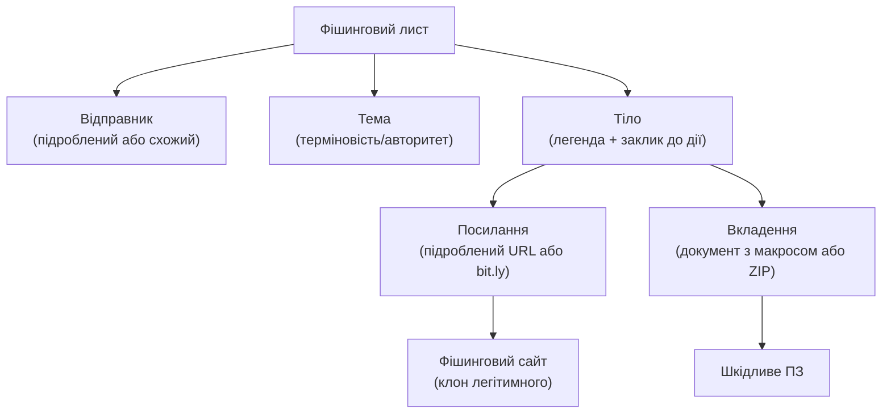

# 7.5. Фішинг і спір-фішинг

Фішинг отримав свою назву від «fishing» (риболовля) у 1990-х — масові повідомлення, що «закидали гачок» і чекали, хто клюне. Але сучасний фішинг у руках державних акторів — це не гачок навмання, а снайперська гвинтівка: ретельно персоналізоване повідомлення, де кожна деталь розрахована на конкретну жертву. CERT-UA зафіксував сотні таких кампаній проти України у 2022–2024 роках, і вони є провідним вектором початкового доступу в атаках APT-груп, пов'язаних з РФ.

> 📖 Ключові терміни — у [глосарії модуля](00-glosariy.md).

## Типи фішингу

| Тип | Ціль | Персоналізація | Вектор |
|---|---|---|---|
| **Масовий фішинг** | Мільйони отримувачів | Мінімальна | Email, SMS |
| **Спір-фішинг** | Конкретна особа або відділ | Висока | Email |
| **Whaling** | Топ-менеджери (CEO, CFO) | Дуже висока | Email |
| **Vishing** | Конкретна особа | Середня | Телефон |
| **Smishing** | Масово або цільово | Мінімальна / Висока | SMS |
| **Квішинг** | Будь-хто | Мінімальна | QR-код |
| **Clone Phishing** | Отримувачі легітимного листа | Висока | Email |

---

## Анатомія фішингового листа



### Типові елементи

**Підроблений відправник (Email Spoofing):**
```
From: security@privatbank.ua.accounts-verification.com   ← не Приватбанк!
From: noreply@g00gle.com                                  ← двійник з нулем
From: admin@company.com (але Reply-To: attacker@evil.com) ← прихований reply-to
```

**Термінові теми:**
- «Ваш акаунт буде заблоковано»
- «Терміново: підтвердьте транзакцію»
- «Зміна зарплатних реквізитів»
- «CERT-UA: оновлення безпеки» (імітує офіційні попередження)

**Технічні ознаки підробленого URL:**
```
https://privatbank.ua.verify-account.ru/login   ← домен verify-account.ru, не privatbank
https://privatb4nk.ua                           ← схожий домен
https://privatbank.ua@attacker.com              ← @ обманює деякі клієнти
https://bit.ly/3xYzAbc                         ← скорочений URL приховує призначення
```

---

## Реальні CERT-UA кейси

### UAC-0050 / Gamaredon (2022–2024)

Gamaredon (Primitive Bear, Shuckworm) — проросійська APT-група, пов'язана з ФСБ. Масові кампанії проти українських держорганів, силових структур і ЗМІ.

**Типовий вектор (CERT-UA#5638, 2023):**
- Email зі шкідливим `.docx` вкладенням.
- Документ містить Remote Template Injection — шаблон завантажується з C2 при відкритті.
- Завантажений шаблон містить VBA-макрос → Pterodo RAT.
- Pterodo збирає документи, скріншоти, кейлогує.

**Масштаб:** тисячі листів на тиждень у піки кампаній.

### UAC-0010 / Sandworm (2022)

Sandworm (APT44) — підрозділ ГРУ, що стоїть за HermeticWiper і NotPetya.

**Кампанія перед 24.02.2022:**
- Фішингові листи з SharpStealer → крадіжка браузерних даних.
- Supply chain через MeDoc → NotPetya-подібні вайпери.
- Координовані атаки з кінетичними операціями.

### UAC-0056 (March 2022)

**CERT-UA#941:** Зловмисники надсилали документи «про евакуацію» або «гуманітарну допомогу». При відкритті — Cobalt Strike Beacon або GraphSteel → збір і ексфільтрація документів.

---

## Розпізнавання фішингу: чек-лист

**Перевірте відправника:**
- [ ] Домен відправника точно відповідає очікуваному (privatbank.ua, а не privatbank.ua.verify.ru)?
- [ ] SPF/DKIM підпис валідний? (DevTools email-клієнта або `header:show`)
- [ ] Reply-To відрізняється від From?

**Перевірте URL перед кліком:**
- [ ] Наведіть мишу — статус-бар покаже реальний URL.
- [ ] Скопіюйте URL, перевірте у `urlscan.io` або `virustotal.com`.
- [ ] Чи використовує сайт HTTPS? (Але HTTPS ≠ безпека! Фішингові сайти також мають HTTPS.)

**Перевірте вкладення:**
- [ ] Розширення файлу відповідає очікуваному? `.docm` ≠ `.docx`.
- [ ] Чому PDF «просить увімкнути макроси»?
- [ ] Перевірте хеш на VirusTotal ПЕРЕД відкриттям.

**Перевірте зміст:**
- [ ] Є граматичні або орфографічні помилки?
- [ ] Тиск терміновості без логічного обґрунтування?
- [ ] Просять дії, що «не передбачені процедурою»?

**При сумніві:**
- Зателефонуйте відправнику за відомим номером (не з листа!).
- Повідомте IT/безпеку.
- НЕ відкривайте.

---

## Технічний захист від фішингу

### SPF (Sender Policy Framework)

DNS TXT-запис, що вказує, яким серверам дозволено надсилати пошту від імені домену:

```
# Перевірити SPF запис
nslookup -type=TXT your-company.com | grep spf

# Приклад валідного SPF:
"v=spf1 include:_spf.google.com ip4:203.0.113.0/24 ~all"
#   ↑                               ↑                 ↑
# версія           дозволені сервери/IP        soft fail (рекомендовано)
```

`~all` (soft fail) vs `-all` (hard fail): `-all` суворіше блокує підроблені листи, але може призводити до проблем з легітимними перенаправленнями.

### DKIM (DomainKeys Identified Mail)

Криптографічний підпис кожного листа приватним ключем домену:

```
# Перевірити DKIM запис
nslookup -type=TXT selector._domainkey.your-company.com

# Приклад:
"v=DKIM1; k=rsa; p=MIIBIjANBgkqhkiG9w0BAQEFAAOCAQ8AMIIBCgKCAQEA..."
```

### DMARC (Domain-based Message Authentication, Reporting & Conformance)

Об'єднує SPF і DKIM, визначає що робити з листами, що не проходять перевірку:

```
# DNS TXT запис для _dmarc.your-company.com:
"v=DMARC1; p=reject; rua=mailto:dmarc@your-company.com; pct=100"
#            ↑                     ↑                       ↑
#   reject/quarantine/none  звіти про збої       100% листів
```

**Поступове впровадження DMARC:**
```
p=none       → лише звіти, без дій (для початку — 2–4 тижні)
p=quarantine → підозрілі листи → spam
p=reject     → підозрілі листи → відхилити
```

### Anti-Phishing технічні заходи

- **Email Gateway** (Microsoft Defender for Office 365, Proofpoint, Mimecast) — аналіз вкладень у пісочниці, реврайт URL.
- **DNS filtering** (Cisco Umbrella, Cloudflare Gateway) — блокування відомих фішингових доменів.
- **Browser isolation** — потенційно небезпечні сайти відкриваються в хмарному браузері.
- **Anti-spoofing headers** — `ARC` (Authenticated Received Chain) для ланцюжка переадресацій.

---

## Міні-вправа

Знайдіть у своїй поштовій скриньці будь-який підозрілий лист (або скористайтесь тестовим прикладом нижче) і проаналізуйте заголовки:

```
# Gmail: Три крапки → Show Original
# Outlook: Дії → Переглянути вихідний код повідомлення
# Thunderbird: View → Message Source

# Що шукати в заголовках:
# Received: from (звідки прийшов лист — реальний IP)
# Authentication-Results: spf=pass/fail; dkim=pass/fail; dmarc=pass/fail
# X-Spam-Score: (оцінка спам-фільтра)
```

Спробуйте онлайн-аналізатор заголовків: `mxtoolbox.com/EmailHeaders.aspx`

## Джерела та додаткові матеріали

- CERT-UA (cert.gov.ua) — актуальні звіти про фішинг-кампанії проти України.
- MITRE ATT&CK, Phishing (T1566) — класифікація технік.
- MXToolbox (mxtoolbox.com) — перевірка SPF/DKIM/DMARC.
- phishtool.com — безкоштовний аналіз фішингових листів.
- Google Safe Browsing (safebrowsing.google.com/safebrowsing/report_phish/) — звітування про фішинг.

---

**Попередній розділ:** [7.4. Психологія соціальної інженерії](04-psykholohiia-sotsinzhenerii.md)
**Далі:** [7.6. Вішинг, смішинг, BEC і квішинг](06-vishynh-smishynh-bec.md)
**Назад до модуля:** [README модуля 07](README.md)
