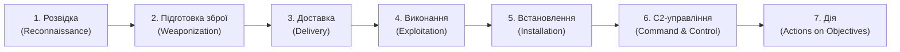
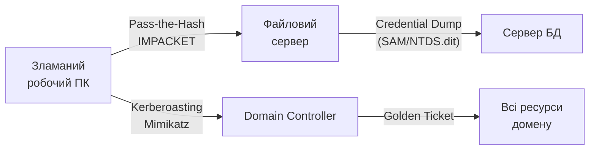

# 7.7. APT і Cyber Kill Chain

Більшість людей уявляють «хакера» як людину, що сидить у темній кімнаті і за кілька годин «зламує» банк. Реальні APT-атаки (Advanced Persistent Threat) виглядають інакше: місяці прихованої присутності в мережі, повільне та методичне розширення доступу, і лише потім — фінальна дія, будь то ексфільтрація терабайтів даних або одночасне розгортання вайпера на тисячах систем. Sandworm провів підготовку в мережах українських організацій за тижні і місяці до 24 лютого 2022 року.

> 📖 Ключові терміни — у [глосарії модуля](00-glosariy.md).

## Що таке APT

**APT (Advanced Persistent Threat)** — зловмисний актор (переважно держава або спонсований державою) що характеризується:

| Характеристика | Звичайний кіберзлочинець | APT |
|---|---|---|
| **Ціль** | Фінансова вигода | Стратегічна (розвідка, саботаж, вплив) |
| **Тривалість** | Години–дні | Місяці–роки |
| **Ресурси** | Обмежені | Державне фінансування |
| **Техніки** | Відомі інструменти | Custom malware, zero-days |
| **Виявлення** | Часто спалахи | Навмисне прихований |
| **Ціль атаки** | Масовий ринок | Конкретна організація/персона |

**Відомі APT-групи, активні проти України:**

| Група | Атрибуція | Відомі операції |
|---|---|---|
| Sandworm (APT44) | ГРУ (Росія) | NotPetya, HermeticWiper, Industroyer |
| APT28 (Fancy Bear) | ГРУ (Росія) | Фішинг проти уряду, ЗМІ |
| APT29 (Cozy Bear) | СВР (Росія) | SolarWinds, розвідка |
| Gamaredon (UAC-0050) | ФСБ (Росія) | Масовий фішинг держорганів |
| Turla | ФСБ (Росія) | Довгострокове шпигунство |

---

## Cyber Kill Chain (Lockheed Martin, 2011)

**Cyber Kill Chain** — модель семи етапів, через які проходить зловмисник від планування до досягнення мети. Розроблена Lockheed Martin для розуміння і розриву ланцюжка атаки.



### Етап 1: Розвідка (Reconnaissance)

Збір інформації про ціль:
- **Пасивна:** OSINT (LinkedIn, сайт, публічні документи, GitHub), WHOIS, сертифікати.
- **Активна:** Сканування портів, DNS-запити, пошук вразливостей.
- **Технічна:** shodan.io, censys.io — пошук відкритих сервісів.

**Захист:** мінімізація публічної присутності, DNS-моніторинг, honeypot для раннього виявлення.

### Етап 2: Підготовка (Weaponization)

Підготовка інструменту атаки:
- Створення шкідливого документа (document exploit).
- Налаштування C2-інфраструктури.
- Вибір exploit для виявленої вразливості.
- Упаковка і обфускація payload.

### Етап 3: Доставка (Delivery)

Передача зброї жертві:
- Фішинговий email з вкладенням або посиланням.
- Watering hole атака.
- USB-носій.
- Скомпрометоване оновлення (supply chain).

### Етап 4: Виконання (Exploitation)

Активація payload:
- Жертва відкриває документ → макрос виконується.
- Drive-by exploit у браузері.
- Використання вразливості у мережевому сервісі.

### Етап 5: Встановлення (Installation)

Закріплення в системі (Persistence):
- AutoRun ключі в реєстрі Windows.
- Нова служба або scheduled task.
- DLL hijacking.
- Модифікація boot record.

```
Типові persistence механізми (Windows):
HKLM\SOFTWARE\Microsoft\Windows\CurrentVersion\Run
HKCU\SOFTWARE\Microsoft\Windows\CurrentVersion\Run
C:\Windows\System32\Tasks\ (Scheduled Tasks)
C:\ProgramData\Microsoft\Windows\Start Menu\Programs\Startup
```

### Етап 6: C2 (Command and Control)

Встановлення каналу управління:
- HTTPS до зовнішнього C2 сервера (важко відрізнити від легітимного трафіку).
- DNS tunneling — команди передаються через DNS-запити.
- Використання легітимних сервісів (Telegram, GitHub, Google Drive, Pastebin) як C2.
- Domain Generation Algorithm (DGA) — автоматична генерація тисяч доменів.

**DGA-приклад (концепція):**
```python
# Демонстрація принципу DGA (для розуміння, не для використання)
import datetime, hashlib

def generate_domain_for_today():
    """DGA: новий домен щоденно — складно заблокувати."""
    today = datetime.date.today().strftime('%Y%m%d')
    seed = f"secret_seed_{today}"
    h = hashlib.md5(seed.encode()).hexdigest()
    return f"{h[:12]}.com"
    # Зловмисник реєструє ці домени заздалегідь або сканує DNS
```

### Етап 7: Дія на цілях (Actions on Objectives)

Досягнення кінцевої мети:
- **Ексфільтрація** — копіювання даних на C2.
- **Lateral movement** — переміщення мережею.
- **Privilege escalation** — підвищення прав.
- **Disruption** — знищення даних (вайпер), зупинка сервісів.
- **Persistency** — довгострокове шпигунство.

---

## MITRE ATT&CK: більш деталізована карта

**MITRE ATT&CK** — відкрита база знань тактик і технік реальних зловмисників. Детальніша, ніж Kill Chain, з конкретними прийомами.

**14 тактик (TA0001–TA0043):**

| Тактика | Приклади технік |
|---|---|
| Initial Access | Phishing (T1566), Exploit Public-Facing App (T1190) |
| Execution | PowerShell (T1059.001), WMI (T1047), Scheduled Task |
| Persistence | Registry Run Keys (T1547.001), Services (T1543.003) |
| Privilege Escalation | Token Impersonation (T1134), UAC Bypass (T1548) |
| Defense Evasion | Obfuscated Files (T1027), Disable AV (T1562), Timestomping |
| Credential Access | Credential Dumping (T1003), Keylogging (T1056) |
| Discovery | Network Scanning (T1046), Account Discovery (T1087) |
| Lateral Movement | Pass-the-Hash (T1550.002), RDP (T1021.001) |
| Collection | Screen Capture (T1113), Keylogging, Email Collection |
| C2 | Web Protocols (T1071), DNS (T1071.004), Ingress Tool Transfer |
| Exfiltration | Over C2 Channel, Scheduled Transfer (T1029) |
| Impact | Data Encrypted for Impact (T1486), Disk Wipe (T1561) |

**ATT&CK Navigator** (`mitre-attack.github.io/attack-navigator`) — інтерактивна теплова карта: можна позначити покриття захисних контролів проти кожної техніки.

---

## Living off the Land (LOLBAS)

Сучасні APT уникають завантаження власних інструментів — замість цього використовують легітимні системні утиліти Windows:

| Утиліта | Можливе зловмисне використання |
|---|---|
| `powershell.exe` | Завантаження і виконання payload з інтернету |
| `certutil.exe` | Декодування Base64 → exe; завантаження файлів |
| `mshta.exe` | Виконання VBScript/JScript із .hta файлу або URL |
| `wmic.exe` | Remote process creation для lateral movement |
| `rundll32.exe` | Запуск DLL з шкідливим кодом |
| `regsvr32.exe` | Squiblydoo: завантаження і виконання COM scriptlet |
| `bitsadmin.exe` | Фонове завантаження файлів |
| `msiexec.exe` | Завантаження і виконання .msi з URL |

**Чому LOLBAS ефективний:** легітимні утиліти підписані Microsoft, не блокуються AV, є у всіх Windows-системах, мають легітимний вигляд у логах.

**Захист:** PowerShell Constrained Language Mode, Script Block Logging, AppLocker/WDAC з whitelist дозволених виконань цих утиліт, EDR з поведінковим аналізом.

---

## Lateral Movement: переміщення мережею

Після первинного доступу до однієї системи — рух до ціннішних ресурсів:



**Типові інструменти lateral movement (відомі в публічних звітах IR):**
- **Impacket** — Python-набір для мережевих протоколів Windows.
- **BloodHound** — графовий аналіз Active Directory для пошуку шляхів до адміна.
- **CobaltStrike** — комерційна платформа, що використовується зловмисниками.
- **Mimikatz** — дамп credentials з LSASS.

**Захист від lateral movement:** мікросегментація мережі, LAPS, Credential Guard, відключення legacy протоколів (NTLM, SMBv1), моніторинг Event ID 4624/4625/4648, Zero Trust (модуль 05).

---

## Міні-вправа

Використайте безкоштовний **MITRE ATT&CK Navigator**:

1. Відкрийте `mitre-attack.github.io/attack-navigator`.
2. Знайдіть звіт CERT-UA про будь-яку останню кампанію (cert.gov.ua/alerts).
3. Знайдіть у звіті MITRE ATT&CK техніки (зазвичай позначені T1566, T1059 тощо).
4. Відзначте ці техніки в Navigator.
5. Запитайте себе: чи є у вашій організації (або навчальній мережі) захисти проти кожної з них?

## Джерела та додаткові матеріали

- MITRE ATT&CK (attack.mitre.org) — база знань тактик і технік.
- Lockheed Martin, *Intelligence-Driven Computer Network Defense* (2011) — оригінальна Kill Chain стаття.
- CERT-UA (cert.gov.ua) — звіти з ATT&CK-маппінгом.
- LOLBAS Project (lolbas-project.github.io) — база LOLBAS технік.
- Mandiant, *APT1 Report* — класичний зразок APT-атрибуції.

---

**Попередній розділ:** [7.6. Вішинг, смішинг, BEC і квішинг](06-vishynh-smishynh-bec.md)
**Далі:** [7.8. Захист від шкідливого ПЗ](08-zakhyst-vid-shkidlyvoho-po.md)
**Назад до модуля:** [README модуля 07](README.md)
