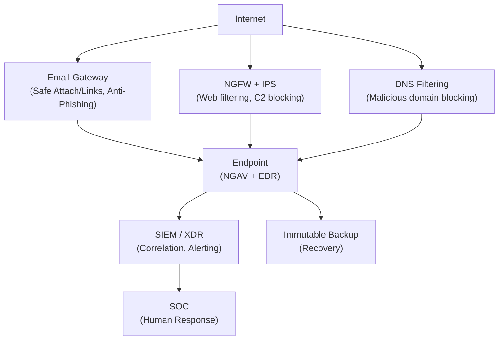

# 7.8. Захист від шкідливого ПЗ

Захист від шкідливого ПЗ — не одне рішення, а система взаємодоповнювальних рівнів. Жоден окремий інструмент не дає повного захисту: антивірус пропустить fileless malware, EDR може не зупинити zero-day на першому хості, але виявить lateral movement. Ціль — зробити атаку достатньо дорогою і помітною, щоб зловмисник або відмовився, або був зупинений до досягнення мети.

> 📖 Ключові терміни — у [глосарії модуля](00-glosariy.md).

## Антивірус (AV) і наступне покоління (NGAV)

**Традиційний AV** — сигнатурний захист: порівняння файлів з базою відомих зразків. Ефективний проти відомих загроз, безсилий проти нових і модифікованих.

**NGAV (Next-Generation Antivirus)** доповнює сигнатури:

| Можливість | Традиційний AV | NGAV |
|---|---|---|
| Сигнатури | ✅ | ✅ |
| Евристика | Обмежена | Розширена |
| ML-детекція | ❌ | ✅ |
| Аналіз поведінки | ❌ | ✅ |
| Виявлення fileless | ❌ | Частково |
| Пісочниця (pre-execution) | Рідко | ✅ |
| Приклади | ESET NOD32, Avast | CrowdStrike, SentinelOne, Microsoft Defender ATP |

**Microsoft Defender Antivirus** (вбудований у Windows 10/11) є достатньо ефективним рішенням для більшості організацій при правильному налаштуванні. Детально — модуль 03, розділ 3.11.

---

## EDR: Endpoint Detection and Response

**EDR** — основний сучасний рівень захисту кінцевих пристроїв:
- Збір телеметрії в реальному часі (кожен процес, мережеве з'єднання, файлова операція).
- Зберігання historical telemetry для ретроспективного аналізу.
- Виявлення аномальної поведінки (не лише відомих сигнатур).
- Можливість ізолювати хост, завершити процес, видалити файл — дистанційно.
- Forensics: повна хронологія дій зловмисника.

**Провідні рішення:** CrowdStrike Falcon, Microsoft Defender for Endpoint, SentinelOne, Carbon Black, Elastic Security.

**XDR (Extended Detection and Response)** — розширення: корелює телеметрію з email-шлюзу, мережевих пристроїв, хмари і endpoint в єдиному контексті.

---

## NGFW: Мережева фільтрація наступного покоління

**NGFW (Next-Generation Firewall)** доповнює традиційний фаєрвол (port/IP):

- **Application awareness** — ідентифікація застосунків незалежно від порту (Facebook на 443 ≠ HTTPS трафік).
- **IPS (Intrusion Prevention System)** — виявлення і блокування атак (exploit, scan).
- **SSL/TLS inspection** — декодування зашифрованого трафіку для аналізу (потребує розгортання CA-сертифіката).
- **Threat intelligence** — блокування відомих шкідливих IP і доменів.
- **DNS Sinkholing** — перенаправлення запитів до відомих C2 на «безпечну» адресу.

**DNS Filtering** (Cisco Umbrella, Cloudflare Gateway, Quad9) — швидкий і ефективний рівень: якщо зловмисний домен заблоковано на рівні DNS — шкідливий код не може підключитись до C2 навіть після зараження.

---

## Application Control та Whitelisting

**Принцип:** дозволити виконання лише відомих, дозволених програм — замість блокування відомих шкідливих.

**Windows:**
- **AppLocker** — правила за шляхом, хешем або підписом видавця.
- **Windows Defender Application Control (WDAC)** — сучасніший, більш захищений від обходу.

```powershell
# Приклад AppLocker правила (через GPO або PowerShell)
# Дозволяємо лише підписані Microsoft і власні застосунки
New-AppLockerPolicy -RuleType Publisher -FilePath "C:\Windows\*" `
    -Action Allow -User "Everyone" -XmlPolicy policy.xml
```

**Linux:**
- **AppArmor** (модуль 03, розділ 3.7) — профілі обмеження застосунків.
- **SELinux** — мандатний контроль доступу на рівні ядра.

**Обмеження:** LOLBAS-техніки обходять application control, бо використовують дозволені утиліти. Потрібно додатково обмежувати небезпечні системні утиліти через WDAC/AppLocker.

---

## Email-захист і безпечна обробка вкладень

**Email Security Gateway** (Microsoft Defender for Office 365, Proofpoint, Mimecast):
- **Safe Attachments** — відкриття вкладень у хмарній пісочниці перед доставкою.
- **Safe Links** — переписування URL і перевірка при кліку.
- **Anti-spoofing** — перевірка SPF/DKIM/DMARC.
- **Phishing simulation** — вбудовані інструменти тестування (детально — розділ 7.9).

**Macros Policy** — вимкнення Office-макросів за замовчуванням (Microsoft вимкнув по замовчуванню для файлів з інтернету у 2022):
```
Group Policy:
User Configuration → Administrative Templates → Microsoft Office
→ "Block macros from running in Office files from the Internet" → Enabled
```

---

## Deception Technology (технології обману)

**Honeypot** — пастка: система або сервіс, що не має легітимної мети, але виглядає як цінний ресурс. Будь-яка активність на honeypot = явна ознака атаки.

**Canary Token** — безкоштовний онлайн-сервіс (canarytokens.org): URL, файл, email-адреса, DNS запис, що надсилає alert при будь-якому відкритті чи запиті.

```python
# Канарковий токен у конфігураційному файлі:
# Якщо хтось «знайде» ці credentials і спробує їх використати → alert

[Database]
host = db-prod.company.local
username = sa_prod
password = P@ssw0rd_DB_2024!
# Насправді: credentials ведуть до honeypot DB
# При спробі підключення → повідомлення на security@company.com
```

**Active Deception Platforms** (Illusive Networks, Attivo Networks, Cymulate) — розміщують «підроблені» credentials, файли і сервіси по всіх хостах мережі. При взаємодії — негайний alert.

---

## Патч-менеджмент: базовий рівень захисту

**57%** успішних атак через вразливості використовують CVE, для яких патч був доступний більше місяця на момент атаки (Ponemon, 2022).

```
Рекомендований SLA для патчування:
Critical (CVSS 9-10) + активно експлуатується: 24–48 годин
Critical (CVSS 9-10): 7 днів
High (CVSS 7-8.9): 14 днів
Medium (CVSS 4-6.9): 30 днів
Low: 90 днів
```

**Інструменти:**
- **WSUS / Microsoft Endpoint Configuration Manager** — патчування Windows.
- **Qualys, Tenable Nessus** — сканування вразливостей.
- **Automox, Patch My PC** — мультиплатформне патчування.

---

## Бекап і відновлення: останній рубіж проти Ransomware

Найефективніший захист від ransomware — можливість відновитись без виплати викупу.

**Правило 3-2-1-1-0:**
- 3 копії даних.
- 2 різних типи носіїв.
- 1 копія офсайт.
- 1 копія offline або immutable (незмінна — навіть адмін не може видалити).
- 0 необроблених помилок верифікації.

**Immutable backups:** Veeam, AWS S3 Object Lock, Azure Immutable Blob Storage — бекапи, що не можна видалити протягом заданого часу навіть з правами адміна. Саме ця копія виживає після ransomware.

**Тестування відновлення:** нетестовані бекапи — ілюзія безпеки (детально — модуль 03, розділ 3.9).

---

## Засоби захисту: зведена архітектура



## Міні-вправа

Перевірте базовий стан захисту Windows-системи:

```powershell
# Стан захисту одним скриптом
@{
    "Defender Real-time"   = (Get-MpComputerStatus).RealTimeProtectionEnabled
    "Defender Up-to-date"  = (Get-MpComputerStatus).AntivirusSignatureAge -le 1
    "Firewall (Domain)"    = (Get-NetFirewallProfile -Profile Domain).Enabled
    "Firewall (Public)"    = (Get-NetFirewallProfile -Profile Public).Enabled
    "AutoRun disabled"     = ((Get-ItemProperty "HKLM:\SOFTWARE\Microsoft\Windows\CurrentVersion\Policies\Explorer" -EA SilentlyContinue).NoDriveTypeAutoRun -eq 255)
    "SMBv1 disabled"       = -not (Get-SmbServerConfiguration).EnableSMB1Protocol
} | ForEach-Object { $_.GetEnumerator() } |
    Select-Object @{N='Контроль';E={$_.Key}},
                  @{N='Стан';E={if ($_.Value) {"✅ OK"} else {"❌ Виправити"}}} |
    Format-Table -AutoSize
```

## Джерела та додаткові матеріали

- CIS Controls v8 (cisecurity.org/controls/v8) — пріоритизовані захисні заходи.
- NIST SP 800-83 Rev1 — Guide to Malware Incident Prevention and Handling.
- CrowdStrike, *2024 Global Threat Report*.
- Canarytokens (canarytokens.org) — безкоштовні honeypot-токени.

---

**Попередній розділ:** [7.7. APT і Cyber Kill Chain](07-apt-ta-kill-chain.md)
**Далі:** [7.9. Захист від соціальної інженерії](09-zakhyst-vid-sotsially-inzhenerii.md)
**Назад до модуля:** [README модуля 07](README.md)
