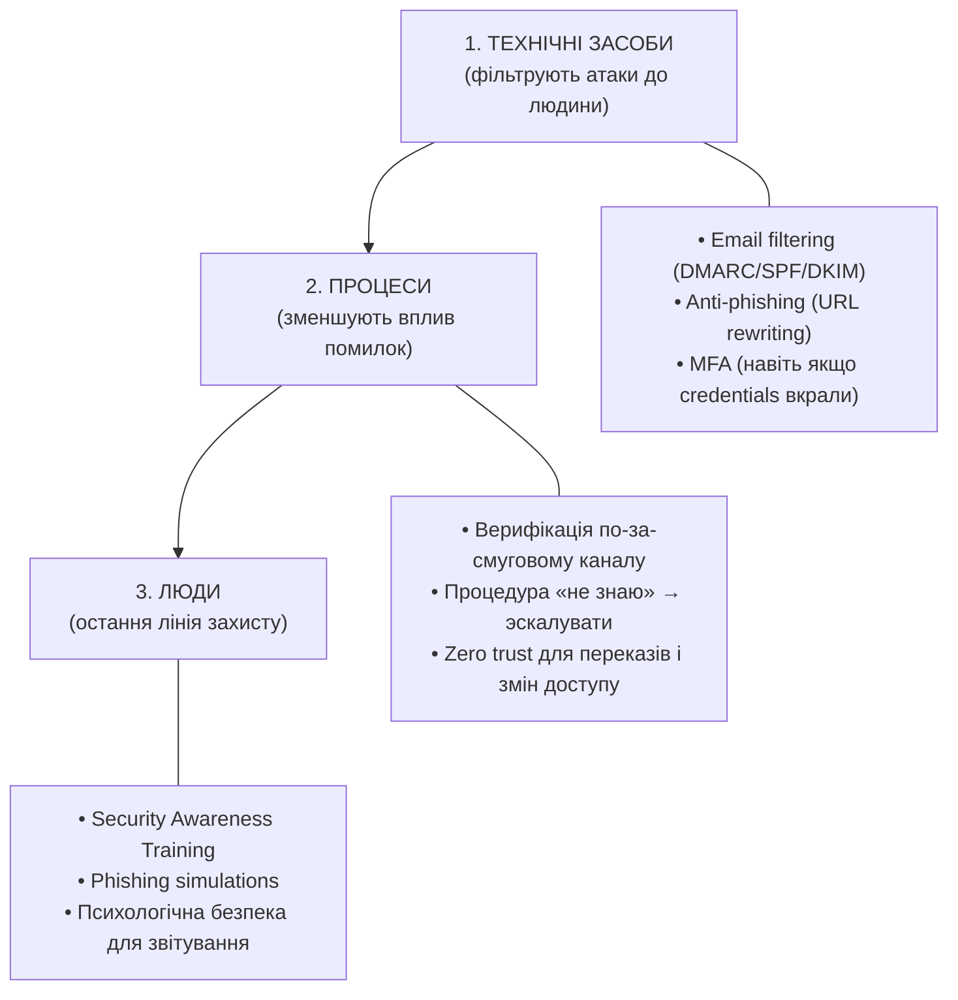
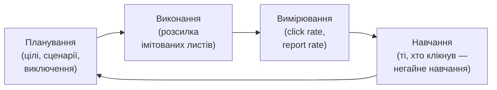

# 7.9. Захист від соціальної інженерії

Захист від технічних атак піддається автоматизації: патч встановлено, правило фаєрволу додано, вразливість закрита. Захист від соціальної інженерії автоматизувати не можна — її ціллю є людина, і жоден технічний засіб не замінює критичного мислення і тренованої реакції. Але «людський фактор» — не виправдання для бездіяльності. Доказова база показує: систематичне навчання і симуляції фішингу знижують вразливість до фішингових атак у 2–5 разів за 12 місяців.

> 📖 Ключові терміни — у [глосарії модуля](00-glosariy.md).

## Трирівнева модель захисту

Ефективний захист від соціальної інженерії будується на трьох рівнях, що доповнюють один одного:



---

## Технічний рівень: SPF, DKIM, DMARC

Три поштових стандарти, що разом роблять підробку відправника значно складнішою.

### SPF (Sender Policy Framework)

SPF визначає, які поштові сервери авторизовані надсилати листи від імені домену. Записується як TXT-запис у DNS:

```dns
# DNS TXT для example.com
v=spf1 ip4:203.0.113.0/24 include:sendgrid.net include:_spf.google.com ~all
#       ↑ IP нашого сервера   ↑ SendGrid             ↑ Google Workspace
# ~all = softfail (позначати підозрілим, але не відхиляти)
# -all = hardfail (відхиляти)
```

### DKIM (DomainKeys Identified Mail)

DKIM додає криптографічний підпис до кожного листа. Отримувач перевіряє підпис через публічний ключ у DNS — гарантує, що лист не змінювали після відправки.

```
# DNS TXT для selector._domainkey.example.com
v=DKIM1; k=rsa; p=MIGfMA0GCSqGSIb3DQEBAQUAA4GNADCBiQ...
```

### DMARC (Domain-based Message Authentication)

DMARC об'єднує SPF і DKIM і визначає, що робити з листами, що не пройшли перевірку:

```dns
# DNS TXT для _dmarc.example.com
v=DMARC1; p=reject; rua=mailto:dmarc@example.com; pct=100; adkim=s; aspf=s
#            ↑ відхиляти   ↑ звіти сюди                         ↑ строга перевірка
```

**Політики DMARC:**
- `p=none` — лише моніторинг; нічого не блокується (для початку).
- `p=quarantine` — підозрілі листи в спам.
- `p=reject` — підозрілі листи відхиляються.

**Поступовий план впровадження DMARC:**

```
Тиждень 1–4:   p=none; rua=mailto:dmarc@example.com
                → Збираємо звіти, розуміємо весь легітимний трафік

Тиждень 5–8:   p=quarantine; pct=25
                → Quarantine для 25% листів, що провалили перевірку

Тиждень 9–12:  p=quarantine; pct=100
Тиждень 13+:   p=reject; pct=100
```

```python
# Перевірка DMARC запису домену
import dns.resolver

def check_dmarc(domain: str) -> dict:
    try:
        answers = dns.resolver.resolve(f'_dmarc.{domain}', 'TXT')
        for rdata in answers:
            record = str(rdata).strip('"')
            if record.startswith('v=DMARC1'):
                parts = dict(p.split('=') for p in record.split(';') if '=' in p)
                return {
                    'found': True,
                    'policy': parts.get('p', 'none').strip(),
                    'rua': parts.get('rua', 'not set').strip(),
                    'record': record
                }
    except Exception:
        pass
    return {'found': False, 'policy': None}

# Перевірити кілька доменів
for domain in ['gmail.com', 'diia.gov.ua', 'your-company.com']:
    result = check_dmarc(domain)
    if result['found']:
        print(f"✅ {domain}: p={result['policy']}")
    else:
        print(f"❌ {domain}: DMARC не налаштовано")
```

### Чому всіх трьох недостатньо окремо

| Сценарій | SPF | DKIM | DMARC | Результат |
|---|---|---|---|---|
| Немає жодного | — | — | — | Підробка відправника тривіальна |
| Лише SPF | ✅ | — | — | Пересилання листів ламає SPF |
| Лише DKIM | — | ✅ | — | Немає політики відхилення |
| SPF + DKIM | ✅ | ✅ | — | Немає механізму реакції |
| Всі три | ✅ | ✅ | ✅ | Підробка відправника заблокована |

---

## Антифішинговий технічний захист

**Email filtering / Secure Email Gateway (SEG):**
- Перевірка вкладень у пісочниці (sandbox).
- URL rewriting — всі посилання в листах переписуються через проксі, що перевіряє їх при кліку.
- Фільтрація за репутацією відправника (IP, домен).
- Блокування виконуваних вкладень (.exe, .bat, .vbs, .js).

**Anti-phishing у браузері:**
- Google Safe Browsing — база відомих фішингових URL.
- Microsoft Defender SmartScreen.
- Browser extensions: uBlock Origin (блокує malvertising і відомі фішингові домени).

**DNS-level захист:**
- Cisco Umbrella / Cloudflare Gateway / Quad9 (`9.9.9.9`) — блокування шкідливих доменів на рівні DNS.

```bash
# Перевірити репутацію домену через VirusTotal API
curl -s "https://www.virustotal.com/api/v3/domains/suspicious-domain.com" \
  -H "x-apikey: YOUR_API_KEY" | python3 -m json.tool | grep '"malicious"'
```

---

## Процесний рівень: верифікація і Zero Trust для дій

Технічні засоби зупинять більшість спроб. Але якщо зловмисник вже в контакті з людиною (дзвінок, лист, обличчям до обличчя) — процеси є останнім процедурним захистом.

**Ключові процедури:**

**1. Out-of-band верифікація для критичних дій:**
Будь-яке прохання про переказ коштів, зміну банківських реквізитів, видачу доступу — верифікується окремим каналом (дзвінок на відомий номер, а не на той, що вказаний у листі).

```
Приклад SOP:
"Якщо в листі є прохання змінити реквізити для виплати —
 перетелефонуй на номер контрагента зі свого адресного справочника
 (не з підпису листа) і підтверди особисто."
```

**2. Процедура «не знаю → зупинись → еськалуй»:**
Будь-яка незрозуміла ситуація (незнайомий відправник вимагає термінових дій) → зупинитись → повідомити службу безпеки. Час ніколи не є причиною ігнорувати перевірку.

**3. Принцип чотирьох очей для фінансових операцій:**
Будь-який переказ понад пороговий ліміт — два незалежних підтвердження.

**4. Zero trust для нових запитів доступу:**
«Мій менеджер сказав дати йому доступ» → «Добре, нехай менеджер надішле запит через офіційну систему, я підтверджу безпосередньо з менеджером».

---

## Security Awareness Training (SAT)

**Стан індустрії:** більшість корпоративних програм навчання — щорічний годинний вебінар, обов'язкова анкета, галочка в HR-системі. Дослідження показують: такий формат має мінімальний вплив на поведінку.

**Що реально працює:**

| Підхід | Ефективність | Причина |
|---|---|---|
| Щорічний вебінар | Низька | Знання не конвертуються в поведінку |
| Щоквартальні короткі модулі | Середня | Краще утримання, але без практики |
| Phishing simulation + навчання | Висока | Реальний досвід + негайний зворотній зв'язок |
| Role-based training | Висока | Релевантний контент для конкретних ролей |
| Gamification і змагання | Середня/Висока | Мотивація і залученість |
| «Just-in-time» навчання | Висока | Навчання в момент ризику |

**Ключові теми навчання за ролями:**

| Роль | Пріоритетні теми |
|---|---|
| Всі | Фішинг, паролі, MFA, фізична безпека |
| Фінанси | BEC, wire fraud, верифікація реквізитів |
| HR | Фішинг через резюме, вішинг, OSINT-ризики |
| IT/Розробники | Spear phishing, supply chain, pretexting |
| Керівництво | Whaling, CEO fraud, конфіденційність в публічних місцях |

---

## Симуляції фішингу

**Phishing simulation** — контрольована фішингова атака проти власних співробітників для вимірювання і покращення їх стійкості.

**Процес:**



**Метрики:**

- **Click rate** — % співробітників, що клікнули на посилання. Хороший результат: <5%.
- **Credential submission rate** — % тих, хто ввів дані. Має бути 0%.
- **Report rate** — % тих, хто повідомив про підозрілий лист. Хороший результат: >70%.
- **Time to report** — наскільки швидко SOC дізнається про фішингову кампанію через звіти співробітників.

**Etика симуляцій:**
- Не використовувати психологічно маніпулятивні сценарії (смерть родичів, медичні загрози).
- Не карати тих, хто клікнув — навчати, а не присоромлювати.
- HR і юридичний відділ мають бути залучені.
- Повідомляти співробітників після кампанії про її мету.

**Інструменти:** Gophish (відкритий код), KnowBe4, Proofpoint Security Awareness.

---

## Психологічна безпека для звітування

Якщо співробітник клікнув на посилання або відкрив вкладення — найгірше що він може зробити — промовчати зі страху. Кожна хвилина затримки у виявленні збільшує потенційний збиток.

**Культура «звітуй, не соромся»:**
- Публічне визнання тих, хто правильно ідентифікував і повідомив про фішинг.
- Анонімні канали звітування для тих, хто боїться засудження.
- Чіткий, простий процес звітування (одна кнопка в Outlook/Gmail «Повідомити про фішинг»).
- Керівництво особисто демонструє «здорове ставлення до помилок».

---

## Міні-вправа

1. Перевірте DMARC і SPF вашого домену або домену вашої організації:
```bash
# SPF
dig TXT example.com | grep "v=spf1"

# DKIM (замініть selector на реальний, наприклад google або mail)
dig TXT google._domainkey.example.com

# DMARC
dig TXT _dmarc.example.com
```

2. Зайдіть на `mxtoolbox.com/dmarc/` і перевірте домен — яку оцінку отримуєте?

3. Знайдіть у вашому поштовому ящику будь-який лист і перевірте заголовки (`Show original` / `View source`): чи є рядки `Authentication-Results` з результатами SPF/DKIM/DMARC?

## Джерела та додаткові матеріали

- RFC 7208 (SPF), RFC 6376 (DKIM), RFC 7489 (DMARC).
- DMARC.org — офіційна документація.
- Gophish (getgophish.com) — відкритий фішинг-симулятор.
- KnowBe4, *Security Awareness Training Industry Report* — щорічні метрики.
- NIST SP 800-50 — Building an Information Technology Security Awareness Program.

---

**Попередній розділ:** [7.8. Захист від шкідливого ПЗ](08-zakhyst-vid-shkidlyvoho-po.md)
**Далі:** [7.10. Реагування на інцидент](10-reahuvannia-na-intsydent.md)
**Назад до модуля:** [README модуля 07](README.md)
