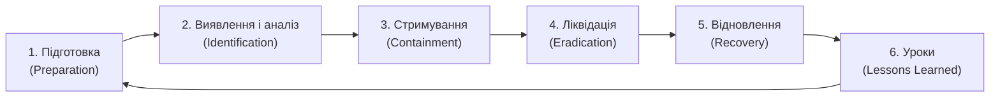

# 7.10. Реагування на інцидент зараження

Виявлення зараження або успішного фішингу — не кінець проблеми, а початок іншої задачі: мінімізувати шкоду, зупинити поширення і відновити нормальну роботу. За даними IBM Cost of a Data Breach 2023, організації з задокументованим планом реагування на інциденти витрачають на подолання наслідків у середньому на $1.49 мільйони менше ніж ті, що його не мають. Різниця між хаотичною реакцією і процедурою — не лише у грошах, а у збережених даних і репутації.

> 📖 Ключові терміни — у [глосарії модуля](00-glosariy.md).

## IR-фреймворк: шість фаз (NIST SP 800-61)



---

## Playbook: Реагування на Ransomware

### Фаза 1: Виявлення і перші хвилини

**Ознаки зараження ransomware:**
- Файли масово отримують незнайоме розширення (`.encrypted`, `.locked`, `.WNCRY`).
- З'являється записка з вимогою викупу (`README.txt`, `HOW_TO_DECRYPT.html`).
- Різке зростання CPU/disk activity.
- Антивірус або EDR надіслав alert.
- Користувач повідомляє, що не може відкрити файли.

**Перші 15 хвилин — критичні:**

```
00:00 — Отримано повідомлення про інцидент
00:02 — Підтвердити: це справді ransomware? (перевірити кілька файлів)
00:05 — Активувати IR команду: SOC, IT, CISO, юрист, PR
00:10 — НЕ вимикати заражену машину (докази в RAM!)
         АЛЕ ізолювати від мережі (відключити кабель / вимкнути Wi-Fi)
00:15 — Визначити: скільки систем уражено?
```

### Фаза 2: Стримування

**Короткострокове стримування:**

```bash
# Windows: ізоляція через Firewall (якщо є доступ)
netsh advfirewall set allprofiles state on
netsh advfirewall firewall add rule name="IR-BLOCK-ALL-IN" dir=in action=block
netsh advfirewall firewall add rule name="IR-BLOCK-ALL-OUT" dir=out action=block

# Або через PowerShell: повна мережева ізоляція
Disable-NetAdapter -Name "*" -Confirm:$false

# EDR (CrowdStrike, SentinelOne): ізолювати хост через консоль
# → Host Management → Isolate Host
```

**Визначення Patient Zero (першої зараженої системи):**

```powershell
# Аналіз логів Event Viewer: хто першим змінив файли з невідомим розширенням?
Get-WinEvent -LogName Security |
    Where-Object { $_.Id -eq 4663 } |  # Object Access: файл змінено
    Where-Object { $_.Message -match '\.WNCRY|\.encrypted' } |
    Select-Object TimeCreated, Message |
    Sort-Object TimeCreated |
    Select-Object -First 20

# Перевірити автозапуск (міг бути встановлений при initial access)
Get-CimInstance Win32_StartupCommand |
    Select-Object Name, Command, Location
```

**Довгострокове стримування:**
- Заблокувати C2-домени/IP на рівні DNS і фаєрвола.
- Скинути паролі для всіх привілейованих акаунтів (ransomware часто краде credentials).
- Відключити зовнішній доступ (VPN, RDP) до завершення розслідування.

### Фаза 3: Криміналістика і аналіз

**Перед відновленням — зібрати докази:**

```bash
# 1. Дамп оперативної пам'яті (winpmem або DumpIt)
winpmem.exe memdump.raw

# 2. Образ диска (якщо система вимкнена або потрібна для розслідування)
# dd if=/dev/sda of=/mnt/external/disk.img bs=4M status=progress

# 3. Важливі логи Windows
wevtutil epl System system.evtx
wevtutil epl Security security.evtx
wevtutil epl Application application.evtx

# 4. Перевірити чи файли можна відновити (не платячи)
# NoMoreRansom.org — безкоштовні дешифратори для відомих ransomware
```

**Визначити strain (тип) ransomware:**
- ID Ransomware (`id-ransomware.malwarehunterteam.com`) — завантажити записку або зашифрований файл.
- Перевірити `NoMoreRansom.org` — чи є безкоштовний дешифратор.

### Фаза 4: Ліквідація

```
1. Видалення шкідливого ПЗ (якщо система відновлюється, а не перевстановлюється)
   → Повне сканування офлайн (завантаження з Live CD/USB)
   → Перевірка всіх persistence mechanisms (autorun, задачі, служби)
   → Очищення або видалення заражених файлів

2. Перевстановлення ОС (рекомендовано для критичних систем або при невпевненості)
   → Гарантує відсутність прихованих backdoor або rootkits

3. Відновлення з резервної копії
   → Перевірити що бекап чистий (з ПЕРЕД атакою!)
   → Протестувати відновлення перед підключенням до мережі
```

### Фаза 5: Відновлення

**Порядок відновлення:**
1. Критична інфраструктура (Active Directory, DNS, core services).
2. Виробничі системи (ERP, бухгалтерія, CRM).
3. Робочі станції користувачів (за пріоритетом бізнес-критичності).
4. Тестові і Dev-середовища.

**Підтвердження відновлення:**
- Запустити EDR і перевірити що немає активного шкідливого ПЗ.
- Перевірити цілісність відновлених даних.
- Активувати посилений моніторинг на 30–60 днів після інциденту.

---

## Playbook: Реагування на фішинг

### Фаза 1: Звіт отримано

```
Співробітник повідомляє: «Я, здається, клікнув на підозрілий лист»

Питання для тріажу (перші 5 хвилин):
1. Що саме ви зробили? (клікнув посилання / відкрив вкладення / ввів дані)
2. На якому пристрої? (корпоративний / особистий)
3. Коли це сталось?
4. Чи ввели credentials (пароль, MFA-код)?
5. Чи помітили щось незвичне після?
```

### Фаза 2: Стримування (залежно від дій)

```
Якщо ЛИШЕ клікнули посилання (без завантаження/виконання):
→ Перевірити URL через VirusTotal
→ Якщо шкідливий: перевірити proxy logs чи відбулось завантаження файлів
→ Повне сканування хоста EDR

Якщо відкрили вкладення (документ, PDF):
→ Ізолювати хост від мережі
→ Перевірити чи виконувались макроси / зовнішні запити
→ Forensic аналіз хоста

Якщо ввели credentials:
→ НЕГАЙНО скинути пароль від зазначеного сервісу
→ Примусовий logout всіх активних сесій
→ Перевірити active sessions на підозрілу активність
→ Скинути пов'язані сервіси (SSO, OAuth apps)
→ Перевірити наявність MFA bypass (нові authorized apps, email forwarding rules)

Якщо ввели MFA-код:
→ Відкликати всі активні токени
→ Зареєструвати новий MFA-пристрій
→ Перевірити OAuth consent grants (можливо зловмисник авторизував app)
```

### Фаза 3: Масштаб кампанії

```python
# Пошук листів з тим самим відправником або темою в поштовій системі
# Microsoft 365 (Security & Compliance Center):
# Content Search → умова: From = "malicious@sender.com"

# Або через PowerShell (Microsoft 365):
# Search-Mailbox -SearchQuery "From:'attacker@evil.com'" -EstimateResultOnly

# Gmail Admin (Google Workspace): Admin → Reports → Email Log Search
```

**Якщо кілька отримувачів:**
- Надіслати повідомлення всім отримувачам: «Якщо ви отримали лист від X — не відкривайте, повідомте IT».
- Видалити шкідливий лист з усіх поштових скриньок (purge).

### Комунікаційний план при інциденті

```
Внутрішні стейкхолдери (протягом 1 години):
├── CISO/CSO → технічні деталі, масштаб
├── CEO/Правління → бізнес-вплив, рішення
├── Юрист → регуляторні зобов'язання (GDPR 72 години!)
├── HR → якщо інцидент пов'язаний із співробітником
└── PR/Communications → підготовка до зовнішніх запитів

Зовнішні сторони (за потреби):
├── Регулятори (GDPR: протягом 72 годин від виявлення!)
├── Правоохоронні органи (поліція, СБУ, CERT-UA)
├── Постраждалі клієнти (якщо витекли їх дані)
└── Кіберстрахова компанія (якщо є поліс)
```

---

## Чек-лист: Чи готові ви до інциденту?

**Технічна готовність:**
- [ ] EDR встановлено на всіх кінцевих пристроях.
- [ ] Централізоване збирання логів (SIEM або хоча б сервер логів).
- [ ] Бекапи тестуються щоквартально (фактичне відновлення, не лише «бекап є»).
- [ ] Offsite/offline бекап захищений від ransomware.
- [ ] Список контактів IR-провайдера збережено поза корпоративними системами.

**Процесна готовність:**
- [ ] IR Playbook задокументований і доступний offline.
- [ ] Ролі і відповідальності при інциденті визначені.
- [ ] Табільні вправи (Tabletop Exercise) проведені в останні 12 місяців.
- [ ] Комунікаційний план для різних сценаріїв готовий.

**Правова готовність:**
- [ ] Зрозуміло, які регуляторні вимоги щодо повідомлення (GDPR, ЗУ «Про захист ПД»).
- [ ] Відомо, куди подавати заяву в Україні (CERT-UA, кіберполіція).

---

## Звітування до CERT-UA

CERT-UA (cert.gov.ua) — Урядова команда реагування на комп'ютерні надзвичайні події України.

**Коли повідомляти:**
- Будь-який інцидент, що зачіпає державні інформаційні системи.
- Атака, що може мати значний вплив або є частиною ширшої кампанії.
- Виявлення нового типу шкідливого ПЗ або тактик.

**Форма звіту:**
- Що сталось (тип інциденту, наслідки).
- Коли (дата і час виявлення та початку).
- Хто постраждав (організація, системи).
- IOC (хеші, IP, домени, email відправника).
- Вжиті заходи.

Контакт: `incidents@cert.gov.ua` або через веб-форму на cert.gov.ua.

## Джерела та додаткові матеріали

- NIST SP 800-61 Rev.2 — Computer Security Incident Handling Guide.
- NoMoreRansom.org — безкоштовні дешифратори для 150+ видів ransomware.
- CERT-UA (cert.gov.ua) — повідомити про інцидент.
- ID Ransomware (id-ransomware.malwarehunterteam.com) — ідентифікація виду.
- CISA Ransomware Guide (cisa.gov) — федеральні рекомендації США.

---

**Попередній розділ:** [7.9. Захист від соціальної інженерії](09-zakhyst-vid-sotsially-inzhenerii.md)
**Далі:** [7.11. Практична лабораторна на Python](11-praktychna-laboratorna.md)
**Назад до модуля:** [README модуля 07](README.md)
