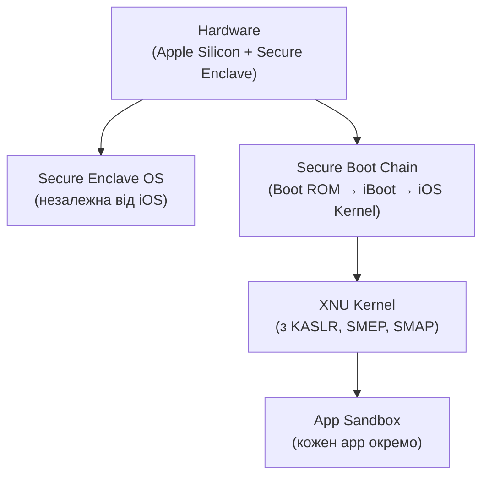

# 8.1. Мобільна архітектура: Android і iOS з погляду безпеки

Дві найпопулярніші мобільні ОС мають принципово різні підходи до безпеки — і розуміти ці відмінності важливо як для захисту особистих пристроїв, так і для розробки корпоративних мобільних застосунків. iOS обрала модель «обгородженого саду» з жорстким контролем Apple; Android — відкриту екосистему з більшою гнучкістю і більшою поверхнею атаки. Жодна з моделей не є «безпечнішою» абсолютно — кожна має свій профіль ризиків.

> 📖 Ключові терміни — у [глосарії модуля](00-glosariy.md).

## Модель безпеки Android

Android базується на Linux-ядрі і має кілька рівнів ізоляції.

### Sandbox і ізоляція процесів

Кожен застосунок отримує унікальний UID (User ID) Linux і виконується в ізольованому процесі. Застосунки не можуть безпосередньо читати дані інших застосунків — для обміну потрібен явний механізм (Content Provider, Intent, Binder IPC).

```
Android Security Stack:
┌─────────────────────────────────────────┐
│           Applications                  │  ← User apps (ізольовані sandbox)
├─────────────────────────────────────────┤
│      Android Runtime (ART)              │  ← Виконання .dex файлів
├─────────────────────────────────────────┤
│    Android Framework / APIs             │  ← Системні сервіси
├─────────────────────────────────────────┤
│    Hardware Abstraction Layer (HAL)     │  ← Драйвери апаратного забезпечення
├─────────────────────────────────────────┤
│    Linux Kernel + SELinux               │  ← Обов'язкове управління доступом
└─────────────────────────────────────────┘
```

**SELinux в Android** (з Android 5.0+): кожен процес, файл і сокет має мітку безпеки. Навіть якщо застосунок отримав root — SELinux обмежує його дії. Android 9+ використовує SELinux в режимі Enforcing по замовчуванню.

### Система дозволів Android

Android використовує **permission-based model**: застосунок декларує потрібні дозволи в `AndroidManifest.xml`, а користувач надає або відхиляє їх.

**Рівні дозволів:**
- **Normal** — надаються автоматично без запиту (читання часового поясу, доступ до інтернету).
- **Dangerous** — запитуються у runtime у користувача (геолокація, камера, контакти, SMS, мікрофон).
- **Signature** — лише для застосунків того ж розробника або системних.
- **SignatureOrSystem** — лише системні застосунки.

```xml
<!-- AndroidManifest.xml -->
<uses-permission android:name="android.permission.CAMERA" />
<uses-permission android:name="android.permission.READ_CONTACTS" />
<uses-permission android:name="android.permission.ACCESS_FINE_LOCATION" />
```

**Android 11+ (Permission auto-reset):** якщо застосунок не використовувався кілька місяців — дозволи скидаються автоматично.

### Verified Boot і dm-verity

**Verified Boot** (Android 7+) — перевірка цілісності кожного розділу при завантаженні:
- Bootloader перевіряє підпис ядра.
- Ядро перевіряє `/system` через dm-verity (Merkle Tree хешів).
- Якщо зміна виявлена — пристрій не завантажується або показує попередження.

**Strongbox / Android Keystore** — апаратний захист криптографічних ключів у Trusted Execution Environment (TEE) або виділеному мікроконтролері. Ключ не може бути витягнутий з пристрою.

### Google Play Protect

Постійне сканування встановлених застосунків на шкідливий код. Використовує ML-моделі, оновлюється незалежно від ОС. Сканує також sideloaded APK при встановленні.

---

## Модель безпеки iOS

Apple реалізує значно жорсткішу модель з централізованим контролем.

### Secure Enclave Processor (SEP)

**Secure Enclave** — окремий процесор із власною прошивкою, ОС і пам'яттю всередині Apple Silicon або Secure Element. Зберігає і обробляє:
- Ключі шифрування диска (AES-256).
- Дані Face ID і Touch ID (biometric templates).
- Apple Pay credentials.
- Ключі сертифікатів.

Навіть якщо основна ОС скомпрометована — Secure Enclave залишається ізольованою. Apple не має доступу до даних в Secure Enclave і не може їх розблокувати.

### App Sandbox і entitlements

Кожен iOS-застосунок виконується у власному sandbox-контейнері. Доступ до ресурсів (камера, геолокація, Bluetooth, контакти) потребує explicit entitlement і явного дозволу користувача.

**Code Signing** — кожен застосунок має бути підписаний Apple-сертифікатом. Система перевіряє підпис при кожному запуску. Це унеможливлює виконання неавторизованого коду (якщо немає jailbreak).

### App Store Review Process

Apple перевіряє кожен застосунок перед публікацією (автоматично і вручну). Це значно зменшує кількість шкідливого ПЗ в App Store порівняно з Google Play (хоча випадки обходу є).

### iOS Security Architecture



---

## Порівняння Android і iOS

| Аспект | Android | iOS |
|---|---|---|
| Ядро | Linux | XNU (Darwin) |
| Магазин застосунків | Google Play + sideloading | App Store (лише; EU: альтернативні) |
| Review застосунків | Автоматичний + пост-публікаційний | Ретельний перед публікацією |
| Оновлення безпеки | Залежить від виробника (фрагментація) | Apple напряму, одночасно |
| Шифрування | FBE (File-Based Encryption) | AES-256 через Secure Enclave |
| Jail/Root | Root доступний, але ризикований | Jailbreak складний, втрата гарантій |
| Управління дозволами | Fine-grained runtime permissions | Fine-grained runtime permissions |
| Корпоративне управління | MDM (Android Enterprise) | MDM через Apple MDM Protocol |
| Завантаження APK | Так (sideloading) | Ні (без jailbreak або Dev account) |

**Ключовий висновок:** iOS має меншу поверхню атаки за замовчуванням через обмеження sideloading. Android гнучкіший, але вимагає більш уважного підходу до безпеки.

---

## Trust Execution Environment (TEE)

**TEE** — захищена область виконання всередині основного процесора, ізольована від звичайної ОС:
- **ARM TrustZone** — апаратна технологія ізоляції у ARM процесорах; Android використовує її для Keystore і biometrics.
- **Apple Secure Enclave** — окремий процесор з власною ОС.

У TEE виконуються операції, що потребують максимального захисту: перевірка PIN/пароля, обробка biometric даних, генерація і використання криптографічних ключів.

---

## Міні-вправа

На своєму смартфоні (Android або iOS):

**Android:**
```
Налаштування → Конфіденційність → Менеджер дозволів
→ Перегляньте список застосунків для кожного дозволу (Камера, Мікрофон, Геолокація)
→ Чи є застосунки, яким ви не пам'ятаєте надавали доступ до мікрофона?
```

**iOS:**
```
Налаштування → Конфіденційність і безпека
→ Перегляньте кожну категорію (Геолокація, Контакти, Камера, Мікрофон)
→ Поставте геолокацію в режим "Під час використання" замість "Завжди" де можливо
```

Скільки застосунків мають доступ до мікрофона або камери? Чи всі вони справді потребують цього доступу?

## Джерела та додаткові матеріали

- Google, *Android Security Bulletins* (source.android.com/security).
- Apple, *Apple Platform Security Guide* (support.apple.com/guide/security).
- NIST SP 800-163 — Vetting the Security of Mobile Applications.
- ENISA, *Smartphone Security — Good Practices* (enisa.europa.eu).

---

**Далі:** [8.2. Загрози мобільним пристроям](02-zahrozy-mobilnym-prystroyam.md)
**Назад до модуля:** [README модуля 08](README.md)
