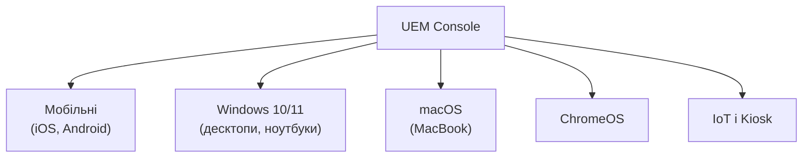

# 8.4. MDM, MAM і UEM: корпоративне управління мобільними пристроями

Коли співробітник виходить з офісу з корпоративним смартфоном або власним пристроєм, на якому є корпоративна пошта — периметр безпеки йде разом з ним. Традиційні засоби (VPN, антивірус на ноутбуці) не вирішують цю задачу. Mobile Device Management виник як відповідь: централізований контроль над мобільними пристроями через їх нативні API — без потреби фізичного доступу до кожного.

> 📖 Ключові терміни — у [глосарії модуля](00-glosariy.md).

## Три рівні управління

### MDM: Mobile Device Management

**MDM** керує пристроєм цілком: конфігурація ОС, застосунки, дані, можливість віддаленого стирання.

**Що може MDM:**
- Примусове шифрування пристрою.
- Встановлення і видалення застосунків.
- Застосування парольних політик.
- Віддалене стирання (Remote Wipe) при втраті або звільненні.
- Блокування функцій (камера, Bluetooth, AirDrop).
- Контроль Wi-Fi і VPN профілів.
- Compliance reporting (моніторинг відповідності).

### MAM: Mobile Application Management

**MAM** керує лише застосунками і їх даними — без контролю над усім пристроєм. Критично важливий для BYOD сценарію: організація не має право стирати особисті фото користувача.

**Що може MAM:**
- Управляти лише корпоративними застосунками і їх даними.
- Вимагати PIN для корпоративних застосунків (окремо від PIN пристрою).
- Блокувати copy/paste між корпоративними і особистими застосунками.
- Дистанційно стирати лише корпоративні дані («selective wipe»).
- Вимагати оновлення корпоративних застосунків.

### UEM: Unified Endpoint Management

**UEM** об'єднує управління мобільними пристроями, ноутбуками, десктопами і IoT у єдиній консолі. Сучасний підхід.



---

## BYOD, COPE і COBO

| Модель | Власник пристрою | Контроль | Найкраще для |
|---|---|---|---|
| **COBO** (Corporate-Owned, Business-Only) | Організація | Повний MDM | Висококонфіденційне середовище |
| **COPE** (Corporate-Owned, Personally Enabled) | Організація | Повний MDM + особисте використання | Збалансований підхід |
| **BYOD** (Bring Your Own Device) | Співробітник | MAM (лише корп. застосунки) | Гнучкість, знижені витрати |
| **CYOD** (Choose Your Own Device) | Організація (зі списку) | Повний MDM | Стандартизований вибір |

**BYOD ризики:**
- Особисті пристрої рідше оновлюються.
-混'ються (mixing) корпоративні і особисті дані.
- При звільненні — складно підтвердити, що всі корп. дані видалені.
- Malware на особистих застосунках може впливати на корп. дані.

---

## Провідні MDM/UEM рішення

### Microsoft Intune (частина Microsoft Endpoint Manager)

Найпоширеніше в корпоративному середовищі, особливо у Windows/M365 екосистемі.

**Ключові можливості:**
- Управління iOS, Android, Windows, macOS з єдиної консолі.
- Conditional Access: доступ до Microsoft 365 лише з Compliant пристроїв.
- App Protection Policies (MAM без MDM реєстрації).
- Windows Autopilot — автоматичне налаштування нових Windows пристроїв.

```powershell
# PowerShell: перевірити стан compliance пристрою через Microsoft Graph API
# (для адміністраторів)
$uri = "https://graph.microsoft.com/v1.0/deviceManagement/managedDevices"
$devices = Invoke-RestMethod -Uri $uri -Headers @{Authorization = "Bearer $token"}
$devices.value | Select-Object deviceName, complianceState, osVersion, lastSyncDateTime
```

### Apple MDM (через Jamf або Intune)

iOS і macOS мають вбудований MDM протокол. Apple Business Manager (ABM) дозволяє Zero-Touch Enrollment — пристрій автоматично реєструється в MDM при першому увімкненні без участі IT.

**Apple Configurator 2** — безкоштовний інструмент для масового налаштування iOS пристроїв через USB.

### VMware Workspace ONE / Ivanti

Популярні у великих підприємствах; підтримують всі платформи і мають розширені UEM-можливості.

---

## Профілі конфігурації MDM

MDM доставляє налаштування через **конфігураційні профілі** — XML/mobileconfig файли:

```xml
<!-- iOS Configuration Profile (спрощено) -->
<?xml version="1.0" encoding="UTF-8"?>
<!DOCTYPE plist PUBLIC "-//Apple//DTD PLIST 1.0//EN" ...>
<plist version="1.0">
<dict>
    <key>PayloadType</key>
    <string>Configuration</string>
    <key>PayloadDisplayName</key>
    <string>Corp Security Policy</string>
    <key>PayloadContent</key>
    <array>
        <!-- Парольна політика -->
        <dict>
            <key>PayloadType</key>
            <string>com.apple.mobiledevice.passwordpolicy</string>
            <key>minLength</key>
            <integer>8</integer>
            <key>requireAlphanumeric</key>
            <true/>
            <key>maxPINAgeInDays</key>
            <integer>90</integer>
            <key>maxFailedAttempts</key>
            <integer>10</integer>
        </dict>
        <!-- VPN профіль, Wi-Fi, Email тощо... -->
    </array>
</dict>
</plist>
```

---

## Mobile Threat Defense (MTD)

**MTD** — рівень захисту поверх MDM: реальний час аналіз загроз безпосередньо на пристрої.

**Що виявляє MTD:**
- Відкриті Wi-Fi мережі та MITM атаки.
- Шкідливі застосунки і підозрілу поведінку.
- Jailbreak / Root.
- Out-of-date OS.
- Відомі вразливості.
- Man-in-the-App (overlay attacks від банківських троянів).

**Провідні MTD:** Lookout, Zimperium, Microsoft Defender for Endpoint (mobile), CrowdStrike Falcon for Mobile.

---

## Corsporate-Specific Considerations

**Що MDM не вирішує:**
- Захист від zero-day вразливостей на рівні ядра.
- Захист даних у незашифрованих backup (якщо MDM не блокує).
- Соціальна інженерія проти користувача.
- Дані, що вже потрапили в особистий застосунок до MDM реєстрації.

**Intune Compliance Policy приклад:**

| Вимога | Android | iOS |
|---|---|---|
| OS версія | ≥ Android 12 | ≥ iOS 16 |
| Шифрування пристрою | Обов'язково | Обов'язково |
| PIN/пароль | 6+ символів | 6+ цифр |
| Jailbreak/Root | Заборонено | Заборонено |
| MTD загрози | Немає High/Critical | Немає High/Critical |
| Максимум без sync | 30 днів | 30 днів |

## Міні-вправа

Якщо у вашій організації є Microsoft 365 з Intune:

1. Зайдіть у [endpoint.microsoft.com](https://endpoint.microsoft.com) → Devices → Compliance Policies.
2. Яка частка пристроїв в стані Compliant vs Non-Compliant?
3. Знайдіть Non-Compliant пристрої — яка найчастіша причина?

Якщо доступу до Intune немає — перегляньте безкоштовний tier Microsoft Intune для тесту з особистим M365 акаунтом.

## Джерела та додаткові матеріали

- Microsoft Intune Documentation (learn.microsoft.com/en-us/intune).
- Jamf Pro Documentation (docs.jamf.com).
- NIST SP 800-124 Rev.2 — Guidelines for Managing Mobile Device Security.
- CISA, *Mobile Device Security* — федеральні рекомендації.

---

**Попередній розділ:** [8.3. OWASP Mobile Top 10](03-owasp-mobile-top10.md)
**Далі:** [8.5. IoT: архітектура і модель загроз](05-iot-arkhitektura.md)
**Назад до модуля:** [README модуля 08](README.md)
