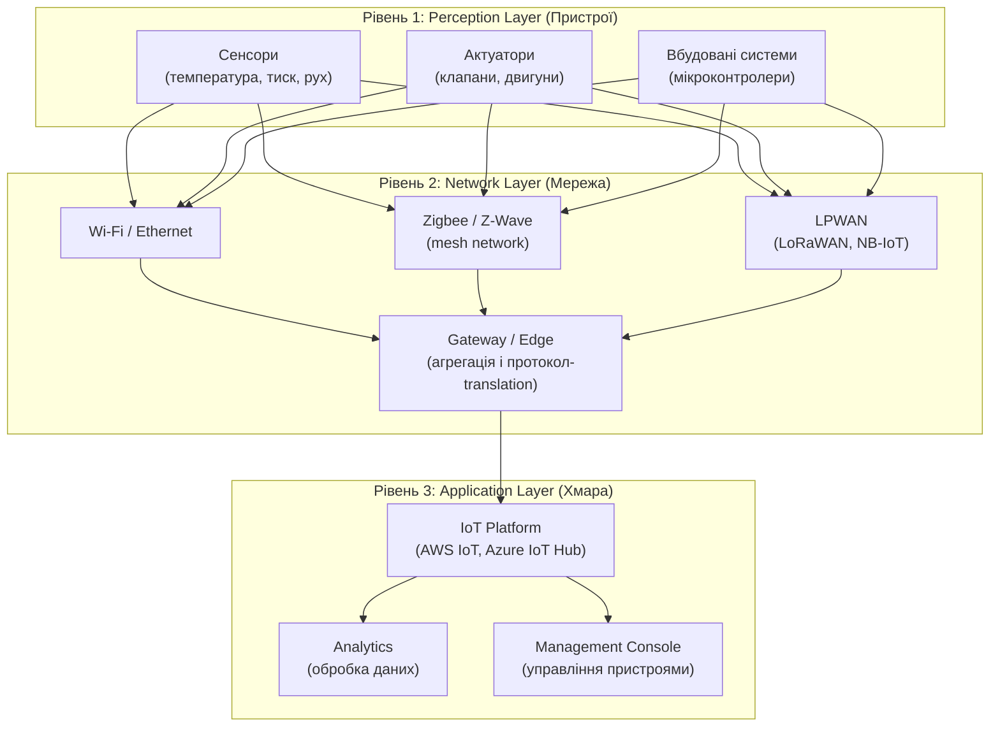
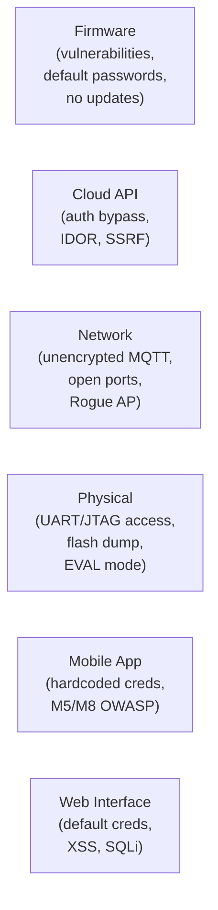

# 8.5. IoT: архітектура, протоколи і модель загроз

Internet of Things — термін, що об'єднує мільярди пристроїв: від термостата на стіні до промислового контролера на електростанції. Спільне між ними — підключення до мережі і обмежені обчислювальні ресурси, що зазвичай виключають традиційний підхід до безпеки (антивірус, повноцінний агент, складні протоколи TLS). Саме це поєднання — підключеність і обмеженість — робить IoT настільки привабливою ціллю.

> 📖 Ключові терміни — у [глосарії модуля](00-glosariy.md).

## Трирівнева архітектура IoT



**Рівень 1 (Perception)** — фізичні пристрої. Типово: MCU (мікроконтролер) без MMU, ROM 32–256 КБ, обмежена RAM. Неможливо запустити традиційний агент безпеки.

**Рівень 2 (Network)** — комунікація між пристроями і хмарою. Часто використовуються спеціалізовані протоколи замість TCP/IP.

**Рівень 3 (Application)** — хмарна обробка, аналітика, управління парком пристроїв.

---

## Ключові IoT-протоколи

### MQTT (Message Queuing Telemetry Transport)

**MQTT** — легкий pub/sub протокол на базі TCP (порт 1883 або 8883 TLS). Розроблений для низькобандвідних і ненадійних з'єднань.

```
Publisher (Device) ──── Topic: "home/temperature" ──── MQTT Broker ──── Subscriber (App)
                              Value: 22.5°C
```

**Компоненти:**
- **Broker** — центральний сервер (Mosquitto, AWS IoT Core, HiveMQ).
- **Topic** — ієрархічний канал (`home/livingroom/temperature`).
- **QoS рівні:** 0 (at most once), 1 (at least once), 2 (exactly once).

**Вразливості MQTT:**
- Порт 1883 без TLS відкрито в інтернет — трафік у відкритому вигляді.
- Анонімний доступ: `mosquitto -p 1883 --allow-anonymous true` — будь-хто підписується на будь-який topic.
- Відсутність ACL: пристрій A може публікувати в topic пристрою B.
- Wildcard subscriptions: `#` підписує на ВСІ топіки брокера.

```bash
# Перевірка незахищеного MQTT брокера (для тестування власної мережі)
mosquitto_sub -h localhost -t "#" -v  # підписатись на всі топіки
# Якщо отримуємо дані без автентифікації — вразливість!
```

### CoAP (Constrained Application Protocol)

**CoAP** — REST-подібний протокол на UDP (порт 5683 або 5684 DTLS). Призначений для дуже ресурсообмежених пристроїв (8-bit MCU, 10 КБ RAM).

Відповідає HTTP-семантиці (GET, POST, PUT, DELETE) але значно легший. Підтримує multicast для груп пристроїв.

### Zigbee і Z-Wave

**Zigbee** — mesh-протокол 2.4 GHz для розумного дому (802.15.4). Кожен пристрій може бути ретранслятором. Дальність: ~10 м, mesh суттєво збільшує покриття.

**Z-Wave** — пропрієтарний 868/908 MHz mesh. Менша пропускна здатність, але краще проникнення крізь стіни. Max 232 пристрої в мережі.

**Вразливості Zigbee:**
- Слабке шифрування в ранніх версіях (Zigbee 2004).
- Можливість примусового переведення пристрою у «join mode» і перехоплення мережевого ключа.
- Zigbee 3.0 суттєво покращив безпеку.

### LoRaWAN і NB-IoT

**LPWAN (Low Power Wide Area Network)** — для пристроїв з батарейним живленням і рідкою передачею даних (smart meters, agricultural sensors).

**LoRaWAN** — дальність до 15 км; пропускна здатність мала (250 bps – 5 kbps). Шифрування AES-128.

**NB-IoT** — стільниковий IoT стандарт від 3GPP; використовує інфраструктуру операторів.

---

## Attack Surface IoT



**Типові вразливості IoT (OWASP IoT Top 10):**
1. Weak/Hardcoded Passwords.
2. Insecure Network Services.
3. Insecure Ecosystem Interfaces (API, Web, App).
4. Lack of Secure Update Mechanism.
5. Use of Insecure or Outdated Components.
6. Insufficient Privacy Protection.
7. Insecure Data Transfer and Storage.
8. Lack of Device Management.
9. Insecure Default Settings.
10. Lack of Physical Hardening.

---

## Реальні кейси IoT-атак

**Mirai Botnet (2016):** черв'як, що сканував інтернет на відкриті Telnet-порти (23) і підбирав 61 дефолтних пар логін/пароль для IP-камер і маршрутизаторів. Зібрав 600 000+ IoT-пристроїв і провів рекордний DDoS 1.2 Tbps проти Dyn DNS. Пів-інтернету США не працювало кілька годин.

**Hackable baby monitors:** численні випадки, коли невідомі отримували доступ до IP-камер у дитячих кімнатах через дефолтні паролі або відсутній захист.

---

## Міні-вправа

Перегляньте IoT-пристрої у вашій мережі:

```bash
# Сканування мережі на IoT пристрої (власна мережа!)
nmap -sn 192.168.1.0/24        # discover hosts
nmap -sV 192.168.1.0/24 -p 23,80,443,1883,5683,8080,8443  # IoT ports

# Перевірити відкриті MQTT брокери (1883)
nmap -p 1883 --script mqtt-subscribe 192.168.1.0/24

# Shodan (пошук публічно доступних IoT ваших IP)
# https://www.shodan.io/search?query=org:"Your+ISP+Name"
```

Скільки IoT пристроїв у вашій мережі? Які порти вони відкривають?

## Джерела та додаткові матеріали

- OWASP IoT Project (owasp.org/www-project-internet-of-things).
- NIST SP 800-213 — IoT Device Cybersecurity Guidance.
- MQTT Specification (mqtt.org).
- Shodan (shodan.io) — пошук підключених пристроїв.

---

**Попередній розділ:** [8.4. MDM, MAM і UEM](04-mdm-mam-uem.md)
**Далі:** [8.6. IoT-безпека: автентифікація і оновлення](06-iot-bezpeka.md)
**Назад до модуля:** [README модуля 08](README.md)
